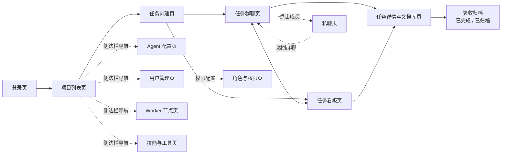

# 交互与页面设计

本文档是产品型 PRD 的最后一章，把 01~05 篇定义的需求落为页面级的交互说明。全文覆盖 13 个页面（8 个核心协作页面 + 5 个 Worker/能力管理页面），每个页面与 `prototypes/` 下的一个静态原型一一对应，文档内可直接预览原型效果。交互描述与 03/04 篇的功能点保持一致，本页只讲产品交互，不涉及技术实现。

## 1. 页面总览

平台共 13 个页面，覆盖从登录到验收归档的完整协作链路，以及平台侧的用户与权限、Worker 与能力管理：

| 页面 | 原型 ID | 用途 | 主要入口 | 适配形态 |
|------|---------|------|---------|---------|
| 登录页 | `login` | 平台账号登录 | 平台入口 | 桌面 / 移动 |
| 项目列表页 | `project-list` | 进入项目，查看项目与任务概况 | 登录成功后 | 桌面 / 移动 |
| 任务创建页 | `task-create` | 提交任务，组建虚拟团队 | 项目内「新建任务」 | 桌面 |
| 任务看板页 | `task-board` | 按状态浏览任务 | 侧边栏「任务看板」 | 桌面 |
| 任务群聊页 | `group-chat` | 任务协作主现场，@ 触发 Agent | 任务卡片 / 侧边栏 | 桌面 / 移动 |
| 私聊页 | `dm-chat` | 与单个 Agent 深入沟通 | 群聊成员面板点击成员 | 桌面 / 移动 |
| 任务详情与文档库页 | `task-detail` | 查看任务信息、产出物与版本 | 群聊任务面板 / 看板卡片 | 桌面 |
| Agent 配置页 | `agent-config` | 管理 Agent 模板与配置项 | 侧边栏「Agent 管理」 | 桌面 |
| 用户管理页 | `user-management` | 管理平台账号与角色分配（平台管理员） | 侧边栏「用户管理」 | 桌面 |
| 角色与权限页 | `role-permission` | 配置角色权限矩阵与权限范围（平台管理员） | 侧边栏「用户管理」→「权限配置」 | 桌面 |
| Worker 节点页 | `worker-list` | 查看与管理 Worker 节点（平台管理员） | 侧边栏「Worker 节点」 | 桌面 |
| 技能与工具页 | `skills-tools-manage` | 管理技能库与工具注册（平台管理员） | 侧边栏「技能工具」 | 桌面 |
| 模型目录管理页 | `models-manage` | 管理 AI 模型目录与模型凭据配置（平台管理员） | 侧边栏「模型管理」 | 桌面 |

### 页面范围与 05 篇 18 个原型的关系

本页总览表覆盖 13 个业务页面：**8 个核心协作页面**（登录 / 项目列表 / 任务创建 / 任务看板 / 任务群聊 / 私聊 / 任务详情与文档库 / Agent 配置）+ **平台管理页面**（用户管理 / 角色与权限 / Worker 节点 / 技能与工具 / 模型目录管理）。其中 Worker 节点页与技能与工具页各带一个附加流程原型（新增 Worker / 注册工具），3 个导航方案原型（nav-rail / nav-cmdk / nav-hybrid）为设计演进存档。合计 15 个业务原型 + 3 个导航方案原型 = 18 个原型页面，与 05 篇 3.1「验收边界」口径一致。

桌面端统一采用「深色侧边栏 + 顶栏 + 内容区」的页面骨架；登录页、项目列表、群聊与私聊在移动端自动折叠侧边栏与次要面板，保留核心操作。

## 2. 页面交互说明

### 2.1 登录页

**用途**：平台账号登录，进入后以成员身份访问所属项目。

**入口**：平台首页的默认落地页。

**关键交互**：
- 左侧品牌区展示产品定位与价值主张（组建虚拟 AI 团队、仅被 @ 的 Agent 响应、产出物沉淀为项目文档），右侧为账号密码登录表单。
- 输入账号与密码后点击「登录」进入项目列表；未注册用户通过「立即注册」入口创建账号。
- 登录校验不涉及第三方认证，账号体系为平台内置。

**对应原型**：

```prototype
id: login
title: 登录页
device: desktop
height: 720
```

### 2.2 项目列表页

**用途**：平台的项目总览，选择项目进入其 AI 协作工作区。

**入口**：登录成功后默认进入；侧边栏项目导航随时可返回。

**关键交互**：
- 以项目卡片网格展示全部项目，卡片含项目名称、描述、任务统计（进行中 / 待验收 / 已完成数量）与成员 Agent 头像。
- 点击项目卡片进入该项目；点击「+ 新建项目」创建新项目。
- 项目无独立状态流转，仅任务有状态（FR-25）；卡片以任务统计代替项目状态标签，帮助成员快速识别活跃与结项项目。

**对应原型**：

```prototype
id: project-list
title: 项目列表页
device: desktop
height: 720
```

### 2.3 任务创建页

**用途**：提交任务并组建虚拟团队，为任务建立群聊与文档库。

**入口**：项目内的「新建任务」操作。

**关键交互**：
- 填写任务标题（必填）、描述，并选择优先级（低 / 中 / 高）。
- 从 Agent 角色列表中勾选一个或多个 Agent 组成虚拟团队；勾选后即时显示已选 Agent。未选中的 Agent 不参与本任务。
- 点击「创建任务」后，平台为任务生成专属群聊与任务文档库，任务进入「待开始」（FR-03 五态状态机的默认状态），所选 Agent 各获得一个独立会话。
- 成员在任务看板或任务群聊中确认团队后，手动触发「开始任务」（FR-07），任务才进入「进行中」。
- 创建页同时提示协作规则：创建后仅被 @ 的 Agent 会收到消息。

**对应原型**：

```prototype
id: task-create
title: 任务创建页
device: desktop
height: 720
```

### 2.4 任务看板页

**用途**：按生命周期状态浏览全部任务，快速定位活跃工作与历史任务。

**入口**：侧边栏「任务看板」导航。

**关键交互**：
- 顶部状态筛选条支持按「全部 / 待开始 / 进行中 / 待验收 / 已完成 / 已归档」过滤任务（与 FR-03 五态状态机一一对应）。
- 每张任务卡片展示任务编号、状态标签、描述、参与 Agent 头像组与产出物数量。
- 点击任务卡片进入任务群聊或任务详情，与状态标签对应的后续动作衔接。

**对应原型**：

```prototype
id: task-board
title: 任务看板页
device: desktop
height: 720
```

### 2.5 任务群聊页（核心页面）

**用途**：任务协作的默认现场。成员与虚拟团队的全部 Agent 在同一群聊中沟通，通过 @ 显式触发指定 Agent 响应。

**入口**：从任务卡片、任务看板或侧边栏进入。

**关键交互**：
- **四段式布局**：侧边栏 → 任务成员面板（点击成员发起私聊）→ 消息区 → 任务信息面板（产出物列表与「查看 Agent 会话」入口）。
- **@ 触发**：输入框内输入 @ 唤出角色候选列表，选中后消息带目标 Agent 的 @ 标记；仅被 @ 的 Agent 收到该消息并处理（`FR-11`）。输入区顶部常驻 @all 提示条，支持向团队全部 Agent 广播（`FR-12`）。
- **消息流**：用户消息、Agent 最终回复、系统消息三类按时间顺序展示，来源通过气泡样式区分（`FR-10`）。
- **成员状态**：成员面板实时展示各 Agent 的处理状态（在线 / 处理中 / 空闲），对应其会话进度。
- **任务信息面板**：展示任务状态、产出物列表，并提供「打开会话面板」入口用于实时查看 Agent 处理过程（`FR-17`）。

**对应原型**：

```prototype
id: group-chat
title: 任务群聊页
device: desktop
height: 720
```

### 2.6 私聊页

**用途**：与单个 Agent 一对一讨论细节，深入沟通而不在群聊刷屏。

**入口**：任务群聊的成员面板点击目标 Agent。

**关键交互**：
- 顶部 Agent 信息条展示头像、角色与当前处理状态，并明确标注「与群聊共用同一 session」。
- 私聊对话中不需要 @ 触发，消息直接进入该 Agent 的任务会话，上下文与群聊 @ 时连续（`FR-14`）。
- 底部提供「查看历史会话」入口，回溯与该 Agent 的全部交互过程。

**对应原型**：

```prototype
id: dm-chat
title: 私聊页
device: desktop
height: 720
```

### 2.7 任务详情与文档库页

**用途**：查看任务的完整信息与产出物，是成果验收与追溯的统一入口。

**入口**：群聊任务信息面板、任务看板卡片或任务详情导航。

**关键交互**：
- 任务信息头部展示编号、标题、状态、优先级、截止时间与参与 Agent。
- Tab 栏在「群聊 / 产出物 / 文档库」间切换，文档库默认激活并显示产出物数量。产出物与文档库为同一集合的两种视图（产出物按 Agent 分组展示提交成果，文档库按文档类型组织全部文档），两者数据同源、非独立集合。
- 文档库左栏为产出物列表，每项标注类型（结论文本 / 文档 / 文件）与版本；点击后在右侧查看器打开。
- 查看器支持在版本历史间切换（v1、v2 依次递进），当前版本高亮；文档只读，修改通过 Agent 重新产出新版本完成（`FR-43`、`FR-45`）。

**对应原型**：

```prototype
id: task-detail
title: 任务详情与文档库页
device: desktop
height: 720
```

### 2.8 Agent 配置页

**用途**：管理 Agent 角色模板与自定义实例，为团队定岗定责。

**入口**：侧边栏「Agent 管理」导航。

**关键交互**：
- 左侧 Agent 列表展示预置模板（产品经理 / 架构师 / 开发者 / 测试）与自定义 Agent，支持启用开关与「新建自定义 Agent」。
- 选中 Agent 后右侧配置面板分五块：提示词配置（即时生效于后续会话）、默认模型（`FR-47`）、技能勾选、工具配置、权限范围（可访问资源与写操作确认）。
- 工具配置为启用开关 + 逐工具权限 effect（allow 允许 / ask 每次确认 / deny 禁止），支持通配符批量授权（见 04 篇 FR-35 / FR-48）。
- 配置面板提供「克隆此 Agent」入口，以当前配置为起点创建新 Agent，原配置不受影响（`FR-31`）。

**对应原型**：

```prototype
id: agent-config
title: Agent 配置页
device: desktop
height: 720
```

### 2.9 用户管理页

**用途**：平台管理员管理平台账号，包括用户列表、新增用户、角色分配、禁用 / 启用与重置密码，是平台账号体系的操作入口。

**入口**：侧边栏「用户管理」导航。

**关键交互**：
- 顶部统计条展示账号总量与角色分布（总用户 / 管理员 / 成员 / 已禁用）。
- 用户列表逐行展示用户名、邮箱、角色（管理员 / 成员）、所属项目数与状态（启用 / 禁用），每行提供「编辑」「禁用 / 启用」「重置密码」操作（`FR-22`）。
- 点击「新增用户」打开弹层，填写用户名、邮箱、初始密码，选择角色（管理员 / 成员）与所属项目（多选），创建平台账号（`FR-22`）。
- 禁用用户后其账号无法登录与操作，账号数据保留；重置密码后用户以新凭据登录。

**对应原型**：

```prototype
id: user-management
title: 用户管理页
device: desktop
height: 720
```

### 2.10 角色与权限页

**用途**：平台管理员配置角色权限，通过权限矩阵（资源 × 操作）与权限范围（全局 / 指定项目 / 项目内角色）控制用户能操作什么。

**入口**：侧边栏「用户管理」下的「权限配置」。

**关键交互**：
- 左侧角色列表展示预置角色（平台管理员 / 项目成员）与自定义角色，点击切换角色后右侧面板随之更新（`FR-23`）。
- 权限矩阵以「资源 × 操作」表格呈现：资源为任务 / 群聊 / 产出物 / Agent 配置 / Worker 节点 / 技能工具 / 用户管理 / 权限配置，操作为查看 / 创建 / 编辑 / 删除 / 验收 / 管理，格值为 ✓ 允许 / ◐ 部分允许 / ✗ 禁止（`FR-23`）。
- 权限范围支持全局（所有项目）/ 指定项目（多选）/ 项目内角色三种配置，角色切换时范围随角色重置（`FR-24`）。
- 页面底部说明平台权限（用户能操作什么）与 opencode 权限（agent 能做什么）相互独立、互不干扰的边界。

**对应原型**：

```prototype
id: role-permission
title: 角色与权限页
device: desktop
height: 720
```

### 2.11 Worker 节点页

**用途**：平台管理员查看与管理 Worker 节点，了解节点池的健康与负载状态（对应 03 篇 FR-26）。

**入口**：侧边栏「Worker 节点」导航。

**关键交互**：
- 节点列表逐行展示 Worker 状态（在线 / 离线）、opencode 版本、能力声明、负载与健康状态，离线节点以醒目标签标记并提示其任务组待重调度（`FR-26`）。
- 提供「新增 Worker」入口进入安装引导（`worker-install` 原型）：展示注册所需的 serverUrl、workerId 与能力声明配置方式，引导 worker 启动后主动注册并维持心跳（对齐 07 篇第 11 章分布式 Worker）。
- 节点行内提供启停操作（优雅停止 / 强制终止），控制面通过 Worker HTTP 接口下发指令，节点内部自行管理 opencode 进程（对齐 07 篇第 10 章）。

**对应原型**：

```prototype
id: worker-list
title: Worker 节点页
device: desktop
height: 720
```

```prototype
id: worker-install
title: 新增 Worker 页
device: desktop
height: 720
```

### 2.12 技能与工具页

**用途**：平台管理员管理技能库与工具注册，为 Agent 配置提供能力来源（对应 03 篇 FR-27）。

**入口**：侧边栏「技能工具」导航。

**关键交互**：
- 页签在「技能 / 工具」间切换：技能页支持技能上传（SKILL.md 技能包）与启用 / 停用；工具页展示全部工具，含工具名（action）、来源徽章（内置 / 自定义 / MCP）与启用状态（`FR-27`、04 篇 FR-48）。
- 工具页提供「注册工具」入口（`tool-register` 原型）：声明工具名、描述与执行方式，执行方式支持代码 / CLI（可配置初始化命令）/ HTTP / MCP 四种（`FR-27`）。
- 工具注册成功后自动进入权限命名空间，可在 Agent 配置页逐工具配置 effect（04 篇 FR-35 / FR-48）。

**对应原型**：

```prototype
id: skills-tools-manage
title: 技能与工具管理页
device: desktop
height: 720
```

```prototype
id: tool-register
title: 注册工具页
device: desktop
height: 720
```

### 2.13 模型目录管理页

**用途**：平台管理员维护 AI 模型目录（模型登记 / 启用停用）并配置模型凭据（provider token），为 Agent 配置提供模型来源（对应 14 篇 FR-47 与 17 篇 §3.4 凭据基线）。

**入口**：侧边栏「模型管理」导航。

**关键交互**：
- 工具条展示总模型数与已配置凭据数，支持按模型名 / provider 搜索（`model-search`），并提供「新增模型」入口（`model-add-button`）。
- 模型列表逐行展示 provider、模型名称、模型 ID（providerID/modelID）、可用节点数、凭据状态徽章（已配置=绿 / 未配置=灰）与启用 / 停用开关（`model-toggle`）。
- 点击模型行联动下方凭据配置区：选择目标模型、输入 token（AES-256-GCM 加密落库，仅展示脱敏 fingerprint）、勾选目标 worker（未选则同步到全部 worker），保存下发凭据。

**对应原型**：

```prototype
id: models-manage
title: 模型目录管理页
device: desktop
height: 720
```

## 3. 核心交互流程

### 3.1 @ 触发协作

@ 触发是任务协作的核心寻址机制，完整流程如下：

1. 成员在任务群聊输入框内输入 @，唤出角色候选列表。
2. 从列表选中目标 Agent（可连续 @ 多个），消息中生成对应 @ 标记。
3. 发送消息。仅被 @ 的 Agent 收到该消息并开始处理，未被 @ 的 Agent 保持静默（`FR-11`）。
4. 被 @ 的 Agent 处理完成后，将其最终回复发回群聊；若回复中 @ 了其他 Agent（`FR-13`），被 @ 者在其自身会话中继续处理。
5. 使用 @all 时，消息广播给团队全部 Agent，均可响应（`FR-12`）。

触发时平台自动把群聊历史与任务文档库内容注入目标 Agent 的会话上下文，Agent 无需成员重复背景信息（`FR-15`、`FR-46`）。

### 3.2 Agent 会话实时查看

Agent 处理过程可见但不打扰，约束为「内部过程不广播」：

1. Agent 被 @ 后开始处理，其内部思考与操作过程**不广播到群聊**，群聊只显示最终回复，保持群聊整洁（`FR-18`）。
2. 成员如需了解处理进展，点击群聊任务面板或私聊中的「查看 Agent 会话」入口。
3. 会话视图实时展示该 Agent 的思考与操作进展（`FR-17`），是单向观察行为，不打断正在进行的处理。

### 3.3 产出物提交与归档

Agent 的工作成果统一沉淀为任务全局文档：

1. Agent 按结构化格式产出，成果分为结论文本、文档、文件三类（`FR-39`）。
2. 结论文本由平台直接归档（`FR-40`）；文档与文件经平台从其工作环境拉取或上传后归档（`FR-41`）。
3. 归档后的产出物进入任务文档库，对团队所有成员与任务内全部 Agent 可见，是各环节衔接的唯一权威载体（`FR-42`）。
4. 对同一产出物的更新不覆盖原内容，而是追加为新版本，版本号依次递增（v1、v2、v3...），成员可追溯每次变更的时间与作者（`FR-43`）。

### 3.4 任务验收流程

任务沿五状态生命周期流转（待开始 / 进行中 / 待验收 / 已完成 / 已归档），验收由成员作出：

1. 任务创建后进入「待开始」默认状态，成员确认团队并触发开始后进入「进行中」，虚拟团队持续协作产出（`FR-01`、`FR-03`、`FR-07`）。
2. 产出物齐备后任务进入「待验收」（由成员手动标记，Agent 不自动触发），状态变更在群聊中以系统消息提示。
3. 成员核对任务文档库中的全部产出物，确认符合预期后标记为「已完成」；验收未通过时任务退回「进行中」继续协作（`FR-04`）。验收结论由成员作出，Agent 不参与验收判定。
4. 已完成任务经团队确认不再跟进后归档；归档不删除任何内容，历史、消息与产出物版本完整保留，可随时查阅复用（`FR-05`）。

## 4. 页面流转关系

下图展示核心页面的流转：从登录进入项目列表，创建任务后进入群聊与看板，经任务详情完成验收归档；私聊与 Agent 配置作为旁路入口贯穿协作过程。



流转要点：

- **主线**：登录 → 项目列表 → 任务创建 → 群聊 / 看板 → 任务详情 → 验收归档。
- **群聊与看板互为入口**：看板卡片可直接进入群聊协作，群聊任务面板也可回到看板。
- **私聊为旁路**：从群聊成员面板发起，不改变任务主线，且与群聊共用同一 Agent 会话。
- **Agent 配置为管理入口**：从侧边栏随时进入，配置结果作用于后续任务的 Agent 选择。
- **用户与权限为平台管理入口**：平台管理员从侧边栏进入用户管理与角色权限页，管理账号与权限配置，与成员侧的任务协作主线相互独立。
- **Worker 与技能工具为能力管理入口**：平台管理员从侧边栏进入 Worker 节点页与技能与工具页，管理 Agent 运行的计算资源与能力来源，与成员侧任务协作相互独立。

## 5. 交互一致性约定

全站交互遵循以下统一约定，保证 13 个页面观感与行为一致：

| 约定项 | 规则 |
|--------|------|
| 页面骨架 | 桌面端统一「深色侧边栏 + 顶栏 + 内容区」；移动端折叠侧边栏与次要面板 |
| 角色视觉 | 产品经理 / 架构师 / 开发者 / 测试使用固定角色色，头像与 @ 标记同色对应 |
| 状态视觉 | 任务状态（待开始 / 进行中 / 待验收 / 已完成 / 已归档）使用固定状态色，任务、看板筛选条与任务卡片共用 |
| 消息样式 | 用户消息、Agent 回复、系统消息三类气泡样式全局一致 |
| 产出物类型 | 结论文本 / 文档 / 文件三类类型标签颜色全局一致，版本以 vN 形式展示 |
| @ 触发 | 输入 @ 唤出候选列表，@ 标记样式全局一致；仅被 @ 的 Agent 响应 |

以上 13 个页面与 4 条核心交互流程构成平台第一版的产品交互全貌。页面静态效果以 `prototypes/` 下的原型为准，本文档与原型、以及 01~05 篇需求共同组成完整的 Agent 协作平台 PRD。
