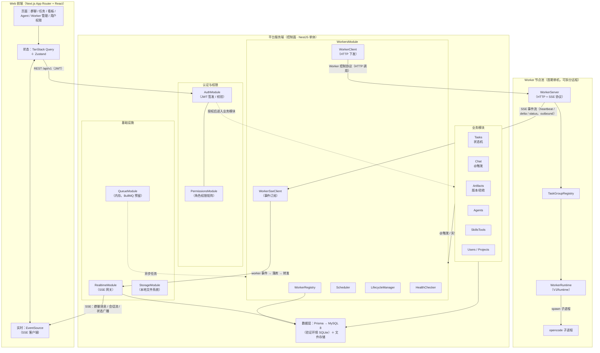

# 平台架构设计

本文档是完整平台技术设计的第一篇，将 07 篇（opencode v2 调研与架构决策）确认的架构基线落地为可实施的技术方案：技术栈选型、控制面模块划分、组件拓扑、数据模型与关键设计决策。架构级设计，不包含完整代码实现；功能依据来自 03/04/05 篇（FR-01~27、FR-30~48）。

## 1. 定位与文档关系

**08 篇是 07 篇的落地化，不是推翻。** 07 篇第 5/9/10/11 章已定四件事，本文档全部继承：

| 07 篇基线 | 08 篇落地 |
|-----------|----------|
| 控制面 / 数据面分离（第 11 章） | 平台服务端（控制面）与 Worker 节点池分离，控制协议为 HTTP + SSE（第 3/4 章） |
| 平台永不直接起 opencode 进程（第 10 章） | 控制面只通过 Worker HTTP 接口下发指令，WorkerRuntime 在节点内部承载 opencode（第 4 章） |
| OpenCodeDriver 抽象（第 9 章） | Worker 内部 V1Runtime（v1 spawn 子进程）/ V2Runtime（v2 Effect Scope），控制面感知不到底层版本（第 4 章） |
| 每任务组一个 opencode 实例（第 5/9 章） | 任务组→worker 实例映射由控制面注册表与 Worker 内 TaskGroupRegistry 共同维护（第 6 章） |

**功能依据。** 需求引用范围：03 篇 FR-01~27（任务/群聊/消息/实时/用户权限/Worker/技能工具）、04 篇 FR-30~48（Agent 管理/产出物/文档库）、05 篇非功能指标（消息显示 ≤1s、@ 首字 ≤5s、会话流查看 ≤2s、单任务 4~6 Agent 并行、可用性 ≥99.5%、水平扩展预留）。

**边界。** 本版实现「完整平台第一版」范围（05 篇 3.2/3.3）；通知、全局搜索、审计、对象存储、WebSocket 双向等明确列为本版之后增强，本文档只做架构预留（第 8 章），不做设计与排期。

## 2. 技术栈选型

### 2.1 总览

| 层 | 选型 | 版本基线 | 选择理由 |
|----|------|---------|---------|
| 运行时 | Node.js + TypeScript | Node.js 22 LTS、TypeScript 5.x | 05 篇已定前后端语言统一；opencode SDK 为 Node/TS 生态 |
| 后端框架 | NestJS | 10+ | 模块化架构天然映射控制面模块划分；内置 DI、管道校验、SSE 网关；业界对比：Express 生态最广但分层需自建，Fastify 性能强但业务基建偏薄 |
| 前端 | Next.js 全栈（App Router + React） | Next.js 15+、React 19 | 05 篇已定；App Router 提供 RSC 与 API Route，轻量胶水逻辑可复用同一进程 |
| 前端状态 | TanStack Query + Zustand | v5 | Query 管理服务端数据（缓存/乐观更新/增量拉取），Zustand 管理 UI 局部状态；对比 Redux Toolkit 样板代码更少 |
| 实时通信 | SSE（统一单向） | — | 群聊与会话流均为服务端→客户端为主的单向流；EventSource 自动重连 + 事件 id 游标续拉；WebSocket 双向需求首版不存在（7.2 详述） |
| ORM | Prisma | 5+ | schema 单一来源 + 全链路类型安全 + MySQL/SQLite 双 provider + 迁移管理；对比 TypeORM 类型体验更佳、Drizzle 迁移生态较新 |
| 数据库 | MySQL 8（验证环境 SQLite） | — | 05 篇已定；兼容策略见 6.2 |
| 认证 | 内置账号 + JWT | @nestjs/passport + @nestjs/jwt | FR-22 内置账号体系；密码 bcrypt 哈希；SSO 属后续迭代（05 篇 3.4） |
| 请求校验 | class-validator + DTO | — | NestJS 管道统一校验，REST 契约清晰 |
| API 文档 | OpenAPI（@nestjs/swagger） | — | 前后端契约单一来源，Swagger UI 直接可调试 |
| 日志 | pino | — | 结构化日志，NestJS 默认集成；审计能力下一版（第 8 章） |
| 文件存储 | 本地文件系统 + 元数据表 | — | 按任务隔离目录；StorageService 抽象接口预留对象存储（05 篇 3.3） |
| 任务队列 | 本版进程内队列 | — | 首期单机部署无需 Redis；QueuePort 抽象预留 BullMQ（7.5） |

### 2.2 关键选型说明

**后端框架选 NestJS。** 控制面是典型的多模块业务系统（认证/任务/群聊/产出物/Agent/Worker 管理），NestJS 的模块化 + DI + 装饰器路由与本文档第 3 章的模块划分一一对应，且 `@Sse()` 事件流、WebSocket 网关、class-validator 管道均为内置生态。Express 作为其底层 HTTP 层的事实标准，生态兼容不损失。

**实时通道选 SSE 而非 WebSocket。** 三个判断依据：① 通道方向以服务端推送为主（群聊新消息、Agent 会话流片段、任务状态变更广播），发消息与 @ 触发走 REST 即可，无双向长连接诉求；② 与 worker→控制面的 SSE 事件流（07 篇 11.3）保持同一种协议实现，控制面只维护一套事件通道基座；③ EventSource 自动重连，配合事件 id 游标可实现断线续拉（7.2），比手写 WebSocket 重连/心跳/背压状态机更稳。协作编辑、看板拖拽实时同步等强双向场景列为下一版 WebSocket 增强。

**ORM 选 Prisma 且双库兼容。** schema 单一来源保证 MySQL（生产）与 SQLite（验证环境）共用一份模型定义；类型安全覆盖从查询到响应。双库兼容的工程约束见 6.2（字符串枚举 + Json 列，规避 SQLite 无原生 enum 的差异）。

## 3. 控制面模块划分

控制面（平台服务端）为 NestJS 单体应用，按业务域切分模块；模块间通过 service 注入与事件总线解耦，禁止跨模块直接访问对方数据表。

### 3.1 模块清单

| 模块 | 职责 | 功能依据 |
|------|------|---------|
| `AuthModule` | 登录/注册/JWT 签发与校验、密码哈希 | FR-22 内置账号体系 |
| `UsersModule` | 用户管理（创建/禁用/列表）、成员查询 | FR-22 |
| `ProjectsModule` | 项目生命周期（创建/归档）、成员管理 | FR-25 |
| `TasksModule` | 任务 CRUD 与状态机（五态迁移）、验收、归档、主 Agent 指定 | FR-01~08 |
| `ChatModule` | 任务群聊/私聊频道、消息模型与持久化、@ 触发解析（定向/@all/互 @）、Loading 与错误状态 | FR-09~14、FR-19~21 |
| `ArtifactsModule` | 产出物协议校验、三类产出物、版本 append、验收基线、文档库 | FR-38~46 |
| `AgentsModule` | Agent 模板/克隆/自定义、提示词/技能/工具/权限范围/默认模型 | FR-30~37、FR-47/48 |
| `SkillsToolsModule` | 技能上传、工具注册（代码/CLI/HTTP/MCP + 初始化命令）与 schema 绑定 | FR-27 |
| `WorkersModule` | Worker 注册表/调度器/生命周期/健康检查（3.2） | FR-26 |
| `PermissionsModule` | 角色权限矩阵、权限范围校验（资源级拦截） | FR-23/24 |
| `RealtimeModule` | SSE 事件网关：worker 事件订阅→落库→前端转发；群聊广播与状态变更广播 | FR-17、FR-19 |
| `StorageModule` | 文件存储抽象：本地文件系统实现；对象存储接口预留 | 05 篇 3.3 |
| `QueueModule` | 队列抽象：本版内存实现；BullMQ 预留（7.5） | 05 篇 1.4 水平扩展预留 |
| `NotificationModule` | 平台内通知 + 外部推送 | **下一版增强，仅接口占位** |

### 3.2 Worker 管理模块（WorkersModule）

对应 07 篇第 11 章控制面侧能力，四个内部组件：

| 组件 | 职责 | 关键实现要点 |
|------|------|-------------|
| `WorkerRegistry` | Worker 注册表：workerId/能力声明/在线状态/负载 | `POST /api/workers/register` 写入；心跳刷新 `last_heartbeat_at`；`GET /api/workers` 供调度与运维 |
| `Scheduler` | 调度器：任务组→worker 实例分配 | 按能力匹配（opencode 版本、可用 skill/tool 清单）+ 负载（实例数）+ 亲和（任务组尽量不动）；07 篇 11.4 任务亲和性 |
| `LifecycleManager` | 生命周期：实例创建/销毁/启停/自愈重调度 | 下发 07 篇 11.3 端点（instances/sessions/prompt/abort）；worker 离线后按亲和与负载迁移任务组 |
| `HealthChecker` | 健康检查：心跳超时检测 | 连续 N 个心跳周期无上报→标记离线→触发重调度；周期可配置（默认 10s 心跳、30s 判定） |

### 3.3 opencode 集成方式（控制面视角）

**控制面不直连 opencode，也不直接起 opencode 进程**（07 篇第 10 章铁律）。WorkersModule 内部持有一个 `WorkerClient`（HTTP 客户端）与 `WorkerSseClient`（事件订阅），按 07 篇 11.3 的语义远程调用：

```
控制面 WorkersModule                       Worker 节点
WorkerClient ──HTTP──▶  POST /worker/{id}/instances        （按任务组创建实例）
                       POST /worker/{id}/sessions/{sid}/prompt（发消息含 mentions）
                       POST /worker/{id}/abort              （中断会话）
                       DELETE /worker/{id}/instances/{gid}  （归档回收）
WorkerSseClient ◀──SSE──  message.part.delta / session.updated / agent.status
                       （worker 主动 outbound，控制面无需反向可达）
```

Driver 语义（createSession/sendMessage/abortSession/listModels）由 WorkerRuntime 在节点内实现并暴露为上述端点，控制面感知不到底层是 v1 还是 v2（v2 迁移只动 worker 侧，07 篇 11.5）。

## 4. Worker 节点与 opencode 承载

Worker 节点侧直接继承 07 篇 11.6 的三层结构，本版以 V1Runtime 起步：

```
Worker 节点
┌──────────────────────────────────────────────┐
│ WorkerServer（HTTP + SSE，协议层 v1/v2 不变）  │
│   /register /instances /sessions /prompt     │
│   /abort /models + SSE 事件流（outbound）      │
├──────────────────────────────────────────────┤
│ TaskGroupRegistry（gid → 运行时实例句柄）      │
├──────────────────────────────────────────────┤
│ WorkerRuntime（本版 V1Runtime）                │
│   createOpencodeServer() spawn opencode 子进程│
│   （每任务组一个实例；agent 变更=写文件+重启该  │
│     实例，07 篇 10.3；v2 迁移换 V2Runtime）    │
└──────────────────────────────────────────────┘
```

- **WorkerServer**：协议编解码与注册/心跳（07 篇 11.2），v2 迁移不动。
- **V1Runtime**：`createOpencodeServer()` 本质是 spawn opencode 子进程（源码证据见 07 篇 10.1），本版采用该方式承载可重启实例；`close()` 杀进程 + 重新 spawn 即「重启实例」。
- **首期部署**：Worker 与控制面同主机部署，但**仍通过 11.3 的 HTTP/SSE 语义通信**（localhost），不直连 opencode；后续将 worker 拆到远程主机零协议改动（07 篇 11.7）。

## 5. 组件拓扑

**正式组件拓扑图（mermaid）。** 下图按「Web 前端 → 平台服务端（控制面）→ Worker 节点池」三层自顶向下呈现组件结构与数据流；本节末尾的 ASCII 图保留作补充参考。



**关键数据流：**

- **前端 ↔ 控制面**：REST `/api/v1`（JWT Bearer）承载发消息 / @ 触发 / 操作命令；控制面 → 前端经 `RealtimeModule` 推送 SSE（群聊消息 / 会话流 / 状态广播，事件 id 游标断线续拉）。
- **控制面 → Worker**：`WorkerClient` 以 Worker 控制协议（HTTP 调用）下发实例创建 / prompt / abort；Worker → 控制面经 `WorkerSseClient` 订阅 outbound SSE 事件流（heartbeat / delta / status）。
- **opencode 铁律**：控制面与 opencode 之间**无直接连线**——指令链为「控制面 `WorkerClient` → `WorkerServer`（HTTP）→ `TaskGroupRegistry` → `WorkerRuntime`（`V1Runtime` spawn opencode 子进程）」，控制面感知不到底层引擎版本。

**补充：ASCII 示意（保留作补充参考）**

```
┌────────────────────────── Web 前端（Next.js App Router + React） ──────────────────────────┐
│  页面：登录/项目列表/任务创建/任务看板/群聊/私聊/任务详情/Agent 配置/Worker 管理/技能工具/   │
│        用户管理/角色权限（06 篇 8 核心页 + 管理页）                                          │
│  状态：TanStack Query（REST 数据缓存）＋ Zustand（UI 局部状态）                              │
│  实时：EventSource（SSE：群聊消息/会话流/任务状态广播）＋ REST（发消息/@ 触发/操作命令）      │
└──────────────────────────────┬───────────────────────────────┬─────────────────────────────┘
                               │ REST /api/v1（JWT Bearer）     │ SSE（事件 id 游标，断线续拉）
┌──────────────────────────────▼───────────────────────────────▼─────────────────────────────┐
│                         平台服务端（控制面 · NestJS 单体）                                     │
│  ┌────────────────────────┐ ┌──────────────────────────────────────────────────────────┐   │
│  │ Auth / Permissions     │ │ 业务模块                                                     │   │
│  │ JWT · 角色权限矩阵      │ │ Tasks（状态机）│ Chat（@触发）│ Artifacts（版本/验收基线）    │   │
│  │ FR-23/24               │ │ Agents（配置/克隆）│ SkillsTools（注册）│ Users │ Projects   │   │
│  └────────────────────────┘ └──────────────────────────────────────────────────────────┘   │
│  ┌───────────────────────────────────────────────────────────────────────────────────┐    │
│  │ WorkersModule：Registry │ Scheduler │ Lifecycle │ Health                              │    │
│  │   WorkerClient（HTTP 下发）＋ WorkerSseClient（事件订阅）── 07 篇 11.3 远程化 Driver    │    │
│  └───────────────────────────────────────────────────────────────────────────────────┘    │
│  ┌─────────────────────┐ ┌─────────────────────┐ ┌────────────────────────────┐           │
│  │ RealtimeModule      │ │ QueueModule（内存）  │ │ StorageModule（本地文件系统）│           │
│  │ worker 事件→落库→    │ │ BullMQ 预留（7.5）   │ │ 对象存储接口预留              │           │
│  │ 转发前端 SSE          │ │                     │ └────────────────────────────┘           │
│  └─────────────────────┘ └─────────────────────┘                                          │
│  ┌───────────────────────────────────────────────────────────────────────────────────┐    │
│  │ 数据层：Prisma → MySQL 8（验证环境 SQLite）│ 文件存储：磁盘按任务隔离目录                │    │
│  └───────────────────────────────────────────────────────────────────────────────────┘    │
└──────────────────────────────┬──────────────────────────────────────────────────────────────┘
                               │ Worker 控制协议（HTTP 调用 + SSE 事件流，worker 主动 outbound）
┌──────────────────────────────▼──────────────────────────────────────────────────────────────┐
│                        Worker 节点池（首期单机，可拆分远程）                                   │
│  ┌──────────────────────────────┐  ┌──────────────────────────────┐  ┌───────────────────┐  │
│  │ WorkerServer（HTTP+SSE）      │  │ WorkerServer（HTTP+SSE）      │  │ WorkerServer      │  │
│  │ TaskGroupRegistry             │  │ TaskGroupRegistry             │  │ （可水平加节点）   │  │
│  │ WorkerRuntime（V1Runtime）    │  │ WorkerRuntime（V1Runtime）    │  │ 注册即入池        │  │
│  │   spawn opencode 子进程       │  │   spawn opencode 子进程       │  │ （07 篇 11.4）    │  │
│  └──────────────────────────────┘  └──────────────────────────────┘  └───────────────────┘  │
└──────────────────────────────────────────────────────────────────────────────────────────────┘
```

**数据流要点：**

1. **群聊消息**：前端 REST 发消息 → ChatModule 落库（FR-19 持久化）→ RealtimeModule 广播 SSE 到频道订阅者 → 前端 EventSource 渲染（目标 ≤1s，05 篇 1.1）。
2. **@ 触发**：ChatModule 解析 mentions（FR-11 定向/FR-12 @all/FR-13 互 @）→ TasksModule 定位任务组与实例 → WorkersModule 经 WorkerClient 下发 `/prompt` → worker 内 V1Runtime 送 opencode（目标首字 ≤5s）。
3. **会话流查看**：前端点击查看（FR-17）→ 建立 SSE 订阅 → RealtimeModule 转发 worker 的 `message.part.delta`（7.3 链路）；群聊不广播内部过程（FR-18）。

## 6. 数据模型

### 6.1 表划分（MySQL，表名 + 要点）

| 域 | 表 | 要点 |
|----|----|------|
| 认证 | `users` | id、username、password_hash（bcrypt）、display_name、状态 |
| 项目 | `projects` | id、name、description、owner_id、status（active/archived，FR-25） |
| 项目 | `project_members` | project_id × user_id、role（owner/member）；跨项目数据隔离依据（05 篇 1.2） |
| 权限 | `roles` | 预置 admin/member + 自定义角色；permissions Json（角色权限矩阵，FR-23） |
| Agent | `agents` | id、name、type（template/clone/custom）、base_agent_id（克隆源）、prompt、default_model、permission_scope Json、created_by（FR-30~33/36/47） |
| Agent | `agent_skills` | agent_id × skill_id（FR-34） |
| Agent | `agent_tool_effects` | agent_id × tool_action × effect（allow/ask/deny），逐工具权限点（FR-35/48） |
| 技能工具 | `skills` | id、name、描述、文件元数据（FR-27） |
| 技能工具 | `tools` | id、action（工具名即权限点）、source（builtin/custom/mcp）、mcp_server、schema Json、init_command Json（FR-27） |
| 任务 | `tasks` | id、project_id、title、description、status（五态字符串枚举）、priority、main_agent_id、background_docs Json、created_by（FR-01~03/06~08） |
| 任务 | `task_agents` | task_id × agent_id、joined_at/removed_at（虚拟团队可调整，FR-02） |
| 任务 | `task_events` | task_id、type（status_change/accept/reject/archive）、from/to、actor、created_at；状态机落库与回查依据（7.4） |
| 会话 | `sessions` | id、task_id × agent_id（每 Agent 每任务独立会话，FR-37）、worker_id、instance_ref、status（active/frozen/archived） |
| 群聊 | `chat_channels` | id、type（task_group/private）、task_id |
| 群聊 | `messages` | id、channel_id、sender_type（user/agent/system）、sender_id、content Json、mentions Json、created_at；持久化与 SSE 游标依据（FR-10/19） |
| 产出物 | `artifacts` | id、task_id、type（text/doc/file）、title、current_version（任务全局文档，FR-39~42） |
| 产出物 | `artifact_versions` | id、artifact_id、version、content_ref、file_path、sha256、accepted_flag（验收基线，FR-04/43） |
| Worker | `workers` | id（workerId）、name、opencode_version、capabilities Json、status（online/offline）、last_heartbeat_at（FR-26，07 篇 11.2） |
| Worker | `task_group_instances` | task_id × worker_id × instance_id；任务组→实例映射，亲和与重调度依据（07 篇 11.6） |
| 预留 | `audit_logs` | actor_type、actor_id、action、target、created_at；**下一版启用**，本版不建（第 8 章） |

### 6.2 双库兼容策略（MySQL / SQLite）

- **字符串枚举**：状态、类型等枚举字段一律用 `String` 列 + 应用层常量（SQLite 无原生 enum），Prisma schema 不声明 `enum` 类型。
- **Json 列**：结构化字段（permissions、content、mentions、capabilities 等）用 Prisma `Json` 类型；SQLite 以 TEXT 存储，行为一致。
- **迁移**：prisma migrate 生成 SQL 按 provider 切换；验证环境跑 SQLite 迁移、生产跑 MySQL 迁移，schema 单一来源。

### 6.3 数据一致性设计

- **任务状态机以数据库为唯一事实源**：`tasks.status` + `task_events` 事件日志；状态变更走 TasksModule 统一入口校验合法迁移（五态：待开始→进行中→待验收→已完成→已归档，FR-03），落库成功后广播 SSE。
- **验收联动**：验收通过时记录 `artifact_versions.accepted_flag`（验收基线）；Agent 再次更新产出物生成新版本时任务自动退回「进行中」（FR-04 版本联动），已验收版本不可覆盖。
- **worker 事件幂等**：控制面消费 worker SSE 事件时以 `(instance_id, event_id)` 唯一约束去重，保证「至少一次投递 + 幂等消费」，为分布式演进与自愈重调度（07 篇 11.4）打好基础。

## 7. 关键设计决策

### 7.1 部署形态：首期单机，架构按分布式预留

首期「控制面 + Worker 节点池」同主机部署（一个主机跑 NestJS 控制面 + 若干 Worker 进程），数据库 MySQL 8（验证环境 SQLite 单文件）。**单机不等于进程内直连**：控制面与 worker 之间仍然走 07 篇 11.3 的 HTTP/SSE 控制协议（localhost），控制面不直连 opencode。分布式演进（worker 拆远程、控制面多实例）时协议层零改动，只需：worker 配置 serverUrl 指向控制面公网地址（07 篇 11.2 outbound 注册）、控制面多实例时把 QueueModule 内存实现换成 BullMQ（7.5）。

### 7.2 实时推送：统一 SSE

| 通道 | 方向 | 协议 | 说明 |
|------|------|------|------|
| worker → 控制面 | 单向 | SSE | 07 篇 11.3 事件流（heartbeat/delta/status） |
| 控制面 → 前端 | 单向 | SSE | 群聊新消息、会话流片段、任务状态变更广播 |
| 前端 → 控制面 | 请求/响应 | REST | 发消息、@ 触发、操作命令 |

**游标续拉**：SSE 事件携带递增 id（复用消息/事件主键）；前端断线重连后按 `since` 游标从控制面补拉增量（REST 兜底），与 FR-19 消息持久化、05 篇「任务与产出不因中断丢失」对齐。WebSocket 双向留待下一版（协作编辑等场景）。

#### 7.2.1 三级 SSE 链路

「统一 SSE」本质是**三级链路**：模型输出流①（opencode 内部）→ worker→控制面 SSE②（内部协议，引擎事件）→ 控制面→前端 SSE③（对外契约，业务事件）。三者的连接不同、事件语义不同，但事件帧格式同构，共同构成 07 篇 11.3 与 09 篇 §4 所指的「一套事件基座」。

```mermaid
flowchart TD
    subgraph ①["① 模型输出流（opencode 内部）"]
        A["opencode 引擎事件流<br/>message.part.delta / session.updated / agent.status / task.completed"]
    end
    A -->|"worker 内捕获（SDK/事件订阅）"| B["② worker → 控制面 SSE<br/>WorkerSseClient 订阅（07 篇 11.3）<br/>内部协议 · 引擎事件"]
    B -->|"SSE 引擎事件"| C["RealtimeModule 消费<br/>幂等落库 → 语义转换（引擎事件 → 业务事件）→ 按订阅者转发"]
    C -->|"SSE 业务事件<br/>chat.message.new / session.stream.chunk / artifact.submitted / task.status_changed"| D["③ 控制面 → 前端 SSE<br/>前端 EventSource（09 篇 §4）<br/>对外契约 · 业务事件"]
```

**三级关系与边界：**

- **① 模型输出流 ≠ ② ≠ ③**：模型输出流在 opencode 进程内（worker 内捕获），② 是 worker→控制面的内部协议连接，③ 是控制面→前端的对外契约连接，三段各自独立，不存在同一连接贯穿。
- **②③ 连接不同、帧格式同构**：事件帧统一 `{id, type, data, timestamp}`（07 篇 11.3 与 09 篇 §4 同构），控制面只维护一套事件基座。
- **不是透传**：RealtimeModule 做语义转换（引擎事件→业务事件）+ 过滤（FR-18 内部过程不广播：思考/工具过程仅按需给 `sessions/:id/stream`）+ 幂等落库（FR-19 持久化，断线游标补拉），worker 事件不会原样到达前端。
- **不是另起一套**：③ 的前端事件帧复用同一格式，只是事件类型为业务事件、语义面向对外契约，与 ② 的引擎事件相区别。

### 7.3 Agent 会话流链路（worker SSE → 控制面 → 前端）

```
Worker 节点                 控制面 RealtimeModule                  前端
opencode 会话流                │                                     │
  message.part.delta ──SSE──▶ 订阅 worker 事件                        │
                              │→ 幂等落库（sessions/messages）        │
                              │→ 按订阅者转发 ────────────────SSE──▶ EventSource 渲染会话流
```

- 会话流**按需订阅**：前端点击「查看 Agent 会话」（FR-17）时才建立订阅；群聊只显示最终回复，内部过程不广播（FR-18）。
- 控制面只做「订阅→落库→转发」，不直连 opencode；事件先落库再转发，保证重连后可游标恢复（会话流查看延迟目标 ≤2s，05 篇 1.1）。

### 7.4 状态机落库与事件驱动

任务/群聊/产出物状态变更统一走「**服务层入口 → 落库（含 task_events）→ 广播 SSE**」三段式：

1. **服务层校验**：合法迁移与业务规则（如验收需产出齐备、已验收版本不可覆盖）在 TasksModule/ArtifactsModule 入口收敛。
2. **落库**：状态变更与事件日志同事务写入，数据库为唯一事实源；worker 侧事件幂等消费（6.3）。
3. **广播**：落库成功后 RealtimeModule 广播，前端状态与数据库保持一致；广播失败不影响数据正确性（前端可游标补拉）。

### 7.5 任务队列抽象（本版内存，预留 BullMQ）

@ 触发消息分派、worker 事件处理、心跳超时检测等异步任务本版由 NestJS 进程内事件机制承载（单机部署无 Redis 依赖）。`QueueModule` 暴露 `QueuePort` 接口（enqueue/consume），控制面多实例部署时替换为 BullMQ（Redis）实现，业务模块零改动。**首版不引入 Redis**——引入新中间件需要明确收益，单机形态下进程内队列已满足。

### 7.6 认证与权限

- **认证**：内置账号 + JWT（access token 短时效 + 刷新），密码 bcrypt；SSO 属后续迭代（05 篇 3.4）。
- **权限**：`roles` 表承载角色权限矩阵（FR-23）；`PermissionsModule` 提供资源级拦截（项目内数据可见性，FR-24、05 篇 1.2 项目级权限模型）；Agent 侧工具权限（allow/ask/deny，FR-48）存于 `agent_tool_effects`，运行时由 worker 内 opencode 执行，ask 确认经 07 篇 Permission 交互事件流回到平台转成员确认。

## 8. 本版实现 vs 下一版增强（架构预留）

| 能力 | 本版实现 | 下一版增强 | 预留方式 |
|------|---------|-----------|---------|
| 通知 | 平台内 SSE 实时广播（无独立通知体系） | 站内信 + 邮件/飞书外部推送 | `NotificationModule` 接口占位（3.1） |
| 全局搜索 | 基础列表查询（SQL 过滤） | 跨任务搜索消息/产出物/标题 | 索引与搜索服务独立模块，本版不引入 |
| 审计 | 核心操作事件落 `task_events` + pino 日志 | 全量操作留痕 `audit_logs` | 表结构预留，本版不建（6.1） |
| 对象存储 | 本地文件系统（按任务隔离目录） | 大规模对象存储 | `StorageModule` 抽象接口（3.1） |
| 任务队列 | 进程内内存队列 | BullMQ（Redis），支持控制面多实例 | `QueuePort` 抽象（7.5） |
| 实时通信 | SSE 单向 | WebSocket 双向（协作编辑等） | RealtimeModule 网关预留升级点（7.2） |
| 会话恢复 | 消息/事件落库 + 游标补拉 | v2 durable session 断点续接（05 篇 3.4） | 会话事件已幂等落库，可重放（7.3） |
| Worker 分布 | 单机同主机 | 远程 Worker 池水平扩展 | 控制协议与注册/心跳已按 outbound 设计（7.1） |

## 9. 风险与缓解

| 风险 | 说明 | 缓解 |
|------|------|------|
| opencode v1 并发稳定性 | 单实例承载并发会话未经大规模验证 | 每任务组一个实例（隔离天然）；实例数上限可配；上线前并发压测（05 篇 4.1） |
| v2 契约演进 | v2 beta 每日发布，契约未冻结 | 07 篇锁版本 + 定期同步；OpenCodeDriver 隔离版本差异，迁移只动 worker 侧（07 篇 11.5） |
| 进程内队列单点 | 控制面单实例时异步处理无横向能力 | 本版单机形态可接受；分布式时换 BullMQ（7.5） |
| SSE 断连丢事件 | 前端长连接中断期间事件丢失 | 事件 id 游标 + 落库后转发，重连补拉（7.2/7.3） |
| Agent 互 @ 循环 | Agent 间互相触发形成响应循环 | 单轮互 @ 次数上限、用户可随时中断（07 篇 abort 语义，05 篇 4.1） |

本文档与 07 篇共同构成完整平台的技术基线：07 篇定方向与引擎决策，本文档定技术栈、模块、数据与关键机制。后续技术设计（API 契约、ER 细化、部署方案）以此为准展开。
