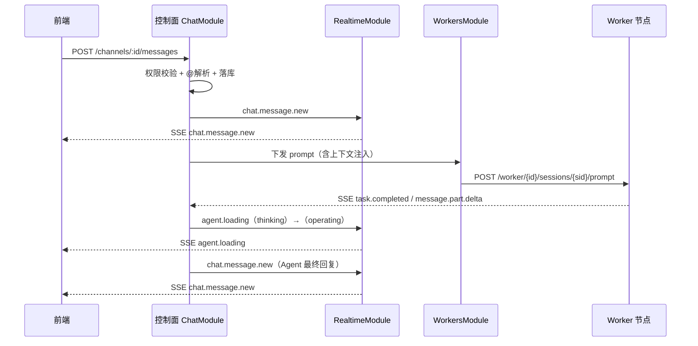
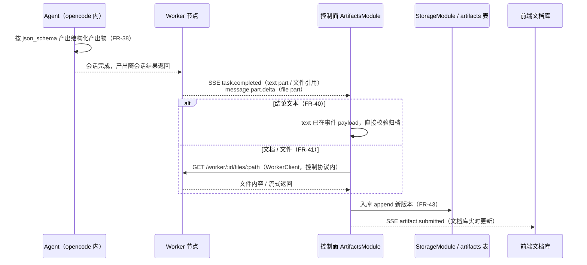

# API 设计

本文档是完整平台技术设计的第二篇，将 08 篇（平台架构设计）的模块划分与数据模型落地为**控制面对外契约**：REST 端点清单（按模块）、SSE 事件设计（前端订阅 + worker 事件消费）、关键接口详设，以及对外 API 与 Worker 控制协议的边界关系。API 设计级：端点清单 + 请求/响应要点 + 关键详设，不包含完整实现代码（DTO 以类型示意给出）。功能依据来自 03/04/05 篇（FR-01~27、FR-30~48、非功能指标）。

## 1. 定位与文档关系

**09 篇是 08 篇的接口落地，不是新增架构。** 08 篇已定四件事，本文档全部继承：

| 08 篇基线 | 09 篇落地 |
|-----------|----------|
| 控制面为 NestJS 单体，REST `/api/v1`（JWT）+ 统一 SSE（08 篇 §2/§5） | 全部 REST 端点收敛在 `/api/v1` 前缀下；SSE 事件格式统一 `{id, type, data, timestamp}`（本文档 §4） |
| 模块划分（Auth/Users/Projects/Tasks/Chat/Artifacts/Agents/SkillsTools/Workers/Permissions/Realtime，08 篇 §3.1） | 端点清单按模块组织，一模块一节（§3）；RealtimeModule 承载全部 SSE 端点（§4） |
| Worker 控制协议（07 篇 11.3，08 篇 §3.3 WorkerClient/WorkerSseClient） | **对外契约 ≠ worker 协议**：前者是前端↔控制面的业务契约，后者是控制面↔worker 的内部协议，两者由控制面翻译衔接（§7） |
| 数据模型（08 篇 §6：users/tasks/messages/artifacts/workers 等 21 表） | 端点请求/响应与表一一对应；消息与事件以主键为游标，SSE 与 REST 历史共用同一游标语义（§2.2/§4.4） |

**功能依据。** 端点逐条引用 FR 编号：03 篇 FR-01~27（任务/群聊/实时/用户权限/Worker/技能工具）、04 篇 FR-30~48（Agent/产出物/文档库）、05 篇非功能指标（消息显示 ≤1s、@ 首字 ≤5s、会话流查看 ≤2s、可用性 ≥99.5%）。

**边界。** 本版实现「完整平台第一版」范围（05 篇 3.2/3.3）。通知、全局搜索、审计、WebSocket 双向等下一版能力**不在 API 中新增端点**，仅按 08 篇 §8 做模块/接口占位（§8）。

**与 07/08 篇前缀的关系。** 07 篇 11.2/08 篇 §3.2 以 `/api/workers/register` 指代 worker 注册端点；为统一对外契约，本文档全部端点收敛为 `/api/v1` 前缀（`POST /api/v1/workers/register`），语义不变。

## 2. 通用约定

### 2.1 REST 基础约定

| 项 | 约定 |
|----|------|
| 基础路径 | `/api/v1`；全部 REST 端点（含 worker 注册/心跳）均在此前缀下 |
| 认证 | `Authorization: Bearer <accessToken>`；access token 短时效（默认 2h）+ refresh token（默认 7d），刷新走 `POST /auth/refresh`（08 篇 §7.6） |
| 内容类型 | 请求/响应均为 `application/json`；文件上传为 `multipart/form-data` |
| 幂等 | 状态迁移类端点（start/accept/archive 等）在服务端做幂等校验：已处于目标状态时返回 200 且不重复产生 `task_events` |

**错误响应统一格式**（HTTP 状态码 + 业务码）：

```json
{
  "code": "TASK_INVALID_TRANSITION",
  "message": "任务状态迁移不合法：待开始 → 已完成",
  "details": { "from": "pending", "to": "done" }
}
```

| HTTP | 业务码前缀 | 场景 |
|------|-----------|------|
| 400 | `VALIDATION_*` | DTO 校验失败（class-validator） |
| 401 | `AUTH_*` | 未认证 / token 过期 / 刷新失败 |
| 403 | `PERMISSION_*` | 已认证但角色权限矩阵禁止（FR-23）或超出权限范围（FR-24） |
| 404 | `NOT_FOUND_*` | 资源不存在（任务/频道/Agent/产出物等） |
| 409 | `*_CONFLICT` / `*_INVALID_TRANSITION` | 状态冲突（如已验收版本覆盖、任务状态迁移非法） |
| 500 | `INTERNAL_*` | 服务端异常（错误消息不回传堆栈） |

### 2.2 分页与游标约定

| 场景 | 机制 | 说明 |
|------|------|------|
| 列表类（任务/用户/Worker/Agent/产出物/角色） | `page`/`pageSize`（默认 1/20，上限 100） | 响应含 `{items, total, page, pageSize}`；排序字段随各端点说明 |
| 消息历史（FR-19 持久化） | `cursor` 游标 | `GET /channels/:id/messages?cursor=<lastMessageId>&limit=50`；响应含 `nextCursor`；**游标即消息主键 id**，与 SSE 事件 id 同源，断线续拉对齐（§4.4） |
| SSE 事件补拉 | `since` 游标 | `GET /events?since=<lastEventId>`，事件 id 递增（§4.4） |

### 2.3 权限控制（FR-23/24 的 API 落地）

权限判定在控制面统一执行：`AuthModule` 验证 JWT → `PermissionsModule` 按「角色权限矩阵（资源×操作）+ 权限范围（项目边界）」拦截（08 篇 §7.6）。端点表以两种标记标注：

- **`[admin]`**：平台管理员专属，对应矩阵中用户管理/权限配置/Worker 节点/技能工具资源行的「管理」操作（FR-22/23/26/27）。
- **`[project]`**：项目内端点，校验调用者须为该项目成员（`project_members`，FR-24「指定项目」范围）；跨项目数据不可见（05 篇 1.2）。
- **`[worker]`**：Worker 注册/心跳端点，**不使用用户 JWT**，使用部署时下发的 worker 内部 token（`X-Worker-Token`），与用户权限体系完全隔离（§7）。

项目成员默认具备：任务查看/创建（FR-01）、群聊发消息与 @（FR-09~13）、产出物查看（FR-44/45）、Agent 查看与克隆/自定义（FR-31/32）；不具备：用户管理、权限配置、Worker 管理、技能工具管理（均为 `[admin]`）。验收操作（FR-04）为项目内权限，不做单独角色门槛（验收员角色属自定义角色组合，FR-23）。

**操作映射**：矩阵「查看/创建/编辑/删除/验收/管理」对应 HTTP 语义——GET=查看、POST=创建、PATCH=编辑、DELETE=删除、POST 状态迁移端点=验收/管理。矩阵中「删除」仅作用于本版可删对象（项目成员移除、自定义角色删除，FR-23 边界说明）；任务/消息/产出物无 DELETE 端点。

## 3. REST 端点清单（按模块）

> 各端点表格列：方法 + 路径 + 请求要点 + 响应要点 + 权限 + 功能依据。

### 3.1 Auth

| 方法 | 路径 | 请求要点 | 响应要点 | 权限 | 依据 |
|------|------|---------|---------|------|------|
| POST | `/auth/register` | `{username, password, displayName, email?}` | `201` + `{id, username, displayName}`；默认角色 member、无项目 | 公开 | FR-22 |
| POST | `/auth/login` | `{username, password}` | `{accessToken, refreshToken, user}` | 公开 | FR-22 |
| POST | `/auth/refresh` | `{refreshToken}` | 新 `{accessToken, refreshToken}`；刷新失败 401 `AUTH_REFRESH_INVALID` | 公开（凭 refresh token） | 08 §7.6 |

### 3.2 Users（FR-22 用户管理）

| 方法 | 路径 | 请求要点 | 响应要点 | 权限 | 依据 |
|------|------|---------|---------|------|------|
| GET | `/users` | `page/pageSize`、`search?`（用户名/姓名模糊） | `{items, total, ...}`；**不含 password_hash** | `[admin]` | FR-22 |
| POST | `/users` | `{username, password, displayName, email?, roleId, projectIds[]}` | `201` + 用户对象 | `[admin]` | FR-22 |
| GET | `/users/:id` | — | 用户详情（含角色、所属项目） | `[admin]`（本人可查自己） | FR-22 |
| PATCH | `/users/:id` | `{displayName?, email?, roleId?, projectIds[]}` | 更新后用户对象 | `[admin]` | FR-22 |
| PATCH | `/users/:id/status` | `{enabled: boolean}` | 禁用/启用；禁用后该用户登录返回 401；**不删除账号数据** | `[admin]` | FR-22 |
| POST | `/users/:id/reset-password` | 管理员生成新临时密码 `{newPassword}` | 返回新密码（仅此一次明文返回） | `[admin]` | FR-22 |

### 3.3 Projects（FR-25 项目生命周期）

| 方法 | 路径 | 请求要点 | 响应要点 | 权限 | 依据 |
|------|------|---------|---------|------|------|
| GET | `/projects` | `page/pageSize`、`status?` | 调用者所属项目列表（管理员可见全部） | `[project]`（成员仅见已加入） | FR-25 |
| POST | `/projects` | `{name, description?}` | `201` + 项目对象（status=active）；创建者为主人 `owner` | `[admin]`（获授权成员可创建） | FR-25 |
| GET | `/projects/:id` | — | 项目详情 + 成员列表 | `[project]` | FR-25 |
| PATCH | `/projects/:id` | `{name?, description?}` | 更新后项目对象 | `[project]`（owner 或授权角色） | FR-25 |
| POST | `/projects/:id/members` | `{userId, role: owner\|member}` | `201`；加入后该用户可在项目内创建任务 | `[admin]` | FR-25 |
| DELETE | `/projects/:id/members/:userId` | — | `204`；**本版可删除对象之一**（FR-23 删除适用）；移除不删用户数据 | `[admin]` | FR-23/25 |

### 3.4 Tasks（FR-01~08 任务管理）

| 方法 | 路径 | 请求要点 | 响应要点 | 权限 | 依据 |
|------|------|---------|---------|------|------|
| GET | `/projects/:pid/tasks` | `page/pageSize`、`status?`（五态筛选）、`priority?` | 看板/列表数据（FR-03 五态对应） | `[project]` | FR-01/03 |
| POST | `/projects/:pid/tasks` | `{title, description?, priority?, agentIds[], mainAgentId?, backgroundDocs[]?}` | `201` + 任务对象；**自动创建任务群聊频道与文档库**（FR-01/09）；背景文档入文档库（FR-06） | `[project]` | FR-01/02/06/09 |
| GET | `/tasks/:id` | — | 任务详情（状态/团队/主 Agent/产出物摘要） | `[project]` | FR-01 |
| PATCH | `/tasks/:id` | `{title?, description?, priority?, mainAgentId?}` | 更新后任务；mainAgentId 校验须为团队内已选 Agent（FR-08） | `[project]` | FR-01/08 |
| POST | `/tasks/:id/start` | — | 状态 待开始→进行中；校验已选 Agent 与主 Agent（FR-07）；**启动消息私信主 Agent**（FR-07）；响应 `{task, mainAgentId}` | `[project]` | FR-07/08 |
| POST | `/tasks/:id/mark-pending-review` | — | 状态 进行中→待验收（成员手动标记，FR-04）；**Agent 不自动触发** | `[project]` | FR-04 |
| POST | `/tasks/:id/accept` | — | 状态 待验收→已完成；记录产出物验收基线 `accepted_flag`（FR-04/43） | `[project]` | FR-04 |
| POST | `/tasks/:id/reject` | — | 状态 待验收→进行中；产出补齐后再入待验收（FR-04） | `[project]` | FR-04 |
| POST | `/tasks/:id/archive` | — | 状态 已完成→已归档；**归档不删除任何内容**（FR-05）；归档后回收 worker 实例（08 篇 §3.3 DELETE instances） | `[project]` | FR-05 |
| POST | `/tasks/:id/team` | `{addAgentIds[]?, removeAgentIds[]?}` | 团队调整（FR-02）；添加时注入文档库上下文（FR-15）；移除后会话冻结、产出物保留；群聊发系统消息（FR-10） | `[project]` | FR-02/10 |
| POST | `/tasks/:id/background-docs` | `multipart/form-data` 多文件 | `201` + 文档元数据数组；进入任务文档库（FR-06） | `[project]` | FR-06 |

**状态迁移汇总**（FR-03 五态，服务端校验合法迁移，非法返回 409 `TASK_INVALID_TRANSITION`）：

```
待开始 ──start──▶ 进行中 ──mark-pending-review──▶ 待验收 ──accept──▶ 已完成 ──archive──▶ 已归档
                        ▲                            │
                        └──────── reject ────────────┘
```

### 3.5 Chat（FR-09~14/19 群聊协作）

| 方法 | 路径 | 请求要点 | 响应要点 | 权限 | 依据 |
|------|------|---------|---------|------|------|
| GET | `/channels` | `type?`（task_group/private） | 调用者可访问的频道列表（任务群聊自动创建，FR-09） | `[project]` | FR-09/14 |
| GET | `/channels/:id` | — | 频道信息（类型、关联任务、成员/Agent 列表） | `[project]` | FR-09 |
| GET | `/channels/:id/messages` | `cursor?&limit?`（默认 50） | `{items, nextCursor}`；消息按 id 升序（FR-19 持久化，游标对齐 SSE） | `[project]` | FR-10/19 |
| POST | `/channels/:id/messages` | `{text, mentions[]}`（@ 解析，见 §5.1 详设） | `201` + `{message, triggers[]}`；触发 Agent 进入 Loading（FR-20） | `[project]` | FR-10/11/12 |
| POST | `/dm-channels` | `{taskId, agentId}` | 私聊频道；**与群聊共用该 Agent 会话**（FR-14），不发新消息 | `[project]` | FR-14 |
| GET | `/channels/:id/trigger-results/:messageId` | — | @ 触发结果（被触发 Agent、dispatch 状态、回复消息 id）；轮询兜底，常态走 SSE（§4.2） | `[project]` | FR-11/12/20 |

> 消息类型三态（用户/Agent 回复/系统，FR-10）由 `senderType` 区分，经 SSE 广播与历史查询均含该字段。Agent 间互 @（FR-13）不新增端点：Agent 回复中的 mentions 经 worker 事件（`task.completed` payload）回流，控制面按其语义继续分派（§4.3），互 @ 轮次上限（3 轮）与循环检测在分派链路校验（FR-13）。

### 3.6 Artifacts（FR-38~46 产出物与文档库）

| 方法 | 路径 | 请求要点 | 响应要点 | 权限 | 依据 |
|------|------|---------|---------|------|------|
| GET | `/tasks/:id/artifacts` | `type?`（text/doc/file）、`search?` | 文档库列表（类型/标题/版本/作者/时间，FR-44） | `[project]` | FR-44 |
| GET | `/artifacts/:id` | — | 产出物详情 + 版本列表（FR-45 版本切换入口） | `[project]` | FR-45 |
| GET | `/artifacts/:id/versions/:version` | — | 指定版本内容（text/doc 返回正文，file 返回下载地址） | `[project]` | FR-43/45 |
| POST | `/tasks/:id/artifacts` | `{type, title, content?}`（结论文本/文档） | `201` + 新版本（append 递增，FR-43）；**成员/主 Agent 辅助提交入口（P1）** | `[project]` | FR-40/43 |

**产出物落库主路径是事件驱动，非本端点**：Agent 会话完成时按产出物协议（FR-38 json_schema）产出，经 worker 事件（`message.part.delta` 的 file part / `task.completed` payload）回流控制面，由 ArtifactsModule 校验后自动归档（FR-40 结论文本直接归档 / FR-41 文档平台拉取；拉取失败不产生不完整归档）。上述 `POST /tasks/:id/artifacts` 仅为成员手动补充提交的辅助入口（P1，FR-40 的「无需额外导出」不依赖它）。已验收版本不可覆盖（FR-43 边界）：对已验收产出物提交新内容返回 409 `ARTIFACT_ACCEPTED_IMMUTABLE`，Agent 只能 append 新版本。

### 3.7 Agents（FR-30~37/47/48 Agent 管理）

| 方法 | 路径 | 请求要点 | 响应要点 | 权限 | 依据 |
|------|------|---------|---------|------|------|
| GET | `/agents` | `type?`（template/clone/custom）、`page/pageSize` | Agent 列表（含四类预置模板，FR-30） | `[project]` | FR-30 |
| GET | `/agents/:id` | — | Agent 详情：提示词/技能/工具 effect/权限范围/默认模型（FR-33~36/47/48） | `[project]` | FR-33~36/47 |
| POST | `/agents` | `{name, type: custom, prompt?, skillIds[], toolEffects{}, permissionScope?, defaultModelId?}` | `201` + Agent 对象（完全自定义，FR-32） | `[project]` | FR-32/33~36/47 |
| POST | `/agents/:id/clone` | `{name}` | `201` + 克隆副本（baseAgentId 记录克隆源，FR-31）；**原模板不受影响** | `[project]` | FR-31 |
| PATCH | `/agents/:id` | `{prompt?, skillIds[], toolEffects{}, permissionScope?, defaultModelId?}` | 更新后 Agent；配置即时生效于后续会话（FR-33） | `[project]` | FR-33~36/47/48 |
| GET | `/agents/:id/available-models` | — | 模型列表（经 worker `GET /models` 动态获取，FR-47） | `[project]` | FR-47 |

> `toolEffects` 结构：`{ "<action>": "allow" | "ask" | "deny" }`，支持通配 action（`jenkins-*`，FR-48）；工具名即权限点，随工具注册动态扩展（FR-48 开放命名空间）。Agent 配置改动对运行中任务的影响：提示词/技能/工具变更后，由控制面经 WorkerClient 下发「重启实例」使 v1 运行时生效（07 篇 10.3，API 层无需暴露）。

### 3.8 SkillsTools（FR-27 技能与工具管理）

| 方法 | 路径 | 请求要点 | 响应要点 | 权限 | 依据 |
|------|------|---------|---------|------|------|
| POST | `/skills` | `multipart/form-data`（SKILL.md 技能包） | `201` + 技能对象（默认停用） | `[admin]` | FR-27 |
| GET | `/skills` | `enabled?`、`page/pageSize` | 技能库列表；启用的技能可供 Agent 勾选（FR-34） | `[admin]`（成员只读可见已启用） | FR-27 |
| PATCH | `/skills/:id/status` | `{enabled: boolean}` | 启用/停用；停用后已勾选该技能的 Agent 不再注入（FR-27） | `[admin]` | FR-27 |
| POST | `/tools` | `{name, execution: code\|cli\|http\|mcp, schema?, initCommand?, mcpServer?}` | `201` + 工具对象；注册后自动进入权限命名空间（action=工具名，FR-48） | `[admin]` | FR-27/48 |
| GET | `/tools` | `source?`（builtin/custom/mcp）、`page/pageSize` | 工具列表（含来源徽章，FR-48） | `[admin]`（成员只读可见） | FR-27/48 |
| PATCH | `/tools/:id` | `{schema?, initCommand?, enabled?}` | 更新工具定义；停用后 Agent 无法调用（FR-35 启用开关） | `[admin]` | FR-27/35 |

> 工具不提供 DELETE：工具名即权限点，删除会造成历史 Agent 配置悬空，本版以停用（enabled=false）替代（FR-35 启用开关语义）。四种执行方式（FR-27）：代码=内嵌脚本、CLI=命令行（initCommand 首次加载执行）、HTTP=远程接口、MCP=外部工具（action 形如 `<server>_<tool>`）。

### 3.9 Workers（FR-26 Worker 节点管理）

| 方法 | 路径 | 请求要点 | 响应要点 | 权限 | 依据 |
|------|------|---------|---------|------|------|
| POST | `/workers/register` | `{workerId, opencodeVersion, capabilities{maxInstances, skills[], tools[]}, load, health}`（`X-Worker-Token`） | `201` + `{workerId, heartbeatIntervalMs}`；注册即入池（FR-26/07 篇 11.2） | `[worker]` | FR-26 |
| POST | `/workers/heartbeat` | `{workerId, load?, health?}` | `200` + `{command?}`（控制面可携带指令如 stop/kill，FR-26 生命周期） | `[worker]` | FR-26 |
| GET | `/workers` | `status?`（online/offline）、`page/pageSize` | 节点列表：状态/负载/能力/opencode 版本（运维可见，FR-26） | `[admin]` | FR-26 |
| GET | `/workers/:id` | — | 节点详情 + 其上任务组实例列表 | `[admin]` | FR-26 |
| POST | `/workers/:id/stop` | — | 优雅停止：先收口进行中会话再退出（FR-26/07 篇 11.4） | `[admin]` | FR-26 |
| POST | `/workers/:id/kill` | — | 强制终止：任务组进入待重调度（FR-26/07 篇 11.4 自愈） | `[admin]` | FR-26 |

> Worker 内部端点（`/instances`、`/sessions`、`/prompt`、`/abort`、`/models`）**不暴露为对外 API**：它们是控制面↔worker 的控制协议（07 篇 11.3），由 WorkersModule 的 WorkerClient 内部调用（§7）。对外 `[admin]` 端点只承载注册、心跳、运维查看与启停。心跳超时判定（连续 N 周期，默认 10s 心跳、30s 判定）由控制面 HealthChecker 执行，不新增对外端点（08 篇 §3.2）。

### 3.10 Permissions（FR-23/24 角色权限矩阵与权限范围）

| 方法 | 路径 | 请求要点 | 响应要点 | 权限 | 依据 |
|------|------|---------|---------|------|------|
| GET | `/roles` | `page/pageSize` | 角色列表（预置 admin/member + 自定义） | `[admin]` | FR-23 |
| POST | `/roles` | `{name, permissions{matrix}, scopes[]}` | `201` + 角色对象（自定义角色，如「验收员」「运维专员」，FR-23） | `[admin]` | FR-23 |
| GET | `/roles/:id` | — | 角色详情：权限矩阵（资源×操作） + 权限范围 | `[admin]` | FR-23/24 |
| PATCH | `/roles/:id` | `{permissions?, scopes?}` | 更新矩阵/范围；生效于下一次权限校验 | `[admin]` | FR-23/24 |
| DELETE | `/roles/:id` | — | `204`；**仅自定义角色可删除**（预置角色禁止，409 `ROLE_BUILTIN_IMMUTABLE`）；**本版可删除对象之一**（FR-23 边界） | `[admin]` | FR-23 |
| GET | `/permission-scopes` | — | 权限范围选项（全局 / 指定项目多选 / 项目内分工，FR-24） | `[admin]` | FR-24 |

> 矩阵结构：`permissions: { "<资源>": { "<操作>": "allow" | "partial" | "deny" } }`，资源行 = 任务/群聊/产出物/Agent 配置/Worker 节点/技能工具/用户管理/权限配置（FR-23）。「删除」操作按 FR-23 边界仅对可删对象生效；对任务/消息/产出物一律 deny（无对应端点）。

## 4. SSE 事件设计

### 三级 SSE 链路总览

SSE 在平台中呈**三级链路**（08 篇 §7.2.1）：① 模型输出流（opencode 内部，worker 内捕获）→ ② worker→控制面 SSE（内部协议，引擎事件）→ ③ 控制面→前端 SSE（对外契约，业务事件）。本节定义的是**第③级（控制面→前端）的事件契约**；② 的 worker 事件由控制面 `WorkerSseClient` 消费，消费表见 §4.3。

| 级 | 通道 | 协议 | 事件类型 | 消费动作 |
|----|------|------|---------|---------|
| ① 模型输出流 | opencode 进程内 | 进程内事件订阅（SDK） | 引擎原始事件（message.part.delta 等） | worker 内捕获，封装为 ② 事件上送 |
| ② worker → 控制面 | worker → 控制面（outbound） | SSE（07 篇 11.3，`WorkerSseClient` 订阅） | 引擎事件（worker.heartbeat / session.updated / message.part.delta / agent.status / task.completed） | 控制面幂等落库 + 语义转换（§4.3 消费表） |
| ③ 控制面 → 前端 | 控制面 → 前端 | SSE（EventSource） | 业务事件（chat.message.new / session.stream.chunk / artifact.submitted / task.status_changed 等） | 前端订阅渲染（§4.2 事件契约） |

**边界**：前端 EventSource 只消费 ③ 业务事件，不直接连接 worker/opencode；② 的引擎事件到不了前端，由 RealtimeModule 完成「消费 → 幂等落库 → 语义转换 → 按订阅者转发」（FR-18 内部过程不广播、FR-19 先落库后转发，08 篇 §7.2.1）。

### 4.1 事件格式与通道

统一事件帧（与 07 篇 11.3 worker 事件流同构，控制面只维护一套事件基座，08 篇 §7.2）：

```
event: <type>
id: <递增事件 id>        // 与消息主键同源，断线续拉游标
data: { "id": "<事件 id>", "type": "<type>", "data": { ... }, "timestamp": "<ISO8601>" }
```

- **事件 id 递增**：复用消息/事件主键，保证按 id 可排序、可续拉（08 篇 §7.2 游标续拉）。
- **投递语义**：事件先落库后转发（08 篇 §7.3）；转发失败不影响数据正确性，前端可游标补拉。
- **通道**（控制面 → 前端）均为 SSE 单向；前端 → 控制面走 REST（§2）。

**订阅端点：**

| 端点 | 说明 | 依据 |
|------|------|------|
| `GET /api/v1/events` | 统一事件流；`?scope=task:<id>` 按任务订阅、`?scope=channel:<id>` 按频道订阅；不传 scope 时推送调用者可访问的全局广播（任务状态变更等） | FR-17/19/20 |
| `GET /api/v1/sessions/:id/stream` | 会话流按需订阅（§5.2）：成员点击查看 Agent 会话时建立，**不并入统一流**（FR-18 内部过程不广播） | FR-17/18 |

### 4.2 前端订阅事件（控制面 → 前端）

| 事件 type | data 要点 | 触发时机 | 依据 |
|-----------|----------|---------|------|
| `chat.message.new` | `{message{id, channelId, senderType, content, mentions}, triggerSummary?}` | 新消息落库后广播到频道订阅者（目标 ≤1s，05 篇 1.1） | FR-10/19 |
| `task.status.changed` | `{taskId, from, to, actorType, actorId}` | 任务状态迁移落库成功后广播（含系统消息提示，FR-03） | FR-03 |
| `agent.loading` | `{taskId, agentId, sessionId, phase: thinking\|operating}` | @ 触发分派后 / 工具执行阶段（FR-20 两阶段指示器） | FR-20 |
| `agent.error` | `{taskId, agentId, messageId?, level: tool\|message\|retry, errorType, retryInfo?}` | 工具级/消息级错误、重试进度（FR-21 三层错误模型） | FR-21 |
| `artifact.submitted` | `{taskId, artifactId, version, type, title, agentId}` | 产出物自动归档后广播（文档库实时更新，FR-42/43） | FR-40~43 |
| `session.stream.chunk` | `{sessionId, partId, delta}` | **仅经 `sessions/:id/stream` 推送**（按需订阅），不进入统一流 | FR-17/18 |
| `team.changed` | `{taskId, action: add\|remove, agentId}` | 团队调整后广播系统消息（FR-02/10） | FR-02/10 |

**Loading/错误状态与 @ 触发的联动**（FR-20/21）：`POST /channels/:id/messages` 触发分派成功后即发 `agent.loading`（思考中）；工具执行阶段更新为「操作中」；Agent 回复落库后发 `chat.message.new`（final）替代 Loading 指示器；失败时发 `agent.error` 而非 `chat.message.new`（FR-21 错误以消息形式返回）。

### 4.3 Worker → 控制面事件（07 篇 11.3，控制面消费）

Worker 事件经 `WorkerSseClient` 订阅（08 篇 §3.3），**控制面消费链路统一为「幂等落库 → 业务处理 → 转前端事件」**（08 篇 §6.3/§7.3）：

| worker 事件 | 控制面消费动作 | 幂等依据（08 §6.3） | 转前端事件 |
|-------------|---------------|-------------------|-----------|
| `worker.heartbeat` | 刷新 `workers.last_heartbeat_at`；HealthChecker 判定超时 | 按 `(worker_id, event_id)` 去重 | —（运维态，前端轮询 `GET /workers`） |
| `instance.created` | 写入 `task_group_instances`；任务组绑定实例（亲和，07 11.6） | 同上 | `task.status.changed`（进行中） |
| `session.updated` | 更新 `sessions.status`；会话历史增量落库（FR-19 持久化） | 同上 | —（供 `GET /sessions/:id/stream` 游标恢复） |
| `message.part.delta` | 增量片段：file part 进入产出物协议校验（FR-38/41）；其余仅记入会话流 | 同上 | `session.stream.chunk`（仅按需订阅者） |
| `agent.status` | 更新 agent 处理状态（忙碌/空闲/错误，FR-20/21） | 同上 | `agent.loading` / `agent.error` |
| `task.completed` | 解析最终回复与 mentions（互 @ 分派 FR-13）、产出物归档（FR-40/41）；互 @ 轮次/循环校验（FR-13） | 同上 | `chat.message.new`（Agent 回复）、`artifact.submitted` |

**控制面是唯一翻译者**：worker 事件只到达控制面，由控制面决定落库与是否/如何转发前端（FR-18 约束在转发层执行——会话流仅按需订阅者可见）。单 Agent 失败不阻塞其他 Agent 与平台（05 篇 1.3）：`agent.error` 收敛在单 Agent 粒度。

### 4.4 游标续拉（SSE 断线恢复）

| 场景 | 恢复端点 | 说明 |
|------|---------|------|
| 统一事件流断线 | `GET /events?since=<lastEventId>&scope=...` | 补拉期间事件（已落库，08 §7.3）；返回后前端续接 EventSource |
| 会话流断线 | `GET /sessions/:id/messages?since=<cursor>` 或重建 `sessions/:id/stream` | 会话增量已幂等落库（§4.3），可重放（08 §8 会话恢复预留） |
| 群聊历史兜底 | `GET /channels/:id/messages?cursor=...` | SSE 与 REST 历史共用消息主键游标（§2.2） |

> 前端断线重连策略：EventSource 自动重连（08 §2.1 选型理由），重连后先 `since` 补拉再继续实时流；`events` 端点返回 `retry` 字段供 EventSource 配置退避。

## 5. 关键接口详设

### 5.1 发消息 + @ 触发（最核心链路）

`POST /api/v1/channels/:id/messages`（FR-09~13）

```ts
// 请求体（DTO 示意）
interface CreateMessageDto {
  text: string;                    // 消息正文；@ 以纯文本形式书写
  mentions?: Array<
    | { type: 'agent'; agentId: string }   // 定向 @（FR-11）
    | { type: 'all' }                     // @all 广播（FR-12）
  >;
}
// 响应体
interface CreateMessageResponse {
  message: {
    id: string;                    // 消息主键，即 SSE 事件 id 与历史游标
    channelId: string;
    senderType: 'user';
    content: { text: string; parts: Part[] };
    mentions: Mention[];
    createdAt: string;
  };
  triggers: Array<{              // @ 触发结果（同步返回分派受理，处理结果走 SSE）
    agentId: string;
    sessionId: string;
    status: 'dispatched' | 'no_session' | 'agent_removed';
  }>;
}
```

**服务端处理流程（8 步）：**

1. **权限校验**：调用者为频道所在项目成员（FR-24）；频道类型合法（任务群聊或私聊）。
2. **@ 解析**：校验 `mentions` 中 agentId 均在任务虚拟团队内（FR-11 仅被 @ 者处理）；`all` 解析为当前团队全部 Agent（FR-12）；被移除 Agent 的 @ 返回 `agent_removed`（FR-02 移除语义）。
3. **落库**：消息写入 `messages`（FR-19 持久化），携带解析后的 mentions。
4. **广播**：RealtimeModule 推送 `chat.message.new` 到频道订阅者（目标 ≤1s，05 篇 1.1）。
5. **分派**：ChatModule → TasksModule 定位任务组与各 Agent 会话（FR-14 私聊/群聊共用会话）→ WorkersModule 经 WorkerClient 下发 `/prompt`（含 mentions，07 篇 11.3）。
6. **上下文注入**：下发 prompt 前注入任务群聊历史 + 文档库内容（FR-15/46）。
7. **Loading**：分派成功后广播 `agent.loading`（thinking，FR-20）。
8. **异步收敛**：worker `task.completed` 回流 → 最终回复落库 → 广播 `chat.message.new`（Agent 回复，FR-10）；错误走 `agent.error`（FR-21）；互 @ 分派沿 §4.3 续跑（FR-13，3 轮上限）。

**SSE 时序（Mermaid）：**



### 5.2 会话流查看（按需订阅）

`GET /api/v1/sessions/:id/stream`（SSE，FR-17/18）

- **按需订阅**：前端点击「查看 Agent 会话」时建立（FR-17）；**不广播到群聊、不并入统一事件流**（FR-18 内部过程不广播）——`session.stream.chunk` 仅对建立该订阅的成员推送。
- **观看不打断**：订阅为只读观察，不向 worker 下发任何指令（FR-17 单向观察）。
- **订阅鉴权**：调用者为会话所在任务的项目成员（FR-24）；会话对应 Agent 须在任务团队内（FR-02）。
- **游标恢复**：断线后按 `since` 补拉会话增量（已幂等落库，§4.4）；延迟目标 ≤2s（05 篇 1.1）。
- **订阅生命周期**：成员关闭查看页即断开；会话进入 frozen（Agent 被移除，FR-02）或 archived（任务归档，FR-05）时推送终止帧并关闭。

```ts
// stream 事件 data 示意（思考/工具/文件片段，FR-10 内容类型）
{
  "type": "session.stream.chunk",
  "data": {
    "sessionId": "s_1", "partId": "p_5",
    "kind": "reasoning" | "tool" | "file" | "text" | "aborted",
    "delta": "…",            // 增量文本；tool/file 为结构化片段
    "status": "in_progress" | "completed" | "failed"
  },
  "timestamp": "…"
}
```

### 5.3 Worker 注册与心跳

`POST /api/v1/workers/register`（FR-26，worker 调用，`X-Worker-Token`）

```ts
interface RegisterWorkerDto {
  workerId: string;                 // 全局唯一，部署时配置（07 篇 11.2）
  opencodeVersion: string;          // 能力声明：支持的引擎版本
  capabilities: {                   // 调度匹配依据（08 §3.2 Scheduler）
    maxInstances: number;
    skills: string[];               // 可用 skill/tool 清单
    tools: string[];
  };
  load: { instances: number };
  health: { status: 'ok' | 'degraded' };
}
// 响应
interface RegisterWorkerResponse {
  workerId: string;
  heartbeatIntervalMs: number;      // 默认 10s（08 §3.2 HealthChecker）
  serverTime: string;
}
```

- **注册即入池**（FR-26/07 篇 11.2）：写入 `workers` 注册表，调度器立即可用；重复注册更新能力声明与状态。
- **心跳循环**：worker 按 `heartbeatIntervalMs` 调 `POST /workers/heartbeat`；控制面在心跳响应可携带 `{command: 'stop' | 'kill' | null}` 实现主动启停的 outbound 下发（FR-26 生命周期，worker 无需入站端口，07 篇 11.2 安全面收敛）。
- **超时判定**：连续 N 周期（默认 10s 心跳 × 3 周期 = 30s）无上报 → 标记 offline → 其上任务组进入待重调度（FR-26/07 篇 11.4 自愈）；判定在控制面 HealthChecker，无额外 API。
- **安全隔离**：该端点不校验用户 JWT，使用 worker 内部 token（`X-Worker-Token`），与用户权限体系分离（§7）；token 由部署配置下发，不支持自助注册。

### 5.4 产出物收集链路（FR-38~41/43）

产出物**落库主路径是事件驱动回流**（§3.6 尾注），本小节把收集链路展开为完整详设：Agent 按 json_schema 结构化产出（FR-38）→ worker 会话完成事件回流 → 控制面 ArtifactsModule 校验归档 → 文档库可见。链路按产出物类型分流（结论文本直接归档 / 文档文件平台拉取），并覆盖重拉、大文件、幂等与验收联动四个边界。

**链路总览（Mermaid 时序图）：**



**结论文本直接归档（FR-40）。** 结论文本以 text part 出现在 `task.completed` 事件 payload 中，控制面消费时直接取用，**无需额外拉取**（§4.3 消费表）。校验通过后写入 `artifacts` 表，append 递增新版本（FR-43）。

**文件拉取端点：文档 / 文件经 worker 拉取（FR-41）。** 文档与文件在事件中携带文件引用（file part 的 url 指向 worker 工作区）。控制面经 `WorkerClient` 调用 **`GET /worker/:id/files/:path`** 从 worker 工作区拉取文件内容，落 StorageModule 后归档。**该端点在 Worker 控制协议内（07 篇 11.3），不对前端暴露**：前端只能经 §3.6 的 REST 端点取已归档内容（`GET /artifacts/:id/versions/:version`），「控制面 ↔ worker」拉取与「前端 ↔ 控制面」查看分属两套边界（§7）。

**拉取失败重拉机制（FR-41「拉取失败不产生不完整归档」的落地）。** 控制面处理分四步：

1. **记录 pending artifact**：控制面为每个待归档产出物登记文件引用与重试状态（已重试次数）。
2. **指数退避重试**：默认重试 3 次，间隔 2s / 4s / 8s 递增（可配）；重试期间不写 `artifacts` 表，避免产生不完整归档记录。
3. **标记失败**：重试仍失败则将该产出物标记「拉取失败」，产出保留在 worker 会话中，控制面仅向成员提示（§3.6 降级为结论文本提示 + 成员辅助提交入口），事件不产生归档。
4. **会话恢复重拉**：该 Agent 下一轮会话或任务恢复时，可对 pending artifact 重新拉取（worker 会话恢复或重新产出）。

**大文件处理。** 文档 / 文件设大小上限（默认 50MB，可配）。超限的产出物仅记录**文件引用元数据**（标题、类型、引用 URL 入文档库），文件本体留在 worker 工作区，或走**异步流式拉取**（分片边拉边存），与对象存储预留接口对接（05 篇 3.3「对象存储（预留接口）」）。

**幂等。** worker 事件按「至少一次投递」语义（08 篇 §6.3），同一 file part 可能被重复消费。控制面以 **file part id / 内容 hash** 去重：已归档的 part 再次到达时直接丢弃，不重复 append 版本，与 worker 事件幂等对齐（08 篇 §6.3、本文档 §4.3 消费表）。

**验收联动。** 归档成功后广播 `artifact.submitted`（§4.2），前端文档库实时更新（FR-42/44）。已验收任务若由 Agent 新增产出物版本，按 FR-04「验收后更新」语义**任务自动退回进行中**，新版本需重新验收；已验收产出物提交新内容仍返回 409 `ARTIFACT_ACCEPTED_IMMUTABLE`（§3.6），Agent 只能 append 新版本（FR-43），两者共同保证验收结论对应内容不可变。

## 6. 群聊与消息机制

群聊与消息机制为平台重点功能，已单独成篇详设，见 **10 篇《群聊与消息机制》**（消息模型/频道模型/@触发机制/消息流实时性/历史游标/状态机错误/边界一致性）。本节仅保留与 API 直接相关的要点：

- 群聊端点：§3.5 Chat（发消息/历史/触发结果）
- 消息事件：§4.2 chat.message.new / agent.loading / agent.error
- 游标：§2.2 / §4.4

## 7. 对外 API 与 Worker 控制协议的关系

**控制面对外 API（本文档）≠ Worker 控制协议（07 篇 11.3）。** 两者是不同边界、不同语义的两套契约，由控制面作为唯一翻译者衔接：

| 维度 | 对外 API（本文档） | Worker 控制协议（07 篇 11.3 / 08 篇 §3.3） |
|------|-------------------|--------------------------------------------|
| 边界 | 前端 ↔ 控制面 | 控制面 ↔ Worker 节点 |
| 通道 | REST `/api/v1` + 控制面 → 前端 SSE | 控制面 → worker HTTP（`/worker/{id}/instances|sessions|prompt|abort|models`）+ worker → 控制面 SSE（outbound） |
| 认证 | 用户 JWT（Bearer）；worker 端点用 worker token | 部署下发的 worker token（无用户概念） |
| 语义 | 业务契约：任务/群聊/@触发/产出物/Agent 配置（FR 依据） | Driver 远程化：createSession/sendMessage/abortSession/listModels 语义（07 篇 11.3） |
| 调用方 | 浏览器（Next.js 前端）、管理员、worker | 仅控制面 WorkersModule（WorkerClient/WorkerSseClient） |
| 谁可见 | 全部产品端点（本文档 §3） | **不对外暴露**：无对应公开端点（§3.9 说明） |
| 演进约束 | 业务演进，契约按版本管理 | 协议层 v1/v2 无感知，v2 迁移零改动（07 篇 11.5） |

**翻译链（一次 @ 触发贯穿两套协议）：**

```
前端 ──POST /channels/:id/messages（对外 API）──▶ 控制面 ChatModule
      ──(落库+广播 chat.message.new)──▶ 前端 SSE
      ──(WorkerClient HTTP)──▶ worker /prompt（控制协议）
      ◀──(worker SSE task.completed)── Worker 节点
      ──(解析落库+转前端事件)──▶ 前端 SSE chat.message.new
```

**为什么必须分离：**
- **安全面**：worker 不需要公网入站端口，注册/心跳/事件全部 outbound（07 篇 11.2）；对外 API 只暴露控制面，Worker 端点不对公网开放。
- **语义隔离**：对外 API 面向业务用户（FR 语义），控制协议面向引擎 Driver（07 篇 9.2 语义）；混用会导致用户直接触达引擎、绕过任务状态机与权限矩阵。
- **演进解耦**：v2 迁移只动 worker 侧运行时（07 篇 11.5），对外 API 零改动；若前端将来需要直连能力（如 WebSocket 增强），只动对外契约层（§8）。

## 8. 本版 vs 下一版（API 预留）

按 08 篇 §8 的预留方式：**本版不新增端点、不新增 DTO，仅保留模块/接口占位**：

| 能力 | 本版 | 下一版 | 预留方式 |
|------|------|--------|---------|
| 通知 | 无独立通知 API（事件流承载实时提示） | 站内信 + 外部推送 | `NotificationModule` 接口占位（08 §3.1），无 REST 端点 |
| 全局搜索 | 各列表端点 SQL 过滤（`search?` 参数） | 跨任务搜索 API | 搜索服务独立模块，本版不引入 |
| 审计 | `task_events` + pino 日志（08 §6.1/§8） | 全量操作留痕 API | `audit_logs` 表预留，本版不建；无端点 |
| WebSocket 双向 | 无（SSE 单向，§4） | 协作编辑等双向通道 | RealtimeModule 网关预留升级点（08 §7.2） |
| 会话断点续接 | 事件幂等落库 + 游标重放（§4.4） | durable session 恢复 | 事件可重放（08 §8），无新端点 |

**契约版本**：对外 API 以 `/api/v1` 版本化；下一版新增端点一律挂 `/api/v1` 内的新资源路径，不做破坏性变更（本版已预留 `details` 扩展位与 `search?` 参数）。

## 9. 风险与开放问题

| 风险/问题 | 说明 | 缓解/方向 |
|-----------|------|----------|
| 消息与事件游标同源耦合 | 消息主键兼任 SSE 事件 id 与历史游标（§2.2/§4.1），消息量大时单表热点 | 主键单调递增 + 分页上限；必要时拆事件表（本版消息量级可承受） |
| @ 触发同步返回与异步结果割裂 | `triggers` 同步受理、结果异步到达，前端需状态机对齐 Loading/错误/回复三态（FR-20/21） | 事件时序固定（loading → chunk/error → final），前端按 messageId 聚合 |
| worker 事件幂等键扩展 | `(instance_id, event_id)` 去重（08 §6.3）依赖事件携带稳定 event_id | 协议层约定事件 id 单调递增；异常序事件按状态机丢弃 |
| 产出物自动归档失败 | 文档拉取失败时（FR-41）归档中断 | 降级为结论文本提示 + 成员辅助提交入口（§3.6 POST artifacts） |
| 游标补拉窗口 | 长时间断线补拉量过大 | `since` 窗口超限返回游标失效，前端全量重拉（消息量可承受） |

本文档与 08 篇共同构成完整平台技术设计的前两篇：08 篇定架构与数据，本文档定对外契约与事件语义。后续技术设计（ER 细化、部署方案、worker 协议详设）以本文档的端点为事实基础展开。
