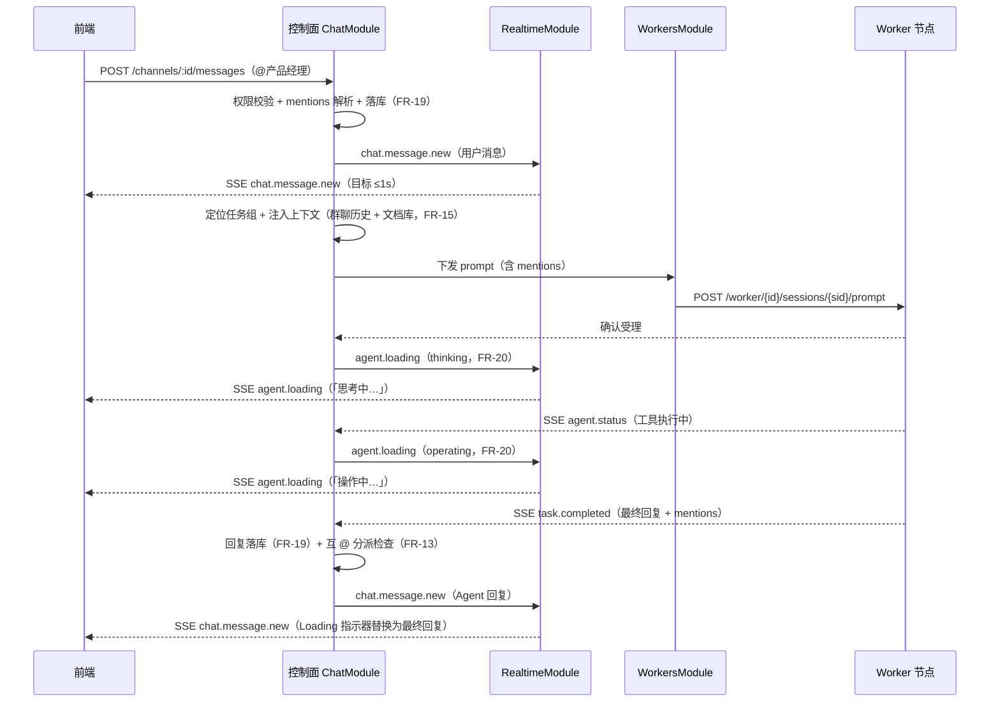
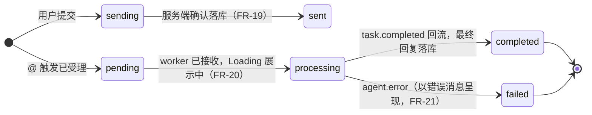

# 群聊与消息机制

## 1. 定位与文档关系

**本文档是群聊与消息机制的专章设计，是 09 篇（API 设计）的重点功能细化。** 群聊是任务协作的默认现场（FR-09），消息与 @ 触发是平台最核心的交互机制。09 篇将群聊契约分散在 §3.5（Chat 端点清单）、§4.2（前端事件契约）、§5.1（发消息详设）中；本文档把这些契约按消息从**发起到展示**的完整生命周期串成一条主线，并补充 UI 映射、状态机状态图与跨模块交互，可独立阅读。

**文档关系：**

| 相关文档 | 关系 |
|---------|------|
| 09 篇 §3.5 Chat | 群聊端点清单（发消息 / 历史 / 触发结果）；本文档不重复端点表 |
| 09 篇 §4.2 前端事件契约 | `chat.message.new` / `agent.loading` / `agent.error` 等事件定义 |
| 09 篇 §5.1 发消息详设 | `POST /channels/:id/messages` 的 DTO 与 8 步服务端流程 |
| 08 篇 §6 数据模型 | `chat_channels` / `messages` / `sessions` 表结构 |
| 03 篇 FR-07~21 | 全部功能依据（任务启动 / 群聊 / @ 触发 / 实时 / 错误） |

**功能依据。** 本文档各节逐条引用 03 篇 FR 编号：FR-09（任务群聊）、FR-10（消息模型与 Part）、FR-11/12/13（@ 触发三种方式）、FR-14（私聊群聊共用会话）、FR-15（上下文注入）、FR-18（内部过程不广播）、FR-19（持久化）、FR-20（Loading 两阶段）、FR-21（错误三层）。

## 2. 消息模型

### 2.1 消息三态（FR-10）

群聊消息按发送者分为三类，由 `senderType` 区分，SSE 广播与历史查询均携带该字段（09 篇 §3.5）：

| senderType | 消息类型 | 产生方 | 说明 |
|-----------|---------|--------|------|
| `user` | 用户消息 | 项目成员 | 可携带 @ 触发；经 `POST /channels/:id/messages` 写入（09 篇 §5.1） |
| `agent` | Agent 回复 | 被 @ 的 Agent | 处理完成后经 worker 事件回流落库（09 篇 §4.3），最终回复显示于群聊（FR-18） |
| `system` | 系统消息 | 平台自动生成 | 状态变更 / 团队调整 / 产出物提交等事件提示（FR-10），由 `task_events` 触发生成（08 篇 §6） |

### 2.2 内容 Part 与群聊展示规则（FR-10/FR-18）

一条消息由多个内容片段（Part）组成，展示规则决定「哪些进群聊、哪些只进会话流」：

| Part 类型 | 含义 | 群聊展示规则 | 会话流（按需订阅） |
|-----------|------|-------------|-------------------|
| `text` 正文 | 消息主干文字 | 直接展示 | 同步增量 |
| `reasoning` 思考 | Agent 分析规划过程 | **默认折叠**：处理中显示「思考中…」，完成后可展开查看；不主动进入群聊气泡（FR-18） | 可查看 |
| `tool` 工具调用 | Agent 执行的操作 | **工具卡片三态**（进行中 / 完成 / 失败）；失败卡片内展示工具级错误（FR-21 第一层） | 可查看 |
| `file` 文件 | 产出物 / 引用文件 | 附件形式展示，可预览下载，**进入任务文档库**（04 篇 FR-38~41） | 可查看 |
| `aborted` 中断 | 处理被主动停止 | 显示「已中断」，**区别于错误**（FR-21 用户中断） | 可查看 |

> 内部过程片段（step-start / step-finish、patch、snapshot、compaction）**不渲染不广播**，仅作会话上下文使用（FR-10 边界），与 FR-18 约束一致。

### 2.3 Part 展示的 UI 映射（群聊气泡呈现）

Part 级过滤层决定群聊气泡的最终形态。以下为五种 Part 在群聊气泡中的 UI 呈现方式：

| Part 类型 | 群聊气泡 UI 形态 | 交互行为 |
|-----------|-----------------|---------|
| `text` 正文 | 普通文字气泡，随 senderType 区分左右（用户右、Agent 左、系统居中窄条） | 全文展示；含 @ 文本高亮 |
| `reasoning` 思考 | 折叠条：「🧠 思考中…」→ 完成后「查看思考过程 ▸」 | 默认折叠；点击展开查看过程；不进入气泡主体 |
| `tool` 工具调用 | 工具卡片（图标 + 工具名 + 三态徽章：进行中⏳ / 完成✅ / 失败❌） | 失败卡片内直接显示错误原因；Agent 可自动重试（FR-21 第一层） |
| `file` 文件 | 附件卡片（文件名 + 类型图标 + 版本号） | 点击预览 / 下载；归档后进入任务文档库 |
| `aborted` 中断 | 灰条：「已中断」 | 不可重试；成员可重新 @ 触发（FR-21 用户中断不重试） |

**多 Part 组合渲染顺序：** 同一条 Agent 回复按 `reasoning → tool → file → text` 顺序自上而下堆叠，text 正文置底作为最终结论（与 FR-20「处理完成替换为最终回复」一致）。`aborted` 中断时其余未完成 Part 不渲染，仅显示中断灰条。

### 2.4 消息结构字段

| 字段 | 类型 | 说明 |
|------|------|------|
| `id` | string | 消息主键；**兼作 SSE 事件 id 与历史游标**（09 篇 §2.2/§4.1） |
| `channelId` | string | 所属频道（task_group / private） |
| `senderType` | `user` \| `agent` \| `system` | 消息三态（§2.1） |
| `senderId` | string | 发送者 id：user → 用户 id；agent → Agent id；system → 空 |
| `content` | `{ text: string; parts: Part[] }` | 正文 + Part 数组（§2.2） |
| `mentions` | `Mention[]` | 解析后的 @ 引用（§4.1）；agent 型含 agentId，all 型为空 |
| `createdAt` | string | ISO8601；升序即消息顺序 |
| `status` | `sending` \| `sent` \| `loading` \| `error` | 消息生命周期状态（§7.1）；`sending`/`loading` 为瞬时态，落库后稳定为 `sent`/`error` |

## 3. 频道模型

### 3.1 频道类型

| 频道类型 | 创建时机 | 关联 | 说明 |
|---------|---------|------|------|
| `task_group` 任务群聊 | 创建任务时自动创建（FR-09，09 篇 §3.4 POST /tasks） | `task_id` | 每任务一个；任务成员 + 虚拟团队全部 Agent 参与（FR-02/09） |
| `private` 私聊 | 成员主动创建（09 篇 §3.5 POST /dm-channels） | `task_id` + `agent_id` | 一对一深入讨论；**与群聊共用该 Agent 会话**（FR-14） |

### 3.2 成员构成

- **人类成员**：项目成员（`project_members`），按 FR-24 权限范围访问频道。
- **Agent 成员**：任务虚拟团队内的 Agent（FR-02）；团队调整（POST /tasks/:id/team）增删后群聊发系统消息（FR-10），被移除 Agent 的会话冻结（`sessions.status=frozen`，08 篇 §6）。

### 3.3 表关系（08 篇 §6）

```
chat_channels（id, type, task_id）
   ├── messages（channel_id → chat_channels.id；sender_type/sender_id）
   └── 经 task_id 关联 sessions（task_id × agent_id，每 Agent 每任务独立会话）
```

群聊 / 私聊只是寻址视图不同，底层都落在同一 Agent 会话上（FR-14），上下文连续。

## 4. @ 触发机制（FR-11/12/13）

### 4.1 mentions 解析

- 消息正文以纯文本书写 `@产品经理` / `@all`，前端提交时解析为 `mentions` 数组（DTO 见 09 篇 §5.1）。
- 服务端二次校验（09 篇 §5.1 第 2 步）：agent 型 mention 的 agentId 必须在该任务虚拟团队内（FR-11「谁被 @，谁处理」）；被移除 Agent 的 @ 返回 `agent_removed`（FR-02）。
- `all` 型 mention 在服务端展开为当前团队全部 Agent（FR-12），落库的 mentions 保持 `all` 语义原样存储。

### 4.2 触发分派链路

被 @ 的 Agent 收到消息后的完整链路：

```
成员消息落库 → 定位任务组与 Agent 会话（FR-14）→ 上下文注入（FR-15）→ worker 下发 prompt（含 mentions）
  → Loading（FR-20）→ worker 处理 → task.completed 回流 → 最终回复落库 → 群聊广播
```

**上下文注入（FR-15）**：下发 prompt 前注入 ① 任务群聊历史消息 ② 任务文档库内容（全部产出物及版本）；新加入团队的 Agent 以任务文档库作初始上下文（FR-02）。上下文分层管理（相关性裁剪、分轮整理）为后续迭代方向（FR-16），本版注入最新群聊历史 + 文档库。

### 4.3 三种触发

| 触发方式 | 发起方 | 行为 | 依据 |
|---------|--------|------|------|
| 定向 @ | 成员 | 仅被 @ 的 Agent 收到并处理，其余 Agent 静默 | FR-11 |
| @all | 成员 | 广播给虚拟团队全部 Agent，均可响应 | FR-12 |
| Agent 互 @ | Agent | Agent 回复中的 mentions 经 `task.completed` 回流（09 篇 §4.3），控制面按其语义继续分派，机制与成员 @ 一致 | FR-13 |

**互 @ 循环控制（FR-13）**：连续互 @ 深度上限 3 轮（A @ B → B @ C → C @ D 计 3 轮）；同一对 Agent 连续互 @（A→B→A→B）判定疑似循环。达到上限或命中循环时停止自动衔接，群聊提示「协作轮次已达上限 / 疑似循环，请成员介入」；成员重新 @ 定向即可打破循环。

### 4.4 dispatch 状态机

每个 @ 触发在控制面登记一个 dispatch 记录（对应 09 篇 §5.1 响应 `triggers[]`）：

```
dispatched → pending（已受理，待 worker 确认）
   ├── processing（worker 已接收，处理中，同步 Loading）
   ├── completed（task.completed 回流，回复已落库）
   └── failed（agent.error，错误已反馈）
```

常态进展经 SSE 推送（09 篇 §4.2 agent.loading / agent.error / chat.message.new）；`GET /channels/:id/trigger-results/:messageId` 为轮询兜底（09 篇 §3.5）。

### 4.5 端到端时序（成员 @ 产品经理）

完整链路覆盖：发消息 → mentions 解析 → 上下文注入 → worker prompt → Loading → 回复回流 → 广播：



## 5. 消息流与实时性（三级 SSE 在群聊）

三级 SSE 链路（① 模型输出流 → ② worker→控制面 → ③ 控制面→前端）定义见 09 篇 §4 总览。群聊场景下第 ③ 级事件与消息生命周期的对应：

| 阶段 | 触发动作 | 群聊可见事件（第③级） | 依据 |
|------|---------|----------------------|------|
| 用户发消息 | REST 落库 | `chat.message.new`（用户消息） | FR-10/19 |
| Agent 处理中 | 分派成功 / 工具执行 | `agent.loading`（thinking → operating） | FR-20 |
| 内部过程 | 思考 / 工具片段 | **不广播**；仅 `session.stream.chunk` 按需推送 | FR-18 |
| Agent 完成 | task.completed 回流 | `chat.message.new`（Agent 回复） | FR-10 |
| 处理失败 | agent.error | `agent.error`（以错误消息形式反馈，FR-21） | FR-21 |

**时序约束（前端按 messageId 聚合，见 09 篇 §9 风险表）**：loading →（可选 chunk）→ final/error，事件顺序固定；`chat.message.new`（Agent 回复）到达即替代 Loading 指示器（09 篇 §4.2 联动说明）。

**性能目标**：群聊新消息展示 ≤1s（05 篇 1.1）；落库在广播前完成（先落库后转发，08 篇 §7.3），转发失败不影响数据正确性，可游标补拉（09 篇 §4.4）。

## 6. 消息历史与游标

- **游标分页**：`GET /channels/:id/messages?cursor=<lastMessageId>&limit=50`，响应 `{items, nextCursor}`；游标即消息主键 id（09 篇 §2.2）。
- **断线补拉**：SSE `since` 游标与 REST `cursor` 同源（均为消息/事件主键）：EventSource 重连后先 `since` 补拉再续实时流（09 篇 §4.4），历史兜底走 REST 游标。
- **私聊历史**：私聊频道消息同样持久化（FR-19），与群聊共用同一 Agent 会话（FR-14），上下文连续——私聊中的对话也会被 FR-15 注入该 Agent 后续处理上下文；私聊历史经同一游标接口按 `channelId` 隔离。
- **归档可追溯**：任务归档后（FR-05）消息仍保留，支撑历史回看（FR-19）。

## 7. 消息状态机与错误处理

### 7.1 消息状态机

**消息生命周期**（`messages.status` 字段，§2.4）：用户消息与 Agent 回复各自走独立状态路径：



- **用户消息**：`sending`（前端提交中）→ `sent`（服务端确认落库），瞬时态到稳定态。
- **Agent 回复**：`pending`（触发已受理）→ `processing`（Loading 展示中）→ `completed`（最终回复落库）；异常时 `processing → failed`（agent.error，以错误消息呈现）。

### 7.2 Loading 两阶段（FR-20）

| 阶段 | 指示器 | 对应事件 | 触发时机 |
|------|--------|---------|---------|
| 思考中 | 「思考中…」 | `agent.loading` phase=thinking | 分派成功后 |
| 操作中 | 「操作中…」 | `agent.loading` phase=operating | 工具执行阶段（agent.status 忙碌） |

Loading 展示于群聊该 Agent 气泡区域与成员面板；处理完成替换为最终回复，失败替换为错误消息（FR-20/21）。

### 7.3 错误三层（FR-21）

| 层级 | 范围 | 呈现 | 处理路径 |
|------|------|------|---------|
| 工具级 | 单个工具操作失败 | 工具卡片内显示失败原因 | Agent 自动重试或换方式完成，无需成员介入 |
| 消息级 | 整条回复失败，共 8 种（认证失败 / 模型服务错误 / 输出超长 / 用户中断 / 结构化失败 / 上下文超限 / 内容过滤 / 未知错误） | 错误消息（`agent.error`），显示原因与处理方式 | 按类型自动重试或提示成员处理（03 篇 FR-21 表） |
| 重试级 | 自动重试过程 | 显示重试次数与等待时间（如「模型繁忙，将在 30 秒后自动重试（第 2 次）」） | 重试多次仍失败转为消息级错误 |

**重试路径**：错误不阻塞任务（FR-21 单 Agent 隔离）；成员重新 @ 该 Agent 即可触发重试，错误消息保留在群聊中供追溯。`用户中断`（aborted part）显示「已中断」，不进入错误重试（FR-21）。

## 8. 群聊与其他模块的交互

群聊系统消息（`senderType=system`）是平台其他模块状态变化在协作现场的可视化出口。以下三类事件自动生成系统消息（FR-10）：

### 8.1 任务状态变更 → 系统消息

| 任务事件 | 触发动作 | 系统消息示例 | 依据 |
|---------|---------|-------------|------|
| 任务启动 | `POST /tasks/:id/start` | 「任务已开始，主 Agent：产品经理」 | FR-03/07 |
| 待验收 | `POST /tasks/:id/mark-pending-review` | 「任务已提交待验收」 | FR-03/04 |
| 验收通过 | `POST /tasks/:id/accept` | 「任务已验收完成，产出物基线已锁定」 | FR-03/04 |
| 验收驳回 | `POST /tasks/:id/reject` | 「任务被驳回，请补齐产出后重新提交」 | FR-03/04 |
| 任务归档 | `POST /tasks/:id/archive` | 「任务已归档，历史可回看」 | FR-03/05 |

任务状态迁移落库成功后经 `task_events` 生成 system 消息，并广播 `task.status.changed`（09 篇 §4.2）。

### 8.2 产出物提交 → 系统消息

| 触发点 | 链路 | 系统消息示例 |
|--------|------|-------------|
| Agent 会话完成产出 | `task.completed` / `message.part.delta`（file part）回流 → ArtifactsModule 校验归档 | 「产品经理提交了产出物：需求文档 v3」 |
| 成员辅助提交 | `POST /tasks/:id/artifacts`（P1 入口） | 「成员提交了产出物：验收报告 v1」 |

归档成功后广播 `artifact.submitted`（09 篇 §4.2）并生成 system 消息（FR-40/10）；已验收任务新增产出物版本时任务自动退回进行中（09 篇 §5.4 验收联动）。

### 8.3 团队调整 → 系统消息

| 触发点 | 链路 | 系统消息示例 |
|--------|------|-------------|
| 添加 Agent | `POST /tasks/:id/team` addAgentIds | 「开发者 Agent 已加入团队」 |
| 移除 Agent | `POST /tasks/:id/team` removeAgentIds | 「测试 Agent 已移出团队，其会话已冻结」 |

团队调整广播 `team.changed`（09 篇 §4.2）并生成 system 消息（FR-02/10）；被移除 Agent 的会话冻结（`sessions.status=frozen`），产出物保留。

### 8.4 模块交互总览

```
任务状态机 ──task_events──▶ 控制面 ──▶ 群聊 system 消息 + task.status.changed
产出物归档 ──artifact.submitted──▶ 控制面 ──▶ 群聊 system 消息 + 文档库更新
团队调整   ──team.changed──▶ 控制面 ──▶ 群聊 system 消息
```

三类交互均遵循「先落库后转发」（08 篇 §7.3）：system 消息落库后广播，成员在群聊可见事件提示，历史查询同样携带（§2.1 senderType=system）。

## 9. 边界与一致性

| 边界 | 约定 | 依据 |
|------|------|------|
| 消息持久化 | 全部消息（含私聊）落库；持久化消息是 FR-15 上下文注入的唯一来源 | FR-19 |
| 不支持撤回 / 编辑 | 本版消息不可撤回、不可编辑；误发可重新发送纠正 | FR-19 边界 |
| 系统消息自动生成 | 任务状态变更（FR-03）、团队调整（FR-02/10）、产出物提交（FR-40）等事件自动生成 system 消息 | FR-10 |
| 私聊 / 群聊上下文连续 | 共用同一 Agent 会话（FR-14），任何入口的对话都进入该会话上下文 | FR-14 |
| 单 Agent 失败隔离 | `agent.error` 收敛在单 Agent 粒度，不阻塞其他 Agent 与平台（05 篇 1.3） | FR-21 |
| 删除边界 | 消息无 DELETE 端点；权限矩阵「删除」对消息 deny（09 篇 §2.3/§3.10） | FR-23 |
| 幂等 | 消息落库按主键去重（08 篇 §6.3），重复 worker 事件不产生重复消息 | 08 §6.3 |
