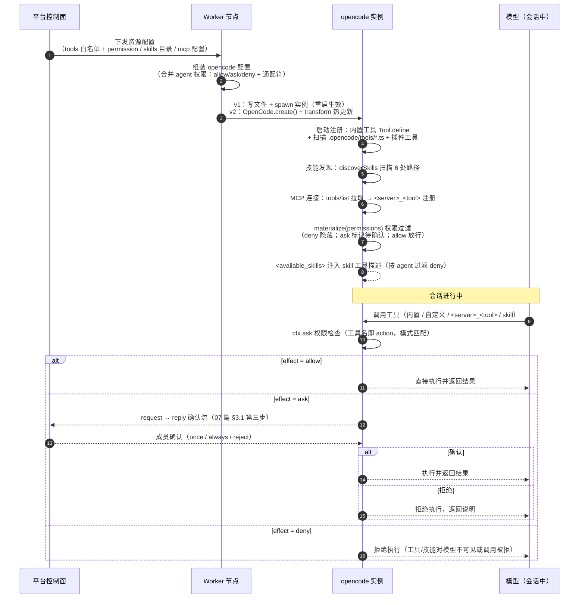

# 资源与注册机制（工具/Skills/MCP）

本文档是三类资源——**工具（Tools）**、**Skills**、**MCP**——与 opencode 注册机制的专章设计。它回答三个问题：资源在 opencode 里如何被定义与注册？注册后如何被发现并暴露给模型？平台 Worker 如何把平台侧的资源装配进任务组的 opencode 实例？全文以 opencode 官方文档与源码事实为准（官方 v1 机制 + 07 篇已核实的 v2 源码事实），不引入推测内容。

## 1. 定位与文档关系

**07 篇讲权限规则，本文档讲资源链路。** 07 篇 §3.1（PermissionV2）与 §4/§5 定义了权限模型：权限点是开放命名空间、effect 三态、通配符、权限链路三步。本文档在此基础上展开资源侧：一个工具/技能/MCP 服务器**如何进入** opencode 的注册表、**如何被发现**、**如何被权限过滤后暴露给模型**。权限规则是"执行时怎么拦"，资源注册是"执行前怎么有"——两者正交，07 篇的权限模型在本文档中是注册链路的终点环节（§6）。

**文档关系：**

| 相关文档 | 关系 |
|---------|------|
| 07 篇 §3.1/§4/§5/§10.3 | 权限模型（PermissionV2、effect 三态、通配符）、权限链路三步、v1 写文件+重启 vs v2 transform 热更新；本文档的资源注册链路以该权限模型为执行时约束 |
| 08 篇 §3.1/§4/§6 | SkillsToolsModule（技能上传/工具注册）、Worker 节点三层结构（WorkerServer/TaskGroupRegistry/WorkerRuntime）、`skills`/`tools`/`agent_tool_effects` 数据表 |
| 04 篇 FR-27/FR-34/FR-35/FR-48 | 功能依据：技能上传与工具注册（FR-27）、技能配置（FR-34）、工具配置（FR-35）、逐工具权限（FR-48，工具名即权限 action） |
| 06 篇 §2.8/§2.9 | agent 配置原型（启用开关 + 工具名 + 来源徽章 + effect 三态）与技能工具管理页（注册工具→进入权限命名空间）的交互落点 |
| 09 篇 §3.12 SkillsTools | 技能上传 / 工具注册 REST 端点清单 |

**功能依据。** 本文档各节逐条引用：04 篇 FR-27（技能上传、工具注册四类 source：代码/CLI/HTTP/MCP + schema 绑定）、FR-34（Agent 技能勾选）、FR-35（工具启用开关 + 权限 effect）、FR-48（工具权限点 = 工具名 action，开放命名空间，通配符）。平台侧资源管理端点见 09 篇 §3.12，本文档不重复端点表。

## 2. 资源全景

三类资源在 opencode 中的定位差异集中在**注册主体与暴露形态**：工具以代码函数注册、Skills 以 Markdown 指令文件注册、MCP 以外部进程/服务的工具集合注册。三者共享同一终点——注册后都进入权限命名空间（工具名即权限 action），按同一套 permission 规则执行。

| 维度 | 工具（Tools） | Skills | MCP |
|------|--------------|--------|-----|
| 定义形式 | TypeScript/JavaScript 函数（`tool()` 工厂或插件 `tool` 对象） | `SKILL.md` Markdown 文件（YAML frontmatter + 指令正文） | 外部 MCP 服务器（local 子进程 / remote HTTP 服务），opencode 只写配置 |
| 注册方式 | 内置：registry 批量注册（`Tool.define`）；自定义：`.opencode/tools/*.ts` 目录扫描 + 插件 `tool` 工厂 | 文件系统发现：按固定目录约定扫描 `skills/*/SKILL.md`（§4.2 六处路径）；另支持 `skills: {paths, urls}` 配置 | 配置声明：opencode.json 顶层 `mcp` 节，local/remote 两型（§5.1） |
| 发现路径 | 内置工具编译期注册；自定义工具启动扫描工具目录 | 启动时 `discoverSkills` 扫描 6 处路径 + 配置扩展路径（v1 无 watch，07 篇 §10.3） | 启动时按配置连接服务器拉取工具列表（tools/list）；支持 ToolListChanged 动态刷新（§5.5） |
| 暴露形态 | 独立工具名，模型可直接调用 | 单一 `skill` 工具 + `<available_skills>` 列表注入系统提示，按名路由 | 每个 MCP 工具独立暴露，工具名带服务器前缀 `<server>_<tool>` |
| 权限 action | 工具名本身（如 `bash`、`jenkins-build`） | `skill`（参数为 skill 名，模式匹配） | 工具全名 `<server>_<tool>`（如 `github_create_issue`） |
| 通配符 | `jenkins-*` 覆盖全部前缀工具 | `internal-*` 覆盖一类技能 | `my-mcp_*` 一次覆盖某服务器全部工具 |

> **工具名即权限 action**：这是三类资源的共同落点（04 篇 FR-48）。任何资源注册成功后，其暴露名自动成为权限命名空间中的一个权限点，effect（allow/ask/deny）由平台按 Agent 逐工具配置（07 篇 §3.1 权限链路第二步）。权限点集合随注册动态扩展，**不是固定枚举**——团队注册的自定义工具、MCP 接入的工具都按同一规则进入命名空间，这也是 08 篇 `tools` 表把 `action` 列作为权限点主键的原因（08 篇 §6.1）。

## 3. 工具（Tools）注册机制

### 3.1 内置工具：registry 批量注册

opencode 内置工具在注册表（`registry.ts`）中通过 `Tool.define(id, init)` 批量注册（07 篇源码事实），每个内置工具的数据结构为：

```
{ id, description, parameters（Effect Schema 定义参数）, execute }
```

内置工具集覆盖基础能力：`bash`、`read`、`edit`、`write`、`grep`、`glob`、`task`（子代理）、`webfetch`、`websearch`、`todowrite`、`skill` 等（官方 permissions 文档的可用权限点清单与此对应）。部分工具按条件启用：`question`（向用户提问）、`lsp`（LSP 查询）、`plan`（规划模式）仅在对应场景下注册，不常驻工具表。

内置工具的权限点预置：`read` 默认 `allow`（但 `.env` 文件默认 `deny`）、`bash`/`edit` 等有副作用工具默认 `ask`、`external_directory` 与 `doom_loop`（同参数重复调用 3 次的保护）默认 `ask`（官方默认策略，07 篇 §3.1 与 04 篇 FR-48 默认策略对齐）。

### 3.2 自定义工具：两条路径

**路径①：工具目录扫描。** 工具定义为 TypeScript/JavaScript 文件，放置于项目 `.opencode/tools/` 或全局 `~/.config/opencode/tools/`（官方 custom-tools 文档）：

| 导出形式 | 工具名规则 | 示例 |
|---------|-----------|------|
| 默认导出（`export default`） | 文件名即工具名 | `.opencode/tools/database.ts` → 工具 `database` |
| 具名导出（`export const`） | `<文件名>_<导出名>` | `.opencode/tools/math.ts` 导出 `add`/`multiply` → 工具 `math_add`/`math_multiply` |

定义使用 `tool()` 工厂（来自 `@opencode-ai/plugin`），参数用 `tool.schema`（即 Zod）声明，`execute` 接收 `(args, context)`，context 提供 `agent/sessionID/messageID/directory/worktree` 等会话上下文。工具定义文件是 TS/JS，但 `execute` 内可调用任意语言脚本（官方示例：Python 子进程）。

**同名冲突规则**：自定义工具按工具名 keyed，**同名覆盖内置工具**（官方文档：`.opencode/tools/bash.ts` 可替换内置 `bash`）。官方建议优先使用唯一命名；若只想禁用内置工具而不覆盖，应使用 permissions 配置而非定义同名工具。

**路径②：插件 `tool` 工厂。** 插件（plugin）内通过 `tool({ description, args(Zod), execute })` 注册工具（v1 插件 API，`server()` 返回的 Hooks 对象中可携带工具定义）。插件工具与目录扫描工具注册到同一工具表，同样受权限控制。

### 3.3 v2 演进：`Tool.make` + `tools.register`

v2 将工具注册重构为显式声明 + 注册 API（07 篇调研的 v2 源码事实）：

| v1 | v2 |
|----|----|
| `Tool.define(id, init)`（registry 批量注册） | `Tool.make({ description, input Schema, output, execute })` 声明工具定义 |
| — | `tools.register` 显式注册到运行时 |
| 权限为配置侧 `permission` 键 | `withPermission` 内联声明默认权限 |
| 工具名即 action（隐式） | `materialize(permissions)` 按权限规则过滤后暴露，工具名校验正则约束命名 |

v2 的 `materialize(permissions)` 是"注册 → 暴露"之间的显式过滤环节：权限为 `deny` 的工具不进入模型可见集合，`ask` 的工具在调用时进入 request → reply 确认流（07 篇 §3.1 权限链路第三步）。这与 07 篇 §3.1「权限点是开放命名空间」一致：v2 中工具名仍然即权限 action，注册即入命名空间。

### 3.4 平台映射：工具白名单 → 配置文件注入 → permission 过滤

平台侧的 Agent 工具配置（04 篇 FR-35 启用开关 + FR-48 逐工具 effect）落地为 worker 内 opencode 实例的配置装配：

```
平台 agent 配置（04 篇 FR-35/FR-48）
  │  工具白名单（启用/停用）＋ 逐工具 effect（allow/ask/deny）
  ▼
控制面生成 opencode 配置文件（permission 节 + 自定义工具文件/插件）
  │  经 Worker 控制协议下发（07 篇 11.3）
  ▼
Worker 节点写入该任务组 opencode 实例的配置目录
  │  v1：写文件 + 重启实例（07 篇 §10.3 四步流程）
  ▼
opencode 启动：内置工具注册 + 扫描 .opencode/tools/*.ts + 加载插件工具
  ▼
permission 过滤（FR-48 落点）：deny 隐藏、ask 进确认流、allow 直接执行
```

- **FR-48 工具权限落点在 permission 过滤环节**：平台按 Agent 配置生成的 `permission` 规则（含通配符如 `jenkins-*`）与 opencode 运行时过滤/确认机制一一对应，平台侧不重复实现权限判定。
- **自定义工具的注入路径**：平台把团队注册的工具（08 篇 SkillsToolsModule）转写为 `.opencode/tools/*.ts` 文件或插件，随实例启动注册；工具名与 `tools` 表 `action` 列保持一致（08 篇 §6.1）。
- **v1 生效方式**：工具变更 = 写文件 + 重启该任务组实例（07 篇 §10.3）；**v2 生效方式**：`ctx.tool.transform` 运行时热更新（07 篇 §10.4）。

## 4. Skills 机制

### 4.1 SKILL.md 定义

每个技能是一个目录 + 一个 `SKILL.md` 文件，frontmatter 字段（官方 skills 文档）：

| 字段 | 必填 | 约束 |
|------|------|------|
| `name` | 是 | 1–64 字符，小写字母数字 + 单连字符，正则 `^[a-z0-9]+(-[a-z0-9]+)*$`；**必须与所在目录名一致** |
| `description` | 是 | 1–1024 字符，足够具体以便模型正确选择 |
| `license` / `compatibility` / `metadata` | 否 | 元信息；未知字段被忽略 |

正文为 Markdown 指令，通常含「我做什么 / 何时使用我 / 关键流程」结构（官方示例 git-release 技能）。v2 演进方向：支持 slash 命令形态、`name` 可从文件名推断（07 篇调研预期，以 v2 正式契约为准）。

### 4.2 发现路径（官方六处 + 配置扩展）

opencode 启动时按固定约定扫描技能（v1 `discoverSkills`，07 篇 §10.3 确认无 watch 热加载）：

| # | 路径 | 说明 |
|---|------|------|
| 1 | 项目 `.opencode/skills/<name>/SKILL.md` | 项目级 opencode 约定 |
| 2 | 全局 `~/.config/opencode/skills/<name>/SKILL.md` | 用户级 opencode 约定 |
| 3 | 项目 `.claude/skills/<name>/SKILL.md` | Claude 兼容 |
| 4 | 全局 `~/.claude/skills/<name>/SKILL.md` | Claude 兼容 |
| 5 | 项目 `.agents/skills/<name>/SKILL.md` | Agent 兼容 |
| 6 | 全局 `~/.agents/skills/<name>/SKILL.md` | Agent 兼容 |

项目内路径从当前工作目录向上遍历至 git worktree 根，沿途收集全部匹配目录；全局路径三处固定加载。另支持配置 `skills: { paths, urls }` 扩展发现来源：`paths` 追加自定义目录，`urls` 指向远程技能包（经下载缓存后按同一 SKILL.md 格式加载）。**名称全局唯一**：技能名在所有发现位置不得重复，冲突时按加载顺序后者覆盖（官方 troubleshooting，§9 边界）。

### 4.3 单一 `skill` 工具与 `<available_skills>` 注入

Skills 不以独立工具暴露，而是收敛为**一个 `skill` 工具** + 系统提示中的技能清单：

- **发现注入**：启动时把可用技能清单渲染为 `<available_skills>` 块注入 `skill` 工具的描述（系统提示的一部分），每项含 `<name>` 与 `<description>`，模型据此判断调用哪个技能。
- **按名路由**：模型调用 `skill({ name: "git-release" })`，参数 `name` 路由到具体 SKILL.md。
- **加载返回**：执行返回 `<skill_content>`（SKILL.md 全文）与技能目录下的文件列表，供模型读取。
- **权限检查**：执行前 `ctx.ask({ permission: "skill", patterns: [name] })` —— skill 调用受 permission 模型控制（官方：permission 键 `skill`，模式匹配技能名）。
- **按 agent 过滤**：`<available_skills>` 注入时按当前 agent 的权限过滤，`deny` 的技能对模型**不可见**（不注入），`ask` 的技能可见但加载前确认。

### 4.4 skill 权限配置

```jsonc
// opencode.json 全局
{
  "permission": {
    "skill": {
      "*": "allow",
      "pr-review": "allow",
      "internal-*": "deny",      // 通配：internal-docs / internal-tools 全部禁止且对模型隐藏
      "experimental-*": "ask"    // 每次加载前向成员确认
    }
  }
}
```

| 配置位置 | 作用域 | 说明 |
|---------|--------|------|
| `permission.skill`（opencode.json） | 全局默认 | 所有 agent 生效，可被 agent 级覆盖 |
| agent frontmatter `permission: { skill: {...} }` | 自定义 agent | 该 agent 内覆盖全局（官方 skills 文档） |
| `agent: { <builtin>: { permission: { skill: {...} } } }` | 内置 agent | opencode.json 内覆盖（官方示例：plan agent 放行 `documents-*`） |
| `tools: { skill: false }`（全局或 agent 级） | 禁用 | 完全禁用 skill 工具，`<available_skills>` 整体省略 |

### 4.5 平台映射：平台技能库 → worker 写入 → 生效

平台侧技能管理（08 篇 SkillsToolsModule、04 篇 FR-27 技能上传 / FR-34 Agent 技能勾选）落地为 worker 内的 SKILL.md 装配：

```
平台技能库（共享 skill 目录 / 内置 skill 包）
  │  Agent 技能授权（FR-34 勾选）→ 按 agent 生成技能清单
  ▼
控制面下发 → Worker 节点把 SKILL.md 写入该任务组 opencode 的 skills 目录
  │  v1：写文件 + 重启实例（07 篇 §10.3：discoverSkills 启动时一次性发现）
  │  v2：ctx.skill.transform 运行时热更新（07 篇 §10.4，无需重启）
  ▼
opencode 启动/热更新：discoverSkills 扫描 → <available_skills> 注入 → 模型按名调用
```

- **v1 生效代价**：新增/修改技能需重启该任务组实例，仅该任务组会话中断（07 篇 §10.3 代价与收益）。
- **平台技能与权限联动**：平台按 Agent 的 skill 授权生成 `permission.skill` 规则（含 `internal-*` 类通配），与 4.4 的配置位一一对应——deny 的技能在 `<available_skills>` 中对该 Agent 不可见，与 FR-34 勾选语义一致。

## 5. MCP 机制

### 5.1 配置：opencode.json 顶层 `mcp` 节

MCP 服务器在 opencode.json 的 `mcp` 节点下按**唯一名称**声明（官方 mcp-servers 文档），每台服务器可全局 `enabled` 开关：

```jsonc
{
  "mcp": {
    "my-local-mcp": {
      "type": "local",
      "command": ["npx", "-y", "@modelcontextprotocol/server-everything"],
      "cwd": "./tools",
      "environment": { "MY_ENV_VAR": "value" },
      "enabled": true,
      "timeout": 5000
    },
    "my-remote-mcp": {
      "type": "remote",
      "url": "https://my-mcp-server.com",
      "headers": { "Authorization": "Bearer {env:MY_API_KEY}" },
      "oauth": { "clientId": "{env:MY_MCP_CLIENT_ID}", "scope": "tools:read tools:execute" },
      "timeout": 5000
    }
  }
}
```

| 类型 | 传输 | 配置字段 | 实现 |
|------|------|---------|------|
| `local` | stdio 子进程 | `command[]`（必填）、`cwd?`、`environment?`、`enabled?`、`timeout?` | `@modelcontextprotocol/sdk` 的 StdioClientTransport |
| `remote` | HTTP | `url`（必填）、`headers?`、`oauth?`、`enabled?`、`timeout?` | StreamableHTTP 传输，SSE 回退 |

`oauth` 字段可传对象（clientId/clientSecret/scope）或 `false`（显式禁用自动 OAuth，适用于 API key 型服务器）。

**远程协议说明**：remote 类型由 opencode **自动探测**传输协议——源码 `packages/opencode/src/mcp/index.ts:269-284` 维护 transports 数组依次尝试 connectTransport：**先 `StreamableHTTPClientTransport`，失败再 `SSEClientTransport`**。官方配置**无协议选择字段**（仅 type/url/enabled/headers/oauth/timeout），**平台不提供协议选择字段，连接协议由 opencode 自动探测**。

### 5.2 工具暴露：`<server>_<tool>` 命名

MCP 工具注册后自动对模型可用（"MCP tools are automatically available to the LLM alongside built-in tools"），命名规则（官方）：**工具名 = `sanitize(server)_sanitize(tool)`**，即 `<服务器名>_<工具名>` 两段式（非三段式），例如 `github_create_issue`、`sentry_query_issues`。每台 MCP 服务器的全部工具由此获得**同一前缀的权限命名空间**。

MCP 工具同样受 permission 完全控制：调用前 `ctx.ask({ permission: <工具全名>, patterns: ["*"] })`——平台/用户可按工具名逐个配置 effect（04 篇 FR-48 来源徽章为「MCP」的工具即此形态，权限点形如 `<server>_<tool>`）。

### 5.3 权限通配：一次覆盖整台服务器

由于工具名以服务器名为前缀，一条通配规则即可覆盖某 MCP 服务器的全部工具（官方 mcp-servers 文档原文示例：tools 配置 `"mymcpservername_*": false`；permission 规则同理）：

```jsonc
{
  "permission": {
    "my-mcp_*": "deny"      // 一次禁止 my-mcp 服务器全部工具
  },
  "tools": {
    "my-mcp_*": true        // 或用 tools 键整体启用/停用（v1.1.1 前写法，已并入 permission）
  }
}
```

permission 模式通配规则：`*` 匹配任意多字符、`?` 匹配单字符、其余字面匹配；对象语法中**最后匹配的规则生效**（官方 permissions 文档）。

### 5.4 MCP 资源访问（3 个内置工具）

除工具外，opencode 内置 3 个 MCP 资源访问工具（v1 内置，本环境可见）：

| 工具 | 作用 | 权限 |
|------|------|------|
| `list_mcp_resources` | 列出某服务器提供的资源 | `read` + `mcp:<server>:*` |
| `list_mcp_resource_templates` | 列出资源模板 | 同上 |
| `read_mcp_resource` | 读取具体资源 | 同上 |

资源访问与工具调用走同一 permission 模型：服务器级通配 `mcp:<server>:*` 可一次授权/禁止该服务器的全部资源。

### 5.5 工具列表动态刷新

MCP 协议支持 `notifications/tools/list_changed`：服务器工具列表变化时，opencode 收到 ToolListChanged 通知后重新拉取 `tools/list` 并刷新模型可见工具集合（运行时动态，不依赖重启）。这使"平台接入/下线 MCP 服务器"可在运行中反映到工具表，但权限规则变更仍按配置生效路径处理（v1 需重启，v2 热更新）。

### 5.6 OAuth 与凭据管理

远程 MCP 的 OAuth 由 opencode 自动处理（官方 mcp-servers 文档）：

1. 服务器返回 401 → opencode 自动发起 OAuth 流程（支持 Dynamic Client Registration，RFC 7591，当服务器支持时）。
2. 授权完成后 token 安全存储于 `~/.local/share/opencode/mcp-auth.json`，后续请求自动携带。
3. CLI 辅助命令：`opencode mcp auth <server>`（手动触发授权，打开浏览器回调）、`opencode mcp list`（列出服务器与 auth 状态）、`opencode mcp logout <server>`（清除凭据）、`opencode mcp debug <server>`（诊断连接与 OAuth 发现流程）。

### 5.7 v2 现状：MCP 能力为待验证项

**v2 的 MCP 配置 Schema 已定义，但客户端与工具适配尚未实现（v2 源码 TODO）。** 具体事实：

- v2 配置 Schema 采用 snake_case 且以 `servers` 嵌套组织（与 v1 顶层 `mcp` + camelCase 不同，见 §8）。
- 但 v2 的 MCP 客户端连接（local/remote 传输）与 MCP 工具 → 模型工具的适配层**尚未落地**，当前唯一可用的 MCP 实现是 v1。
- 平台结论：**v1 阶段完整支持 MCP（v1 是 MCP 的唯一实现）**；v2 迁移时 MCP 能力列为**待验证项**——迁移 V2Driver 时须先验证 v2 MCP 适配是否随 beta 发布补齐，未补齐前 MCP 依赖的工具能力不迁移（07 篇 §9.8 迁移工作量评估需为此预留验证点）。

### 5.8 平台映射：MCP 配置管理 → worker 注入 → 可用性监控

平台侧 MCP 管理（08 篇 SkillsToolsModule 四类 source 中的 MCP 类、09 篇 §3.12 注册端点）落地为 worker 内的 MCP 装配：

```
平台 MCP 配置管理（服务器 CRUD / 凭据占位）
  │  生成 opencode mcp 配置节（local command / remote url + headers）
  ▼
控制面下发 → Worker 注入该任务组 opencode 实例的配置（OPENCODE_CONFIG_CONTENT 或配置文件）
  ▼
opencode 启动连接 MCP：tools/list 拉取 → <server>_<tool> 注册 → 权限过滤
  ▼
平台对 MCP 服务器可用性监控：needs_auth / connected / failed 三态上报控制面
```

- **可用性三态**：`needs_auth`（远程服务器要求 OAuth 未授权）、`connected`（正常连接）、`failed`（连接/拉取工具失败）；worker 心跳或事件流携带该状态，控制面在技能与工具管理页展示（06 篇 §2.9）。
- **OAuth 流程由 worker 本地完成**：worker 节点本地执行 `opencode mcp auth` 回调（浏览器授权发生在 worker 所在主机），token 落在 worker 本地 `mcp-auth.json`；控制面不持有 MCP 凭据，只管理「哪台服务器的哪个 Agent 可用」（§9 开放问题）。
- **平台生成配置的 v1/v2 差异**：v1 生成 camelCase 顶层 `mcp` 节；v2 迁移时若 MCP 适配落地，则改生成 snake_case `servers` 节（§5.7）。

## 6. 注册 → 暴露 → 权限过滤：完整链路

下图把 §3~§5 的三条资源链路收敛为一条端到端时序：平台下发资源配置 → worker 组装 opencode 配置 → 实例启动注册 → 权限过滤 → 会话内调用与确认。



链路要点：

- **注册在前、过滤在后**：所有资源先进入注册表（统一命名空间），再经权限过滤决定"对谁可见、调用时怎么处理"——这保证平台可按 Agent 动态调整暴露面而不改注册。
- **工具名即权限 action 贯穿全链路**：内置工具（`bash`）、自定义工具（`math_add`）、MCP 工具（`github_create_issue`）、skill 名（`internal-docs`）在注册时即进入同一权限命名空间，§6 的 `ctx.ask` 检查是这条命名空间的执行时收敛点。
- **确认流回到平台**：`ask` 触发的 request → reply 确认事件经 worker → 控制面转成员确认（08 篇 §7.6：ask 确认经 07 篇 Permission 交互事件流回到平台转成员确认），确认结果沿原路返回 opencode 执行。
- **v1/v2 差异只出现在"装配生效"一步**：v1 写文件 + 重启，v2 transform 热更新；链路其余环节两版一致（07 篇 §10.4/§11.5）。

## 7. 平台资源管理模型

### 7.1 三类资源生命周期

| 资源类型 | 平台侧管理位置（08 篇 §3.1） | worker 生效路径 | v1 生效方式 | v2 生效方式 |
|---------|---------------------------|----------------|------------|------------|
| 工具（内置） | AgentsModule：逐工具 effect 配置（FR-35/48） | 生成 `permission` 配置节注入实例 | 重启实例 | `ctx.tool.transform` / 权限热更新 |
| 工具（自定义） | SkillsToolsModule：注册（代码/CLI/HTTP/MCP + schema，FR-27） | 转写 `.opencode/tools/*.ts` 或插件写入实例 | 写文件 + 重启实例（07 篇 §10.3 四步） | `ctx.tool.transform` 热更新 |
| Skills | SkillsToolsModule：上传/停用（FR-27）；AgentsModule：Agent 勾选（FR-34） | SKILL.md 写入该任务组 skills 目录；按 Agent 生成 `permission.skill` | 写文件 + 重启实例（discoverSkills 启动时一次性发现） | `ctx.skill.transform` 热更新 |
| MCP | SkillsToolsModule：服务器 CRUD、可用性监控（三态） | 生成 opencode `mcp` 配置节 + headers/oauth 注入 | 写配置 + 重启实例（连接 + tools/list 拉取） | **待验证**（v2 MCP 适配未实现，§5.7） |

### 7.2 v1 变更流程（写文件 + 重启） vs v2 热更新

- **v1（当前基线）**：任何资源变更走 07 篇 §10.3 四步——写文件 → `close()` 杀子进程 → 重新 spawn → 启动时发现生效。代价：仅该任务组会话中断；收益：其他任务组不受影响，隔离收益完整。
- **v2（迁移目标）**：`ctx.skill.transform` / `ctx.tool.transform` 运行时热更新，无需重启（07 篇 §10.4）；MCP 是否可热更新取决于适配实现（§5.7 待验证）。
- **控制面无感知**：资源变更统一抽象为"下发资源配置 + 触发生效"指令（07 篇 11.3），worker 内部选择 v1 重启或 v2 transform（07 篇 §11.5 只动 worker 侧）。

### 7.3 平台「资源 × Agent」绑定

资源与 Agent 的绑定在平台侧有三个落点（对接 04 篇 FR-34/35/48 与 06 篇 §2.8 agent 配置原型交互）：

| 绑定 | 平台配置 | 生成到 worker 的配置 |
|------|---------|---------------------|
| 工具启用开关 + effect（FR-35/48） | agent 配置页工具区：每工具一行 = 启用开关 + 工具名（action）+ 来源徽章 + effect 三态（06 篇 §2.8） | `permission` 节（含通配符批量授权）；`tools: { <tool>: false }` 表示停用 |
| 技能授权（FR-34） | agent 配置页技能区：勾选/移除技能 | 对应 SKILL.md 进入该 Agent 可见集合；`permission.skill` 生成 deny 规则隐藏未授权技能 |
| MCP 挂载 | 技能与工具管理页：为 Agent 挂载 MCP 服务器（06 篇 §2.9） | opencode `mcp` 配置节 + `permission: { "<server>_*": effect }` 服务器级规则 |

> 平台侧权限判定边界（08 篇 §7.6）：**用户/角色权限**（谁能配置资源）由控制面 PermissionsModule 拦截（FR-23/24）；**Agent 工具权限**（Agent 能调用什么工具）由 worker 内 opencode 执行，ask 确认流回到平台转成员确认。两类权限正交，本文档只覆盖后者在 worker 内的配置生成。

## 8. v1 vs v2 注册机制差异表

| 维度 | v1（当前基线） | v2（迁移目标） | 平台影响 |
|------|--------------|---------------|---------|
| 工具定义 | `Tool.define(id, init)`（registry 批量注册）| `Tool.make({description, input Schema, output, execute})` | WorkerRuntime 内注册逻辑替换 |
| 工具注册 | 内置 registry + `.opencode/tools/*.ts` 扫描 + 插件 `tool` 工厂 | `tools.register` 显式注册 + `withPermission` | 配置生成侧 v2 写法 |
| 权限 | `permission` 键 + 模式（pattern）匹配 + 工具名即 action | action + resource + effect 结构化规则（PermissionV2） | 平台生成的权限配置格式切换（OpenCodeDriver 内收敛） |
| 工具暴露 | 注册即暴露，权限过滤在调用时 | `materialize(permissions)` 注册后显式过滤 | 暴露面控制更显式 |
| skills 配置 | `skills: { paths, urls }`（对象） | `skills: string[]`（路径数组） | 配置生成格式切换 |
| skill 生效 | 写文件 + 重启（discoverSkills 一次性） | `ctx.skill.transform` 热更新；支持 slash、name 从文件名推断 | v1 重启代价消失 |
| MCP 配置 | 顶层 `mcp` 节，camelCase（type/command/enabled/...） | Schema 已定义：snake_case + `servers` 嵌套；**客户端与工具适配未实现（TODO）** | v1 完整支持（remote 自动探测 Streamable HTTP → SSE，§5.1）；v2 迁移待验证（§5.7） |
| 插件工具 | `server()` ⇒ Hooks 对象含 `tool` 定义 | 插件 `{id, effect}` + `ctx.skill`（hooks 进 core domain，07 篇 §3） | 插件 API 破坏性变更（07 篇 §2 三大破坏性变更之一） |

差异全部收敛在 worker 侧：控制面以「资源配置 + 权限规则」的语义下发（§6/§7），v1/v2 的格式差异由 WorkerRuntime 翻译（07 篇 §11.5 只动 worker 侧），业务层与前端零改动。

## 9. 边界与开放问题

| # | 问题 | 现状与风险 | 处理方向 |
|---|------|-----------|---------|
| 1 | **v2 MCP 未实现** | v2 配置 Schema 已定义但客户端与工具适配为源码 TODO（§5.7）；MCP 工具能力若随 v2 迁移将不可用 | 迁移前先验证 v2 MCP 适配是否随 beta 补齐；未补齐则 MCP 依赖能力暂留 v1 或延迟迁移，列为 V2Driver 迁移工作量的显式验证点（07 篇 §9.8） |
| 2 | **工具名冲突** | 自定义工具同名覆盖内置工具（官方规则，§3.2）；MCP 工具带 `<server>_` 前缀（§5.2），与自定义工具 `<filename>_<export>` 命名空间可能重叠 | 平台注册工具时校验命名空间：保留内置名与既有 MCP 前缀，冲突时提示改名而非静默覆盖；`tools` 表 `action` 列加唯一约束（08 篇 §6.1） |
| 3 | **skill 名称冲突** | 技能名须全局唯一（§4.2）；冲突时按加载顺序后者覆盖，同名不同内容的技能会静默替换 | 平台技能库上传时校验与内置/既有技能重名；worker 写入前比对目标实例已发现技能清单，冲突即上报控制面而非直接覆盖 |
| 4 | **远程 skill url 下载的安全边界** | `skills: { urls }` 从远程下载技能包到本地缓存后加载（§4.2）；SKILL.md 是模型指令，恶意内容可诱导 Agent 越权操作 | 平台仅允许从受信技能源（内置 skill 包 / 白名单 URL）下载；下载内容做校验（frontmatter 合法、无敏感指令模式），与技能上传走同一审核入口（FR-27） |
| 5 | **MCP 认证（OAuth）与平台凭据管理的分工** | OAuth token 存 worker 本地 `mcp-auth.json`（§5.6），控制面不持有凭据；但平台需要知道服务器的 auth 状态（needs_auth）以引导用户授权 | 明确分工：控制面管理「授权状态展示与引导」（needs_auth → 提示用户到 worker 所在主机执行 `opencode mcp auth`），worker 管理凭据生命周期；平台凭据管理（Vault/环境变量注入 headers）列为后续增强（08 篇 §8 边界） |

**边界一致性（与 07 篇 §8 风险表呼应）**：v2 的 MCP 适配缺口是「平台基于 v2 实现」决策的已知风险项，与 07 篇 §8「API 契约未冻结」同一处理策略——锁版本 + 定期同步 + 迁移前验证；在 v1 阶段 MCP 功能不受影响（v1 是 MCP 的唯一实现）。
