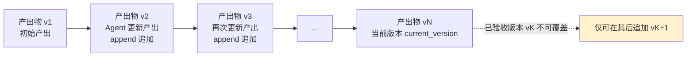
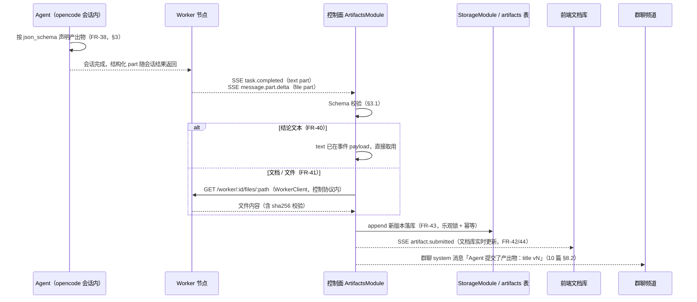
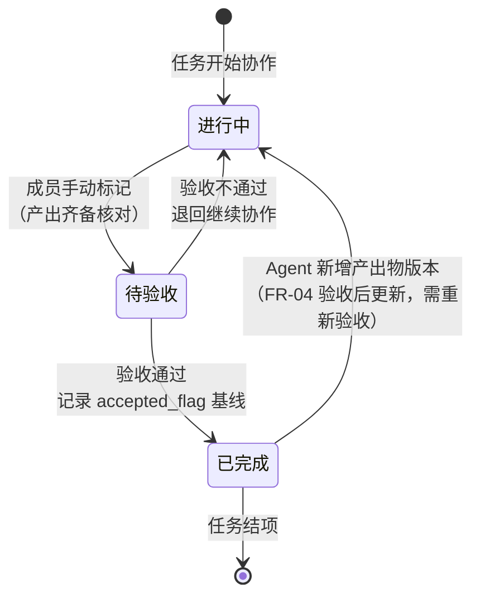

# 产出物协议与文档库

本文档是产出物（Artifacts）协议与任务文档库的专章详设，回答四个问题：Agent 如何**声明**产出物（结构化协议）？产出物如何被**归档**（事件驱动链路）？版本如何**演进**（append 递增、不可变）？文档库如何被**复用**（列表 / 查看 / @ 触发上下文注入）？全文以 04 篇 FR-38~46 为功能依据，把 09 篇 §5.4 的链路概览展开为完整模型，不引入需求之外的内容。

## 1. 定位与文档关系

**产出物是 Agent 工作成果的载体，文档库是任务全局文档的唯一权威入口（FR-42）。** 本文档覆盖产出物从「声明」到「复用」的完整生命周期：声明（§3 结构化协议）→ 归档（§5 事件驱动链路）→ 版本演进（§4 append 不可变）→ 文档库复用（§6 列表查看 + §8 上下文注入），并以验收为终态约束（§7 验收与不可变）。

**文档关系：**

| 相关文档 | 关系 |
|---------|------|
| 04 篇 §2/§3（FR-38~46） | **功能依据**：三类产出物（FR-39）、结构化输出规范（FR-38）、结论文本直接归档（FR-40）、文档平台拉取（FR-41）、任务全局文档（FR-42）、版本 append 递增（FR-43）、文档列表/查看/上下文注入（FR-44~46） |
| 09 篇 §3.6 / §4.2 / §4.3 / §5.4 | **API 落点**：Artifacts 四个 REST 端点（含 409 `ARTIFACT_ACCEPTED_IMMUTABLE`）、`artifact.submitted` SSE 事件、worker 事件消费表（`message.part.delta` 的 file part / `task.completed`）、产出物收集链路概览——本文档是其详设展开 |
| 10 篇 §4.2 / §8 | **消息侧衔接**：@ 触发分派链路中的上下文注入位置（FR-15/46）、产出物提交 → 群聊系统消息联动（§8.2） |
| 08 篇 §3.1 / §6.1 | **模块与表**：`ArtifactsModule`（产出物协议校验、三类产出物、版本 append、验收基线、文档库）；`artifacts` / `artifact_versions` 两张数据表 |
| 03 篇 FR-04 | **验收联动**：待验收 → 已完成流程、验收基线 `accepted_flag`、已验收版本不可覆盖、验收后更新任务自动退回进行中 |
| 06 篇 task-detail 原型 | 文档库交互落点：产出物列表、文档查看器与版本切换统一呈现在任务详情页 |

**阅读路径。** 只关心 Agent 怎么产出 → §3；只关心归档链路 → §5；只关心验收与版本 → §4 + §7；只关心文档库复用 → §6 + §8。§2 是全部章节共用的实体模型。

## 2. 产出物模型

### 2.1 三类产出物（FR-39）

产出物按内容形态分三类，归档方式与查看形态各不相同：

| 类型 | 内容载体 | 归档方式 | 查看形态 | 典型例子 | 依据 |
|------|---------|---------|---------|---------|------|
| `text` 结论文本 | 会话最终回复中的 text part，短小（结论/摘要/问答） | 控制面直接取用事件 payload，**无需拉取**（FR-40） | 正文直接渲染 | 「接口耗时已定位为慢查询」「验收结论：通过」 | FR-39/40 |
| `doc` 文档 | worker 工作区文件（长文） | 控制面经 Worker 协议从工作区**拉取**后归档（FR-41） | 正文渲染（只读） | 需求文档、设计文档、测试用例 | FR-39/41 |
| `file` 文件 | worker 工作区文件（附件/代码/配置） | 同上，经工作区拉取或异步流式拉取（FR-41） | 下载链接 + 预览（按 MIME） | 补丁文件、配置文件、导出数据 | FR-39/41 |

> **结论文本与文档/文件的本质差异在归档路径**：`text` 已随事件回流、零额外步骤；`doc`/`file` 需要平台从 Agent 工作环境拉取（FR-41），因此引入拉取失败处理（§5.3）。

### 2.2 产出物实体（08 篇 §6.1 展开）

产出物由两张表承载：`artifacts`（产出物头）与 `artifact_versions`（版本体），一对多。实体字段如下：

| 表 | 字段 | 说明 | 依据 |
|----|------|------|------|
| `artifacts` | `id` | 产出物主键（文档库列表项标识） | FR-44 |
| | `task_id` | 所属任务；**产出物是任务全局文档（FR-42），不依赖会话/对话记录** | FR-42 |
| | `type` | `text` / `doc` / `file` 三态枚举（String 列 + 应用层常量，08 §6.2） | FR-39 |
| | `title` | 产出物标题（FR-38 元信息） | FR-38 |
| | `current_version` | 当前最新版本号（列表展示、append 目标） | FR-43 |
| `artifact_versions` | `id` | 版本主键 | FR-43 |
| | `artifact_id` | 所属产出物 | FR-43 |
| | `version` | 版本号，按产出物内递增（v1/v2/v3…） | FR-43 |
| | `content_ref` | 内容引用：text 存正文；doc 存正文存储引用；file 存对象存储引用 | FR-40/41 |
| | `file_path` | 原始文件路径（worker 工作区路径，供追溯） | FR-41 |
| | `sha256` | 内容哈希：拉取完整性校验 + 事件幂等去重依据（09 §5.4） | FR-41 |
| | `accepted_flag` | **验收基线**：验收通过时标记，已验收版本不可覆盖（03 篇 FR-04） | FR-04/43 |
| | `author_agent_id` | 产出 Agent（FR-38 元信息） | FR-38 |
| | `created_at` | 版本提交时间（FR-43 追溯） | FR-43 |

### 2.3 产出物与任务/会话/Agent 的关系

| 关系 | 说明 | 依据 |
|------|------|------|
| 产出物 → 任务 | 全局文档归属任务（`task_id`），跨会话可见；文档库按任务聚合 | FR-42 |
| 产出物 → 会话 | **不依赖**：产出物归档后独立于产生它的会话存在，会话清档不影响文档库 | FR-42 |
| 产出物 → Agent | `author_agent_id` 记录产出者；同一 Agent 对同一产出物的连续产出 append 为新版本（§4.3） | FR-38/43 |
| 产出物 → 验收 | 最新版本的 `accepted_flag` 构成验收基线（§7） | FR-04 |

## 3. 产出物结构化协议（对接 opencode json_schema）

### 3.1 声明 Schema（FR-38 的具体化）

04 篇 FR-38 约定「结构化格式的具体定义属于设计阶段产物」，本文档给出平台定义的产出物声明 JSON Schema。Agent 在最终回复中以结构化 part 声明产出物，顶层形态：

```json
{
  "type": "text | doc | file",
  "title": "产出物标题（必填）",
  "content": "结论文本正文（type=text 时必填）",
  "fileRef": "worker 工作区文件引用 URL（type=doc/file 时必填）"
}
```

**Schema 约束：**

| 字段 | 约束 | 校验失败处理 |
|------|------|-------------|
| `type` | 必填，枚举 `text`/`doc`/`file` | 拒绝归档，回退为普通消息 |
| `title` | 必填，非空字符串 | 拒绝归档，回退为普通消息 |
| `content` / `fileRef` | 按 `type` 二选一：`text`→`content`；`doc`/`file`→`fileRef` | 二选一不满足 → 拒绝归档，回退为普通消息 |
| 未知字段 | **忽略**（向前兼容，新字段不破坏旧 Agent 产出） | 不报错，仅取已知字段 |
| 非法声明 | 校验不通过 | 产出保留在会话中、向成员提示、**不产生归档记录**（与 FR-41 拉取失败语义一致） |

> **回退语义**：非法声明拒绝归档，但产出内容不丢失——仍以普通消息形式保留在群聊会话中（Agent 的原始回复），成员可手动补充提交（§5.4）。

### 3.2 与 opencode json_schema 能力的对接

平台技术底座依托 opencode 的 json_schema 能力（04 篇 §4 技术愿景）：产出物声明是 Agent 会话产出的**结构化 part**，经 worker 事件回流控制面：

| 承载事件 | part 形态 | 覆盖类型 | 依据 |
|---------|----------|---------|------|
| `task.completed` payload | 最终回复中的 text part（结论文本声明） | `text` | 09 §4.3 / FR-40 |
| `message.part.delta` | file part（文件/文档引用，`url` 指向 worker 工作区） | `doc` / `file` | 09 §4.3 / FR-41 |

控制面是唯一翻译者（09 §4.3）：worker 事件只到达控制面，由 `ArtifactsModule` 校验声明并决定归档（§5），不直接暴露给前端。

### 3.3 结论文本与文档/文件的声明差异

| 维度 | `text` 结论文本（FR-40） | `doc`/`file` 文档与文件（FR-41） |
|------|------------------------|--------------------------------|
| 声明位置 | `task.completed` 最终回复 text part | `message.part.delta` 的 file part |
| 内容获取 | 事件 payload 直接携带正文 | 事件携带 `fileRef` 引用，控制面另行走拉取 |
| 归档前置条件 | 仅 Schema 校验 | Schema 校验 + 拉取成功（含重试） |
| 失败语义 | 非法声明回退普通消息 | 拉取失败：产出保留会话、提示成员、**不产生不完整归档** |

## 4. 版本机制（append 递增 + 不可变）

### 4.1 append 递增（FR-43）

对同一产出物的更新**不覆盖**，而是追加为新版本，版本号在产出物内递增（v1、v2、v3…）。版本元数据：

| 元数据 | 说明 | 依据 |
|--------|------|------|
| 版本号 | 产出物内递增序号（`current_version` 指向最新） | FR-43 |
| 提交时间 | `created_at`，追溯演进过程 | FR-43 |
| 作者 Agent | `author_agent_id`，每次版本记录产出者 | FR-43 |
| 变更说明 | append 时可附 change note（版本间差异说明，前端版本列表展示） | FR-43 |



### 4.2 不可变性

| 约束 | 规则 | 违反时 | 依据 |
|------|------|--------|------|
| 既有版本内容不可修改 | 任何版本一经归档，正文/内容引用不可变更（无更新/删除端点） | 无删除端点；本版不支持删除 | FR-43 边界 |
| 已验收版本不可覆盖 | 验收基线的版本不可被修改或覆盖 | 409 `ARTIFACT_ACCEPTED_IMMUTABLE` | FR-43 / 03 篇 FR-04 |

### 4.3 并发 append 冲突

| 场景 | 处理 | 依据 |
|------|------|------|
| 多事件并发 append 同一产出物 | **乐观锁**：`artifact_versions` 以 `(artifact_id, version)` 唯一约束，append 以 `current_version + 1` 为目标，冲突则重读重试 | 08 §6.3 |
| worker 事件重复投递 | 以 file part id / `sha256` 去重：已归档 part 再次到达直接丢弃，不重复 append（幂等消费） | 09 §5.4 / 08 §6.3 |
| 同任务同 Agent 连续产出同一主题 | **合并为 append** 而非新建产出物：以「标题规范化匹配」识别同一产出物（同任务 + 同 Agent + 同规范化标题），命中则 append 新版本；否则新建产出物 v1 | FR-43 |

### 4.4 版本上限与清理策略（开放问题）

本版**不做版本数量上限**：产出物不可删除（FR-43 边界），append 无数量约束，存储成本作为开放问题记录（§9）。若未来设上限，需明确只剪枝**不可变基线之前**的旧版本（基线之后不得动），且剪枝不改变任何已验收版本的可见性——本版不实现，仅记录。

## 5. 归档链路（事件驱动）

### 5.1 完整时序

产出物落库主路径是**事件驱动回流**（09 §3.6 尾注 / §5.4）：Agent 会话完成 → worker 事件回流 → 控制面校验归档 → 文档库更新 + 群聊系统消息联动。



### 5.2 拉取失败处理（FR-41 落地）

文档/文件拉取失败不产生不完整归档，控制面处理四步（09 §5.4）：

1. **记录 pending artifact**：登记文件引用与重试状态（已重试次数）。
2. **指数退避重试**：默认 3 次，间隔 2s / 4s / 8s（可配）；重试期间不写 `artifacts` 表。
3. **标记失败**：重试仍失败 → 产出保留在 worker 会话中，控制面向成员提示，**事件不产生归档记录**（无半截文档入库）。
4. **会话恢复重拉**：该 Agent 下一轮会话或任务恢复时对 pending artifact 重新拉取。

**大文件**：默认上限 50MB（可配）。超限产出物仅记录引用元数据（标题/类型/引用 URL 入文档库），文件本体留在工作区或走异步流式拉取（分片边拉边存），与对象存储预留接口对接（05 篇 3.3）。

### 5.3 手动补充提交（辅助入口，P1）

`POST /tasks/:id/artifacts`（body `{type, title, content?}`）为成员/主 Agent 手动补充提交入口（09 §3.6），用于拉取失败兜底与人工补充。**产出物自动归档不依赖此端点**（FR-40「无需额外导出」），二者是主路径与旁路的关系：

| 路径 | 触发方 | 定位 |
|------|--------|------|
| 事件驱动自动归档（主路径） | Agent 会话完成 | P0，覆盖 FR-38~43 全流程 |
| POST /tasks/:id/artifacts（旁路） | 成员/主 Agent | P1，拉取失败降级 + 人工补充；同样 append 新版本、同样受已验收不可覆盖约束（409） |

## 6. 任务文档库

**文档库 = 任务全局文档集合（FR-42）**：聚合任务全部产出物（含全部分版本），是成员查看成果与 Agent 获取上下文的统一入口。

### 6.1 列表（FR-44）

| 展示列 | 来源 | 说明 |
|--------|------|------|
| 类型 | `artifacts.type` | text/doc/file 徽章 |
| 标题 | `artifacts.title` | 点击进入查看 |
| 版本 | `artifacts.current_version` | 最新版本号（如 v3） |
| 作者 Agent | `artifact_versions.author_agent_id` | 最近版本产出者 |
| 提交时间 | `artifact_versions.created_at` | 最近版本时间 |
| 验收状态 | `accepted_flag` | 基线版本标记（§7） |

筛选：按类型（`type?=text/doc/file`）与名称（`search?`）过滤（09 §3.6 端点参数）。

### 6.2 查看与版本切换（FR-45）

- `GET /artifacts/:id`：产出物详情 + 版本列表（版本切换入口）。
- `GET /artifacts/:id/versions/:version`：指定版本内容——text/doc 返回正文，file 返回下载地址。
- **只读**：文档库无写端点，修改只能通过 Agent 重新产出 append 新版本（FR-45）。

### 6.3 交互落点与实时性

文档库界面统一呈现在任务详情页（task-detail 原型，04 篇 §3 / 06 篇）：左栏产出物类型与版本、右侧查看器支持版本历史切换。归档成功后广播 `artifact.submitted`（09 §4.2），前端文档库**实时刷新**（FR-42/43），不依赖手动刷新或轮询。

## 7. 验收与不可变

### 7.1 验收流程（03 篇 FR-04）

任务进入「待验收」后，成员核对任务文档库中的全部产出物，确认符合预期后标记「已完成」——验收结论由成员作出，Agent 不参与判定。验收动作 `POST /tasks/:id/accept` 在通过时**记录验收基线**：当前最新版本标记 `accepted_flag`（08 §6.3）。



### 7.2 验收语义

| 阶段 | 可执行操作 | 不可执行 | 依据 |
|------|-----------|---------|------|
| 验收前（无基线） | 任意 append 新版本 | — | FR-43 |
| 验收后（有基线） | 在基线之后 append 新版本（vK+1） | 覆盖/修改已验收版本（409 `ARTIFACT_ACCEPTED_IMMUTABLE`） | FR-43 / 03 篇 FR-04 |
| 验收后追加新版本 | 任务**自动退回进行中**，新版本需重新验收 | — | FR-04「验收后更新」/ 09 §5.4 验收联动 |

> **不可变的双重保证**：① 已验收版本内容不可修改/覆盖（409）；② 若 Agent 追加新版本，任务退回进行中、新版本重新走验收——验收结论对应的内容始终不可变，且验收始终针对最终交付版本（FR-04）。

## 8. 文档库上下文注入协议（对接 @ 触发）

### 8.1 注入位置与内容（FR-46）

群聊 @ 触发 Agent 时，平台在**下发 prompt 前**自动注入 ① 任务群聊历史 ② 任务文档库内容（FR-15/46，10 篇 §4.2 分派链路第 4 步）。新加入团队的 Agent 以任务文档库作初始上下文（FR-02）。注入组装：

| 注入项 | 内容 | 说明 |
|--------|------|------|
| 产出物清单 | 全部产出物（类型/标题/当前版本/作者/时间） | 让 Agent 知道"有什么" |
| 文档正文 | 各文档**最新版本**内容 | 让 Agent 基于最新状态作答；按需截断/摘要 |
| 截断策略 | 长文档按大小上限截断（默认 32KB/文档，可配），超出部分以摘要替代 | 控制 token 成本（§8.3） |

### 8.2 注入格式（与 11 篇 skill 注入风格一致）

以结构化提示块注入，与 `<available_skills>` 注入风格对齐：

```xml
<doclib>
  <artifact type="doc" title="需求文档" version="v3" author="产品经理" updated="2026-08-06">…内容…</artifact>
  <artifact type="text" title="验收结论" version="v1" author="测试" updated="2026-08-06">…内容…</artifact>
</doclib>
```

```mermaid
flowchart TD
    A[@ 触发 Agent（FR-11/12）] --> B[定位任务组与会话<br/>FR-14]
    B --> C[组装上下文：<br/>① 群聊历史 ② 文档库内容]
    C --> D{文档库大小<br/>超过上限？}
    D -- 否 --> E[完整注入 doclib 块]
    D -- 是 --> F[最新版本优先 + 长文档截断/摘要]
    E --> G[下发 prompt（含 mentions）<br/>FR-15/46]
    F --> G
    G --> H[worker 处理 → task.completed 回流]
```

### 8.3 大小与成本控制

| 控制手段 | 策略 | 状态 |
|---------|------|------|
| 长文档截断 | 单文档正文上限 + 摘要替代 | 本版实现 |
| 最新版本优先 | 只注入 `current_version` 内容，历史版本不进上下文 | 本版实现 |
| 成员可关闭注入 | 任务/Agent 配置项关闭文档库注入 | 本版实现（开关）；上下文分层管理（相关性裁剪、分轮整理）为 FR-16 后续迭代方向 |

## 9. 边界与开放问题

### 9.1 本版边界

- **产出物不可删除**：产出物（含各版本）不可删除，只能由 Agent 重新产出追加新版本（FR-43 边界）；无删除端点。
- **拉取失败不产生不完整归档**：重试 3 次仍失败 → 产出保留会话、提示成员、无半截归档记录（FR-41）。
- **非法声明拒绝归档**：Schema 校验失败 → 回退为普通消息，不产生归档（§3.1）。
- **验收基线不可撤销**：本版不支持撤销验收/清除 `accepted_flag`（开放问题 ④）。

### 9.2 开放问题

| # | 开放问题 | 现状 | 触发条件（何时需解决） |
|---|---------|------|------------------------|
| ① | 版本数量无上限的存储成本 | 本版 append 无上限 | 长生命周期任务版本量显著增长时，评估基线前版本剪枝策略（§4.4） |
| ② | 超大文档注入截断策略 | 默认 32KB/文档摘要替代 | 文档库成为 Agent 上下文瓶颈时，引入 FR-16 上下文分层管理 |
| ③ | 文件类产出物的存储与下载 | 工作区存储 + 对象存储预留接口（05 §3.3） | 文件产出规模化时，接入对象存储并统一下载鉴权 |
| ④ | 验收基线的撤销 | 本版不支持 | 出现「误验收需回退」真实诉求时评审，涉及 03 篇 FR-04 语义变更 |

### 9.3 与 09 篇 §5.4 的衔接

09 篇 §5.4 是产出物收集链路的**概览**（一次 mermaid + 四边界），本文档是其详设展开：§3 补全 Schema 校验细则、§4 补全版本机制、§5 补全完整时序与失败语义、§6~8 补全文档库复用侧。09 篇的端点表（§3.6）、事件表（§4.2）、worker 消费表（§4.3）为本文档的 API 事实依据，两处表述冲突时以 09 篇为准并同步修正本文档。
