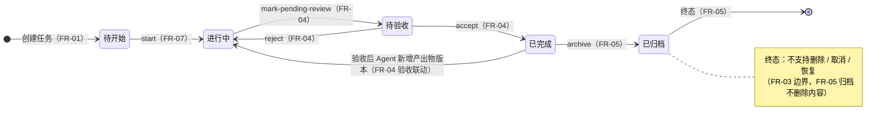
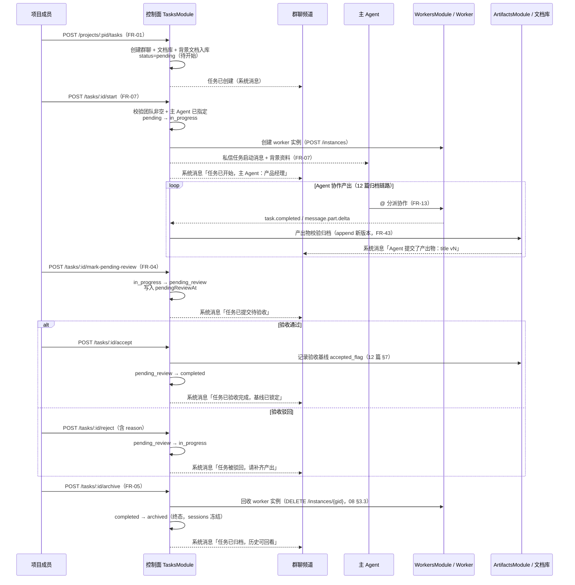

# 任务状态机与全生命周期

本文档是任务**五态状态机**与**全生命周期**的专章详设。它回答五个问题：任务沿哪些状态流转、每个迁移动作触发什么副作用、状态变更如何驱动群聊 / 产出物 / Worker 实例联动、权限与边界如何约束迁移、状态机在服务端如何实现才安全。全文以 03 篇 FR-01~08 为功能依据、09 篇任务端点为 API 落点，把 08 篇「任务状态机以数据库为唯一事实源」的原则（08 篇 §6.3）展开为逐状态、逐动作、逐事件的设计。

## 1. 定位与文档关系

**任务状态机是平台业务主线的骨架。** 任务沿五态流转，每次迁移都是一次「状态事实更新 + 联动触发」：状态写入 `tasks.status` 与 `task_events`（08 篇 §6.1），随后驱动群聊系统消息（10 篇 §8.1）、产出物验收基线（12 篇 §7）、Worker 实例创建与回收（08 篇 §3.3）。看板五列与五态一一对应（06 篇 task-board 原型），前端看板刷新依赖 `task.status.changed` 事件（09 篇 §4.2）。

**文档关系：**

| 相关文档 | 关系 |
|---------|------|
| 03 篇 FR-01~08 | **功能依据**：任务创建（FR-01）、虚拟团队（FR-02）、五态状态机（FR-03）、验收流程（FR-04）、归档（FR-05）、背景文档（FR-06）、启动流程（FR-07）、主 Agent（FR-08） |
| 09 篇 §2.1/§3.4/§4.2 | **API 落点**：任务 REST 端点（POST /tasks、/start、/mark-pending-review、/accept、/reject、/archive）、幂等规则、`task.status_changed` 事件 |
| 08 篇 §3.1/§3.3/§6.1/§6.3/§7.4 | **实现基线**：TasksModule 职责、`DELETE /worker/{id}/instances/{gid}` 归档回收、`tasks`/`task_events` 表、状态机唯一事实源、三段式落库广播 |
| 10 篇 §8.1 | **群聊联动**：任务状态变更 → 系统消息（任务已启动/待验收/已完成/已归档） |
| 12 篇 §7 | **验收联动**：accept 记录 `accepted_flag` 验收基线；验收后 Agent 新增版本任务自动退回进行中 |
| 06 篇 §2.4 task-board | **界面落点**：看板五列（待开始/进行中/待验收/已完成/已归档）与五态对应 |

**阅读路径。** 只关心五态怎么流转 → §3；只关心某个动作的副作用 → §4 对应小节；只关心事件与联动 → §5；只关心实现与并发 → §8。§2 是全部章节共用的实体模型。

## 2. 任务实体模型

### 2.1 任务字段（08 篇 §6.1 `tasks` 表展开）

| 字段 | 类型 | 说明 | 依据 |
|------|------|------|------|
| `id` | string | 任务主键 | FR-01 |
| `projectId` | string | 所属项目（`project_id`）；跨项目数据隔离依据 | FR-25 |
| `title` | string | 任务标题（创建必填） | FR-01 |
| `description` | string? | 任务描述（创建可选） | FR-01 |
| `priority` | enum | 高 / 中 / 低（创建可选，默认中） | FR-01 |
| `status` | enum | **五态字符串枚举**：`pending`（待开始）/ `in_progress`（进行中）/ `pending_review`（待验收）/ `completed`（已完成）/ `archived`（已归档）；应用层常量 + String 列（08 篇 §6.2 双库兼容） | FR-03 |
| `mainAgentId` | string? | **主 Agent**（任务负责人，FR-08）；多 Agent 启动前必填，单 Agent 任务即该 Agent | FR-07/08 |
| `backgroundDocs[]` | Json | 背景文档元数据数组（创建时上传，FR-06；`background_docs` Json 列） | FR-06 |
| `teamAgentIds[]` | array | 虚拟团队（`task_agents` 表，task_id × agent_id，含 joined_at/removed_at） | FR-02 |
| `createdBy` | string | 创建者（`created_by`） | FR-01 |
| `createdAt` | timestamp | 创建时间（任务创建即生成群聊与文档库的时点） | FR-01 |
| `startedAt` | timestamp? | 启动时间（start 迁移时写入） | FR-07 |
| `pendingReviewAt` | timestamp? | 进入待验收时间（mark-pending-review 迁移时写入） | FR-04 |
| `completedAt` | timestamp? | 验收完成时间（accept 迁移时写入） | FR-04 |
| `archivedAt` | timestamp? | 归档时间（archive 迁移时写入） | FR-05 |

### 2.2 创建即生成的三件套（FR-01/06/09）

任务创建不是孤立的「插一行记录」，而是在同一事务内完成三个副作用的初始化：

| 副作用 | 产物 | 落点 | 依据 |
|--------|------|------|------|
| 任务群聊频道 | `chat_channels`（type=task_group，关联 task_id） | 10 篇 §3.1 | FR-01/09 |
| 任务文档库 | `artifacts` 聚合视图（初始为空，随产出物归档填充） | 12 篇 §6 | FR-01 |
| 背景文档入库 | 背景文档作为首批文档进入文档库（`POST /tasks/:id/background-docs` 或创建请求携带） | 12 篇 §6 / 09 篇 §3.4 | FR-06 |

> **创建即就绪**：任务创建后即为「待开始」默认态（FR-03），群聊与文档库立即可用——成员无需等待启动即可在群聊中澄清需求、上传补充资料（FR-01 描述）。

### 2.3 与状态相关的派生视图

| 视图 | 数据来源 | 说明 |
|------|---------|------|
| 看板五列 | `tasks.status` 分组 | 06 篇 §2.4 任务看板页，顶部筛选条按五态过滤（FR-03） |
| 状态时间线 | `task_events`（from/to/created_at） | 任务详情页状态历史回看（08 篇 §6.1） |
| 主 Agent 标识 | `tasks.main_agent_id` | 任务详情 / 群聊任务面板展示任务负责人（FR-08） |

## 3. 五态状态机（核心）

### 3.1 状态机总览（mermaid）

五态、五个迁移动作（start / mark-pending-review / accept / reject / archive）。迁移链唯一确定，无跳态、无回退分支（reject 是唯一的「后退」动作）：



> **虚线回边（已完成 → 进行中）不是人工迁移动作**：它由 ArtifactsModule 在验收后新增产出物版本时自动触发（FR-04「验收后更新」，详见 §4.5 联动与 12 篇 §7.2），不在 REST 端点清单中。

### 3.2 迁移总表

| 动作 | 前置状态 | 后置状态 | 执行人 | 权限 | 幂等行为 | 关键副作用 |
|------|---------|---------|--------|------|---------|-----------|
| 创建（POST /tasks） | —（无状态） | 待开始 | 项目成员 | `[project]` | 自然幂等（每次创建新任务） | 生成群聊 + 文档库 + 背景文档入库（§4.1） |
| start | 待开始 | 进行中 | 项目成员 | `[project]` | 已进行中返回 200，不重复产生 task_events（09 §2.1） | 校验团队与主 Agent；创建 worker 实例；私信主 Agent；群聊系统消息「任务已启动」（§4.2） |
| mark-pending-review | 进行中 | 待验收 | 项目成员 | `[project]` | 已待验收返回 200 | 写入 pendingReviewAt；群聊系统消息「任务已提交待验收」（§4.3） |
| accept | 待验收 | 已完成 | 项目成员（验收判定权在成员，FR-04） | `[project]` | 已完成返回 200 | 记录产出物验收基线 accepted_flag；写入 completedAt；群聊系统消息「任务已验收完成」（§4.4） |
| reject | 待验收 | 进行中 | 项目成员 | `[project]` | 进行中返回 200 | 记录驳回原因；群聊系统消息「任务被驳回」（§4.4） |
| archive | 已完成 | 已归档 | 项目成员 | `[project]` | 已归档返回 200 | **终态**；回收 worker 实例；群聊系统消息「任务已归档」；会话冻结（§4.5） |
| 验收后更新（自动） | 已完成 | 进行中 | 平台（ArtifactsModule 自动） | — | 每次新增版本触发一次退回 | 新版本需重新验收（FR-04，§4.4 联动） |

### 3.3 无效迁移

任意非前置状态执行动作 → **409 `TASK_INVALID_TRANSITION`**（09 篇 §2.1/§3.4）：

| 动作 | 合法前置 | 非法示例（409） |
|------|---------|----------------|
| start | 待开始 | 进行中 / 待验收 / 已完成 / 已归档 |
| mark-pending-review | 进行中 | 待开始 / 待验收 / 已完成 / 已归档 |
| accept | 待验收 | 待开始 / 进行中 / 已完成 / 已归档 |
| reject | 待验收 | 待开始 / 进行中 / 已完成 / 已归档 |
| archive | 已完成 | 待开始 / 进行中 / 待验收 / 已归档 |

错误响应统一格式（09 篇 §2.1）：`{code: "TASK_INVALID_TRANSITION", message, details: {from, to}}`；前端据此提示「任务状态迁移不合法」，不进入任何副作用。

## 4. 各迁移详设

### 4.1 创建（FR-01/02/06）

`POST /projects/:pid/tasks`，请求 `{title, description?, priority?, agentIds[], mainAgentId?, backgroundDocs[]?}`（09 篇 §3.4）：

1. **权限校验**：调用者为项目成员（`[project]`）。
2. **团队落库**：`agentIds[]` 写入 `task_agents`（虚拟团队，FR-02）；`mainAgentId` 若指定须在团队内（FR-08，09 篇 §3.4 PATCH 校验规则同）。
3. **三件套初始化**（同事务）：创建 `chat_channels`（task_group）、初始化文档库、背景文档入库（FR-01/06）。
4. **入待开始**：`tasks.status = pending`，写入 `task_events`（type=status_change, from=null, to=pending）。
5. **响应**：`201` + 任务对象（含 status=pending、mainAgentId）。

> **创建即团队已组但未投入协作**：待开始态下 Agent 已入队（获得独立会话，FR-14/37）但不接收任何 @ 分派前的处理；成员在待开始态可调整团队（FR-02，`POST /tasks/:id/team`），也可补充背景文档（FR-06）。

### 4.2 启动 start（FR-07/08）

`POST /tasks/:id/start`（仅待开始合法）：

**前置校验（两项，缺一不可）：**

| 校验 | 规则 | 不满足时 |
|------|------|---------|
| 已选 Agent 非空 | `task_agents` 至少一名 Agent | 前端弹 Agent 选择面板补选后再开始（FR-07） |
| 主 Agent 已指定 | 多 Agent 任务须 `mainAgentId` 已确定；单 Agent 任务主 Agent 即该 Agent | 多 Agent 未指定时提示先指定主 Agent（FR-07/08） |

**执行顺序：**

1. 状态迁移：`pending → in_progress`，写入 `startedAt`、`task_events`。
2. **创建 worker 实例**：经 WorkersModule 下发 `POST /worker/{id}/instances`（按任务组创建实例，08 篇 §3.3）；`task_group_instances` 记录 task_id × worker_id × instance_id；`instance.created` 事件回流后广播 `task.status.changed`（09 篇 §4.3）。
3. **私信主 Agent**：向主 Agent 发送任务启动消息（含任务目标、团队分工、背景文档），落库后经群聊/私聊可见（FR-07，10 篇消息机制）；同时群聊生成系统消息「任务已开始，主 Agent：产品经理」（10 篇 §8.1）。
4. 响应 `{task, mainAgentId}`（09 篇 §3.4）。

**主 Agent 职责边界（FR-08）：**

| 职责 | 说明 | 边界 |
|------|------|------|
| 协调权 | 可 @ 其他 Agent 衔接协作，牵头分工（FR-13 Agent 互 @） | 互 @ 3 轮上限、循环检测（FR-13） |
| 推进职责 | 启动后向团队同步目标与分工；环节间协调产出衔接；必要时向成员提示进度 | — |
| 兜底设计 | 主 Agent 无产出不阻塞任务；处理失败不视为任务失败 | 成员仍可直接 @ 各 Agent；单 Agent 错误隔离（FR-21） |
| **不越权验收** | 验收结论由成员作出 | 主 Agent 不替代验收判定权（FR-04/08） |

### 4.3 标记待验收 mark-pending-review（FR-04）

`POST /tasks/:id/mark-pending-review`（仅进行中合法）：

- **仅成员手动触发，Agent 不自动触发**：语义是「产出已齐备，请成员验收」——自动判定无法保证产出完整性，手动标记比自动更可控（FR-04）。
- **触发时机**：成员在任务文档库中核对产出齐备（12 篇 §6 列表 + 查看）后主动操作；可从看板卡片或群聊任务面板发起（06 篇）。
- **副作用**：`in_progress → pending_review`，写入 `pendingReviewAt`、`task_events`；群聊系统消息「任务已提交待验收」（10 篇 §8.1）。
- **进入后 Agent 仍可产出**：待验收不冻结 Agent 会话，Agent 可继续 append 新版本（冲突处理见 §7 边界冲突与 12 篇 §7）。

### 4.4 验收 accept / 驳回 reject（FR-04）

**accept** `POST /tasks/:id/accept`（仅待验收合法）：

1. 状态迁移：`pending_review → completed`，写入 `completedAt`、`task_events`。
2. **记录验收基线**：将**当前最新版本**的各产出物版本标记 `accepted_flag = true`（12 篇 §7.1，08 篇 §6.3）——验收针对最终交付版本，验收结论对应的内容从此不可变（FR-04/43）。
3. 群聊系统消息「任务已验收完成，产出物基线已锁定」（10 篇 §8.1）。

**reject** `POST /tasks/:id/reject`（仅待验收合法）：

1. 状态迁移：`pending_review → in_progress`，写入 `task_events`。
2. **驳回原因记录**：请求可携带 `{reason?}`，写入 task_events metadata，供 Agent 与成员在群聊可见（10 篇 §8.1 系统消息「任务被驳回，请补齐产出后重新提交」）。
3. **二次循环**：驳回后任务回到进行中，Agent 继续产出补齐（append 新版本，12 篇 §4），成员再次核对齐备后重新 mark-pending-review——**reject 后无自动重试**，重新进入待验收必须由成员手动再次标记（FR-04，§7 边界）。

**验收联动（accept 之后的自动回退）：**

| 触发 | 动作 | 结果 |
|------|------|------|
| 已验收（completed）任务，Agent 新增产出物版本（append vK+1） | ArtifactsModule 自动将任务退回进行中 | 新版本需重新验收；已验收版本 vK 不可覆盖（409 `ARTIFACT_ACCEPTED_IMMUTABLE`，12 篇 §7.2） |

> **不可变的双重保证**（12 篇 §7.2）：① 已验收版本内容不可修改/覆盖（409）；② Agent 追加新版本则任务自动退回进行中、重新走验收——验收结论对应内容始终不可变，且验收始终针对最终交付版本。

### 4.5 归档 archive（FR-05）

`POST /tasks/:id/archive`（仅已完成合法）：

1. 状态迁移：`completed → archived`，写入 `archivedAt`、`task_events`（type=archive）。
2. **回收 worker 实例**：经 WorkersModule 下发 `DELETE /worker/{id}/instances/{gid}`（08 篇 §3.3）；`task_group_instances` 记录解除；实例回收后该任务组不再承载任何 Agent 会话。
3. **会话冻结**：任务内全部 `sessions.status = archived`（08 篇 §6.1）；成员点开历史会话可回看（FR-19 消息持久化）。
4. **不删除任何内容**：任务历史、群聊记录、产出物全版本完整保留（FR-05，10 篇 §6「归档可追溯」）。
5. 群聊系统消息「任务已归档，历史可回看」（10 篇 §8.1）；归档为**终态**，无恢复路径。

**归档后操作限制表：**

| 端点 | 归档后行为 |
|------|-----------|
| POST /tasks/:id/start / mark-pending-review / accept / reject | 409 `TASK_INVALID_TRANSITION`（非前置状态） |
| POST /tasks/:id/archive | 200（幂等，已处目标态） |
| POST /tasks/:id/team | **禁止**（409 或 403）：团队调整仅在待开始/进行中合法（FR-02） |
| POST /channels/:id/messages | **禁止**：任务群聊归档后只读（开放问题②，§9）；历史可经 GET 回看 |
| POST /tasks/:id/artifacts / 产出物 append | 拒绝：归档后不接受新产出（冲突处理见 §7） |
| GET 类（任务详情/文档库/消息历史/产出物版本） | 全部保留，可读（FR-05 追溯） |

## 5. 状态变更事件与联动

### 5.1 task_events 事件表（08 篇 §6.1 展开）

每次状态迁移落库一条事件，作为「状态机唯一事实源」的审计与回查依据（08 篇 §6.3/§7.4）：

| 字段 | 说明 | 示例 |
|------|------|------|
| `id` | 事件主键（兼 SSE 事件 id，09 篇 §4.1） | e_1024 |
| `task_id` | 所属任务 | t_1 |
| `eventType` | `status_change` / `accept` / `reject` / `archive`（对齐 08 篇 §6.1 type 枚举） | accept |
| `fromStatus` | 迁移前状态（from） | pending_review |
| `toStatus` | 迁移后状态（to） | completed |
| `actorId` | 执行人（成员 user_id；验收后自动回退为 system） | u_5 |
| `timestamp` | ISO8601 迁移时间 | 2026-08-06T10:00:00+08:00 |
| `metadata` | Json：驳回原因（reject.reason）、验收基线版本清单（accept 记录的各产出物 accepted 版本号）等 | {"reason":"需求文档缺失性能测试结论"} |

**唯一约束**：`(task_id, id)` 主键 + 迁移动作去重（见 §8.2 幂等）；幂等规则下已处目标态的重复请求返回 200 且**不新增事件行**（09 篇 §2.1）。

### 5.2 SSE 广播：task.status_changed

| 事件 type | data 要点 | 触发时机 | 消费端 |
|-----------|----------|---------|--------|
| `task.status_changed` | `{taskId, from, to, actorType, actorId}` | 状态迁移落库成功后广播（09 篇 §4.2） | 前端看板实时刷新（FR-03，06 篇 §2.4）；群聊任务面板状态同步 |

广播遵循「先落库后转发」（08 篇 §7.3）：事件先写 `task_events` 再广播，广播失败不影响数据正确性，前端可游标补拉（09 篇 §4.4）。看板五列与五态一一对应（FR-03），状态视觉使用固定状态色（06 篇）。

### 5.3 群聊系统消息联动（10 篇 §8.1）

| 迁移 | 系统消息示例 | 消息文案要点 |
|------|-------------|-------------|
| start | 「任务已开始，主 Agent：产品经理」 | 含主 Agent 名（FR-07/08） |
| mark-pending-review | 「任务已提交待验收」 | 提示成员核对产出（FR-04） |
| accept | 「任务已验收完成，产出物基线已锁定」 | 强调 accepted_flag 基线锁定（FR-04） |
| reject | 「任务被驳回，请补齐产出后重新提交」 | 附驳回原因（§4.4） |
| archive | 「任务已归档，历史可回看」 | 明确内容保留（FR-05） |

system 消息（senderType=system）由 `task_events` 触发生成（10 篇 §2.1），落库后广播（`chat.message.new`），历史查询同样携带。

### 5.4 联动总览

```
任务状态机（TasksModule）
   ├─ tasks.status 更新 + task_events 落库（同事务，08 §6.3）
   ├─ SSE task.status_changed ──▶ 前端看板实时刷新（09 §4.2）
   ├─ 群聊 system 消息（10 §8.1）：start / 待验收 / accept / reject / archive
   ├─ worker 实例生命周期（08 §3.3）：start 创建 / archive 回收
   └─ 产出物验收基线（12 §7）：accept 标记 accepted_flag / 验收后新增版本自动回退
```

## 6. 跨模块联动时序

### 6.1 完整生命周期时序（mermaid）

覆盖「创建 → 启动 → 协作产出 → 待验收 → 验收 → 归档」主链路：



### 6.2 验收驳回的二次循环

reject 不是终点，而是循环回到进行中：产出补齐 → 再入待验收 → 再验收，直到 accept：

```
待验收 ──reject──▶ 进行中 ──Agent 补齐产出（append 新版本）──▶ 待验收（成员再次手动标记）──accept──▶ 已完成
```

关键约束（§7 边界）：**每次重新进入待验收都必须由成员手动触发**；验收基线只随 accept 建立，reject 不产生基线；accept 后若 Agent 再 append 版本，任务自动退回进行中、基线版本不可覆盖（12 篇 §7.2）。

## 7. 权限与边界

### 7.1 执行人权限

| 动作 | 执行人 | 权限校验 | 说明 |
|------|--------|---------|------|
| 创建 / start / mark-pending-review / accept / reject / archive / team | 项目成员 | `[project]`（09 篇 §2.3） | 验收判定权在成员，主 Agent 不越权（FR-04/08）；验收操作不做单独角色门槛（09 篇 §2.3） |
| 验收后自动回退（已完成→进行中） | 平台（ArtifactsModule） | — | 非用户操作，沿产出物归档链路自动触发（12 篇 §7.2） |

### 7.2 幂等

状态迁移类端点（start/accept/archive 等）在服务端做幂等校验（09 篇 §2.1）：**已处于目标状态时返回 200 且不重复产生 task_events**。幂等覆盖两种重复：① 用户双击/重试造成的重复请求；② SSE 断线后前端补拉与重放（09 篇 §4.4）。

### 7.3 本版边界

| 边界 | 约定 | 依据 |
|------|------|------|
| 不支持删除 / 取消 | 任务沿五态流转直至归档，归档即终态；删除/撤回留待后续迭代 | FR-03 |
| 归档为终态无恢复 | 无 archive 反向端点；归档后任务不可再启动或改状态 | FR-05 |
| reject 后无自动重试 | 驳回后回到进行中，成员/主 Agent 协调补齐产出后**成员手动**再次标记待验收 | FR-04 |
| 消息不可撤回/编辑 | 群聊消息本版不可撤回编辑（与任务状态机联动的系统消息同样不可撤回） | FR-19 |
| 验收基线不可撤销 | 本版不支持撤销 accept / 清除 accepted_flag（12 篇 §9.2 开放问题④） | 12 §9.2 |

### 7.4 边界冲突处理

| 冲突场景 | 处理 | 依据 |
|---------|------|------|
| 待验收期间 Agent 仍产出 | **允许**：待验收不冻结 Agent 会话，产出 append 新版本；验收时以**当前最新版本**为基线（accept 记录的是迁移时点的 current_version） | 12 篇 §7 |
| accept 后 Agent 追加新版本 | 任务**自动退回进行中**，新版本需重新验收；已验收版本 409 `ARTIFACT_ACCEPTED_IMMUTABLE` 不可覆盖 | FR-04 / 12 §7.2 |
| 归档后新产出 | **拒绝**：实例已回收（§4.5），Agent 无会话可产出；若事件迟到（归档前已生成），控制面丢弃并提示「任务已归档」 | 08 §3.3 / FR-05 |
| 团队调整与状态冲突 | team 调整仅待开始/进行中合法；待验收/已完成/已归档时调用返回 409 | FR-02 |

## 8. 状态机实现要点

### 8.1 状态迁移校验在服务端集中

- **单一状态机服务**：合法迁移表只存在于控制面 TasksModule（08 篇 §3.1「任务 CRUD 与状态机」），前端看板/群聊按钮仅发起请求，不本地判定——避免客户端绕过校验直接改状态。
- **迁移表驱动**：以「动作 × 前置状态」映射表（§3.2）为唯一判定源，新增动作只改表不改分支逻辑。
- **三段式落库**：服务层校验 → 落库（tasks.status + task_events 同事务）→ 广播 SSE（08 篇 §7.4）；数据库为唯一事实源（08 篇 §6.3）。

### 8.2 并发安全

| 并发场景 | 机制 |
|---------|------|
| 同任务并发迁移（如两个成员同时 accept/reject） | **乐观锁**：`tasks` 表带版本字段（或 CAS 式「WHERE status = 前置状态」更新），更新影响行数为 0 时判定冲突，重读后按最新状态重新校验（返回 200 幂等或 409 非法迁移） |
| 重复请求 / 事件重放 | `task_events` 主键唯一（幂等键 = 动作 + 目标态 + 前置态）＋ 幂等规则（已处目标态返回 200 不新增事件，09 §2.1） |
| 验收基线与产出物并发 append | `artifact_versions` 以 `(artifact_id, version)` 唯一约束 + 乐观锁（12 篇 §4.3）；accept 与 append 竞态由「验收以迁移时点 current_version 为基线」收敛（§7.4） |
| worker 事件迟到（归档后到达） | 以任务状态为守卫：archived 任务的事件直接丢弃并记日志（§7.4） |

### 8.3 与 Worker 实例生命周期绑定

| 迁移 | 实例动作 | 协议端点 | 落库 |
|------|---------|---------|------|
| start | **创建实例**（按任务组，每任务组一个 opencode 实例） | `POST /worker/{id}/instances`（08 篇 §3.3） | `task_group_instances`（task_id × worker_id × instance_id）；`instance.created` 事件回流广播 `task.status.changed`（09 篇 §4.3） |
| archive | **回收实例** | `DELETE /worker/{id}/instances/{gid}`（08 篇 §3.3） | 实例解除绑定；`sessions.status = archived`（08 §6.1） |
| worker 离线自愈 | 任务组待重调度（不影响任务状态） | 调度器按亲和与负载迁移（07 篇 11.4） | 实例映射更新；任务状态不受影响（FR-26） |

> **任务状态与实例解耦**：任务状态由 `tasks.status` 唯一决定，实例只是运行载体。worker 离线/实例重建（自愈重调度）不改变任务状态，只改变实例映射——状态机不感知 worker 细节（08 篇 §6.3/§7.4）。

### 8.4 实现清单（TasksModule 内部）

| 组件 | 职责 |
|------|------|
| `TaskStateMachine` | 迁移表判定（§3.2）、非法迁移 409、幂等判定（§7.2） |
| `TaskLifecycleService` | 副作用编排：三件套创建（§4.1）、私信主 Agent（§4.2）、回收实例（§4.5） |
| `TaskEventStore` | task_events 落库（同事务）与查询 |
| `AcceptanceService` | accept 时收集产出物 current_version 标记 accepted_flag；reject 记录 reason；验收后新增版本的自动回退守卫（12 篇 §7） |

## 9. 开放问题

| # | 开放问题 | 现状 | 触发条件（何时需解决） |
|---|---------|------|------------------------|
| ① | 待验收期间 Agent 产出与验收基线的竞态 | 验收以迁移时点 current_version 为基线；若验收提交瞬间 Agent 并发 append，存在「基线是否应含刚到达版本」的窗口 | 出现实际误判诉求时，明确验收快照语义（锁定迁移时点版本集合） |
| ② | 归档后任务群聊是否只读 | 本版归档后禁止发消息（§4.5 限制表） | 若出现「归档后追加备注」真实诉求，评估开放只读附注或另行归档说明频道 |
| ③ | 主 Agent 变更时机 | 本版 PATCH /tasks/:id 支持 mainAgentId 变更但须团队内（09 §3.4）；启动后变更的联动（新主 Agent 是否重收启动消息、是否通知团队）未定义 | 出现「启动后换负责人」诉求时，定义变更触发的新启动消息与系统消息 |
| ④ | reject 驳回原因的结构化 | 本版 reason 以文本入 metadata（§4.4） | 驳回原因需驱动 Agent 定向补齐时，定义结构化驳回清单（如按产出物逐项） |
| ⑤ | 归档任务数据长期保留的成本 | 归档不删除任何内容（FR-05），消息/产出物/事件持续累积 | 数据量增长后评估归档分库或冷存储（08 篇 §8 预留方向） |

**与 08 篇 §6.3 的衔接。** 本文档是「任务状态机以数据库为唯一事实源」的展开实现：§3 定义迁移表、§5 定义事件与联动、§8 定义并发与实例绑定。08 篇的 `tasks.status` + `task_events` 双表是全部状态语义的事实基础，09 篇的端点表（§3.4）、事件表（§4.2）与幂等规则（§2.1）为本文档的 API 事实依据，两处表述冲突时以 09 篇为准并同步修正本文档。
