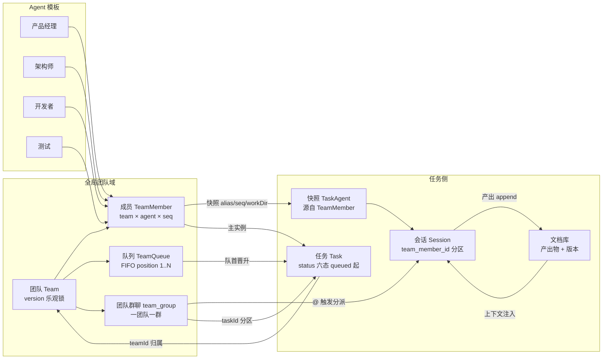
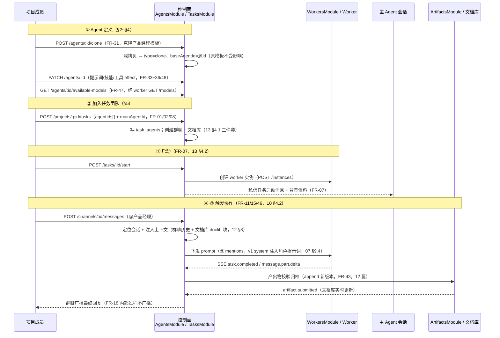

# Agent 配置与虚拟团队模型

本文档回答平台的两个核心问题：**Agent 如何定义**（配置模型：三种来源、五块配置项、四类预置角色模板）与**Agent 如何加入任务协作**（虚拟团队：团队组建、主 Agent、团队调整、会话模型）。前者定义「Agent 是谁、能做什么」，后者定义「哪些 Agent 如何协作」。全文以 04 篇 FR-30~37/47/48 与 03 篇 FR-02/08 为功能依据，09 篇 §3.7（Agents 端点）与 §3.4（团队端点）为 API 落点，把 11 篇 §7.3「资源 × Agent 绑定」展开为完整配置生成，把 13 篇 §4.2（启动私信主 Agent）与 10 篇 §4（@ 触发）串入 Agent 加入任务的完整链路。

## 1. 定位与文档关系

**Agent 配置定义「Agent 是谁、能做什么」，虚拟团队定义「哪些 Agent 如何协作」。** 两件事分属两个平面：配置是 Agent 的静态定义（平台侧数据 + 生成到 worker 的 opencode 配置），虚拟团队是任务对 Agent 的动态编排（任务侧 `task_agents` 关联）。配置决定能力边界，团队决定参与范围——同一 Agent 配置可被多个任务以不同团队组合复用。

**文档关系：**

| 相关文档 | 关系 |
|---------|------|
| 04 篇 FR-30~37/47/48 | **功能依据**：预置模板（FR-30）、模板克隆（FR-31）、完全自定义（FR-32）、提示词（FR-33）、技能（FR-34）、工具（FR-35/48）、权限范围（FR-36）、默认模型（FR-47）、会话模型（FR-37） |
| 03 篇 FR-02/08 | **功能依据**：虚拟团队组建与进行中调整（FR-02）、主 Agent 指定与职责边界（FR-08） |
| 09 篇 §3.7 Agents | **API 落点**：GET /agents、GET /agents/:id、POST /agents、POST /agents/:id/clone、PATCH /agents/:id、GET /agents/:id/available-models |
| 09 篇 §3.4/§3.5 | **API 落点**：POST /tasks/:id/team（团队调整，FR-02）、POST /dm-channels（私聊，FR-14） |
| 11 篇 §7.3/§7.1/§8 | **资源绑定落点**：工具/技能/MCP 与 Agent 绑定的三落点（§7.3）、资源生命周期与 v1/v2 生效方式（§7.1/§8） |
| 07 篇 §9.4/§10.3/§10.4 | **角色解析差异**：v1 system 注入 vs v2 `ctx.agent.transform` 注册（§9.4）；v1 写文件+重启 vs v2 transform 热更新（§10.3/§10.4） |
| 13 篇 §4.2/§6 | **生命周期衔接**：启动私信主 Agent（§4.2）、完整生命周期时序（§6） |
| 10 篇 §4/§8.3 | **消息衔接**：@ 触发分派链路（§4）、团队调整系统消息（§8.3） |
| 12 篇 §8 | **上下文衔接**：文档库注入协议（FR-46，@ 触发时注入 doclib 块） |

**阅读路径。** 只关心 Agent 怎么定义 → §2/§3/§4；只关心团队怎么组建与调整 → §5；只关心会话怎么隔离与流转 → §6；只关心配置改了怎么生效 → §7；只关心 Agent 从创建到产出的完整链路 → §8。

## 2. Agent 配置模型

### 2.1 Agent 实体字段（09 篇 §3.7 端点数据展开）

Agent 是平台中的 AI 协作者，每名 Agent 是一个可独立配置、可被多个任务复用的实体。控制面 `agents` 表字段与 09 篇 §3.7 端点请求/响应一一对应：

| 字段 | 类型 | 说明 | 依据 |
|------|------|------|------|
| `id` | string | Agent 主键；被任务以 `agentIds[]` / `mainAgentId` 引用 | FR-02/08 |
| `name` | string | 展示名（如「产品经理」「后端开发-张三」） | FR-32 |
| `type` | enum | `template`（预置模板，只读）/ `clone`（模板克隆副本）/ `custom`（完全自定义） | FR-30/31/32 |
| `baseAgentId` | string? | **克隆源**：clone 类型记录被克隆的 Agent id（FR-31）；template/custom 为 null | FR-31 |
| `role` | string? | 角色名（自定义 Agent 的角色定位，如「数据分析师」）；模板 Agent 即模板名 | FR-30/32 |
| `prompt` | string | 提示词：行为方式与角色边界（FR-33）；模板 Agent 带默认提示词，可克隆后修改 | FR-33 |
| `skillIds[]` | string[] | 已授权技能集合（FR-34）；生成 worker 侧可见技能集合 | FR-34 |
| `toolEffects{}` | `{ "<action>": "allow"\|"ask"\|"deny" }` | **每工具独立权限 effect**：工具名即权限 action，支持通配符（FR-35/48） | FR-35/48 |
| `permissionScope` | object? | 权限范围：限定可访问的资源/操作边界（FR-36）；与 toolEffects 正交叠加 | FR-36 |
| `defaultModelId` | string? | 默认模型（FR-47）；未选择时沿用模板默认 | FR-47 |
| `createdBy` | string | 创建者用户 id | FR-31/32 |
| `timestamps` | object | createdAt / updatedAt | — |

> **toolEffects 的结构语义**（09 篇 §3.7 尾注）：`{ "<action>": effect }`，action 是工具注册时自动进入的权限点（开放命名空间，FR-48），支持 `jenkins-*` 通配 action 批量配置。平台侧存结构，生成到 worker 时翻译为 opencode `permission` 节（§3.5 映射表）。

### 2.2 三种来源（FR-30/31/32）

| 来源 | type | 创建方式 | 继承关系 | 隔离规则 | 依据 |
|------|------|---------|---------|---------|------|
| 预置模板 | `template` | 平台内置，任务创建时直接勾选 | 平台出厂默认（四类角色，§4） | **只读**：模板本身不可编辑（改动需克隆副本）；成员可直接加入任务 | FR-30 |
| 模板克隆 | `clone` | `POST /agents/:id/clone` 以 `{name}` 复制 | `baseAgentId` 记录克隆源；副本继承源的全部配置（prompt/skillIds/toolEffects/permissionScope/defaultModelId） | **克隆是深拷贝**：副本可任意修改，**原模板不受影响**（FR-31）；修改只写副本行，不回写源 | FR-31 |
| 完全自定义 | `custom` | `POST /agents` 空白创建 | 无继承，`baseAgentId = null`；自行定义角色名与全部配置项 | 与模板 Agent 能力无差别，均可加入任务（FR-32） | FR-32 |

**克隆链路设计要点（FR-31）：**

1. `POST /agents/:id/clone` 仅对 `type=template` 与 `type=clone` 的 Agent 合法；对 `custom` 克隆同样允许（团队自定义 Agent 可作克隆起点，04 篇 FR-31「或团队内已自定义的 Agent」）。
2. 克隆落库：复制源行全部配置字段 → 新行 `type=clone`、`baseAgentId=源id`、`name=请求指定名`、`createdBy=当前用户`；**同一事务内完成，克隆不触碰源行**。
3. 隔离验证：克隆后修改副本（PATCH /agents/:id）只更新副本行；对源行的 GET 返回原配置不变。`baseAgentId` 仅作血缘追溯（团队可查看该 Agent 从哪个模板演化而来），不建立联动——**源模板后续不可变（只读），因此不存在「源变更同步到副本」的问题**。
4. 模板只读边界：`PATCH /agents/:id` 对 `type=template` 返回 403 `PERMISSION_AGENT_READONLY`；对 clone/custom 正常更新（09 篇 §3.7 PATCH）。

## 3. 五块配置项详设

### 3.1 提示词配置（FR-33）

提示词定义 Agent 的行为方式与角色边界（如「以产品经理视角拆解需求，输出验收标准」）。成员可查看、编辑；**配置即时生效并作用于该 Agent 的后续会话**。

| 维度 | 约定 | 依据 |
|------|------|------|
| 内容 | 角色定位 + 行为准则 + 输出边界；模板带默认提示词，克隆后按项目规范调整 | FR-33 |
| 生效时点 | **作用于后续会话**：已进行中的会话维持原提示词，不中断重放；新 @ 触发（下次分派）开始使用新提示词 | FR-33 |
| 角色解析落点 | v1：下发 prompt 时以 `system` 字段注入角色提示词（07 篇 §9.4 v1 resolveRole）；v2：插件 `ctx.agent.transform` 注册 agent 携带提示词 + `switchAgent` 切换 | 07 §9.4 |
| API | `PATCH /agents/:id` 请求 `{prompt?}` | 09 §3.7 |

**「后续会话」语义澄清**：FR-33 的「即时生效」≠「中断进行中的处理」。会话是持续上下文（FR-37），提示词变更只对**变更之后发起的处理**生效——进行中会话的下一轮 prompt 分派即携带新提示词，无需重启会话；这与「技能/工具文件新增需重启实例」的 v1 代价（§7）是两类不同的生效机制。

### 3.2 技能配置（FR-34）

成员可为 Agent 勾选或移除技能，决定其擅长执行的工作类型（文档撰写、代码审查、用例设计等）。技能来源为平台技能库（FR-27 上传启用）。

| 维度 | 约定 | 依据 |
|------|------|------|
| 配置形态 | `skillIds[]`：从已启用技能库勾选（09 篇 §3.8 GET /skills enabled）；移除即取消勾选 | FR-34 |
| worker 侧生成 | ① 对应 SKILL.md 进入该 Agent 可见集合；② 生成 `permission.skill` deny 规则隐藏未授权技能（11 篇 §7.3 技能授权落点） | 11 §7.3 |
| 生效方式 | v1：写 SKILL.md + 重启实例（discoverSkills 启动时一次性发现，07 篇 §10.3）；v2：`ctx.skill.transform` 运行时热更新（11 篇 §8） | 07 §10.3/10.4 |
| 停用联动 | 技能在平台停用（PATCH /skills/:id/status enabled=false）后，已勾选该技能的 Agent 不再注入（09 篇 §3.8） | FR-27 |

### 3.3 工具配置（FR-35/48）

工具配置由**启用开关**与**每工具独立权限 effect** 两部分组成。配置界面每工具一行：启用开关 + 工具名（action）+ 来源徽章（内置/自定义/MCP）+ effect 三态（FR-48，06 篇 agent-config 原型）。

| 配置维度 | 取值 | 语义 | 生成到 worker |
|---------|------|------|--------------|
| 启用开关 | 启用 / 停用 | 停用的工具 Agent 无法调用（FR-35） | `tools: { "<action>": false }`（11 篇 §7.3 工具落点） |
| effect | `allow` | 允许，无需确认（只读低风险工具默认） | `permission: { "<action>": "allow" }` |
| effect | `ask` | 每次执行前向成员确认（有副作用工具默认） | `permission: { "<action>": "ask" }`（确认流经 request → reply 回平台转成员，07 篇 §5 权限链路第三步） |
| effect | `deny` | 禁止（对模型隐藏） | `permission: { "<action>": "deny" }`（materialize 过滤后不可见，11 篇 §3.3） |
| 通配符 | `jenkins-*` | 一次批量配置前缀同类工具（FR-48） | `permission: { "jenkins-*": effect }` |

> **工具名即权限 action（FR-48）**：权限点不是固定枚举，而是随工具注册动态扩展的开放命名空间——内置工具（`bash`）、自定义工具（`math_add`）、MCP 工具（`github_create_issue`，`<server>_<tool>` 形态）注册后自动成为可配置的权限点（11 篇 §2/§3/§5）。工具不提供 DELETE（09 篇 §3.8 尾注）：停用（enabled=false）替代删除，避免历史 Agent 配置悬空。

### 3.4 权限范围配置（FR-36）

权限范围限定 Agent 可访问的**资源与操作边界**（如仅可读取指定项目、仅可查看文档库、不可执行写操作）。超出范围的操作不直接执行，由平台**转交成员确认后放行**。

| 维度 | 约定 | 依据 |
|------|------|------|
| 与工具权限的关系 | **正交、叠加生效**：工具权限 = 每个工具单独的 effect（该工具能否被调用、调用前是否确认）；权限范围 = 资源范围（被授权工具能触及哪些项目/文档/仓库） | 04 篇 FR-36 说明 |
| 超范围处理 | 不直接执行 → 转成员确认（对接 opencode ask 流：`ctx.ask` 的 request → reply 事件经 worker → 控制面转成员确认，确认结果沿原路返回，07 篇 §5 权限链路第三步） | 07 §5 / 11 §6 |
| 配置形态 | `permissionScope` 对象：如 `{ projects: ["p1"], write: false, doclibOnly: true }`；第一版以项目/读写/文档库为最小粒度，细粒度资源规则列为开放问题（§9） | FR-36 |
| 落点 | 生成到 worker 的 permission 规则与 opencode 运行时过滤/确认机制一一对应；ask 确认流回到平台（08 篇 §7.6：平台转成员确认） | 08 §7.6 |

**确认流闭环**：Agent 请求超出权限范围的操作 → worker 内 `ctx.ask` 触发 request → worker SSE 事件回流控制面 → 控制面向成员展示确认请求（群聊/私聊可见）→ 成员确认（once / always / reject）→ 确认结果经 WorkerClient 返回 worker → opencode 按确认结果执行或拒绝。成员拒绝后 Agent 收到拒绝说明，可换路径完成（FR-21 工具级错误语义）。

### 3.5 默认模型配置（FR-47）

| 维度 | 约定 | 依据 |
|------|------|------|
| 模型列表来源 | 经 worker 接口**动态获取**：`GET /agents/:id/available-models` → 控制面经 WorkerClient 调 worker `GET /models`（07 篇 11.3 控制协议）→ 返回可用模型列表 | FR-47 / 09 §3.7 / 07 §11.3 |
| 选择与默认 | 成员从列表中选择；未选择时**沿用模板默认模型**（§4 四类模板侧重不同） | FR-47 |
| 模型能力侧重 | 通用对话 / 代码生成 / 复杂推理等基础能力侧重（§4 模板表） | FR-47 |
| 保存 | `PATCH /agents/:id` 请求 `{defaultModelId?}` | 09 §3.7 |

> **available-models 端点说明**：`GET /agents/:id/available-models` 返回的是 worker 节点实际可用的模型（能力声明随 worker 注册上报，07 篇 §11.2），不是平台侧静态枚举——worker 离线或换节点时列表随之变化，保证「从列表中选择」永远基于真实可用性（FR-47 动态获取语义）。

### 3.6 五块配置 → opencode 配置映射总表（11 篇 §7.3 展开）

平台按 Agent 配置生成 worker 内 opencode 实例的配置，`agents` 表数据与生成结果一一对应：

| Agent 配置（平台侧） | 生成到 worker 的 opencode 配置 | 示例 | 落点依据 |
|---------------------|------------------------------|------|---------|
| prompt（FR-33） | v1：prompt 分派时 `system` 字段注入角色提示词；v2：agent 定义 prompt | v1 `{system: "以产品经理视角拆解需求…"}` | 07 §9.4 |
| skillIds[]（FR-34） | SKILL.md 进入可见集合 + `permission.skill` deny 规则 | `permission.skill: { "*": "allow", "internal-*": "deny" }` | 11 §7.3 |
| toolEffects{}（FR-35/48） | `permission` 节（含通配符）+ `tools: {action: false}` 停用 | `permission: { "bash": "ask", "jenkins-*": "allow" }` | 11 §7.3 |
| permissionScope（FR-36） | permission 规则中的资源级约束（项目/读写边界） | 超范围操作触发 `ctx.ask` 确认流 | 07 §5 / 08 §7.6 |
| defaultModelId（FR-47） | 会话创建/分派时指定的模型 | `model: "gpt-5-code"`（示例） | 09 §3.7 |
| MCP 挂载（若配置） | opencode `mcp` 配置节 + `<server>_*` 服务器级权限规则 | `mcp: {"github": {...}}` + `permission: {"github_*": "ask"}` | 11 §7.3/§5.3 |

> 映射由控制面生成「资源配置 + 权限规则」语义后经 Worker 控制协议下发（07 篇 §11.3），v1/v2 的格式差异由 worker 侧 WorkerRuntime 翻译（11 篇 §8：业务层与前端零改动）。

## 4. 预置角色模板

### 4.1 四类模板（FR-30）

平台预置产品经理、架构师、开发者、测试四类角色模板，开箱即用，成员可直接加入任务无需任何配置。每类模板带**默认提示词 + 默认技能 + 默认工具集 + 默认权限范围 + 默认模型侧重**：

| 模板 | 默认提示词定位 | 默认技能 | 默认工具集（示例） | 默认权限范围 | 默认模型侧重 |
|------|--------------|---------|-------------------|-------------|-------------|
| 产品经理 | 需求拆解与文档化，输出需求文档与验收标准 | 需求分析、文档撰写、产出物协议 | `read`、`doclib`（文档库读取）、`webfetch`；写操作默认 ask | 项目内只读 + 文档库读写 | 通用对话模型，擅长结构化文本梳理 |
| 架构师 | 技术方案设计与推演，权衡取舍输出设计文档 | 架构设计、方案评审、文档撰写 | `read`、`grep`、`glob`、`lsp`；`bash` 默认 ask | 项目内只读 | 推理模型，擅长复杂逻辑推演与方案权衡 |
| 开发者 | 编码实现与问题排查，输出实现代码与说明 | 编码、代码审查、调试 | `read`/`edit`/`write`/`bash`（allow 或按团队收紧）、`grep` | 项目读写（写操作默认 ask） | 代码能力突出的通用模型 |
| 测试 | 用例设计与缺陷验证，穷举边界输出验证结论 | 用例设计、缺陷验证、文档撰写 | `read`、`bash`（执行测试脚本，ask）、`webfetch` | 项目内只读 + 文档库读写 | 推理模型，擅长边界推演与场景穷举 |

> 上表工具集为**出厂建议默认**：模板只读（§2.2），团队按项目规范通过**克隆**调整工具 effect 与权限范围（FR-31 是模板的扩展路径）；表中模型侧重对应 FR-47「未选择时沿用模板默认模型」的默认来源。

### 4.2 模板只读 + 克隆为扩展路径（FR-30/31）

| 动作 | 模板（type=template） | 克隆副本（type=clone） |
|------|----------------------|----------------------|
| 加入任务 | ✅ 直接勾选（FR-30 开箱即用） | ✅ 同模板 |
| 编辑配置 | ❌ 403 `PERMISSION_AGENT_READONLY` | ✅ PATCH 任意修改 |
| 克隆 | ✅ 可作克隆源（FR-31） | ✅ 可再克隆（血缘链 baseAgentId） |
| 删除 | ❌（本版无 Agent 删除端点，模板常驻） | ❌（本版无 Agent 删除端点，见 §9 开放问题） |

**主 Agent 与模板的关系（04 篇 FR-30 补充说明）**：预置产品经理模板（或团队克隆自它的自定义项目经理 Agent）可作为任务的主 Agent（负责人），牵头组织虚拟团队。主 Agent 同样是平台中的一名普通 Agent，其角色、配置项与默认模型按本篇规则统一维护（§5.2）。

## 5. 全局团队域（独立 Team 域，28 篇详述）

本章为全局团队域的**概要**，完整设计见 28 篇《团队模型与排队设计》。团队是**独立于任务的全局实体**，一团队一群、多任务串行排队、成员多实例——任务通过 `teamId` 归属团队，不再每任务建群。

### 5.1 团队创建与成员（Team / TeamMember）

| 项 | 约定 | 依据 |
|----|------|------|
| 创建 | `POST /teams` `{name!, description?, reuseSession?, members[]}`；`name` 全局唯一，`reuseSession` 默认 true | 09 §3.4，28 §2 |
| 成员 | `team_members` 行：`team_id` + `agent_id`（模板）+ `alias`（默认「<角色>-<seq>」）+ `seq`（同模板同团队内序号，`SELECT MAX(seq) FOR UPDATE` 生成）+ `workDir` | 28 §2 |
| 多实例 | 同一模板 Agent 可在同一团队内添加多次，`seq` 递增区分（`uk_team_members_team_agent_seq`），各实例独立会话/私聊/`@` | 28 §2 |
| 调整 | `POST /teams/:id/members` 增、`PATCH /teams/:id/members/:memberId` 改 alias/workDir、`DELETE /teams/:id/members/:memberId` 删；仅空闲且队列空可删团队 | 28 §2，09 §3.4 |
| 乐观锁 | `teams.version` CAS：`PATCH /teams/:id` 需携带 `version`，冲突 409 `VERSION_CONFLICT` | 28 §2 |
| 权限 | 团队为全局域，需 `teams:view/create/edit/delete` 权限（非项目成员校验） | 28 §2 |

团队与群聊成员的关系：

| 成员类型 | 来源 | 参与方式 |
|---------|------|---------|
| 人类成员 | 项目成员（`project_members`，FR-24） | 群聊发消息、@ 触发、验收判定（FR-04） |
| Agent 成员 | **全局团队**（`team_members`，`team_id × agent_id × seq`） | 群聊 @ 被触发（FR-11/12）、Agent 互 @（FR-13）；未在团队内的 Agent 不参与该团队任务 |

> **团队是全局域，任务是归属关系**：`tasks.team_id` 指向团队，`team_queues` 决定串行顺序，`task_agents` 为创建时从 `team_members` 的快照（alias/seq/workDir 原样复制）——团队调整不改快照，已创建任务的快照保持不变。

### 5.2 任务归属与排队（TeamQueue，FIFO）

| 维度 | 约定 | 依据 |
|------|------|------|
| 归属 | `POST /projects/:pid/tasks` `{teamId!, title!, resetAfterComplete?}`；`teamId` 必填（旧 `agentIds[]` 已废弃） | 09 §3.4，28 §3 |
| 串行 | 一团队一次仅一任务进行中（`teams.current_task_id` 指队首）；其余入 `team_queues` 按 `position` 1..N FIFO 排队，状态 `queued` | 28 §3 |
| 入队 | 团队空闲（`current_task_id` NULL）→ 任务 `pending` 并设 `current_task_id`；忙时 → `queued` + `team_queues` 追加（`MAX(position)+1`，`FOR UPDATE` 行锁 + `version` CAS） | 28 §3 |
| 晋升 | `accept`/`archive`/`reject` 后事务内 `promoteNextInTx`：队首 `queued→pending`、删队首 `team_queues`、重排剩余 `position` 1..N、`current_task_id` 指向新队首或 NULL（空闲） | 28 §3 |
| 取消 | `DELETE /teams/:id/queue/:taskId` 仅 `queued` 可取消（否则 409 `TASK_NOT_QUEUED`）；取消后重排 + 若队首被取消则晋升下一队首 | 28 §3 |
| 看板 | `queued` 为第六态，看板新增「排队中」列；取消不支持拖拽重排 | 28 §3 |
| 队列视图 | `GET /teams/:id` 返回 `queue: TeamQueue[]`（含 `taskTitle/taskStatus`），任务详情 `TeamQueueCard` 展示 FIFO 徽章与取消入口 | 28 §3 |

### 5.3 群聊复用（一团队一群）

| 维度 | 约定 | 依据 |
|------|------|------|
| 频道 | `team_group` 一团队一群（`chat_channels(team_id, team_member_id)` 唯一，`team_member_id` NULL 表示群聊）；`task_group` 已废弃，请求返回 400 `CHANNEL_TYPE_DEPRECATED` | 28 §3，10 §3.1 |
| 创建 | 懒创建：首任务创建时建 `team_group` 频道，复用团队后续任务不再新建 | 28 §3 |
| 消息分区 | `messages.task_id` 分区；团队群跨任务复用时按 `taskId` 过滤历史 + 插入系统分隔「--- Task B started ---」；`idx_messages_channel_task` 保证分区查询 | 28 §3 |
| 私聊 | `private` 按 `team_member_id` 复用（`uk_channels_team_member`），`teamId + teamMemberId` 维度幂等，`taskId` 滞空；`getSessionHistory` 按 `team_member_id` 跨任务保留历史 | 28 §3 |
| @ 触发 | `@` 解析从 `team_members` 展开，`all` 展开未移除成员，`disabled` 400 | 10 §4，28 §3 |
| 事件 | `POST /channels/:id/messages` 双广播 `channel:<id>` + `team:<teamId>`，SSE 订阅 `team:<teamId>` 可收团队群消息与 `team.queue.changed` | 28 §3 |

### 5.4 主 Agent（FR-08，团队内指定）

| 维度 | 约定 | 依据 |
|------|------|------|
| 默认人选 | 产品经理 Agent（若已在团队内）；可改选其他团队成员实例 | FR-08，28 §2 |
| 指定时机 | 任务启动时校验：多实例团队需 `mainAgentInstanceId` 指向团队内成员，否则 400 | FR-07/08，28 §3 |
| 存储 | `tasks.main_agent_id`（模板）+ `tasks.main_agent_instance_id`（实例，`tmm_`/`ta_`） | 28 §3 |
| 职责 | 同前：协调权、推进职责、不越权验收；群聊无 @ 消息路由给主 Agent | FR-08 |

**全局团队与任务/群聊/会话/文档库关系图（mermaid）：**



## 6. 会话模型（FR-37，teamMember 分区）

### 6.1 会话与 task × 实例一一对应（可跨任务复用）

平台为每实例的每个任务维护会话，`sessions` 以 `task_id × task_agent_id` 唯一标识，`team_member_id` 决定是否跨任务复用（10 篇 §3.3 + 28 篇 §4）：

| 入口 | 会话复用 | 依据 |
|------|---------|------|
| 群聊 @ 触发 | 分派到该实例该任务会话 | FR-14/37，28 §4 |
| 私聊（POST /dm-channels） | 按 `team_member_id` 复用，与群聊**历史可跨任务保留**（`reuseSession` 时） | FR-14，28 §4 |
| 任务启动私信主 Agent | 主实例的任务会话（启动消息作为会话首条上下文） | FR-07 / 13 §4.2 |
| 跨任务复用 | `teams.reuseSession=true` 且 `tasks.reset_after_complete=false` 时，`sessions.team_member_id` 同行延续（`instanceRef` 保留）；任一为 false 时完成/归档同事务内批量 reset（`POST /teams/:id/reset-sessions` 同逻辑，幂等） | 28 §4 |

> **一实例一任务一会话，团队维度可复用**：`team_member_id` 分区让同一成员在同一团队的多任务间可选择保留上下文（`reuseSession` 默认保留）或每任务新会话（reset）。私聊按 `team_member_id` 复用，群聊一团队一群按 `taskId` 分区过滤历史，底层会话是否复用由团队记忆开关与任务级覆盖共同决定。

### 6.2 会话生命周期

会话沿「创建 → 激活 → 协作 → 冻结/重置 → 归档」流转，与任务状态机（13 篇）、团队队列（28 篇 §3）与记忆开关（28 篇 §4）联动：

| 阶段 | sessions.status | 触发 | 语义 |
|------|----------------|------|------|
| 创建（入队） | `created` | 任务创建（`task_agents` 快照 + `sessions` 创建，`team_member_id` 绑定） | 实例获得会话记录，`queued` 时不接入 worker，`pending` 时可被 @ |
| 排队 | `created` | 团队忙时任务 `queued`（28 §3） | 会话已创但不分派，待队首晋升 `pending` 后激活 |
| 激活 | `active` | 任务 `pending→in_progress`（start，13 篇 §4.2：创建 worker 实例） | 会话接入 worker 实例，可被 @ 分派与处理 |
| 协作中 | `active` | @ 触发 / 私聊 / Agent 互 @ | **上下文连续**：@ 触发时注入群聊历史（按 `taskId` 分区）+ 文档库（FR-15/46，12 篇 §8） |
| 冻结 | `frozen` | 团队移除成员（§5.1） | 不再接收 @ 与消息；历史可查看；产出保留 |
| 重置（批量） | 删除旧行 → 新 `created` | 任务完成/归档且 `!reuseSession || resetAfterComplete` 时同事务批量 `resetTeamSessionsInTx`（含手动 `POST /teams/:id/reset-sessions`） | 软删 `task_group_instances` → 删 `sessions` → 建新 `created` 会话（`workerId/instanceRef` 清空）+ 系统消息「已为下一任务开新会话」 |
| 归档 | `archived` | 任务归档（archive，13 篇 §4.5） | 实例回收（DELETE /instances/{gid}）；会话只读可回看；无恢复路径（晋升队首前先重置则新会话归档） |

### 6.3 任务间隔离（FR-37）

| 隔离维度 | 机制 | 依据 |
|---------|------|------|
| 会话隔离 | 不同任务的会话相互独立（task × agent 唯一键），互不串扰 | FR-37 |
| 上下文隔离 | 任务启动后 worker 实例按任务组创建（每任务组一个实例，07 篇 §5/§9.5）；v2 演进为多 Location 图，Session 绑定创建时 Location，不能靠传 path 偷换上下文 | 07 §9.5 |
| 配置复用 | 同一 Agent 配置可在多个任务复用，各任务会话独立承载 | §2.1 |

### 6.4 内部处理不广播（FR-37/FR-18）

| 内容 | 可见范围 | 依据 |
|------|---------|------|
| 思考（reasoning）、工具调用（tool） | **仅会话流可查**：成员点击 Agent 经 `GET /sessions/:id/stream` 按需订阅（FR-17，单向观察不打断） | FR-37/18，09 §5.2 |
| 最终回复 | 群聊广播 `chat.message.new` | FR-18 |
| 处理中指示 | 群聊仅显示「思考中… / 操作中…」Loading 两阶段（agent.loading），过程细节不展示 | FR-20，10 §7.2 |

## 7. 配置变更生效路径

### 7.1 变更生效总表

**区分两类变更**：① **配置改动**（prompt/技能勾选/effect/权限范围/默认模型——修改的是 `agents` 表数据）作用于**后续会话**即可；② **文件类变更**（新增/修改技能 SKILL.md、自定义工具文件——新增的是 worker 侧文件）v1 需重启实例（07 篇 §10.3），v2 走 transform 热更新（07 篇 §10.4）。

| 变更项 | 作用范围 | v1 生效方式 | v2 生效方式 | 代价 |
|--------|---------|------------|------------|------|
| 提示词（FR-33） | 后续会话（进行中会话维持原提示） | 配置随实例重下发生效；不涉及文件新增，**仅新分派生效** | agent transform 热更新（`ctx.agent.transform` + `switchAgent`） | 无会话中断 |
| 技能勾选（FR-34） | 后续会话 | 写 SKILL.md 到该任务组 skills 目录 + **重启实例**（discoverSkills 启动时一次性发现） | `ctx.skill.transform` 热更新 | v1：仅该任务组会话中断 |
| 工具 effect（FR-35/48） | 后续会话 | 生成 permission 节注入 + 重启实例（11 篇 §7.1 工具生效路径） | `ctx.tool.transform` / 权限热更新 | v1：仅该任务组会话中断 |
| 工具停用（FR-35） | 后续会话 | `tools: {action: false}` + 重启实例 | 同上 | 同上 |
| 权限范围（FR-36） | 后续会话 | permission 规则重下发 + 重启实例 | 权限热更新 | 同上 |
| 默认模型（FR-47） | 后续会话 | 会话创建/分派携带新模型 | 同 v1（模型为分派参数） | 无会话中断 |
| 自定义工具新增 | 后续会话 | 写 `.opencode/tools/*.ts` + 重启实例（07 §10.3 四步：写文件→close→重新 spawn→发现生效） | `ctx.tool.transform` 热更新 | v1：仅该任务组会话中断 |
| MCP 挂载 | 后续会话 | 写 mcp 配置节 + 重启实例 | **待验证**（v2 MCP 适配未实现，11 篇 §5.7） | v1：仅该任务组会话中断 |

### 7.2 生效链路（v1 示例：技能勾选变更）

```
PATCH /agents/:id（skillIds 变更）
  → 控制面生成技能配置（SKILL.md 写入 + permission.skill 规则）
  → 经 WorkerClient 下发「重启实例」指令（07 篇 11.3）
  → worker：写 SKILL.md → close() 杀子进程 → 重新 spawn → discoverSkills 发现生效（07 篇 10.3 四步）
  → 仅该任务组会话中断（代价收敛在单任务组粒度）
```

### 7.3 与 11 篇 §7.1 生命周期的衔接

| 11 篇 §7.1 资源 | 平台管理侧 | 本文档对应 |
|----------------|-----------|-----------|
| 工具（内置） | AgentsModule 逐工具 effect（FR-35/48） | §3.3 |
| 工具（自定义） | SkillsToolsModule 注册（FR-27） | §3.3（来源徽章=custom） |
| Skills | SkillsToolsModule 上传 + AgentsModule 勾选（FR-34） | §3.2 |
| MCP | SkillsToolsModule CRUD + Agent 挂载 | §3.3（来源徽章=MCP，`<server>_<tool>`） |

**控制面无感知**：资源变更统一抽象为「下发资源配置 + 触发生效」指令（07 篇 §11.3），worker 内部选择 v1 重启或 v2 transform（11 篇 §7.2）；Agent 配置改动对运行中任务的影响由控制面经 WorkerClient 下发「重启实例」使 v1 运行时生效（09 篇 §3.7 尾注，API 层无需暴露）。

## 8. 联动时序

### 8.1 Agent 加入任务全流程时序（mermaid）

覆盖「克隆模板 → 配置 → 加入任务团队 → 启动（主 Agent 私信）→ @ 触发（上下文注入）→ 产出归档」主链路，衔接 10 篇 §4.2 分派链路与 13 篇 §6 生命周期时序：



### 8.2 团队调整时序（FR-02，衔接 10 篇 §8.3）

```
POST /tasks/:id/team
  ├─ add：写 task_agents(joined) → 注入文档库上下文建初始会话（FR-02/15）
  │         → 群聊系统消息「开发者 Agent 已加入团队」+ team.changed（FR-10）
  └─ remove：写 task_agents(removed) → sessions.status=frozen（08 §6）
             → 产出物保留不删（FR-02）→ 群聊系统消息「测试 Agent 已移出团队，其会话已冻结」
             → 后续 @ 该 Agent 返回 agent_removed（09 §5.1）
```

### 8.3 与既有链路的关系

| 既有链路 | 本文档衔接点 |
|---------|-------------|
| 10 篇 §4.2 触发分派链路 | 分派第 4 步「上下文注入」即本文档 §6.1 会话 + 12 篇 §8 doclib 注入；被移除 Agent 的 @ 返回 agent_removed（§5.3） |
| 13 篇 §6 生命周期时序 | start 动作的「私信主 Agent」即本文档 §5.2 主 Agent 职责起点；archive 动作的「会话冻结」即本文档 §6.2 会话归档态 |
| 12 篇 §8 文档库注入 | @ 触发注入的 doclib 块（32KB 截断、最新版本优先）是本文档 §6.1 会话上下文的核心来源 |

## 9. 边界与开放问题

### 9.1 本版边界

| 边界 | 约定 | 依据 |
|------|------|------|
| 模板只读 | 预置模板不可编辑，改动需克隆副本（403 `PERMISSION_AGENT_READONLY`） | FR-30/31 |
| 配置作用于后续会话 | 提示词/技能/工具/权限/模型变更只影响后续分派；进行中会话维持原配置，不中断重放 | FR-33 |
| 克隆不联动源 | 副本修改不回写源；源模板只读故无「源变更同步」问题 | FR-31 |
| Agent 无删除端点 | 本版不支持删除 Agent（与工具停用替代删除一致，09 §3.8 尾注）；停用语义待开放问题③ | FR-35 |
| 团队调整时间窗 | 仅待开始/进行中合法；待验收/已完成/已归档返回 409（13 §7.4） | FR-02 |
| 权限范围最小粒度 | 第一版以项目/读写/文档库为粒度；细粒度资源规则（指定仓库、指定目录）留待后续 | FR-36 |

### 9.2 开放问题

| # | 开放问题 | 现状 | 触发条件（何时需解决） |
|---|---------|------|------------------------|
| ① | 团队调整上限 | 本版未设虚拟团队 Agent 数量上限（FR-02 无约束） | 大规模任务出现协作质量下降时，评估单任务团队上限与互 @ 轮次的联动调优 |
| ② | 主 Agent 变更时机 | 本版 PATCH /tasks/:id 支持 mainAgentId 变更但须团队内（09 §3.4）；启动后变更的联动（新主 Agent 是否重收启动消息、是否通知团队）未定义（13 篇 §9 开放问题③同源） | 出现「启动后换负责人」诉求时，定义变更触发的新启动消息与系统消息 |
| ③ | 会话冻结后的恢复路径 | 移除 Agent 后会话 frozen 不可逆；重新加入按 add 流程新建会话注入文档库（FR-02），原会话历史不合并 | 出现「移出后希望恢复原会话上下文」诉求时，评估 frozen 会话解冻或历史迁移方案 |
| ④ | 自定义 Agent 的权限最小化默认 | 完全自定义 Agent（FR-32）空白创建时 permissionScope 与 toolEffects 为空，行为等效于全 allow，存在越权风险 | 出现自定义 Agent 误操作事故时，将默认收紧为「全 deny + 按需开放」并要求显式授权 |
| ⑤ | 可用模型列表跨 worker 一致性 | `GET /agents/:id/available-models` 返回的是当前 worker 实际模型（§3.5）；worker 能力不同导致列表差异 | 多 worker 能力差异影响调度选择时，定义按能力声明的统一模型目录（07 §11.2 能力声明扩展） |

**与既有文档的衔接。** 本文档是「Agent 定义 + 团队编排」的专章展开：§2~§4 落地 04 篇 FR-30~37/47/48 的配置侧，§5 落地全局 Team 域（28 篇详述，独立于任务），§6 落地 `team_member_id` 分区的跨任务复用会话。09 篇端点表（§3.7/§3.4 团队域、§3.4 任务 `teamId`）、10 篇消息链路（§4/§8 一团队一群）、13 篇状态机（§4/§6 六态 `queued`）、15 篇 ER（Team/TeamMember/TeamQueue）为本文档的事实依据，两处表述冲突时以 09 篇与 15 篇落库为准并同步修正本文档。
