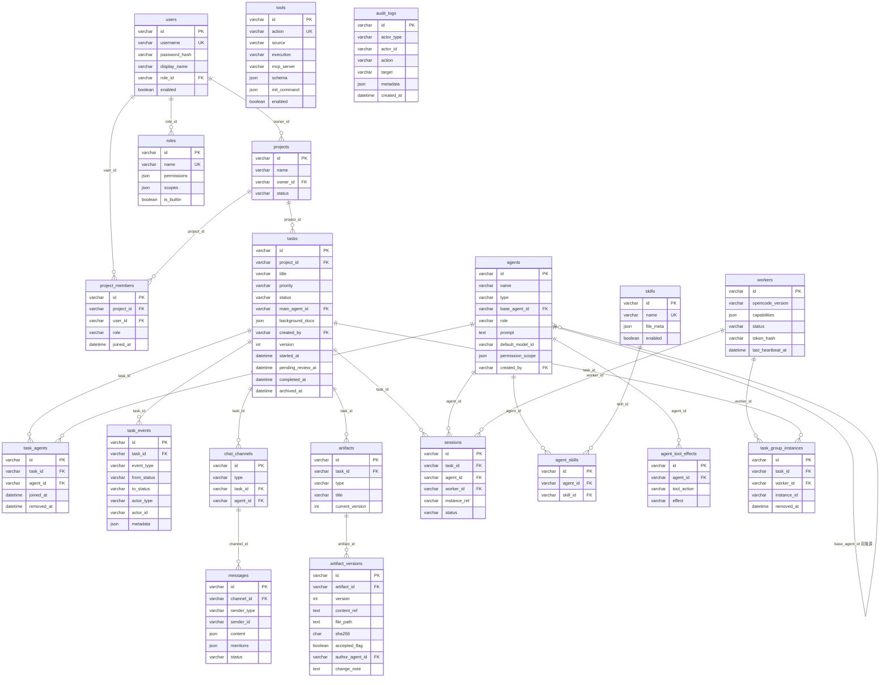

# 数据模型细化（ER 图）

本文档是完整平台数据模型的**字段级细化**：把 08 篇 §6.1 的表划分从「表名 + 要点」落库为「逐表字段定义（主键/外键/唯一约束/索引）」、表间关系与级联策略、关键索引设计与数据一致性要点，并产出完整 ER 图。它是 12/13/14 篇详设（产出物协议、任务状态机、Agent 配置与虚拟团队）中全部实体落库的唯一依据，也是 09 篇端点字段与数据库列名对齐的对照基准。功能依据沿用 03/04/05 篇（FR-01~27、FR-30~48）。

## 1. 定位与文档关系

**本文档是「从表清单到建表 DDL」的最后一公里。** 08 篇 §6.1 只给出表名与要点（如 `tasks`：status 五态、background_docs Json），12/13/14 篇详设在各自章节给出实体字段（如 13 篇 §2.1 的 `tasks` 五时间戳、12 篇 §2.2 的 `artifact_versions.accepted_flag`），09 篇端点请求/响应与表一一对应——本文档把这些分散的字段依据**收敛到每张表的完整字段定义**，作为 Prisma schema 与迁移脚本的直接来源。

| 相关文档 | 关系 |
|---------|------|
| 08 篇 §6.1/§6.2/§6.3/§7.4 | **表清单与要点**（20 张表）、双库兼容策略（字符串枚举 + Json 列）、数据一致性（状态机唯一事实源、验收联动、worker 事件幂等）、三段式落库广播——本文档全部继承并逐表展开 |
| 13 篇 §2.1/§5.1/§8.2 | **tasks/task_agents/task_events 落库**：五态枚举 + 五时间戳、事件表字段（from/to/actor/metadata）、乐观锁与幂等 |
| 12 篇 §2.2/§4.3/§7 | **artifacts/artifact_versions 落库**：三类产出物、sha256/accepted_flag/current_version、`(artifact_id, version)` 唯一约束、验收基线 |
| 14 篇 §2.1/§5/§6.2 | **agents/agent_skills/agent_tool_effects/sessions 落库**：12 字段 + base_agent_id 克隆、虚拟团队 task_agents、会话五阶段（created/active/frozen/archived） |
| 10 篇 §2.4/§3.1/§6 | **chat_channels/messages 落库**：频道类型、消息字段（content Json/mentions Json）、主键兼 SSE 游标 |
| 09 篇 §3.1~§3.10 | **端点字段对齐**：本文档每张表的字段与 09 篇对应端点请求/响应列一致（如 POST /tasks 的 `{title, description?, priority?, agentIds[], mainAgentId?, backgroundDocs[]?}` 落为 tasks/task_agents 两表） |

**表数量口径说明。** 08 篇 §6.1 表格清单共 **20 张**（含预留表 `audit_logs`）；08/09 篇正文以「21 表」指称（09 篇 §1「users/tasks/messages/artifacts/workers 等 21 表」），计数差异源于 `audit_logs` 预留表是否计入——本文档以 §6.1 表格清单为准逐表落库，`audit_logs` 按「预留不建」处理（§3.10/§7）。

**阅读路径。** 只关心类型与命名约定 → §2；只关心某张表字段 → §3 对应小节；只关心表间关系与删除策略 → §4；只关心查询性能 → §5；只关心一致性与并发 → §6；只关心全表总览与遗留问题 → §7。

## 2. 字段类型约定

### 2.1 类型映射表（MySQL 为主，SQLite 兼容）

Prisma 双 provider（08 篇 §2.1）下，同一份 schema 同时生成 MySQL 与 SQLite 迁移。类型映射约定如下：

| MySQL 类型 | SQLite 类型 | 说明 | 本平台使用场景 |
|-----------|------------|------|---------------|
| `BIGINT UNSIGNED` | `INTEGER` | SQLite 无无符号概念，INTEGER 为 64 位有符号 | 内部序号/辅助列（主键策略见 §2.2） |
| `VARCHAR(64)` | `TEXT` | 业务主键/短标识（主键策略见 §2.2） | `id`、`worker_id`、`instance_id` |
| `VARCHAR(128/255)` | `TEXT` | 名称/标题/哈希 | `name`、`title`、`action`、`sha256`（CHAR 语义见下） |
| `TEXT` | `TEXT` | 长文本 | `description`、`prompt`、`content_ref`、`file_path`、`change_note` |
| `JSON` | `TEXT` | **Json 列统一用 Prisma `Json` 类型**，SQLite 以 TEXT 存储，行为一致（08 篇 §6.2） | `permissions`、`content`、`mentions`、`background_docs`、`capabilities`、`schema`、`init_command`、`permission_scope`、`metadata`、`load` |
| `DATETIME(3)` | `TEXT`（ISO8601）/`DATETIME` | 时间戳统一 UTC 存储；SQLite 用 ISO8601 文本（`2026-08-06T10:00:00.000Z`）保证排序语义一致 | `created_at`、`started_at`、`last_heartbeat_at` 等全部时间列 |
| `ENUM(...)` | `TEXT` + `CHECK` | **不声明 Prisma enum**：状态/类型/优先级一律 `String` 列 + 应用层常量（08 篇 §6.2），SQLite 侧加 CHECK 约束兜底 | `status`、`type`、`priority`、`sender_type`、`effect`、`source`、`execution`、`role` |
| `CHAR(64)` | `TEXT` | sha256 固定长度（hex 64 字符） | `artifact_versions.sha256` |
| `BOOLEAN` / `TINYINT(1)` | `INTEGER`（0/1） | SQLite 无原生布尔，Prisma `Boolean` 自动映射 0/1 | `enabled`、`accepted_flag`、`is_builtin` |
| `INT` | `INTEGER` | 序号/版本号 | `version`、`current_version`、`capabilities.maxInstances` |
| `DECIMAL(10,2)` | `REAL`/`NUMERIC` | 本版无金额/度量列，保留映射备查 | 预留 |

> **枚举统一字符串化的原因（08 篇 §6.2）**：SQLite 无原生 enum；字符串枚举 + 应用层常量（`TASK_STATUS`、`ARTIFACT_TYPE` 等）让同一份 schema 在双库行为一致，且状态/类型新增取值不产生迁移。

### 2.2 主键策略

| 项 | 约定 | 依据 |
|----|------|------|
| 业务主键 | **`id VARCHAR(64)`，值形如 `<域前缀>_<自增序号>`**：`u_5`、`p_3`、`t_1`、`e_1024`、`s_1`、`a_7`、`w_2` | 09/10/12/13/14 篇全部详设中 id 均为 string（10 篇 §2.4、13 篇 §2.1/§5.1、14 篇 §2.1），worker/前端透传无需数字解析 |
| 序号来源 | 应用层序号服务（本版单机进程内序列；生产 MySQL 可依赖 `AUTO_INCREMENT` 辅助列生成），**保证全局单调递增** | 09 篇 §4.1「事件 id 递增」——SSE 事件 id、消息历史游标（10 篇 §6）与主键同源，序号单调性直接决定游标可排序可续拉 |
| 自增序号 ↔ 内部主键 | 类型映射表保留 `BIGINT UNSIGNED ↔ INTEGER` 条目：若未来迁移集群/分库，可加内部代理主键，业务 id 降为唯一索引列——本版不引入，避免双主键复杂度 | 09 篇 §9 游标热点预留方向 |
| 主键唯一性 | 每表 `PRIMARY KEY (id)`；序号服务 + 数据库唯一约束双保险 | 08 §6.3 |

### 2.3 通用约定

| 约定 | 内容 |
|------|------|
| 审计时间列 | 每张业务表含 `created_at`、`updated_at`（`DATETIME(3)`，UTC）；事件/日志表仅 `created_at` |
| 软删除 | **本版无软删除列**：删除语义以「状态/标记」替代——`users.enabled`（禁用不删，FR-22）、`task_agents.removed_at`（团队移除标记，FR-02）、`task_group_instances.removed_at`（实例解除标记）、`roles` 预置只读/自定义可删（真删，09 §3.10）；任务/消息/产出物/会话无删除端点（FR-43） |
| 索引命名 | `uk_<表>_<列>[_<列>]`（唯一）、`idx_<表>_<列>[_<列>]`（普通/联合）、主键 `pk_<表>`（Prisma 默认 `PRIMARY`） |
| 外键命名 | `fk_<子表>_<父表>`（如 `fk_messages_channel`） |
| 外键策略 | 关系表全部声明 `REFERENCES` 外键；**级联一律 `ON DELETE RESTRICT` / `ON UPDATE RESTRICT`**——本版删除面极小（§4.3），删除路径均由服务层显式处理 |
| 乐观锁 | `tasks.version`、`artifact_versions` 版本约束承载并发控制（13 篇 §8.2、12 篇 §4.3），详见 §6 |

### 2.4 分域标注

| 分域 | 业务主表（独立生命周期） | 关系表（纯外键，无独立业务） | 事件/日志表 | 预留表 |
|------|------------------------|------------------------------|------------|--------|
| 认证/用户 | `users`、`roles` | — | — | — |
| 项目 | `projects` | `project_members` | — | — |
| Agent | `agents` | `agent_skills`、`agent_tool_effects` | — | — |
| 技能工具 | `skills`、`tools` | — | — | — |
| 任务 | `tasks` | `task_agents` | `task_events` | — |
| 会话 | `sessions` | — | — | — |
| 群聊 | `chat_channels`、`messages` | — | — | — |
| 产出物 | `artifacts` | — | `artifact_versions`（版本体，append 不可变） | — |
| Worker | `workers` | `task_group_instances` | — | — |
| 预留 | — | — | — | `audit_logs`（本版不建） |

## 3. 逐表字段定义（20 表全量）

> 每表给出完整字段表；「约束」列标注 PK/FK/UNIQUE/NOT NULL/DEFAULT；「来源」列引用 FR 编号或详设篇章节，字段名与 09 篇端点请求/响应一一对应。

### 3.1 认证与用户域

**`users`（业务主表）**

| 字段 | 类型 | 约束 | 说明 | 来源 |
|------|------|------|------|------|
| `id` | VARCHAR(64) | PK | 用户主键（`u_5`） | 09 §3.1/§3.2 |
| `username` | VARCHAR(64) | UNIQUE NOT NULL | 登录名 | FR-22 |
| `password_hash` | VARCHAR(255) | NOT NULL | bcrypt 哈希；**API 响应不含此列**（09 §3.2） | FR-22 |
| `display_name` | VARCHAR(128) | NOT NULL | 展示名 | FR-22 |
| `email` | VARCHAR(255) | UNIQUE | 可选邮箱（register 请求 `email?`） | 09 §3.1 |
| `role_id` | VARCHAR(64) | FK → roles.id NOT NULL | 平台角色（admin/member/自定义）；`POST /users` 请求 `roleId` | FR-22/23 |
| `enabled` | BOOLEAN | NOT NULL DEFAULT true | 启用状态；禁用后登录 401，**不删账号数据** | FR-22 |
| `created_at` / `updated_at` | DATETIME(3) | NOT NULL | 审计时间 | — |

**`roles`（业务主表）**

| 字段 | 类型 | 约束 | 说明 | 来源 |
|------|------|------|------|------|
| `id` | VARCHAR(64) | PK | 角色主键 | FR-23 |
| `name` | VARCHAR(64) | UNIQUE NOT NULL | 预置 `admin`/`member` + 自定义角色名 | FR-23 |
| `permissions` | JSON | NOT NULL | **角色权限矩阵**：`{ "<资源>": { "<操作>": "allow"\|"partial"\|"deny" } }`，资源行=任务/群聊/产出物/Agent 配置/Worker 节点/技能工具/用户管理/权限配置 | FR-23，09 §3.10 |
| `scopes` | JSON | NOT NULL | 权限范围选项（全局/指定项目/项目内分工，FR-24） | FR-24，09 §3.10 |
| `is_builtin` | BOOLEAN | NOT NULL DEFAULT false | 预置角色只读：删除返回 409 `ROLE_BUILTIN_IMMUTABLE` | 09 §3.10 |
| `created_at` / `updated_at` | DATETIME(3) | NOT NULL | 审计时间 | — |

### 3.2 项目域

**`projects`（业务主表）**

| 字段 | 类型 | 约束 | 说明 | 来源 |
|------|------|------|------|------|
| `id` | VARCHAR(64) | PK | 项目主键（`p_3`） | FR-25 |
| `name` | VARCHAR(128) | NOT NULL | 项目名（创建必填） | FR-25 |
| `description` | TEXT | — | 项目描述（创建可选） | FR-25 |
| `owner_id` | VARCHAR(64) | FK → users.id NOT NULL | 创建者即 owner（`POST /projects` 创建者为主人） | FR-25 |
| `status` | VARCHAR(16) | NOT NULL DEFAULT 'active' | `active`/`archived`（字符串枚举，应用层常量） | FR-25 |
| `created_at` / `updated_at` | DATETIME(3) | NOT NULL | 审计时间 | — |

**`project_members`（关系表）**

| 字段 | 类型 | 约束 | 说明 | 来源 |
|------|------|------|------|------|
| `id` | VARCHAR(64) | PK | 关联主键 | 08 §6.1 |
| `project_id` | VARCHAR(64) | FK → projects.id NOT NULL | 所属项目；跨项目数据隔离依据（05 篇 1.2） | FR-24/25 |
| `user_id` | VARCHAR(64) | FK → users.id NOT NULL | 成员用户 | FR-24 |
| `role` | VARCHAR(16) | NOT NULL | 项目内角色：`owner`/`member`（区别于 users.role_id 平台角色） | FR-25 |
| `joined_at` | DATETIME(3) | NOT NULL | 加入时间 | FR-25 |
| — | — | UNIQUE `uk_project_members_pid_uid (project_id, user_id)` | 同一用户在项目内唯一 | 08 §6.1 |

### 3.3 任务域

**`tasks`（业务主表，状态机核心）**

| 字段 | 类型 | 约束 | 说明 | 来源 |
|------|------|------|------|------|
| `id` | VARCHAR(64) | PK | 任务主键（`t_1`） | FR-01 |
| `project_id` | VARCHAR(64) | FK → projects.id NOT NULL | 所属项目；跨项目隔离依据 | FR-25 |
| `title` | VARCHAR(255) | NOT NULL | 任务标题（创建必填） | FR-01 |
| `description` | TEXT | — | 任务描述（创建可选） | FR-01 |
| `priority` | VARCHAR(8) | NOT NULL DEFAULT 'medium' | `high`/`medium`/`low`（字符串枚举） | FR-01 |
| `status` | VARCHAR(16) | NOT NULL DEFAULT 'pending' | **五态字符串枚举**：`pending`/`in_progress`/`pending_review`/`completed`/`archived`；应用层常量 + String 列（08 §6.2） | FR-03，13 §2.1 |
| `main_agent_id` | VARCHAR(64) | FK → agents.id | **主 Agent**（任务负责人，FR-08）；多 Agent 启动前必填；校验须在团队内 | FR-07/08 |
| `background_docs` | JSON | — | 背景文档元数据数组（创建时上传，FR-06） | FR-06 |
| `created_by` | VARCHAR(64) | FK → users.id NOT NULL | 创建者 | FR-01 |
| `version` | INT | NOT NULL DEFAULT 0 | **乐观锁版本号**（CAS 更新 `WHERE status = 前置状态 AND version = ?`；13 篇 §8.2） | 13 §8.2 |
| `created_at` | DATETIME(3) | NOT NULL | 创建时间（任务创建即生成群聊与文档库的时点） | FR-01 |
| `started_at` | DATETIME(3) | — | 启动时间（start 迁移时写入） | FR-07 |
| `pending_review_at` | DATETIME(3) | — | 进入待验收时间（mark-pending-review 时写入） | FR-04 |
| `completed_at` | DATETIME(3) | — | 验收完成时间（accept 时写入） | FR-04 |
| `archived_at` | DATETIME(3) | — | 归档时间（archive 时写入，终态） | FR-05 |

**`task_agents`（关系表，虚拟团队）**

| 字段 | 类型 | 约束 | 说明 | 来源 |
|------|------|------|------|------|
| `id` | VARCHAR(64) | PK | 关联主键 | 08 §6.1 |
| `task_id` | VARCHAR(64) | FK → tasks.id NOT NULL | 所属任务 | FR-02 |
| `agent_id` | VARCHAR(64) | FK → agents.id NOT NULL | 团队成员 Agent | FR-02 |
| `joined_at` | DATETIME(3) | NOT NULL | 入队时间（团队 add 写入） | FR-02，14 §5.3 |
| `removed_at` | DATETIME(3) | — | **移除标记而非删除**：置位后该 Agent 不再接收 @（返回 `agent_removed`），会话冻结、产出保留 | FR-02，14 §5.3/§5.4 |
| — | — | UNIQUE `uk_task_agents_task_agent (task_id, agent_id)` | 同一 Agent 在任务内唯一（重新加入按 add 新流程，原会话不合并，14 篇 §9 开放问题③） | 08 §6.1 |

**`task_events`（事件表，状态机落库）**

| 字段 | 类型 | 约束 | 说明 | 来源 |
|------|------|------|------|------|
| `id` | VARCHAR(64) | PK | 事件主键（`e_1024`）；**兼 SSE 事件 id**（09 §4.1） | 13 §5.1 |
| `task_id` | VARCHAR(64) | FK → tasks.id NOT NULL | 所属任务 | 13 §5.1 |
| `event_type` | VARCHAR(32) | NOT NULL | `status_change`/`accept`/`reject`/`archive` | 08 §6.1，13 §5.1 |
| `from_status` | VARCHAR(16) | — | 迁移前状态（from） | 13 §5.1 |
| `to_status` | VARCHAR(16) | — | 迁移后状态（to） | 13 §5.1 |
| `actor_type` | VARCHAR(8) | NOT NULL | `user`（成员执行）/`system`（验收后自动回退等平台动作） | 13 §5.1 |
| `actor_id` | VARCHAR(64) | — | 执行人 user_id；system 动作为空 | 13 §5.1 |
| `metadata` | JSON | — | 驳回原因（`reject.reason`）、验收基线版本清单（accept 记录的各产出物 accepted 版本号）等 | 13 §5.1 |
| `created_at` | DATETIME(3) | NOT NULL | 迁移时间（ISO8601） | 13 §5.1 |

> **幂等设计说明**：任务迁移防重由 `tasks` 乐观锁 CAS 承担（更新影响行数 0 → 幂等返回 200 或 409，13 篇 §7.2/§8.2）；`task_events` 不设 `(task_id, from_status, to_status)` 唯一索引——**reject 会合法循环触发同型迁移**（待验收→进行中可多次发生，13 篇 §6.2），唯一索引将误伤合法事件；事件主键唯一 + 同事务写入保证单次迁移不重复落库（§6.1）。

### 3.4 会话域

**`sessions`（业务主表）**

| 字段 | 类型 | 约束 | 说明 | 来源 |
|------|------|------|------|------|
| `id` | VARCHAR(64) | PK | 会话主键（`s_1`） | FR-37 |
| `task_id` | VARCHAR(64) | FK → tasks.id NOT NULL | 所属任务 | FR-37 |
| `agent_id` | VARCHAR(64) | FK → agents.id NOT NULL | 所属 Agent | FR-37 |
| `worker_id` | VARCHAR(64) | FK → workers.id | 承载实例的 Worker（会话接入实例后写入） | 08 §6.1 |
| `instance_ref` | VARCHAR(128) | — | worker 侧实例句柄/引用（TaskGroupRegistry 标识） | 08 §6.1 |
| `status` | VARCHAR(16) | NOT NULL DEFAULT 'created' | **四态字符串枚举**：`created`（入队）/`active`（激活协作）/`frozen`（团队移除冻结）/`archived`（任务归档只读） | 14 §6.2，08 §6.1 |
| `created_at` / `updated_at` | DATETIME(3) | NOT NULL | 创建/最近变更时间 | 14 §6.2 |
| — | — | UNIQUE `uk_sessions_task_agent (task_id, agent_id)` | **每 Agent 每任务独立会话**（FR-37）；群聊/私聊共用此会话（FR-14） | FR-14/37 |

### 3.5 群聊域

**`chat_channels`（业务主表）**

| 字段 | 类型 | 约束 | 说明 | 来源 |
|------|------|------|------|------|
| `id` | VARCHAR(64) | PK | 频道主键 | FR-09 |
| `type` | VARCHAR(16) | NOT NULL | `task_group`（任务群聊，创建任务时自动生成）/`private`（私聊，POST /dm-channels） | FR-09/14，10 §3.1 |
| `task_id` | VARCHAR(64) | FK → tasks.id NOT NULL | 关联任务（两种类型均有关联任务） | 08 §6.1 |
| `agent_id` | VARCHAR(64) | FK → agents.id | `private` 私聊的目标 Agent；`task_group` 为 NULL | 10 §3.1 |
| `created_at` | DATETIME(3) | NOT NULL | 创建时间 | — |
| — | — | UNIQUE `uk_channels_task_agent (task_id, agent_id)` | 任务群聊每任务一个（agent_id NULL，NULL 不参与唯一判定）；私聊每 task×agent 一个 | 10 §3.1 |

**`messages`（业务主表，高写入）**

| 字段 | 类型 | 约束 | 说明 | 来源 |
|------|------|------|------|------|
| `id` | VARCHAR(64) | PK | **消息主键，兼 SSE 事件 id 与历史游标**（升序即消息顺序，主键序号单调递增） | 10 §2.4/§6，09 §2.2 |
| `channel_id` | VARCHAR(64) | FK → chat_channels.id NOT NULL | 所属频道（task_group/private） | 10 §2.4 |
| `sender_type` | VARCHAR(8) | NOT NULL | 消息三态：`user`/`agent`/`system`（系统消息由 task_events/产出物/团队调整触发生成，FR-10） | 10 §2.1 |
| `sender_id` | VARCHAR(64) | — | user→users.id；agent→agents.id；system→空 | 10 §2.4 |
| `content` | JSON | NOT NULL | `{ text: string; parts: Part[] }` 正文 + 内容片段数组 | FR-10，10 §2.4 |
| `mentions` | JSON | — | 解析后的 `Mention[]`（agent 型含 agentId；all 型为空，`all` 语义原样存储，FR-12） | 10 §4.1 |
| `status` | VARCHAR(16) | NOT NULL DEFAULT 'sent' | 消息生命周期：用户消息 `sending`→`sent`；Agent 回复 `pending`→`processing`→`completed`/`failed` | 10 §7.1 |
| `created_at` | DATETIME(3) | NOT NULL | 发送时间（持久化与 SSE 游标依据，FR-19） | FR-19 |

### 3.6 产出物域

**`artifacts`（业务主表，产出物头）**

| 字段 | 类型 | 约束 | 说明 | 来源 |
|------|------|------|------|------|
| `id` | VARCHAR(64) | PK | 产出物主键（文档库列表项标识） | FR-44 |
| `task_id` | VARCHAR(64) | FK → tasks.id NOT NULL | 所属任务；**产出物是任务全局文档（FR-42），不依赖会话** | FR-42 |
| `type` | VARCHAR(8) | NOT NULL | 三类产出物：`text`/`doc`/`file`（字符串枚举） | FR-39 |
| `title` | VARCHAR(255) | NOT NULL | 产出物标题（FR-38 元信息，append 合并匹配依据） | FR-38 |
| `current_version` | INT | NOT NULL DEFAULT 0 | 当前最新版本号（列表展示 vN、append 目标；v1 起） | FR-43，12 §2.2 |
| `created_at` / `updated_at` | DATETIME(3) | NOT NULL | 创建/最近版本时间 | 12 §2.2 |

**`artifact_versions`（版本体，append 不可变）**

| 字段 | 类型 | 约束 | 说明 | 来源 |
|------|------|------|------|------|
| `id` | VARCHAR(64) | PK | 版本主键 | FR-43 |
| `artifact_id` | VARCHAR(64) | FK → artifacts.id NOT NULL | 所属产出物 | FR-43 |
| `version` | INT | NOT NULL | 版本号，按产出物内递增（v1/v2/v3…） | FR-43 |
| `content_ref` | TEXT | NOT NULL | 内容引用：text 存正文；doc 存正文存储引用；file 存对象存储引用 | FR-40/41，12 §2.2 |
| `file_path` | TEXT | — | 原始文件路径（worker 工作区路径，供追溯） | FR-41 |
| `sha256` | CHAR(64) | — | 内容哈希：拉取完整性校验 + 事件幂等去重依据 | FR-41，12 §2.2 |
| `accepted_flag` | BOOLEAN | NOT NULL DEFAULT false | **验收基线**：accept 时标记当前最新版本；已验收版本不可覆盖（409 `ARTIFACT_ACCEPTED_IMMUTABLE`） | FR-04/43，12 §7 |
| `author_agent_id` | VARCHAR(64) | FK → agents.id | 产出 Agent（FR-38 元信息） | FR-38 |
| `change_note` | TEXT | — | 变更说明（append 时可附，版本列表展示） | FR-43，12 §4.1 |
| `created_at` | DATETIME(3) | NOT NULL | 版本提交时间（FR-43 追溯） | FR-43 |
| — | — | UNIQUE `uk_artifact_versions_art_ver (artifact_id, version)` | 版本号唯一 + 并发 append 乐观锁依据（12 篇 §4.3） | 12 §4.3 |

### 3.7 Agent 域

**`agents`（业务主表，12 字段 + 克隆）**

| 字段 | 类型 | 约束 | 说明 | 来源 |
|------|------|------|------|------|
| `id` | VARCHAR(64) | PK | Agent 主键；被任务以 `agentIds[]`/`mainAgentId` 引用 | FR-02/08 |
| `name` | VARCHAR(128) | NOT NULL | 展示名（如「产品经理」「后端开发-张三」） | FR-32 |
| `type` | VARCHAR(16) | NOT NULL | 三种来源：`template`（预置模板只读）/`clone`（克隆副本）/`custom`（完全自定义） | FR-30/31/32 |
| `base_agent_id` | VARCHAR(64) | FK → agents.id | **克隆源**：clone 类型记录被克隆的 Agent id；template/custom 为 NULL；仅血缘追溯不联动（14 §2.2） | FR-31 |
| `role` | VARCHAR(64) | — | 角色名（自定义 Agent 角色定位；模板即模板名） | FR-30/32 |
| `prompt` | TEXT | NOT NULL | 提示词：行为方式与角色边界 | FR-33 |
| `default_model_id` | VARCHAR(64) | — | 默认模型（FR-47）；未选择时沿用模板默认 | FR-47 |
| `permission_scope` | JSON | — | 权限范围：`{ projects, write, doclibOnly }` 最小粒度（项目/读写/文档库） | FR-36 |
| `created_by` | VARCHAR(64) | FK → users.id NOT NULL | 创建者用户 id | FR-31/32 |
| `created_at` / `updated_at` | DATETIME(3) | NOT NULL | 审计时间 | 14 §2.1 |
| — | — | CHECK `type IN ('template','clone','custom')` | 类型枚举应用层校验 | 14 §2.2 |

**`agent_skills`（关系表）**

| 字段 | 类型 | 约束 | 说明 | 来源 |
|------|------|------|------|------|
| `id` | VARCHAR(64) | PK | 关联主键 | 08 §6.1 |
| `agent_id` | VARCHAR(64) | FK → agents.id NOT NULL | Agent | FR-34 |
| `skill_id` | VARCHAR(64) | FK → skills.id NOT NULL | 已授权技能（从已启用技能库勾选） | FR-34 |
| `created_at` | DATETIME(3) | NOT NULL | 绑定时间 | — |
| — | — | UNIQUE `uk_agent_skills_agent_skill (agent_id, skill_id)` | 同一技能对 Agent 唯一 | 08 §6.1 |

**`agent_tool_effects`（关系表，逐工具权限点）**

| 字段 | 类型 | 约束 | 说明 | 来源 |
|------|------|------|------|------|
| `id` | VARCHAR(64) | PK | 关联主键 | 08 §6.1 |
| `agent_id` | VARCHAR(64) | FK → agents.id NOT NULL | Agent | FR-35/48 |
| `tool_action` | VARCHAR(128) | NOT NULL | **工具名即权限点**（action）：内置 `bash`、自定义 `math_add`、MCP `<server>_<tool>`；支持通配符 `jenkins-*` 批量配置 | FR-48，14 §3.3 |
| `effect` | VARCHAR(8) | NOT NULL | `allow`（放行）/`ask`（执行前成员确认）/`deny`（隐藏） | FR-35/48 |
| `updated_at` | DATETIME(3) | NOT NULL | 最近调整时间 | — |
| — | — | UNIQUE `uk_agent_tool_effects (agent_id, tool_action)` | 同一工具对 Agent 唯一（PATCH 即更新 effect） | 14 §3.3 |

### 3.8 技能工具域

**`skills`（业务主表）**

| 字段 | 类型 | 约束 | 说明 | 来源 |
|------|------|------|------|------|
| `id` | VARCHAR(64) | PK | 技能主键 | FR-27 |
| `name` | VARCHAR(128) | UNIQUE NOT NULL | 技能名（SKILL.md 标识） | FR-27 |
| `description` | TEXT | — | 技能描述 | FR-27 |
| `file_meta` | JSON | — | SKILL.md 文件元数据（路径/大小/版本） | FR-27，08 §6.1 |
| `enabled` | BOOLEAN | NOT NULL DEFAULT false | 启用状态：上传默认停用；停用后已勾选 Agent 不再注入 | FR-27 |
| `created_at` / `updated_at` | DATETIME(3) | NOT NULL | 审计时间 | — |

**`tools`（业务主表）**

| 字段 | 类型 | 约束 | 说明 | 来源 |
|------|------|------|------|------|
| `id` | VARCHAR(64) | PK | 工具主键 | FR-27 |
| `name` | VARCHAR(128) | NOT NULL | 工具展示名 | FR-27 |
| `action` | VARCHAR(128) | UNIQUE NOT NULL | **工具名即权限 action**（注册后自动进入权限命名空间） | FR-48 |
| `source` | VARCHAR(16) | NOT NULL | 来源徽章：`builtin`/`custom`/`mcp` | FR-48，14 §3.3 |
| `execution` | VARCHAR(16) | NOT NULL | 执行方式：`code`（内嵌脚本）/`cli`（命令行）/`http`（远程接口）/`mcp`（外部工具） | FR-27，09 §3.8 |
| `mcp_server` | VARCHAR(128) | — | source=mcp 时的服务器名（`<server>_<tool>` 前缀来源） | FR-27，11 §5.3 |
| `schema` | JSON | — | 工具入参 schema（校验与生成） | FR-27 |
| `init_command` | JSON | — | 初始化命令（CLI 首次加载执行；可为命令+参数结构） | FR-27 |
| `enabled` | BOOLEAN | NOT NULL DEFAULT true | **停用替代删除**（删除会造成历史 Agent 配置悬空） | FR-35 |
| `created_at` / `updated_at` | DATETIME(3) | NOT NULL | 审计时间 | — |

### 3.9 Worker 域

**`workers`（业务主表）**

| 字段 | 类型 | 约束 | 说明 | 来源 |
|------|------|------|------|------|
| `id` | VARCHAR(64) | PK | workerId（部署时配置，全局唯一） | 09 §5.3，07 11.2 |
| `name` | VARCHAR(128) | — | 节点展示名 | 08 §6.1 |
| `opencode_version` | VARCHAR(32) | NOT NULL | 能力声明：支持的引擎版本 | 09 §5.3 |
| `capabilities` | JSON | NOT NULL | `{ maxInstances, skills[], tools[] }` 调度匹配依据 | 09 §5.3，08 §3.2 |
| `load` | JSON | — | 心跳上报 `{ instances }` 负载（瞬态，随心跳刷新） | 09 §5.3 |
| `status` | VARCHAR(16) | NOT NULL DEFAULT 'offline' | `online`/`offline`（心跳超时置离线） | FR-26 |
| `token_hash` | VARCHAR(255) | — | `X-Worker-Token` 哈希（与用户 JWT 完全隔离，不落明文） | 09 §5.3 |
| `last_heartbeat_at` | DATETIME(3) | — | 最近心跳（默认 10s 心跳、30s 判定离线） | FR-26，08 §3.2 |
| `registered_at` | DATETIME(3) | NOT NULL | 注册即入池时间 | FR-26 |

**`task_group_instances`（关系表，亲和映射）**

| 字段 | 类型 | 约束 | 说明 | 来源 |
|------|------|------|------|------|
| `id` | VARCHAR(64) | PK | 映射主键 | 08 §6.1 |
| `task_id` | VARCHAR(64) | FK → tasks.id NOT NULL | 任务组 | 07 11.6 |
| `worker_id` | VARCHAR(64) | FK → workers.id NOT NULL | 承载节点 | 07 11.6 |
| `instance_id` | VARCHAR(128) | NOT NULL | worker 侧实例标识（TaskGroupRegistry 句柄） | 08 §6.1 |
| `created_at` | DATETIME(3) | NOT NULL | 实例创建（start 下发 `POST /instances`） | 13 §8.3 |
| `removed_at` | DATETIME(3) | — | **解除标记而非删除**：归档回收（`DELETE /instances/{gid}`）或重调度迁移时置位，历史亲和可追溯 | 13 §8.3 |

### 3.10 预留表：`audit_logs`（本版不建）

| 字段 | 类型 | 约束 | 说明 | 来源 |
|------|------|------|------|------|
| `id` | VARCHAR(64) | PK | 审计主键 | 08 §6.1 |
| `actor_type` | VARCHAR(16) | NOT NULL | `user`/`worker`/`system` | 08 §6.1 |
| `actor_id` | VARCHAR(64) | NOT NULL | 操作者 id | 08 §6.1 |
| `action` | VARCHAR(64) | NOT NULL | 操作动作（如 `task.accept`、`user.disable`） | 08 §6.1 |
| `target` | VARCHAR(128) | NOT NULL | 操作对象（资源类型 + id） | 08 §6.1 |
| `metadata` | JSON | — | 扩展信息（请求摘要、结果等） | 08 §6.1 |
| `created_at` | DATETIME(3) | NOT NULL | 操作时间 | 08 §6.1 |

> **建表计划**：`audit_logs` 属下一版能力（08 篇 §8 审计行、09 篇 §8「表结构预留，本版不建」）。启用时机与条件见 §7 开放问题①：本版核心操作事件已落 `task_events` + pino 结构化日志，满足审计留痕最低要求；当出现合规审计/全量操作追溯诉求时建表，字段按上表执行（不迟于下一版排期）。

## 4. 关系与约束

### 4.1 ER 关系图（mermaid，完整 20 表）

> 关系形态：`users`↔`projects` 经 `project_members` 为 **N:M**；`tasks`↔`agents` 经 `task_agents` 为 **N:M**（虚拟团队）；`agents`↔`skills` 经 `agent_skills` 为 **N:M**；`tasks`↔`workers` 经 `task_group_instances` 为 **N:M**（亲和映射）；其余为 1:N。`agents` 自关联 `base_agent_id`（克隆血缘，N:1）。

### 4.2 关键关系说明

| 关系 | 语义 | 关键约束/行为 | 依据 |
|------|------|--------------|------|
| projects → tasks | 1:N | 任务归属项目；看板按 project_id 聚合 | FR-01/25 |
| tasks → task_agents → agents | 1:N:N（N:M） | 虚拟团队；移除走 `removed_at` 标记，不删行 | FR-02，14 §5.3 |
| tasks → chat_channels → messages | 1:1:N | 任务群聊每任务一个；消息按 channel 聚合、id 游标分页 | FR-09/19，10 §3.3 |
| tasks → artifacts → artifact_versions | 1:N:1:N | 任务全局文档；版本 append 递增不可变 | FR-42/43，12 §2.2 |
| tasks × agents → sessions | N:M → N:M 唯一化 | `(task_id, agent_id)` 唯一：每 Agent 每任务独立会话，群聊/私聊共用 | FR-37，14 §6.1 |
| agents → agent_skills → skills | 1:N:N（N:M） | 技能授权集合；技能停用联动注入 | FR-34 |
| agents → agent_tool_effects | 1:N | 逐工具权限 effect（工具名即权限点） | FR-35/48 |
| tasks → task_events | 1:N | 状态机审计与回查（状态时间线） | 13 §5.1 |
| workers → task_group_instances → tasks | 1:N:N（N:M） | 任务组→实例映射；亲和与重调度依据 | 07 11.6，13 §8.3 |
| agents → agents（base_agent_id） | N:1 自关联 | 克隆血缘；模板只读不联动 | FR-31 |

### 4.3 唯一性约束汇总

| 表 | 唯一约束 | 语义 | 依据 |
|----|---------|------|------|
| `users` | `username`、`email` | 账号唯一 | FR-22 |
| `project_members` | `(project_id, user_id)` | 用户在一项目内唯一 | FR-24/25 |
| `task_agents` | `(task_id, agent_id)` | Agent 在任务团队内唯一 | 08 §6.1 |
| `sessions` | `(task_id, agent_id)` | 每 Agent 每任务独立会话 | FR-37 |
| `artifact_versions` | `(artifact_id, version)` | 版本号唯一 + 并发 append 乐观锁 | 12 §4.3 |
| `chat_channels` | `(task_id, agent_id)` | task_group 每任务一频道；private 每 task×agent 一频道（NULL 不参与唯一判定） | 10 §3.1 |
| `agent_skills` | `(agent_id, skill_id)` | 技能绑定唯一 | 08 §6.1 |
| `agent_tool_effects` | `(agent_id, tool_action)` | 工具权限点唯一 | 14 §3.3 |
| `tools` | `action` | 工具名即权限点，权限命名空间唯一 | FR-48 |
| `messages.id` | 主键唯一 | **SSE 游标与历史游标同源**（10 篇 §6）：主键序号单调递增保证游标可排序、可续拉 | 10 §6，09 §2.2/§4.1 |

### 4.4 级联策略

| 场景 | 处置 | 依据 |
|------|------|------|
| 任务归档（completed → archived） | **不删任何内容**：任务历史/群聊记录/产出物全版本完整保留；`sessions.status=archived`；`task_group_instances` 置 `removed_at`（实例回收） | FR-05，13 §4.5 |
| 团队移除 Agent | `task_agents.removed_at` 标记而非删除；会话 `frozen`；产出物保留 | FR-02，14 §5.3 |
| Worker 离线/重调度 | `task_group_instances` 置 `removed_at` + 新行映射；任务状态不受影响 | 13 §8.3 |
| 成员移出项目 | `project_members` 物理删除（本版可删对象之一）；不删用户数据 | 09 §3.3，FR-23 |
| 自定义角色删除 | 真删；预置角色 409 `ROLE_BUILTIN_IMMUTABLE` | 09 §3.10 |
| 用户禁用 | `enabled=false`（软禁用），保留全部关联数据 | FR-22 |
| 任务/消息/产出物/Agent/技能/工具 | **无 DELETE 端点**：任务终态归档、消息不可撤回、产出物不可删（append 新版本替代）、工具停用替代删除 | FR-43，09 §3.8 |
| 外键级联 | 全部 `ON DELETE RESTRICT`：删除路径由服务层显式编排，禁止数据库隐式级联 | §2.3 |

## 5. 关键索引设计

### 5.1 查询场景 → 索引

| 查询场景 | 索引 | 类型 | 说明 |
|---------|------|------|------|
| 任务看板（按项目 + 状态分组，FR-03） | `idx_tasks_project_status (project_id, status)` | 联合 | 看板五列按五态分组一次扫出；`status` 单列查询（归档统计）命中前缀 |
| 群聊消息分页（channel + 游标，FR-19） | `idx_messages_channel_id (channel_id, id)` | 联合 | `WHERE channel_id=? AND id<? ORDER BY id` 覆盖游标分页；主键 id 尾列天然有序 |
| 产出物列表（按任务 + 类型筛选，FR-44） | `idx_artifacts_task_type (task_id, type)` | 联合 | 文档库列表 `WHERE task_id=? AND type=?` |
| 会话查询（按 task × agent，FR-37） | `uk_sessions_task_agent (task_id, agent_id)` | 唯一联合 | 唯一约束即查询索引，`@ 触发`定位会话主路径 |
| 虚拟团队查询（任务成员，FR-02） | `idx_task_agents_task (task_id, joined_at)` | 联合 | 任务团队列表 + 入队排序 |
| 状态时间线（事件回查，13 篇 §2.3） | `idx_task_events_task_time (task_id, created_at)` | 联合 | 任务详情页状态历史 |
| Worker 心跳巡检（08 篇 §3.2） | `idx_workers_status_heartbeat (status, last_heartbeat_at)` | 联合 | `WHERE status='online' AND last_heartbeat_at < now()-30s` 一次性捞出超时节点 |
| 消息游标（SSE 补拉，10 篇 §6） | 主键 `PRIMARY (id)` | 主键 | 游标即主键，无需额外索引；序号单调递增保证可排序 |
| 任务分组聚合（任务全局文档，FR-42） | `idx_artifacts_task (task_id)` | 单列 | 文档库聚合兜底（与 5.1 联合索引前缀重合，视查询分布取舍） |
| 产出物版本校验（12 篇 §4.3） | `uk_artifact_versions_art_ver (artifact_id, version)` | 唯一联合 | append 乐观锁：`WHERE artifact_id=? AND version=?` 更新即 CAS |

### 5.2 联合/覆盖索引与游标同源

- **覆盖索引**：`idx_messages_channel_id (channel_id, id)` 覆盖分页查询的全部引用列（无回表）；任务看板 `(project_id, status)` 覆盖看板卡片所需字段（title/priority 若需回表，量级可承受，本版不扩大索引面）。
- **SSE 游标与消息主键同源**（10 篇 §6）：`messages.id` 既是主键、SSE 事件 id（09 §4.1）、又是历史游标与断线 `since` 补拉游标——索引与排序语义天然一致，前端游标续拉（`GET /channels/:id/messages?cursor=` 与 `GET /events?since=`）不需要第二套排序键。
- **字符串主键与序号**：`t_1`/`e_1024` 的字符串序与序号序一致（前缀等长 + 序号零宽拼接由序号服务保证，§2.2），避免 `t_10 < t_2` 的字典序陷阱；序号服务须输出定宽或由创建序号单调保证（本版单机序列无此问题）。
- **索引面控制**：本版查询面收敛在 §5.1 十个索引；消息表除主键与 `(channel_id, id)` 外不建冗余索引（高写入表控制索引数，09 篇 §9 游标热点预留方向）。

## 6. 数据一致性要点

### 6.1 状态机落库：`tasks.status` 与 `task_events` 同事务

状态迁移严格遵循「服务层校验 → 落库（同事务）→ 广播 SSE」三段式（08 篇 §7.4）：

1. **校验**：合法迁移表（13 篇 §3.2）在 TasksModule 收敛；非法 409 `TASK_INVALID_TRANSITION`。
2. **落库（同事务）**：`UPDATE tasks SET status=?, version=version+1 WHERE id=? AND status=<前置状态> AND version=?`（乐观锁 CAS，13 篇 §8.2）；影响行数 0 → 幂等（已处目标态返回 200）或 409；同时插入 `task_events`（event_type/from/to/actor/metadata）——**两条写操作在同一数据库事务内**，任一步失败整体回滚，数据库为唯一事实源（08 §6.3）。
3. **广播**：事务提交后经 RealtimeModule 广播 `task.status_changed`；广播失败不影响数据正确性，前端游标补拉（09 §4.4）。

### 6.2 事件幂等

| 幂等面 | 机制 | 依据 |
|--------|------|------|
| 状态迁移重复请求 | `tasks` 乐观锁 CAS（更新影响行数 0 → 幂等 200，不新增 task_events）；**task_events 不设 (task_id, from, to) 唯一索引**——reject 循环（待验收→进行中可多次）会合法触发同型迁移 | 13 §7.2/§8.2 |
| worker 事件重复投递（至少一次投递） | 控制面消费以 `(instance_id, event_id)` 去重（08 §6.3）；产出物以 file part id / `sha256` 去重，已归档 part 直接丢弃不重复 append | 08 §6.3，12 §4.3 |
| 消息落库重复 | 消息主键唯一 + 事件消费去重（§6.2 上行），重复 worker 事件不产生重复消息 | 10 §9 幂等行 |

### 6.3 产出物验收基线联动

- **accept 事务内完成基线锁定**：`tasks.status → completed` 与「标记当前最新版本 `accepted_flag=true`」在**同一事务**执行（12 篇 §7.1/§7.2）——验收结论对应的内容从此不可变。
- **验收后不可覆盖**：已验收版本 append 冲突返回 409 `ARTIFACT_ACCEPTED_IMMUTABLE`；只能追加 vK+1（`(artifact_id, version)` 唯一约束 + 乐观锁承载，12 篇 §4.3）。
- **验收后新增版本自动回退**：ArtifactsModule 在验收后 append 成功时触发「已完成 → 进行中」自动迁移（FR-04，13 篇 §4.4）——该迁移同样走 §6.1 同事务路径，actor_type=system。

### 6.4 双库兼容的 DDL 策略（08 篇 §6.2）

| 维度 | 策略 | 说明 |
|------|------|------|
| 枚举 | 一律 String 列 + 应用层常量 | 不声明 Prisma enum；SQLite 验证、MySQL 生产同构 |
| Json | Prisma `Json` 类型 | SQLite 以 TEXT 存储，读写行为一致 |
| 迁移 | `prisma migrate` 按 provider 切换 | 验证环境 SQLite 迁移、生产 MySQL 迁移，schema 单一来源 |
| 时间 | 统一 UTC + `DATETIME(3)` | SQLite ISO8601 文本排序与 MySQL 一致 |
| 布尔 | Prisma `Boolean` | SQLite 映射 INTEGER 0/1 |
| 唯一索引 NULL 语义 | `chat_channels(task_id, agent_id)` | MySQL/SQLite 对 NULL 均不参与唯一判定（task_group 行 agent_id=NULL 不冲突），双库行为一致 |

## 7. 表清单总览与开放问题

### 7.1 全表总览（20 张，含预留）

| 域 | 表 | 类型 | 用途一句话 | 详设落点 |
|----|----|------|-----------|---------|
| 认证 | `users` | 业务主表 | 内置账号体系（bcrypt + 启用状态） | 09 §3.1/§3.2 |
| 权限 | `roles` | 业务主表 | 角色权限矩阵（资源×操作 allow/partial/deny） | FR-23，09 §3.10 |
| 项目 | `projects` | 业务主表 | 项目生命周期（active/archived） | FR-25 |
| 项目 | `project_members` | 关系表 | 项目成员与项目内角色（owner/member），跨项目隔离依据 | FR-24/25 |
| 任务 | `tasks` | 业务主表 | **状态机核心**：五态 + 五时间戳 + 主 Agent + 乐观锁 | 13 篇 §2.1/§8.2 |
| 任务 | `task_agents` | 关系表 | 虚拟团队（joined_at/removed_at 标记） | FR-02，14 篇 §5 |
| 任务 | `task_events` | 事件表 | 状态机审计与回查（兼 SSE 事件 id） | 13 篇 §5.1 |
| 会话 | `sessions` | 业务主表 | 每 Agent 每任务独立会话（task×agent 唯一） | FR-37，14 篇 §6 |
| 群聊 | `chat_channels` | 业务主表 | 任务群聊/私聊频道 | FR-09/14，10 篇 §3.1 |
| 群聊 | `messages` | 业务主表 | 消息持久化 + **SSE/历史游标同源主键** | FR-10/19，10 篇 §2.4/§6 |
| 产出物 | `artifacts` | 业务主表 | 产出物头（任务全局文档，current_version） | FR-42/43，12 篇 §2.2 |
| 产出物 | `artifact_versions` | 版本体 | append 不可变版本 + 验收基线 accepted_flag | FR-43，12 篇 §2.2/§4 |
| Agent | `agents` | 业务主表 | 三来源 + 五块配置 + base_agent_id 克隆血缘 | FR-30~36/47，14 篇 §2 |
| Agent | `agent_skills` | 关系表 | 技能授权集合 | FR-34 |
| Agent | `agent_tool_effects` | 关系表 | 逐工具权限 effect（allow/ask/deny，工具名即权限点） | FR-35/48，14 篇 §3.3 |
| 技能工具 | `skills` | 业务主表 | 技能库（SKILL.md 元数据 + 启用状态） | FR-27 |
| 技能工具 | `tools` | 业务主表 | 工具注册（action 唯一 = 权限点，四执行方式） | FR-27/48 |
| Worker | `workers` | 业务主表 | 节点注册表（能力声明 + 心跳 + 状态） | FR-26，09 §5.3 |
| Worker | `task_group_instances` | 关系表 | 任务组→实例亲和映射（removed_at 解除） | 07 11.6，13 §8.3 |
| 预留 | `audit_logs` | 预留表 | 全量操作留痕（**本版不建，下一版启用**） | 08 §6.1/§8，09 §8 |

### 7.2 开放问题

| # | 开放问题 | 现状 | 触发条件（何时需解决） |
|---|---------|------|------------------------|
| ① | `audit_logs` 启用时机 | 本版不建：核心操作事件落 `task_events` + pino 日志（08 §6.1/§8） | 出现合规审计/全量操作追溯诉求时按 §3.10 字段建表；不迟于下一版排期 |
| ② | 大字段存储演进（content Json / file_path / doc 正文） | `content_ref` TEXT 内联存储 + 本地文件系统（按任务隔离目录，08 §2.1/§3.1） | 文件类产出物规模化时接入对象存储（05 篇 3.3 预留接口），`content_ref` 变对象存储引用 |
| ③ | `messages` 表增长与归档策略 | 本版全量持久化、无归档分表；主键游标 + 分页上限（09 §2.2） | 数据量增长后评估：按任务归档分表/冷存储（08 §8 预留方向）；注意消息主键兼 SSE 游标，分表不得破坏游标单调性 |
| ④ | 主键序号服务的分布化 | 本版单机进程内序列 + 数据库唯一约束兜底 | 控制面多实例部署（07 篇 11.4 分布式演进）时替换为分布式 ID（如雪花/MySQL 自增），序号单调性为硬约束（§2.2） |
| ⑤ | 软删除 vs 状态标记的边界 | 本版以状态/标记替代软删（§2.3）；`users.enabled`、`task_agents.removed_at` 分散在各表 | 若出现「撤销移除/恢复禁用」等诉求，评估统一软删列（deleted_at）+ 查询过滤的集中方案 |

**与既有文档的衔接。** 本文档是「表清单 → 建表 DDL」的落地依据：08 篇 §6.1 的表清单与 §6.2 双库策略在此逐表展开；12/13/14 篇详设中的实体字段（accepted_flag/五时间戳/base_agent_id/会话五阶段）在此统一落库；09 篇端点请求/响应与本文档列名一一对应。既有文档字段口径冲突时以本文档的落库定义为准并同步修正相关详设（沿用各详设篇「以 09 篇为准」的同步约定）。
