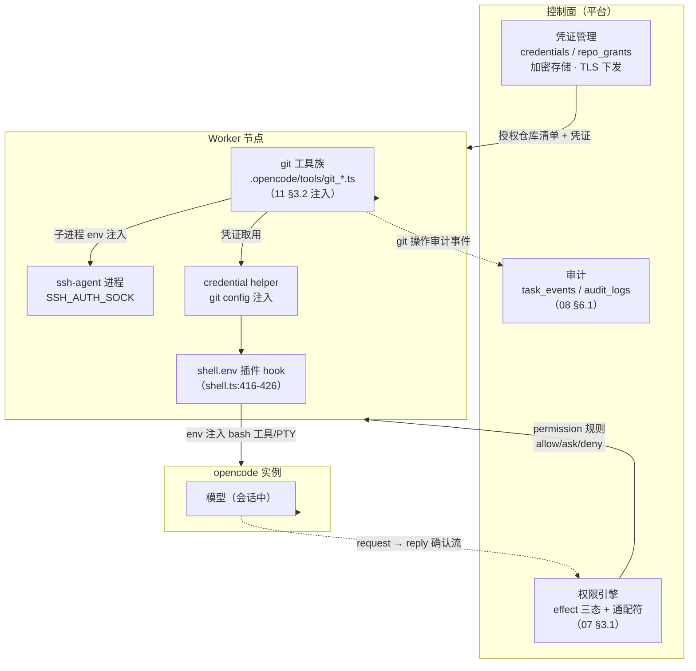
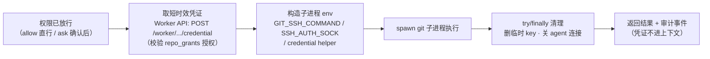
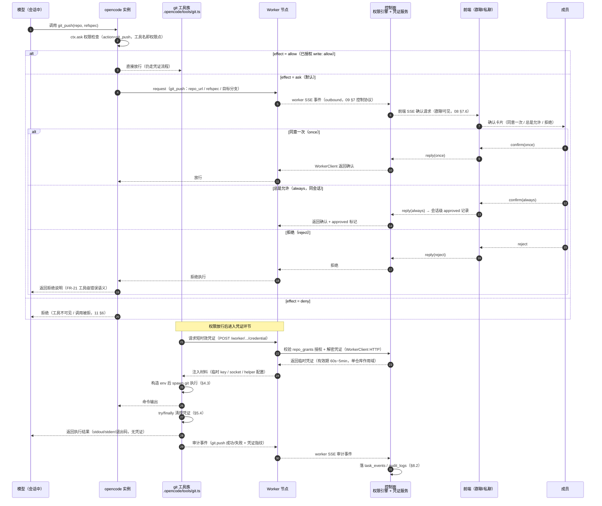
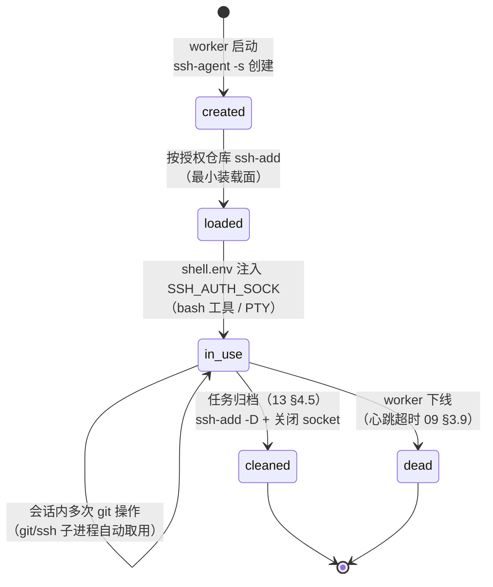

# 仓库权限与凭证机制（Git）

本文档回答「**分配了仓库权限的 Agent 如何安全地拉取/推送代码**」。14 篇 §3.4 权限范围（FR-36）只定义到「项目/读写/文档库」粒度，细粒度资源规则（指定仓库）在 14 篇 §9.1 被列为开放问题；16 篇开发者角色声明「项目代码仓库（读写）、写操作默认 ask」但未定义**凭证从何而来、如何注入、如何清理**。本文档补齐这三层：**凭证管理**（控制面：加密存储 + 仓库授权绑定）→ **git 工具族**（worker 注入 `.opencode/tools/`，工具名即权限 action）→ **注入与清理**（执行期：按场景注入 env / socket / helper，try/finally 用完即删）。本版支持经本机制的仓库拉取/推送；**PR 合并、CI/CD 部署、分支管理仍属后续迭代**（01 篇边界调整，见 §9.1）。

## 1. 定位与文档关系

**本文档是 Git 仓库凭证机制的专章。** 它解决 14/16 篇「角色有仓库权限」与「凭证如何安全落地执行」之间的空白：权限模型（07 篇 §3.1）回答「能不能调用工具」，本文档在此基础上回答「放行之后用什么凭证、怎么注入、怎么清理」。机制完全建立在 opencode 既有能力之上（自定义工具注册 + shell.env 注入 + bash 权限前缀），**不修改 opencode 本体**。

**01 篇边界调整说明。** 01 篇 §非目标原表述「不做仓库操作与发布流水线」随本文档落库调整为「**不做 PR 合并与发布流水线**」：分配给 Agent 的仓库可在权限申请（ask 确认）与临时凭证（短时效、用完即删）下执行 clone/pull/push；PR 合并、CI/CD 部署、分支管理仍属后续迭代（调整摘要见 §9.1）。

| 相关文档 | 关系 |
|---------|------|
| 01 篇 §非目标 | **边界调整**：本文档落库后，「不做仓库操作与发布流水线」调整为「不做 PR 合并与发布流水线」；仓库拉取/推送经本机制支持（§9.1 记录调整摘要） |
| 04 篇 FR-36/48 | **功能依据**：权限范围（FR-36，本文档 §3.2 将「指定仓库」细化落点）；工具 effect（FR-48，每工具 allow/ask/deny，§4.1） |
| 07 篇 §3.1 | **权限链路三步**：创建工具（工具名即 action）→ 逐工具配置 effect → 运行时执行（request → reply 确认流）；本文档 §4/§5 的权限模型基座，effect 三态与通配符语义全部继承 |
| 11 篇 §3.2/§6 | **工具注册与确认流**：自定义工具两条路径（`.opencode/tools/*.ts` 目录扫描 + 插件 `tool()`）；注册 → 暴露 → 权限过滤完整链路，ask 触发的 request → reply 确认流经 worker → 控制面转成员确认（once / always / reject） |
| 09 篇 §4/§7 | **Worker 控制协议**：控制面 ↔ worker 边界（HTTP + outbound SSE），WorkerClient/WorkerSseClient 承载确认流与凭证下发；本文档 §5.1 时序图中 worker ↔ 控制面两跳均走既有协议 |
| 14 篇 §3.4/§9.1 | **权限范围配置**（FR-36：资源边界与工具权限正交叠加）；开放问题「细粒度资源规则（指定仓库）留待后续」——本文档 §3.2 将其落地为仓库粒度授权绑定 |
| 16 篇 §6 | **开发者角色**：「项目代码仓库（读写）、写操作默认 ask」——本文档为其提供凭证执行落地；§8.3 说明角色权限语义不变 |
| 15 篇 §2/§3 | **落库规范**：字段类型映射（VARCHAR(64) 主键、Json 列、枚举字符串化、DATETIME(3)）；本文档 §3.1/§3.2 的 credentials / repo_grants 两表对齐 15 篇风格 |
| 13 篇 §4.5 | **归档回收**：归档迁移回收 worker 实例（DELETE /worker/{id}/instances/{gid}）；本文档 §7.2 清理触发点与之衔接 |

**阅读路径。** 只关心怎么配置仓库授权 → §3；只关心 Agent 侧工具怎么工作 → §4；只关心权限申请与凭证衔接全链路 → §5；只关心凭证怎么注入 → §6；只关心清理与生命周期 → §7；只关心管控与审计 → §8；只关心边界与遗留 → §9。

## 2. 现状与机制定位（opencode 事实）

### 2.1 opencode 现状事实表（已核实，非推测）

| 事实 | 说明 | 源码/文档依据 |
|------|------|--------------|
| **无内置 git 工具** | opencode 内置工具注册表（registry 批量注册）中**无 git_* 工具**；LLM 的 git 操作只能走 bash 工具跑 `git` 命令 | registry.ts builtin 列表（全仓库 grep 0 命中） |
| **无任何 git 凭证机制** | credential.helper / ssh-agent / GIT_SSH_COMMAND 注入**全部不存在**；无 ssh-agent、无 credential helper、无 GIT_SSH_COMMAND 环境注入 | 全仓库 grep 0 命中 |
| **bash 中 git 权限管控已完备** | `permission: {bash: {"git *": "allow"}}` 官方支持：arity 前缀机制（`git:2` → 模式 `git *`），通配符匹配由运行时规则表承载 | permission/arity.ts:83-86；官方 docs/permissions.mdx 示例 |
| **shell.env 是官方第一注入点** | 插件 `shell.env` hook 注入环境变量，**覆盖 bash 工具 + session 指令 shell + 用户终端 PTY** | shell.ts:416-426；plugins.mdx:261-273 官方示例 |
| **自定义工具可注入子进程 env** | `.opencode/tools/*.ts` 的 execute 内可自建子进程并注入**任意 env**；但 ToolContext 无 env 字段（拿不到 session shell.env） | registry.ts:178-192 |
| **内部 git 子进程不走 shell.env** | opencode 内部 git 子进程（snapshot 等）**只继承进程环境变量**（extendEnv: true），shell.env 对它们不生效 | 已核实（extendEnv: true） |

> 以上六条是本文档全部机制设计的**事实底座**：正因为 ②「无凭证机制」，平台才需要补凭证管理（§3）；正因为 ③ ⑤，平台才能用「bash 前缀 + 自定义工具 + shell.env」三件套实现管控与注入；正因为 ⑥，内部 git 的凭证覆盖列为开放问题（§9.2 ①）。

### 2.2 设计定位：三层补齐（不修改 opencode 本体）



三层职责：

| 层 | 位置 | 职责 | 依据 |
|----|------|------|------|
| **凭证管理**（控制面） | 平台控制面 | 凭证加密存储（§3.1）、仓库授权绑定（§3.2）、凭证下发与吊销 | FR-36；15 篇表风格 |
| **git 工具族**（worker） | worker 实例 `.opencode/tools/` | 平台内置工具注入；工具名即权限 action；execute 内取凭证、注入、执行、清理（§4） | 11 篇 §3.2 路径① |
| **注入与清理**（执行期） | worker 执行期 | GIT_SSH_COMMAND / SSH_AUTH_SOCK / credential helper 三种注入；try/finally 用完即删（§6/§7） | shell.ts:416-426 |

**为什么三层都在 worker 侧落地。** 凭证在 worker 进程内存中存在的时间最短（取用 → 注入 → 执行 → 清理），控制面只存密文与授权关系，不接触明文私钥/token 的运行时流转；控制面 ↔ worker 只走既有控制协议（09 篇 §7，worker 无公网入站端口，07 篇 §11.2）。

## 3. 凭证管理模型（控制面）

### 3.1 credentials 表（凭证本体）

对齐 15 篇 §2 字段约定：主键 `id VARCHAR(64)`（`<域前缀>_<序号>`）、枚举字符串化（无 Prisma enum）、时间戳 DATETIME(3)、Json 列统一 `Json` 类型。

| 字段 | 类型 | 说明 | 示例 |
|------|------|------|------|
| `id` | VARCHAR(64) | 主键，`cr_<序号>` | cr_1 |
| `repo_url` | VARCHAR(255) | 仓库地址（规范化：去 `.git` 后缀、统一协议，授权比对用规范化值） | git@gitee.com:xishuhq/ketaops.git |
| `auth_type` | String | `ssh_key` / `https_token`（枚举字符串化，15 篇 §2.1） | ssh_key |
| `credential_ref` | VARCHAR(128) | **加密存储引用**（平台加密库条目 id / KMS key 引用），**不存明文** | enc:c37a9f... |
| `fingerprint` | VARCHAR(128)? | 脱敏标识：私钥 SHA256 指纹 / token 前 8 位（日志与审计展示用，防泄明文） | SHA256:ab12cd34 |
| `owner_type` | String | 归属：`agent`（某 Agent 专用）/ `project`（项目共享） | project |
| `owner_id` | VARCHAR(64)? | 归属 id（agent_id / project_id），owner_type=project 时可为空 | p_3 |
| `scope` | Json | 授权范围：读写开关、分支约束（可选） | `{"read":true,"write":true,"branch":"main"}` |
| `expires_at` | DATETIME(3)? | 凭证过期时间（空 = 长期；管理员可随时吊销） | 2027-08-06T00:00:00.000Z |
| `created_by` | VARCHAR(64) | 录入管理员 user_id（凭证只能由管理员录入，§3.3） | u_5 |
| `created_at` | DATETIME(3) | 创建时间 | 2026-08-06T10:00:00.000Z |
| `revoked_at` | DATETIME(3)? | 吊销时间（吊销 = 软删，保留审计轨迹） | null |

**唯一约束**：`UNIQUE (repo_url, auth_type)`——同一仓库同一认证方式只允许一条有效凭证；吊销后重录走新行。**索引**：`(owner_type, owner_id)`（按归属检索）、`(expires_at)`（过期扫描）。

### 3.2 仓库授权绑定（repo_grants：14 篇 FR-36 细粒度落点）

14 篇 §3.4 权限范围的配置形态为 `{ projects, write, doclibOnly }`，细粒度资源规则（指定仓库）在 14 篇 §9.1 列为开放问题——**本文档将其落地为仓库粒度授权**：

| 字段 | 类型 | 说明 | 示例 |
|------|------|------|------|
| `id` | VARCHAR(64) | 主键，`rg_<序号>` | rg_7 |
| `subject_type` | String | 授权主体类型：`agent` / `role` / `project` | role |
| `subject_id` | VARCHAR(64) | agent_id / role_id / project_id（role 可先于实例存在，模板授权） | developer |
| `repo_url` | VARCHAR(255) | 被授权仓库（**必须已录入 credentials**，外键约束防孤儿授权） | git@gitee.com:xishuhq/ketaops.git |
| `permission` | String | `read` / `write`（write 隐含 read） | write |
| `effect` | String | 该仓库操作的工具 effect 覆盖：`allow` / `ask`（**默认 ask**，对齐 16 篇开发者「写操作默认 ask」） | ask |
| `granted_by` | VARCHAR(64) | 授权人 user_id（仅管理员可授权） | u_5 |
| `granted_at` | DATETIME(3) | 授权时间 | 2026-08-06T10:00:00.000Z |
| `revoked_at` | DATETIME(3)? | 撤销时间 | null |

**唯一约束**：`UNIQUE (subject_type, subject_id, repo_url)`——同一主体对同一仓库只有一条授权。**级联**：`repo_url` 指向 credentials 的 `repo_url`（同一规范化值），凭证吊销后该仓库的所有授权自动失效（执行期校验取不到凭证即拒绝，§5.1）。

**凭证与授权分离的设计意图：**

| 维度 | credentials（凭证本体） | repo_grants（谁可用） |
|------|----------------------|----------------------|
| 录入 | 管理员一次录入 | 管理员多次授权 |
| 变更 | 吊销凭证 = 全局失效 | 撤销授权 = 个别失效 |
| 粒度 | 仓库 × 认证方式 | 仓库 × 主体（agent/role/project） |
| 生命周期 | 短时效可设过期 | 随角色/任务生命周期 |

### 3.3 凭证来源

| 来源 | 本版 | 说明 |
|------|------|------|
| 平台管理员录入 | ✅ | admin 在控制面上传 SSH 私钥 / HTTPS token，加密存储（AES-256-GCM + 主密钥，§3.4）；录入后生成 `credential_ref` 与脱敏 `fingerprint` |
| 代码托管平台 OAuth 代持 | 预留 | 平台注册为托管平台 OAuth 应用，代持 token 并自动轮换；本版不引入（09 篇 §8 预留方式同源，开放问题④ §9.2） |

### 3.4 安全基线

- **加密存储**：凭证密文用 AES-256-GCM 加密落库，主密钥由平台环境变量/密钥文件提供（不进代码库）；KMS 演进见 §9.2 ②。
- **TLS 下发**：凭证请求走控制协议（worker 注册后经 WorkerClient 发起），传输层 TLS；worker 无公网入站端口（07 篇 §11.2 outbound 设计）。
- **最小授权**：scope 默认只读；写授权需管理员显式配置且 effect 默认 ask；临时凭证有效期 60s~5min（§5.1），超时自动失效。
- **明文零接触**：模型上下文、日志、审计事件均不出现明文（fingerprint 脱敏）；临时 key 文件权限 600、路径随机化（§5.4）。

## 4. 内置 git 工具族（核心）

### 4.1 工具清单（工具名即权限 action）

对齐 07 篇 §3.1「每个工具在注册时自动以其名字成为新的权限点」——平台内置 git 工具族每个工具独立成为权限 action，可独立配置 allow/ask/deny（11 篇 §6 链路）：

| 工具 | 作用 | 关键参数 | 默认 effect | 副作用 |
|------|------|---------|------------|--------|
| `git_clone` | 克隆仓库到工作目录 | `repo_url`、`ref?`、`target?` | allow | 写本地磁盘 |
| `git_pull` | 拉取远端更新到当前工作区 | `repo_url?`（缺省取当前目录 origin） | allow | 写本地 |
| `git_fetch` | 获取远端引用（不合并） | `repo_url?`、`ref?` | allow | 写本地 refs |
| `git_status` | 查看工作区/暂存区状态 | `porcelain?` | allow | 无 |
| `git_diff` | 查看工作区/提交间差异 | `ref_a?`、`ref_b?`、`path?` | allow | 无 |
| `git_log` | 查看提交历史 | `limit?`、`path?` | allow | 无 |
| `git_push` | **推送本地提交到远端** | `repo_url?`、`refspec` | **ask** | **写远端（核心副作用）** |

> 默认 effect 原则（07 篇 §3.1「有副作用工具默认 ask」）：**只读四件套（status/diff/log/fetch）默认 allow**；**写本地（clone/pull）默认 allow**（写本地磁盘是开发者角色的正常行为，16 篇 §6）；**写远端（push）默认 ask**——每次推送经 request → reply 确认流（§5.1）。团队可经 agent 配置逐工具收紧（如 pull 也 ask）。

### 4.2 注册路径：平台作为自定义工具注入

按 11 篇 §3.2 路径①（目录扫描）：**平台把 git 工具族文件注入 worker 实例的 `.opencode/tools/`**，实例启动时自动注册为工具并进入权限命名空间。

| 注入形态 | 工具名 | 说明 |
|---------|--------|------|
| 每工具一文件 | `git_clone.ts`、`git_push.ts`… | 文件名即工具名，权限点独立清晰 |
| 单文件具名导出 | `git.ts` 导出 `clone/pull/push/...` | 工具名 `<文件名>_<导出名>`（如 `git_clone`），与每文件形态命名一致 |

推荐**单文件具名导出**（`git.ts`）：一次注入、共享凭证取用与清理逻辑（§4.3 模板的公共封装）；工具名按 `<文件名>_<导出名>` 规则仍为 `git_clone` / `git_push` 等，与权限规则书写一致（`git_push: ask`）。

**注入时机**：worker 实例创建（v1 写文件 + 重启 / v2 transform 热更新，11 篇 §6 链路）时随资源配置下发；仅对**已配置 git 工具集的角色**注入（14 篇 §3.3 工具配置），未授权仓库的 Agent 工具族即便注入也因权限 deny 而不可用（双保险：注入面 + 权限面）。

### 4.3 execute 流程（通用模板）



伪代码模板（工具族公共封装）：

```typescript
// .opencode/tools/git.ts（平台内置，注入 worker）
export const git_push = tool({
  description: "推送本地提交到远端仓库（需仓库写授权，push 默认 ask）",
  args: {
    refspec: tool.schema.string().describe("推送引用规格，如 main:main"),
    repo_url: tool.schema.string().optional().describe("缺省取当前工作区 origin"),
  },
  execute: async (args, ctx) => {
    const cred = await fetchWorkerCredential(ctx, {
      repo: args.repo_url ?? cwdOrigin(),
      action: "push",          // 控制面据此校验 repo_grants.permission=write
    });                          // 返回：临时 key / agent socket / helper 配置
    try {
      const env = buildGitEnv(cred, ctx);   // §6 三种注入方式
      const r = await spawn("git", ["push", args.refspec], { env, cwd: ctx.directory });
      return { ok: true, output: r.stdout };
    } finally {
      cred.cleanup();                        // 删临时 key / 释放 agent 引用（§5.4）
    }
  },
});
```

**execute 六步约定**：① 权限已放行（opencode 运行时保证，工具内不再自判）；② 请求短时效凭证（经 Worker API，控制面校验 repo_grants）；③ 构造注入 env；④ spawn 执行；⑤ try/finally 清理；⑥ 返回结果 + 上报审计事件（§8.2）。**凭证只在 ②~⑤ 窗口存在，模型全程不可见**（§5.4）。

## 5. 权限申请与临时凭证衔接（核心）

### 5.1 完整链路时序



链路要点：

- **两条事件流走既有协议**：确认流（worker → 控制面 → 前端 SSE → 成员 → 原路返回）完全复用 11 篇 §6 的 ask 分支与 08 篇 §7.6「ask 确认回到平台转成员确认」；凭证下发走 WorkerClient HTTP（09 篇 §7 控制协议），**不新增对外端点、不打开 worker 入站**。
- **确认与凭证是两步**：确认解决「能不能」（权限），凭证解决「用什么」（凭据）。即使 effect=allow 也**仍取临时凭证**——放行不等于裸奔，凭证生命周期照旧（§5.2）。
- **超时兜底**：成员 60s 未确认 → 按拒绝处理（FR-21 错误语义）；临时凭证 5min 过期，过期后 git 命令自然失败并返回明确错误码。

### 5.2 三种 effect 分支表

| effect | 行为 | 是否取凭证 | 说明 |
|--------|------|-----------|------|
| `allow` | 直接执行 | ✅ **仍取临时凭证** | 免确认；凭证短时效 + 用完即删不变（放行 ≠ 免凭证） |
| `ask` | request → reply 确认流 | ✅ 确认后取 | **push 默认值**；确认选项：同意一次 / 总是允许 / 拒绝 |
| `deny` | 拒绝执行，返回错误 | ❌ | 工具对模型不可见或调用被拒（11 篇 §6 materialize 过滤） |

### 5.3 「总是允许」作用域

**同会话 approved 列表，非永久授权**（07 篇 §3.1 事实：「总是允许」只在该会话生效）。约定：

- 会话内确认「总是允许」后，后续同工具调用直接放行，不再弹确认；
- **会话结束 / 任务归档即失效**，跨会话回到 ask；
- 平台侧不自动将「总是允许」沉淀为 repo_grants 的 effect 变更——**从 ask 提升到 allow 必须由管理员显式操作**（§3.2），成员或模型不能单方面决定（14 篇 §3.4 权限正交语义）。

### 5.4 凭证不进模型上下文

| 约束 | 实现 |
|------|------|
| 模型只见执行结果 | 返回 stdout/stderr/退出码；工具描述与输出中无 key/token/socket 路径 |
| 临时 key 路径随机化 | `os.tmpdir()/keta-cred-<random>`（crypto.randomBytes），文件权限 600 |
| 用完即删 | try/finally 覆盖成功/失败/超时全分支；子进程 kill 后删临时文件 |
| 审计脱敏 | 事件记录 `fingerprint`（SHA256 前缀）而非明文 |

## 6. 注入方式（三种）

### 6.1 方式对照表

| 方式 | 场景 | 注入机制 | 等价物 |
|------|------|---------|--------|
| **GIT_SSH_COMMAND 临时 key** | SSH 仓库，单次操作 | 工具 execute 内构造 `ssh -i <tmpkey> -o IdentitiesOnly=yes` 传入**子进程 env**（GIT_SSH_COMMAND） | Jenkins withCredentials(sshUserPrivateKey) |
| **SSH_AUTH_SOCK ssh-agent** | SSH 仓库，会话内多次 | worker 维护 ssh-agent 进程，**shell.env 插件 hook** 注入 socket 到 bash 工具 / PTY（shell.ts:416-426 官方注入点） | **Jenkins sshagent 等价** |
| **credential helper** | HTTPS 仓库 token | worker 配置 `git config credential.helper` 指向平台 helper 脚本（每次 git 认证经 Worker API 取 token） | Jenkins gitUsernamePassword |

### 6.2 覆盖面对比

| 注入方式 | 内置工具族 | bash 裸 git 命令 | 用户 PTY（直连） |
|---------|-----------|----------------|-----------------|
| GIT_SSH_COMMAND（工具内注入） | ✅ | ❌ | ❌ |
| SSH_AUTH_SOCK（shell.env hook） | ✅（子进程继承） | ✅ | ✅ |
| credential helper（git config） | ✅ | ✅ | ✅ |

**结论：**

- **内置工具族**用 GIT_SSH_COMMAND 精准注入——单次操作、最小凭证面、路径随机化（§5.4）；
- **bash 裸 git 命令**依赖 shell.env 注入的 SSH_AUTH_SOCK（SSH 仓库）与 git config credential.helper（HTTPS 仓库）——覆盖模型自由发挥的兜底路径，与工具族**双轨并行**（§8.1 管控策略）；
- 用户直连 worker PTY（运维场景）同样经 shell.env 拿到 socket，行为一致。

### 6.3 边界说明

opencode **内部 git 子进程（snapshot 等）不走 shell.env**，只继承进程环境变量（extendEnv: true）——本版**不覆盖内部 git**，列为开放问题（§9.2 ①）。这不阻断 Agent 的 clone/pull/push：内部 git 只做工作区快照与版本记录，不涉及远端凭证；若未来需要（如远端工作区），采用进程启动级 env（worker spawn 实例时注入）解决。

## 7. worker 侧生命周期

### 7.1 ssh-agent 生命周期

1. **worker 启动**：平台配置下发含授权仓库清单 → worker 创建 ssh-agent 进程（`ssh-agent -s` 捕获 `SSH_AUTH_SOCK` 路径）；
2. **按授权仓库装载私钥**：`ssh-add` 仅装载该 worker 承载任务的授权仓库私钥（最小装载面，不装全量）；
3. **会话/实例使用**：shell.env hook 把 `SSH_AUTH_SOCK` 注入 bash 工具与 PTY（shell.ts:416-426），git/ssh 子进程自动取用（等价 Jenkins sshagent 的 socket 机制）；
4. **任务归档**（13 篇 §4.5 归档迁移）：归档回收 worker 实例时，卸载已装载 key（`ssh-add -D`）+ 关闭 socket（§7.2 清理触发点）；
5. **worker 下线**（心跳超时，09 篇 §3.9）：进程级回收，agent 进程消亡连带 socket 自然失效。



### 7.2 清理触发点表

| 触发点 | 清理内容 | 机制 | 衔接 |
|--------|---------|------|------|
| 工具执行完毕 | 临时 key 文件删除、子进程 env 释放 | try/finally（§4.3/§5.4） | 每次调用必达 |
| 会话结束 | 会话内 approved 列表清空、临时文件清扫 | 会话生命周期钩子 | 14 篇 §6.2 会话五阶段 |
| 任务归档 | ssh-agent 卸载已装载 key + 关闭 socket | 归档迁移联动（13 篇 §4.5：`DELETE /worker/{id}/instances/{gid}` 回收实例） | 13 篇 §4.5 |
| worker 下线 | 进程级回收，socket 自然失效 | 心跳超时判定（09 篇 §3.9，连续 N 周期） | 09 §3.9 |

> **与 13 篇 §4.5 的衔接**：归档迁移的「回收 worker 实例」动作（13 篇 §4.5 第 2 步）同时承载凭证清理——实例回收 = 会话冻结 + agent 进程终止 + ssh-agent 卸载 key；归档为终态无恢复路径（13 篇），因此凭证在归档后**必然**不可再用，无需额外兜底。

## 8. 权限与审计

### 8.1 裸 git 命令管控（bash 兜底，双轨并行）

`permission: {bash: {"git *": "allow", "*": "ask"}}` 官方机制（07 篇 §3.1 权限链路 + 官方 docs/permissions.mdx：arity 前缀 `git:2` → 模式 `git *`）——与内置工具族**双轨并行**：

| 轨道 | 管控粒度 | 凭证注入 | 适用 |
|------|---------|---------|------|
| 内置 git 工具族 | **工具级**（git_push 独立 ask，git_clone allow…） | GIT_SSH_COMMAND 精准注入（§6.1） | 平台推荐路径，工具语义清晰 |
| bash 裸 git 命令 | **命令模式级**（`git *` allow，其余命令 ask） | shell.env 注入 SSH_AUTH_SOCK + credential helper（§6.1） | 模型自由操作兜底；仓库范围内放行 |

**关键语义澄清**：bash 的 `git *` 放行的是「git 命令可以执行」；**凭证面由注入的 socket/helper 控制**（§6.2 覆盖 bash）。因此 `git *: allow` 不等于「裸奔」——模型只有拿到工作区里的本地仓库才能操作，远端写（push）受双重约束：

- **凭证面**：ssh-agent 只装载授权仓库 key / helper 只返回授权仓库 token；
- **命令面**：若团队要求 push 也逐次确认，可配置 `git push *: ask`（arity 前缀机制**原生支持子命令模式**，`git push` 对应 `git:2` 之后更长前缀）。

推荐基线：开发者角色默认 `git *: allow` + `git push *: ask`（子命令模式收紧），与工具族的 push=ask 语义对齐（§8.3）。

### 8.2 审计

git 操作与权限申请事件落 `task_events` / `audit_logs`（08 篇 §6.1：audit_logs 预留表，本版以 task_events + pino 日志承载，09 篇 §8 审计预留）：

| 审计项 | 内容 | 载体 |
|--------|------|------|
| git 操作 | agent、repo_url（规范化）、action（clone/pull/push/fetch…）、时间、结果（成功/退出码） | task_events（eventType=`git.op`）+ audit_logs |
| 权限申请 | request id、effect 分支（allow/ask/deny）、确认人、确认结果（once/always/reject）、耗时 | task_events（eventType=`permission.request`） |
| 凭证生命周期 | 凭证 id（fingerprint 脱敏）、下发时刻、清理时刻、超时/吊销标记 | audit_logs |

> 审计事件为**单向追加**：模型不可见、成员可见（任务群聊内可查），管理员可全局检索（09 篇 §8 下一版全量操作留痕 API 的演进基座）。

### 8.3 与角色权限衔接（14/16 篇）

14 篇 §4.1 / 16 篇 §6 开发者角色默认「项目代码仓库（读写），写操作默认 ask」——本文档落为 **repo_grants 默认授权表**：

| 角色 | 仓库授权默认 | effect 默认 | 依据 |
|------|-------------|------------|------|
| 开发者 | 项目仓库 `read`（写需管理员授权） | read: allow；write: ask | 16 篇 §6.3「项目读写（写操作默认 ask）」 |
| 架构师 | 项目仓库只读 | allow | 16 篇 §5.2「代码仓库只读」 |
| 测试者 | 项目仓库只读（跑测试/校验） | allow | 16 篇 §7（只读 + bash ask） |
| UI 设计 | 无仓库授权 | — | 16 篇 §4「无代码仓库写权限」 |
| 产品经理 | 无仓库授权 | — | 16 篇 §3 |

**凭证机制不改变角色权限语义**，只提供「有权限后如何安全执行」的执行层：未授权的角色调用 git_push → 权限 deny 或取凭证时校验失败（双重拒绝）；授权角色的只读操作（clone/pull/fetch）免确认直行，写操作（push）默认 ask（§5.2）。

## 9. 边界与开放问题

### 9.1 本版边界（含 01 篇边界调整）

| 边界 | 约定 | 依据 |
|------|------|------|
| **仓库拉取/推送** | 分配给 Agent 的仓库可在权限申请（ask 确认）与临时凭证（短时效、用完即删）下执行 clone/pull/push | 本文档 §3~§6 |
| **不做 PR 合并** | PR 创建/合并/评审流属后续迭代（01 篇调整后表述） | 01 篇 §非目标 |
| **不做 CI/CD 部署** | 触发流水线、部署发布属后续迭代 | 01 篇 §非目标 |
| **不做分支管理** | 创建/删除/保护分支等托管平台能力不在本版 | 01 篇 §非目标 |
| **凭证最小授权** | 默认只读；写授权需管理员显式配置且 effect=ask | FR-36 |
| **不覆盖 opencode 内部 git** | 内部 git 子进程（snapshot 等）不走 shell.env，本版不注入 | §6.3 |

**01 篇边界调整摘要**（01 篇 §非目标第 64-67 行）：

| 原文 | 调整后 |
|------|--------|
| 不做仓库操作与发布流水线 | **不做 PR 合并与发布流水线** |
| 不操作代码仓库在范围外：向代码仓库提交代码、创建分支、合并 PR、触发 CI/CD 等需要 git 仓库写操作的能力，留待后续迭代 | **仓库拉取/推送经本版凭证机制支持**（见 17 篇《仓库权限与凭证机制》）：分配给 Agent 的仓库可在权限申请（ask 确认）与临时凭证（短时效、用完即删）下执行 clone/pull/push；**PR 合并、CI/CD 部署、分支管理仍属后续迭代** |
| 「开发阶段」指产出实现代码与实现说明，不包含将代码合并回仓库的流程 | 不变（开发阶段边界不受影响：产出物归档依旧，仓库推送是新通道） |

### 9.2 开放问题

| # | 开放问题 | 现状 | 触发条件（何时需解决） |
|---|---------|------|------------------------|
| ① | opencode 内部 git 子进程凭证覆盖 | 内部 git（snapshot 等）不走 shell.env，只继承进程环境变量；本版不注入 | 需要内部 git 访问远端（如远端工作区快照）时，评估 worker spawn 实例时注入进程启动级 env |
| ② | 凭证存储 KMS 演进 | 本版加密库（AES-256-GCM）+ 主密钥文件 | 多控制面实例 / 合规审计要求时，引入 KMS（云厂商或自建 Vault） |
| ③ | 多仓库并发凭证作用域隔离 | 临时凭证单仓库作用域（§5.1）；ssh-agent 按 worker 装载多仓库 key | 单实例并发多任务多仓库出现跨仓库串用风险时，改为按任务/会话隔离 agent 实例或 key 作用域 |
| ④ | token 轮换策略 | 管理员手动更新 credentials；托管平台 OAuth 代持预留（§3.3） | 托管平台 token 过期/泄漏事件频发时，引入自动轮换 + 平台 OAuth 应用 |
| ⑤ | 裸 git 子命令级管控默认值 | 开发者默认 `git *: allow`，`git push *: ask` 建议项未进默认模板 | 团队要求 push 也逐次确认时，把 `git push *: ask` 写入开发者角色默认权限 |
