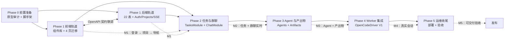
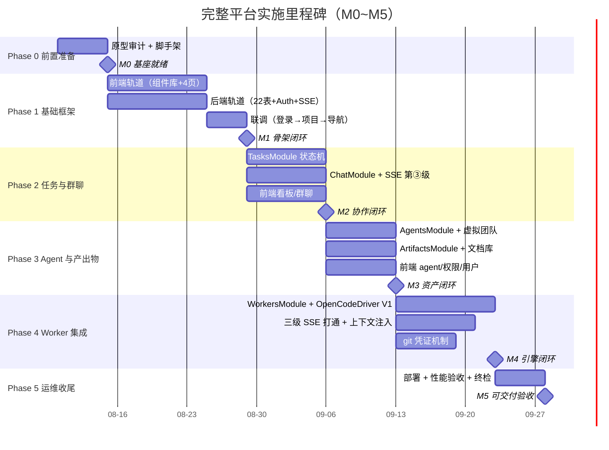

# 推进计划（分阶段实施）

本文档是完整平台的**实施计划**：把 01~17 篇设计文档转化为可执行的分阶段推进路线。每阶段定义目标、范围、任务清单与验收标准，阶段间以里程碑（M0~M5）衔接，**每阶段独立可验收、可回滚**。本版实现「完整平台第一版」范围（05 篇 3.2/3.3）；通知、全局搜索、审计 API、WebSocket 双向、对象存储等下一版能力（08 篇 §8）不在本计划排期，仅保留架构预留。

## 1. 定位与计划基线

### 1.1 文档定位

**18 篇是「设计 → 开发」的转换层，不是新设计。** 它不新增任何架构/契约/交互决策，只回答三个问题：先做什么（阶段划分）、怎么做（任务清单）、做完怎么算好（验收标准）。全部设计事实来自 01~17 篇，本计划与既有文档的引用关系：

| 事实来源 | 本计划用法 |
|---------|-----------|
| 08 篇《平台架构设计》§2/§3 | 技术栈锁定（§3.2）、控制面模块划分（后端脚手架，§5.2） |
| 15 篇《数据模型细化（ER 图）》 | Prisma schema 的直接来源：20 表字段级定义（§5.2） |
| 17 篇《仓库权限与凭证机制》 | credentials / repo_grants 两表并入 15 篇 20 表，合计 22 表（§3.3） |
| 09 篇《API 设计》 | OpenAPI 契约为前后端并行联调锚点（§2.3、§5.2） |
| 13 篇《任务状态机与全生命周期》 | TasksModule 五态状态机实现依据（§6.1） |
| 12 篇《产出物协议与文档库》 | ArtifactsModule 归档链路与文档库接口依据（§7.3） |
| 14 篇《Agent 配置与虚拟团队模型》 | AgentsModule 与虚拟团队端点实现依据（§7.1/§7.2） |
| 10 篇《群聊与消息机制》 | ChatModule 与三级 SSE 第 ③ 级实现依据（§6.2/§8.3） |
| 07 篇 §9《OpenCodeDriver 抽象层》 | Worker 侧 V1Driver/V2Driver 实现依据（§8.2） |
| 05 篇《非功能与验收边界》 | 性能验收指标（消息 ≤1s、@ 首字 ≤5s、会话流 ≤2s 等，§9.3） |
| 原型体系（17 页 + `_shared` 3 文件） | 前端页面与组件库的迁移基线，**一致性为最高约束**（§3.1、§5.1） |

### 1.2 计划基线表

| 基线 | 内容 | 来源 |
|------|------|------|
| 技术栈 | Node.js 22 LTS + TypeScript 5.x；后端 NestJS 10+；前端 Next.js 15+ + React 19；TanStack Query v5 + Zustand；SSE 统一单向；Prisma 5+（MySQL 8 生产 / SQLite 验证双 provider）；JWT（@nestjs/passport + @nestjs/jwt）+ bcrypt；class-validator DTO；@nestjs/swagger OpenAPI；pino 日志；本地文件存储；进程内队列（QueuePort 抽象，BullMQ 预留） | 08 篇 §2 |
| 数据模型 | 20 表字段级定义（users/roles/projects/project_members/tasks/task_agents/task_events/sessions/chat_channels/messages/artifacts/artifact_versions/agents/agent_skills/agent_tool_effects/skills/tools/workers/task_group_instances + audit_logs 预留）+ 17 篇 credentials/repo_grants，合计 **22 表** | 15 篇 §3、17 篇 §3 |
| API 契约 | REST `/api/v1` 10 模块端点（Auth/Users/Projects/Tasks/Chat/Artifacts/Agents/SkillsTools/Workers/Permissions）+ SSE 三级链路（第 ③ 级前端事件契约）+ 游标语义（消息主键兼 SSE 事件 id） | 09 篇 §3/§4 |
| 原型 | 17 个原型页面（login/project-list/task-create/task-board/group-chat/dm-chat/task-detail/agent-config/role-permission/user-management/worker-list/worker-install/skills-tools-manage/tool-register + nav-rail/nav-cmdk/nav-hybrid）+ `_shared` 3 文件（styles.ts 102 行 token、components.tsx 8 组件、nav.tsx 778 行导航体系） | 06 篇 + prototypes/ |

### 1.3 每阶段独立可功能性验收原则

- **阶段验收不跨阶段**：每阶段产出物在阶段内完成闭环（功能可用 + 测试通过 + 原型一致），不把验证债留到下一阶段；**每阶段都设有独立的功能性验收点（M1~M5）**，可单独演示、单独判定通过与否。
- **失败可回滚**：阶段以独立分支（`feature/phase-N`）推进，验收不通过不合并基线；回滚粒度 = 阶段粒度。
- **里程碑即门禁**：M0~M5 任一未达成，后续阶段不启动（依赖见 §2.1/§10.2）。

## 2. 总体策略（核心）

### 2.1 阶段总览表

| 阶段 | 目标 | 范围 | 里程碑 | 依赖 |
|------|------|------|--------|------|
| **Phase 0** 前置准备 | 原型审计 + 项目脚手架 | 原型审计清单（17 页）、Monorepo 骨架（web/ + server/）、环境准备、Prisma 初始化 | **M0** | — |
| **Phase 1** 基础框架 | 前后端并行立骨架，联调跑通「登录 → 项目 → 导航」 | 前端：共享组件库 + 4 页迁移 + 路由布局 + 状态层；后端：脚手架 + Prisma 22 表 + Auth/Users/Projects + RealtimeModule SSE 基座 + OpenAPI | **M1** | Phase 0 |
| **Phase 2** 任务与群聊核心 | 任务全生命周期 + 群聊实时流转 | TasksModule（CRUD + 五态状态机 + 看板接口）、ChatModule（落库/发消息/历史/游标 + SSE 第 ③ 级）、前端 task-board/group-chat/dm-chat | **M2** | Phase 1 |
| **Phase 3** Agent 与产出物 | Agent 配置 + 虚拟团队 + 产出物闭环 | AgentsModule（模板/克隆/自定义 + available-models）、虚拟团队端点、ArtifactsModule（协议校验/归档/文档库）、前端 agent-config/task-detail/role-permission/user-management | **M3** | Phase 2 |
| **Phase 4** Worker 与 opencode 集成 | 真实 Agent 会话跑通（技术攻坚） | WorkersModule（注册/心跳/调度）、OpenCodeDriver V1、三级 SSE 打通、上下文注入、@ 触发分派、git 凭证机制 | **M4** | Phase 3 |
| **Phase 5** 运维与收尾 | 可交付验收 | 部署方案（单机 + Docker Compose）、审计基线、性能验收、17 页原型终检 | **M5** | Phase 4 |

### 2.2 阶段依赖图（mermaid）



> **Phase 1 双轨道并行**：前端轨道（P1F）与后端轨道（P1B）互不阻塞，以 OpenAPI 契约为唯一联调锚点（§2.3）；两者都完成才进入 Phase 2。

### 2.3 前后端并行策略（Phase 1 起）

- **两条轨道、一个契约**：前端轨道按原型迁移页面 + 接入 TanStack Query/Zustand；后端轨道按 09 篇实现端点。**OpenAPI（@nestjs/swagger 生成）是两条轨道之间唯一的联调锚点**——前端不等待后端实现，先用契约生成类型（openapi-typescript）与 mock（MSW），后端就绪后切换真实端点。
- **契约先行**：Phase 1 后端轨道的首个交付物是 OpenAPI spec（模块骨架 + DTO 即契约），前端据此并行开发。
- **SSE 基座先行（RealtimeModule）**：SSE 是群聊/会话流/状态广播的统一基座（08 篇 §7.2），Phase 1 即实现第 ③ 级事件通道与游标补拉语义（09 篇 §4），后续阶段的事件类型（chat.message.new 等）只是注册增量，不改基座。
- **每阶段前端/后端各自独立验收**：后端以契约测试（Supertest 打端点）+ 单元测试验收；前端以原型逐页对比验收（§3.1）；联调里程碑（M1~M5）做端到端走查。

### 2.4 里程碑定义

| 里程碑 | 验收主题 | 验收标准（摘要） |
|--------|---------|-----------------|
| M0 | 基座就绪 | 原型审计报告完成；`web/`+`server/` 脚手架可跑；Prisma 22 表 schema 编译通过（MySQL + SQLite 双 provider） |
| M1 | 骨架闭环 | 登录 → 项目列表 → 全局导航（NavDock/CmdK）全链路可用；前端 4 页与原型一致；SSE 基座 ping/游标可测 |
| M2 | 协作闭环 | 任务创建 → 启动 → 群聊发消息 @ 触发（mock 模式）→ 消息实时回流；看板状态联动 |
| M3 | 资产闭环 | Agent 配置 → 加入任务团队 → 产出物归档（mock 回流）→ 文档库展示；role-permission/user-management 可操作 |
| M4 | 引擎闭环 | 真实 Agent 会话跑通：@ 触发 → 上下文注入 → 回复回流 → 产出物归档；git clone/pull 凭证链路可执行 |
| M5 | 交付验收 | 单机部署（Docker Compose）跑通；05 篇非功能指标达标；17 页原型终检通过 |

## 3. 核心约束（硬性，用户强调）

### 3.1 前端与原型一致（最高约束）

**前端页面效果与当前原型一致：样式、风格、布局都不要随意改变**（除非用户明确要求）。本约束在 Phase 1 与 Phase 5 终检中重点验收，分四层落地：

**① `_shared/styles.ts` 全部主题 token 原样迁移（零改动）**

| token 分组 | 内容 | 迁移要求 |
|-----------|------|---------|
| 角色语义色 `roles` | product=蓝 #3B82F6 / architect=紫 #8B5CF6 / developer=绿 #10B981 / tester=橙 #F59E0B（含 label/color/bg/border） | 原样复制到前端 `styles/theme.ts`，值不做任何调整 |
| `roleText` | 角色强调色深一档（#2563EB 等 4 色） | 原样 |
| `statusColors` | 进行中/待验收/已完成/已归档 四态 color/bg/border | 原样 |
| `neutral` | 中性色 50~900 十级 | 原样 |
| `space`/`radius`/`fontSize` | 间距（4px 基准）/圆角/字号 | 原样 |
| `fontFamily` | body/display/mono 三套 | 原样 |
| `shadow` | sm/md/lg 三级 | 原样 |
| `sidebarTheme` | 深色侧边栏 5 项 | 原样 |

> 迁移验收：`styles.ts` 与 `styles/theme.ts` 逐 token diff 为空（除导出语法适配），**禁止借迁移机会"优化"色值/间距**。

**② `_shared/components.tsx` 8 组件原样迁移为真实组件库**

| 组件 | 关键 props | data-testid（必须保留） |
|------|-----------|------------------------|
| `AgentAvatar` | role/initials/size/dot | `agent-avatar` |
| `AgentBadge` | role/dot | `agent-badge` |
| `ChatBubble` | text/type/author/role/time | `chat-bubble`、`chat-bubble-author` |
| `MessageInput` | mentionable/placeholder | `message-input`、`message-input-mentions`、`message-input-send` |
| `StatusBadge` | status | `status-badge` |
| `Sidebar` | projectName/active/onNavClick | `sidebar`、`sidebar-project`、`sidebar-nav-tasks`、`sidebar-nav-agents` |
| `TopBar` | title/subtitle/userName/userRole | `topbar`、`topbar-user` |
| `EmptyState` | title/description/icon/action | `empty-state` |

迁移要求：**结构、样式、data-testid 三者全部保留**；原型为纯展示组件（无交互逻辑），迁移时补齐交互（onClick/onSubmit）但不改变视觉结构与布局。组件实现从原型 inline style 提升为真实组件库（Tailwind 或 CSS Modules 均可），但**渲染结果与原型逐像素一致**（以 token 对照 + data-testid 断言验收）。

**③ 17 原型页面迁移：布局结构、间距、字号、配色、交互形态与原型一致**

| 原型页面 | 迁移阶段 | 说明 |
|---------|---------|------|
| login / project-list / task-create / task-board | Phase 1 | 首批 4 页 |
| group-chat / dm-chat / task-detail | Phase 2 | 任务与群聊 |
| agent-config / role-permission / user-management | Phase 3 | Agent 与权限 |
| worker-list / worker-install / skills-tools-manage / tool-register | Phase 3~4 | 管理与集成 |
| nav-rail / nav-cmdk / nav-hybrid | Phase 1（共享库阶段） | 导航三变体收敛为 `_shared/nav.tsx` 真实组件 |

迁移铁律：页面布局（分栏/间距/对齐）、字号、配色、交互形态（hover/展开/弹层/loading 指示）与原型一致；**导航体系以 nav-hybrid（NavDock + NavTopBar + CmdKPanel）为主形态**（`_shared/nav.tsx` 已提取为共享组件），nav-rail/nav-cmdk 作为变体保留在组件库中供切换。

**④ 验收方式：原型 vs 实现逐页对比**

| 对比维度 | 方法 | 通过标准 |
|---------|------|---------|
| 样式 token 一致性 | 逐 token diff（§3.1①） | diff 为空 |
| 布局结构比对 | 截图对比（原型 vs 实现同屏） | 布局结构一致，无错位/溢出 |
| data-testid 保留 | 页面级 grep 断言 + Playwright 查询 | 原型全部 testid 在实现中存在且可命中 |
| 交互形态 | Playwright 交互走查（hover/弹层/loading） | 交互行为与原型一致 |

### 3.2 技术栈锁定（08 篇 §2）

- 技术栈以 08 篇 §2 为唯一选型清单（§1.2 基线表），**不引入计划外依赖**；确需新增依赖时必须说明理由并走评审（原则：能用既有依赖解决的问题不引入新库）。
- 双库兼容：Prisma 双 provider（MySQL 生产 / SQLite 验证），枚举一律字符串化 + 应用层常量、Json 列统一 Prisma `Json` 类型（08 篇 §6.2、15 篇 §2.1）。
- 实时通道：首版统一 SSE，不引入 WebSocket；任务队列用进程内队列（QueuePort 抽象），首版不引入 Redis（08 篇 §7.5）。

### 3.3 数据模型以 15 篇为准

- Prisma schema 以 15 篇 §3 逐表字段定义（含唯一约束/索引/主键策略）为唯一来源；17 篇的 credentials/repo_grants 两表按 15 篇 §2 字段约定补入（合计 **22 表**，audit_logs 按预留不建）。
- 主键策略：`VARCHAR(64)` 域前缀 + 自增序号（`t_1`/`e_1024`/`s_1`），序号单调性保证 SSE 游标可排序可续拉（15 篇 §2.2）。
- 一致性：状态机以数据库为唯一事实源（tasks.status + task_events 同事务）、验收基线 accepted_flag 联动、worker 事件幂等（08 篇 §6.3）。

### 3.4 其他工程约束

| 约束 | 约定 |
|------|------|
| 提交规范 | 一个需求一个 commit；Java 改动提交前跑 googleJavaFormat（本计划前后端为 TS/TSX，不涉及） |
| 分支流程 | 基于 xishuhq/develop 建 `feature/phase-N` 分支，推 ketabot 后向 xishuhq/develop 提 PR |
| 目录边界 | 前端 `web/`、后端 `server/` 独立 package，禁止跨目录直接 import 源码（共享类型经 OpenAPI 生成） |

## 4. Phase 0 前置准备

### 4.1 原型审计清单（17 页逐个核对）

Phase 0 首个交付物：**原型审计报告**——逐页登记组件引用、样式依赖与 data-testid 清单，作为 Phase 1 迁移与 Phase 5 终检的对照基准。

| 审计项 | 内容 | 产出 |
|--------|------|------|
| 组件引用 | 每页引用了 `_shared/components.tsx` 的哪些组件（如 group-chat 引用 ChatBubble/MessageInput/AgentBadge） | 页面 × 组件矩阵 |
| 样式依赖 | 每页直接引用的 styles token 清单（直接 inline 的色值/间距也要登记，防迁移遗漏） | 页面 × token 矩阵 |
| data-testid 清单 | 每页全部 data-testid 登记（含 nav.tsx 的 rail-*/cmdk-* 系列） | 全站 testid 清单 |
| 布局结构 | 每页的布局骨架描述（分栏/栅格/滚动区域/浮层宿主） | 布局说明书 |

> 审计输出存 `docs/agent-platform/18-原型审计报告.md`（或 .omo/evidence 内附录），Phase 5 终检以此为准。

### 4.2 Monorepo 结构（web/ + server/ 目录规划）

```
aiagents/
├── docs/agent-platform/          # 设计文档（01~18 篇）
├── web/                          # 前端（Next.js 15 App Router + React 19）
│   ├── src/
│   │   ├── app/                  # 路由页面（login/projects/tasks/chats/agents/workers/...）
│   │   ├── components/           # 共享组件库（迁移自 prototypes/_shared）
│   │   │   ├── ui/               # 8 组件（AgentAvatar 等，data-testid 保留）
│   │   │   └── nav/              # NavDock/NavTopBar/CmdKPanel（迁移自 nav.tsx）
│   │   ├── styles/theme.ts       # styles.ts token 全量迁移
│   │   ├── lib/api/              # OpenAPI 生成客户端（openapi-typescript）
│   │   ├── stores/               # Zustand（UI 局部状态）
│   │   └── hooks/                # TanStack Query hooks（服务端数据）
│   ├── package.json
│   └── tsconfig.json
├── server/                       # 后端（NestJS 10）
│   ├── prisma/
│   │   ├── schema.prisma         # 22 表（MySQL + SQLite 双 provider）
│   │   └── migrations/
│   ├── src/
│   │   ├── modules/              # 08 篇 §3.1 模块划分（Auth/Users/.../Realtime）
│   │   ├── common/               # 守卫/管道/拦截器/错误码（09 §2.1）
│   │   └── main.ts               # OpenAPI 装配（@nestjs/swagger）
│   ├── test/                     # Supertest 契约测试
│   ├── package.json
│   └── tsconfig.json
└── package.json                  # 根 workspace（npm/pnpm workspaces）
```

### 4.3 环境准备

| 项 | 要求 |
|----|------|
| Node.js | 22 LTS（08 篇 §2.1） |
| 数据库 | 开发/验证：SQLite 单文件；生产：MySQL 8（docker compose 提供） |
| Prisma | 5+ 初始化：`schema.prisma` 22 表首版 + 双 provider 迁移脚本 |
| 包管理 | npm/pnpm workspace（web/ + server/ 共享根 lockfile） |
| opencode | v1 SDK `@opencode-ai/sdk` 1.18.14（07 篇 §6/§9.6 实测基线），Phase 4 引入 |

### 4.4 Phase 0 交付物

| 交付物 | 验收 |
|--------|------|
| 原型审计报告 | 17 页全覆盖：组件/token/testid 三矩阵齐备 |
| 项目脚手架骨架 | `web/` 与 `server/` 均可 `npm run dev` 启动；根 workspace 安装无错误 |
| Prisma schema 首版 | 22 表编译通过（`prisma generate` 双 provider 均成功） |
| **M0** | 上述三项全部通过 |

## 5. Phase 1 基础框架（用户指定重点：前后端并行，详设）

### 5.1 前端轨道

**步骤 1：共享组件库提取（先于任何页面迁移）**

| 子步骤 | 内容 | 验收 |
|--------|------|------|
| styles token 迁移 | `styles.ts` → `web/src/styles/theme.ts`（§3.1① 零改动） | token diff 为空 |
| 8 组件迁移 | `components.tsx` → `web/src/components/ui/`（§3.1②） | data-testid 全保留；组件渲染与原型一致 |
| 导航体系迁移 | `nav.tsx` → `web/src/components/nav/`（NavDock/NavTopBar/CmdKPanel） | rail-*/cmdk-* testid 全保留 |

**步骤 2：页面迁移批次（每页：原型代码迁移 + token 对齐 + data-testid 保留）**

| 批次 | 页面 | 关键内容 |
|------|------|---------|
| 批次 A-1 | login | 左品牌区 + 右表单布局；username/password/login-button/register-link testid |
| 批次 A-2 | project-list | 项目卡片网格；NavTopBar + CmdKPanel 接入 |
| 批次 A-3 | task-create | 表单 + Agent 勾选 + 背景文档上传区（upload testid） |
| 批次 A-4 | task-board | 五列看板（§6.1 联调时接状态数据） |

**步骤 3：路由与布局框架**

- App Router 路由：`/login`、`/projects`、`/projects/[pid]/tasks`、`/tasks/[id]` 等，与 06 篇 8 核心页 + 管理页对齐。
- 全局布局：登录外页面统一挂 NavDock（左侧 Dock）+ NavTopBar（顶栏）+ CmdKPanel（受控开关），宿主容器 `position: relative`（nav.tsx 铁律：浮层绝对定位，禁 fixed/100vh）。

**步骤 4：状态层接入**

| 状态类型 | 选型 | 用法 |
|---------|------|------|
| 服务端数据 | TanStack Query v5 | 项目列表/任务列表/消息历史的缓存、失效与乐观更新 |
| UI 局部状态 | Zustand | 导航 activeKey、CmdKPanel open、消息输入区状态、Loading 指示器 |
| 实时事件 | EventSource（SSE 客户端） | Phase 1 接入 `GET /events` 基座，事件 → Query 缓存更新 |

**验收（前端轨道独立）：** 与原型逐页视觉对比通过（样式/布局/交互一致，§3.1④）；4 页 data-testid 断言全过；路由跳转可用。

### 5.2 后端轨道

**步骤 1：NestJS 脚手架**

- 模块划分对齐 08 篇 §3.1：AuthModule/UsersModule/ProjectsModule/TasksModule/ChatModule/ArtifactsModule/AgentsModule/SkillsToolsModule/WorkersModule/PermissionsModule/RealtimeModule/StorageModule/QueueModule（NotificationModule 接口占位）。
- 通用基建：JWT 守卫 + 角色权限守卫（PermissionsModule，09 篇 §2.3 的 [admin]/[project]/[worker] 三标记）、class-validator 全局管道、统一错误格式（09 篇 §2.1 业务码表）、pino 日志。

**步骤 2：Prisma schema（22 表首版落库）**

- 15 篇 §3 全部 20 表（audit_logs 按预留不建，仅注释保留）+ 17 篇 credentials/repo_grants。
- 双 provider 迁移：`prisma migrate dev` 生成 SQLite 迁移（验证环境）+ MySQL 迁移（生产）同源 schema（15 篇 §6.4）。
- 主键/唯一约束/索引按 15 篇 §4.3/§5.1 落库（如 `idx_tasks_project_status`、`uk_sessions_task_agent`、`idx_messages_channel_id`）。

**步骤 3：认证模块（AuthModule）+ UsersModule 基础**

| 端点 | 实现要点 | 依据 |
|------|---------|------|
| POST /auth/register | bcrypt 哈希、默认 role=member；username/email 唯一校验 | 09 §3.1 / FR-22 |
| POST /auth/login | 校验 + 签发 {accessToken(2h), refreshToken(7d)} | 09 §2.1 / 08 §7.6 |
| POST /auth/refresh | refresh token 轮换 | 09 §3.1 |
| GET /users（[admin]） | 分页 + search；响应不含 password_hash | 09 §3.2 |

**步骤 4：ProjectsModule 基础（列表/创建）**

| 端点 | 实现要点 | 依据 |
|------|---------|------|
| GET /projects | 成员可见项目列表（管理员全部）；分页 page/pageSize | 09 §3.3 / FR-25 |
| POST /projects | 创建者 owner；status=active；写 project_members | 09 §3.3 / FR-25 |
| POST /projects/:id/members（[admin]） | 成员加入（Phase 2 完善） | 09 §3.3 |

**步骤 5：RealtimeModule SSE 基座（先行）**

| 能力 | 实现要点 | 依据 |
|------|---------|------|
| 事件通道 | `GET /api/v1/events`（统一事件流，scope 支持 task/channel 过滤） | 09 §4.1 |
| 事件帧 | `{id, type, data, timestamp}` 统一帧；id 复用消息/事件主键 | 09 §4.1 / 08 §7.2 |
| 游标语义 | 事件先落库后转发；`GET /events?since=` 补拉 | 09 §4.4 / 08 §7.3 |
| 订阅管理 | 按 scope 的订阅者注册表 + 断线自动清理 | 08 §3.1 RealtimeModule 职责 |
| 幂等落库 | 消费 worker 事件以 `(instance_id, event_id)` 去重（Phase 4 启用） | 08 §6.3 |

> **SSE 基座先行是并行策略的关键**：Phase 1 只实现通道与游标，Phase 2/3/4 的事件类型（chat.message.new / artifact.submitted / session.stream.chunk）作为事件字典增量注册，不改基座代码。

**步骤 6：OpenAPI 契约**

- @nestjs/swagger 全量装配：DTO 装饰（class-validator 双写）+ 端点摘要；`/api/v1/docs` Swagger UI 可调试。
- 契约导出：`openapi.json` 提交到仓库，前端 openapi-typescript 生成类型 + MSW mock（§2.3 契约先行）。

**验收（后端轨道独立）：** `npm run test`（Supertest 契约测试：注册/登录/项目 CRUD/SSE 基座 ping）全绿；OpenAPI spec 生成成功且 DTO 与 09 篇字段一致。

### 5.3 联调里程碑（M1）

| 联调项 | 前端 | 后端 | 通过标准 |
|--------|------|------|---------|
| 登录 | login 页提交 → 存 token → 跳转项目列表 | /auth/login 签发 JWT | 登录成功进入项目列表 |
| 项目列表 | 项目卡片渲染（Query 缓存） | GET /projects 返回成员项目 | 列表数据正确 |
| 全局导航 | NavDock/CmdK 切换页面 | —（纯前端） | 三变体导航可用 |
| SSE 基座 | EventSource 订阅 + 断线补拉 | GET /events 心跳帧 + since 游标 | 订阅收到事件、补拉不重复 |

**M1 = 登录 → 项目列表 → 全局导航（原型一致验收通过）。**

## 6. Phase 2 任务与群聊核心

### 6.1 TasksModule：CRUD + 五态状态机 + 看板接口

| 任务组 | 端点 | 实现要点 | 依据 |
|--------|------|---------|------|
| CRUD | GET/POST `/projects/:pid/tasks`、GET/PATCH `/tasks/:id` | 创建即三件套（群聊频道 + 文档库 + 背景文档入库，同事务）；mainAgentId 校验须团队内 | 13 篇 §4.1 / FR-01/02/06/09 |
| 状态机 | POST /tasks/:id/{start,mark-pending-review,accept,reject,archive} | TaskStateMachine 迁移表驱动（五态，13 §3.2）；非法 409；幂等（已处目标态 200 不重复产生 task_events）；乐观锁 CAS（tasks.version） | 13 篇 §3/§8.2 / FR-03/04/05 |
| 看板 | GET /projects/:pid/tasks?status= | idx_tasks_project_status 命中；响应含五态分组所需字段 | 13 篇 §2.3 / FR-03 |
| 团队 | POST /tasks/:id/team | task_agents joined/removed 标记；仅待开始/进行中合法；系统消息 + team.changed | 14 篇 §5.3 / FR-02/10 |
| 事件 | task_events 落库（同事务）+ 广播 task.status_changed | 状态时间线回查；验收基线 accepted_flag 联动（accept 事务内标记） | 13 篇 §5 / 12 篇 §7 |

**状态机实现要点**：迁移表 + CAS 并发安全（13 篇 §8.2）：`UPDATE tasks SET status=?, version=version+1 WHERE id=? AND status=<前置> AND version=?`，影响行数 0 → 幂等或 409；task_events 不设 (task_id, from, to) 唯一索引（reject 循环合法，15 篇 §3.3）。

### 6.2 群聊：ChatModule + SSE 第 ③ 级

| 能力 | 端点/事件 | 实现要点 | 依据 |
|------|----------|---------|------|
| 频道 | GET /channels、GET /channels/:id | task_group 每任务一频道（创建任务自动生成）；private 经 POST /dm-channels | 10 篇 §3 / FR-09/14 |
| 发消息 | POST /channels/:id/messages | 8 步流程（权限校验→@ 解析→落库→广播→分派→上下文注入→Loading→异步收敛，Phase 4 接通 worker 侧）；mentions 服务端二次校验（agent 须在团队内） | 09 篇 §5.1 / FR-10~13 |
| 历史 | GET /channels/:id/messages?cursor=&limit= | 游标 = 消息主键；idx_messages_channel_id 覆盖游标分页；响应 {items, nextCursor} | 10 篇 §6 / FR-19 |
| SSE 第 ③ 级 | chat.message.new / agent.loading / agent.error / task.status_changed | 事件字典注册到 RealtimeModule；loading → final/error 时序固定，前端按 messageId 聚合 | 09 篇 §4.2 / FR-20/21 |
| 系统消息 | senderType=system | 任务状态变更/团队调整/产出物提交自动生成（10 篇 §8） | FR-10 |

**Phase 2 的 worker 侧分派用 mock 模式**：@ 触发后由 MockDispatcher 模拟 Loading →（延迟）→ 回复消息回流，验证完整 SSE 时序；Phase 4 替换为真实 WorkerClient（§8.3），消息链路零改动。

### 6.3 前端

| 页面 | 迁移内容 | 状态联动 |
|------|---------|---------|
| task-board | 五列看板：卡片按 status 分组；顶部筛选条 | 订阅 task.status_changed → 卡片移动（Query 缓存更新） |
| group-chat | ChatBubble 三态渲染（user 右/agent 左/system 居中）；MessageInput @ 提示 chips；Loading 两阶段指示器 | 订阅 chat.message.new/agent.loading/agent.error → 消息流追加 |
| dm-chat | 私聊频道视图（复用同 Agent 会话概念） | 频道切换即消息列表切换 |
| task-create（增强） | Agent 勾选 + 主 Agent 指定 + 背景文档上传（mock 上传） | 创建成功跳看板 |

### 6.4 里程碑（M2）

**M2 = 任务创建 → 启动 → 群聊消息实时流转（mock Agent 回复）**：看板五态流转可用；群聊发消息 @ 产品经理 → 用户消息 ≤1s 展示 → Loading → mock 回复回流；断线重连 since 补拉不丢消息。

### 6.5 Phase 2 可验收功能清单（M2 验收依据）

> 本节为 Phase 2（`.omo/plans/phase2-task-chat.md`）完成后的**逐项可验收功能清单**。执行完成后按此清单逐项勾选验收；每项含验收方式（curl / Playwright testid / jest），证据存 `.omo/evidence/`。

#### A. 后端可验收功能

- [ ] **A1. 任务创建（三件套同事务）**：`POST /projects/:pid/tasks` 创建任务 → 同事务生成任务 + 群聊频道（task_group）+ task_agents 团队 + task_events(status_change from=null→pending)。验收：curl 201 + 查表三件套齐全。
- [ ] **A2. 任务列表/看板接口**：`GET /projects/:pid/tasks?status=` 五态筛选 + 分页 `{items,total,page,pageSize}`。验收：curl 按 status 过滤返回正确子集。
- [ ] **A3. 任务详情与编辑**：`GET /tasks/:id`、`PATCH /tasks/:id`（mainAgentId 须团队内）。验收：curl 返回/更新字段正确。
- [ ] **A4. 五态状态机**：`start`(pending→in_progress) / `mark-pending-review`(→pending_review) / `accept`(→completed) / `reject`(→in_progress) / `archive`(→archived)；非法迁移 409 `TASK_INVALID_TRANSITION`；幂等（已处目标态 200 不重复事件）；CAS 乐观锁并发安全。验收：curl 全链路 + jest 三态测试 + CAS 并发测试。
- [ ] **A5. task_events 审计落库**：每次迁移同事务写 task_events（eventType/fromStatus/toStatus/actorType/actorId/metadata/createdAt）。验收：查表断言事件行。
- [ ] **A6. 团队调整**：`POST /tasks/:id/team` add（joined_at + 系统消息 + team.changed）/ remove（removed_at 标记 + 会话 frozen + 系统消息）；仅待开始/进行中合法（409 时间窗）。验收：curl + jest。
- [ ] **A7. 群聊频道**：`GET /channels?type=`、`GET /channels/:id`、`POST /dm-channels`（private 私聊）。验收：curl 返回频道列表/信息。
- [ ] **A8. 发消息 8 步流程**：`POST /channels/:id/messages` 权限校验 → @ 解析（团队内/已移除 agent_removed/不存在 400）→ 落库 → 广播 chat.message.new → 分派 → Loading → 异步收敛。验收：curl 201 + SSE 收到事件 + triggers 状态正确。
- [ ] **A9. 历史消息游标分页**：`GET /channels/:id/messages?cursor=&limit=` → `{items,nextCursor}`，翻页无重复无遗漏，空历史 nextCursor=null。验收：curl 翻页断言。
- [ ] **A10. SSE 完整改造**：`GET /events?token=&scope=task:<id>|channel:<id>` scope 过滤 + query token 鉴权（无效 401/非成员 403）+ 事件 id 字符串（与消息主键同源）+ 事件持久化（重启后 since 补拉不丢）+ 15s 心跳。验收：curl -N + 重启补拉测试。
- [ ] **A11. MockDispatcher**：MessageDispatcher 接口抽象 + MockDispatcher 确定性模板回复（按角色 1-3s 延迟 → agent.loading thinking/operating → 回复落库广播）。验收：SSE 时序断言 + 确定性测试 + 替换点 grep。
- [ ] **A12. GET /agents 简化端点**：seed 4 内置角色（产品经理/架构师/开发者/测试）+ `GET /agents` 返回列表。验收：curl 返回 4 项。

#### B. 前端可验收功能

- [ ] **B1. useSSE hook**：`?token=` 连接 + lastEventId/since 断线重连补拉 + 事件分发回调。验收：Playwright 触发广播断言接收 + 断线重连补拉。
- [ ] **B2. MessageInput 重写**：受控 value/onChange/onSend + @ 输入候选 chips 点击插入 + Enter 发送；保留 message-input / message-input-mentions / message-input-send testid。验收：Playwright 输入/插入/发送断言 + 截图对比原型。
- [ ] **B3. group-chat 页 `/tasks/[id]`**：三栏布局（members-panel + 消息区 + task-info-panel）与原型一致；历史加载 + 新消息 SSE 追加 + Loading 两阶段指示器 + agent.error 错误态。验收：Playwright 三栏 testid + 实时流转 + 截图对比。
- [ ] **B4. dm-chat 页 `/messages/[id]`**：会话列表（/messages）+ 单栏私聊（AgentInfoBar + 消息 + 输入）+ 复用群聊消息组件。验收：Playwright 会话流 + 截图对比。
- [ ] **B5. task-board 接真实数据**：useQuery 接 `GET /projects/:pid/tasks?status=` + 筛选条真实过滤 + 订阅 task.status.changed 卡片联动 + 卡片点击跳 /tasks/[id] + 「开始任务」真实调用。验收：Playwright 数据驱动 + SSE 联动。
- [ ] **B6. task-create 增强**：Agent 勾选来自 GET /agents（非静态）+ 真实提交成功跳转（移除 mock fallback）+ pid 修正为真实 seed 项目。验收：Playwright 创建闭环。
- [ ] **B7. SSE 事件→Query 缓存桥**：chat.message.new → 消息列表追加；task.status.changed → 看板缓存更新；agent.loading/error → loading 状态更新。验收：Playwright 事件驱动断言。
- [ ] **B8. AppShell 路由配套**：/tasks/[id] 标题「任务群聊」+ Dock 高亮 board；/messages/[id] 标题「私聊」+ 高亮 messages。验收：Playwright 断言。

#### C. M2 端到端验收（联调）

- [ ] **C1. 完整主流程**：登录 → 创建任务（勾选 Agent + 主 Agent）→ 跳 /tasks/[id] → 看板见新任务（pending）→ 开始（in_progress）→ 群聊发消息 @ 产品经理 → 用户消息即时显示 → Loading 指示器 → mock 回复回流 → 看板卡片状态联动。验收：Playwright 全流程截图 + curl 数据断言。
- [ ] **C2. 断线补拉**：断开 SSE → 重连 `?since=` → 无重复无遗漏。验收：脚本化断连/重连断言。
- [ ] **C3. 原型一致性**：group-chat / dm-chat / task-board / task-create 四页实现 vs 原型截图对比 PASS（布局/token/testid）。验收：`.omo/evidence/phase2-prototype-parity.md`。
- [ ] **C4. 全量门禁**：`server npm run test && npm run build` + `web npm run build` 全过；无 Phase 3+ 功能泄漏（grep artifacts 写入/Agent CRUD/worker 分派）。

> **验收顺序建议**：A1→A4→A7→A8（后端主链路）→ B3→B5→C1（前端主链路）→ C2（断线补拉）→ C3（原型一致）→ C4（门禁）。每项验收通过后在左侧勾选，证据存档 `.omo/evidence/`。

## 7. Phase 3 Agent 与产出物

### 7.1 AgentsModule：模板/克隆/自定义

| 端点 | 实现要点 | 依据 |
|------|---------|------|
| GET /agents（type?） | 列表含四类预置模板（产品经理/架构师/开发者/测试）；分页 | 14 篇 §4.1 / FR-30 |
| POST /agents（custom） | 完全自定义：prompt/skillIds/toolEffects/permissionScope/defaultModelId | 14 篇 §2.2 / FR-32~36/47 |
| POST /agents/:id/clone | 深拷贝副本（baseAgentId 血缘，不触源）；同事务 | 14 篇 §2.2 / FR-31 |
| PATCH /agents/:id | 模板 403 PERMISSION_AGENT_READONLY；配置作用于后续会话 | 14 篇 §7 / FR-33 |
| GET /agents/:id/available-models | 经 WorkerClient 调 worker GET /models（Phase 4 接通；Phase 3 先静态占位） | 14 篇 §3.5 / FR-47 |

落库：agents + agent_skills + agent_tool_effects 三表（15 篇 §3.7）；toolEffects 结构 `{ "<action>": allow|ask|deny }`，支持通配符 action（FR-48）。

### 7.2 虚拟团队（task_agents 落库 + 团队调整端点）

| 能力 | 实现要点 | 依据 |
|------|---------|------|
| 团队组建 | 创建任务时 agentIds[] 写 task_agents（joined）；mainAgentId 校验 | 14 篇 §5.1 / FR-02/08 |
| 团队调整 | POST /tasks/:id/team：add（注入文档库初始上下文）/remove（removed_at 标记 + 会话 frozen + 产出保留）；系统消息 + team.changed | 14 篇 §5.3 / FR-02/10 |
| 会话模型 | sessions 表（task×agent 唯一）；入队 created → 启动 active → 移除 frozen → 归档 archived | 14 篇 §6 / FR-37 |

### 7.3 ArtifactsModule：产出物协议 + 归档链路 + 文档库

| 能力 | 实现要点 | 依据 |
|------|---------|------|
| 协议校验 | json_schema 校验（type/title/content/fileRef）；非法声明回退普通消息不产生归档 | 12 篇 §3 / FR-38 |
| 归档链路 | 事件驱动回流（Phase 4 接通 worker；Phase 3 用 mock 事件注入）：text 直接归档 / doc+file 经 WorkerClient 拉取（重试 3 次 2s/4s/8s）；append 递增版本 + sha256 幂等去重 | 12 篇 §5 / FR-40/41/43 |
| 文档库 | GET /tasks/:id/artifacts、GET /artifacts/:id、GET /artifacts/:id/versions/:version | 12 篇 §6 / FR-44/45 |
| 验收联动 | accept 事务内标记 current_version.accepted_flag；验收后 append → 任务自动退回进行中；已验收版本 409 ARTIFACT_ACCEPTED_IMMUTABLE | 12 篇 §7 / FR-04/43 |

### 7.4 前端

| 页面 | 迁移内容 |
|------|---------|
| agent-config | 五块配置项表单（提示词/技能勾选/工具 effect 每工具一行三态/权限范围/默认模型）；模板只读态 |
| /artifacts?pid= | 产出物管理聚合页（项目级）：任务/类型/验收状态三筛默认全部 + 列表（验收状态徽章）+ 版本查看器 + 空态 |
| /roles | 角色权限矩阵表格（资源×操作 allow/partial/deny）+ 自定义角色 CRUD（预置只读）；Dock 新项「角色权限」 |
| user-management | 用户列表/创建/禁用/重置密码（[admin] 端点对接） |

### 7.5 里程碑（M3）

**M3 = Agent 配置 → 加入任务 → 产出物归档 → 文档库展示**：克隆模板 → 配置 effect → 创建任务选 Agent → mock 会话产出 → 归档（mock 事件）→ 文档库实时刷新（artifact.submitted）；验收流程（mark-pending-review → accept → 基线锁定）闭环。

### 7.6 Phase 3 可验收功能清单（M3 验收依据）

> 本节为 Phase 3（`.omo/plans/phase3-agent-artifacts.md`）完成后的**逐项可验收功能清单**。执行完成后按此清单逐项勾选验收；每项含验收方式（curl / Playwright testid / jest），证据存 `.omo/evidence/`。

#### A. 后端可验收功能

- [ ] **A1. Agent 列表与详情**：`GET /agents?type=` 类型过滤 + 分页，响应含 skillIds / toolEffects / permissionScope / defaultModelId；`GET /agents/:id` 返回完整关联。验收：curl 断言响应字段齐全。
- [ ] **A2. 自定义 Agent 创建**：`POST /agents`（custom）三表同事务（agents + agent_skills + agent_tool_effects）；toolEffects 支持通配符 action。验收：curl 201 + 查表三表齐全。
- [ ] **A3. Agent 克隆**：`POST /agents/:id/clone` 深拷贝（baseAgentId 血缘、不触源、副本与源解耦）。验收：curl 断言 baseAgentId + 改副本不影响源。
- [ ] **A4. 更新/删除权限**：`PATCH` / `DELETE /agents/:id`：模板 403 `PERMISSION_AGENT_READONLY`、custom 可写可删。验收：curl 断言 403 / 200。
- [ ] **A5. available-models 静态占位**：`GET /agents/:id/available-models` 返回静态模型数组（Phase 4 接 worker 真实探测）。验收：curl 200 数组。
- [ ] **A6. 会话状态机**：任务启动时 sessions 由 created 置 active（created→active）。验收：curl 启动 + DB 直查 sessions 状态。
- [ ] **A7. 产出物协议校验**：json_schema 校验产出物声明；非法声明回退普通消息、不产生归档。验收：curl 非法声明不落库。
- [ ] **A8. 归档链路**：消费 artifact.submitted 归档（text 直接归档 / doc+file 重试拉取）；append 版本递增 + sha256 幂等去重。验收：curl 同内容重复提交版本不增、改内容版本递增。
- [ ] **A9. 文档库端点**：`GET /tasks/:id/artifacts`（type / accepted 筛选）、`GET /artifacts/:id`、`GET /artifacts/:id/versions/:version`。验收：curl 筛选正确 + 版本字段完整。
- [ ] **A10. 验收联动**：accept 标记 accepted_flag；已验收版本写操作 409 `ARTIFACT_ACCEPTED_IMMUTABLE`；验收后 append 任务退回进行中 + 广播。验收：curl + jest 状态断言。
- [ ] **A11. 用户管理端点**：`POST /users`、`POST /users/:id/reset-password`；AdminGuard 拦截。验收：curl 创建/重置 + 非管理员 403。
- [ ] **A12. 角色矩阵 CRUD**：`GET/POST/PATCH/DELETE /roles`；预置角色只读 403。验收：curl 自定义 CRUD + 预置 403。

#### B. 前端可验收功能

- [ ] **B1. /agents**：agent-config 原型迁移（五块配置 + 模板只读态 + 克隆调真实 API），data-testid 一致。验收：Playwright 断言 testid + 只读态 + 克隆闭环。
- [ ] **B2. /users**：user-management 原型迁移（统计条 + 列表 + 新增弹层 + 禁用/重置）。验收：Playwright 断言 user-stats / user-toggle / 新增提交。
- [ ] **B3. /roles**：role-permission 原型迁移（8×6 权限矩阵 + 自定义角色 CRUD）+ Dock 新增「角色权限」第 7 项。验收：Playwright 断言矩阵渲染 + Dock 7 项。
- [ ] **B4. /artifacts?pid=**：产出物管理聚合页（任务/类型/验收状态三筛默认全部 + 列表含验收状态徽章 + 版本查看器 + 空态）。验收：Playwright 三筛联动 + 版本切换 + 空态。
- [ ] **B5. 产出物入口**：看板「产出物」按钮 + 项目卡片次级入口 + 群聊页 artifact-link 跳转 → /artifacts?pid=。验收：Playwright 三入口 URL 断言。

#### C. M3 端到端验收（联调）

- [ ] **C1. 完整主流程**：克隆 Agent → 创建任务选 Agent → 启动 → mock 产出 → 归档 → 聚合页刷新 → mark-pending-review → accept 验收闭环。验收：Playwright 全流程截图 + curl 数据断言。
- [ ] **C2. 聚合页 SSE 实时性**：artifact.submitted → 前端订阅聚合页列表实时刷新。验收：触发归档 + Playwright 断言列表新增。
- [ ] **C3. 回归**：Phase 0-2 功能不回归（任务创建 / 团队 / 群聊 / SSE / 看板）。验收：jest 全量 + Playwright 回归冒烟。
- [ ] **C4. 全量门禁**：server `npm run test && npm run build` + web `npm run build` 全过；无 Phase 4 功能泄漏（worker 调度 / 真实 LLM）。验收：门禁命令全绿。

> **验收顺序建议**：A1→A3→A7→A8（后端主链路）→ B1→B4→C1（前端主链路）→ C2（SSE 实时性）→ C3（回归）→ C4（门禁）。每项验收通过后在左侧勾选，证据存档 `.omo/evidence/`。

## 8. Phase 4 Worker 与 opencode 集成（技术攻坚）

### 8.1 WorkersModule：注册/心跳/调度

| 组件 | 实现要点 | 依据 |
|------|---------|------|
| WorkerRegistry | POST /api/v1/workers/register（X-Worker-Token，不与用户 JWT 混用）；注册即入池；workers 表 + token_hash | 09 §5.3 / FR-26 |
| HealthChecker | 心跳 10s/超时 30s 判定（连续 3 周期）；idx_workers_status_heartbeat 巡检 | 08 §3.2 |
| Scheduler | 按能力（opencode 版本/skills/tools）+ 负载 + 亲和分配任务组→worker；task_group_instances 落库 | 08 §3.2 / 07 11.4 |
| LifecycleManager | WorkerClient 下发 instances/sessions/prompt/abort/models；worker 离线 → 任务组待重调度 | 08 §3.3 |

### 8.2 OpenCodeDriver V1 实现（Worker 侧 V1Runtime）

- Worker 节点内实现 V1Driver（07 篇 §9.2 接口）：createSession / sendMessage（mentions → system 注入 resolveRole）/ listModels / getMessages / abortSession。
- V1Runtime 以 `createOpencodeServer()` spawn opencode 子进程承载（每任务组一个实例，07 篇 §10.1/§10.2）；agent 配置变更 = 写文件 + 重启该实例（07 篇 §10.3 四步）。
- 控制面不直连 opencode：仅经 WorkerServer HTTP/SSE 控制协议（09 篇 §7 边界），v2 迁移只换 V2Driver（07 篇 §9.7/§9.8，工作量 10-15% 且集中在封装层）。

### 8.3 三级 SSE 打通

| 级 | 实现 | 依据 |
|----|------|------|
| ① 模型输出流 | opencode 内事件（message.part.delta 等），worker 内捕获封装 | 09 篇 §4 / 08 §7.2.1 |
| ② worker→控制面 | WorkerSseClient 订阅（heartbeat/session.updated/message.part.delta/agent.status/task.completed）；消费链路「幂等落库→语义转换→转发」 | 09 篇 §4.3 |
| ③ 控制面→前端 | 业务事件字典注册（chat.message.new 等，Phase 2 已建）；session.stream.chunk 仅按需订阅（sessions/:id/stream，不并入统一流） | 09 篇 §4.2/§5.2 / FR-17/18 |

### 8.4 上下文注入与 @ 触发分派

- 分派链路接通真实 WorkerClient：定位任务组与会话（uk_sessions_task_agent）→ 注入上下文（群聊历史 + 文档库 doclib 块，12 篇 §8，32KB 截断）→ 下发 /prompt（含 mentions）→ Loading → task.completed 回流 → 回复落库广播。
- 互 @ 分派（FR-13）：task.completed 的 mentions 回流续跑，3 轮上限 + 循环检测；错误三层模型（FR-21）映射 agent.error。

### 8.5 git 凭证机制落地（17 篇）

| 能力 | 实现要点 | 依据 |
|------|---------|------|
| credentials/repo_grants 两表 | 管理员录入（AES-256-GCM 加密存储 + fingerprint 脱敏）；repo_url 规范化 + 外键防孤儿授权 | 17 篇 §3 |
| git 工具族 | `.opencode/tools/git.ts` 注入 worker（单文件具名导出：git_clone/git_pull/git_fetch/git_status/git_diff/git_log/git_push）；工具名即权限 action | 17 篇 §4 |
| 注入与清理 | GIT_SSH_COMMAND（工具内）/ SSH_AUTH_SOCK（worker ssh-agent + shell.env hook）/ credential helper 三方式；try/finally 用完即删；凭证不进模型上下文 | 17 篇 §5/§6 |
| 权限申请流 | ask 确认（request→reply 经 worker→控制面→前端 SSE→成员 once/always/reject）；「总是允许」仅同会话 approved | 17 篇 §5.1 |
| 审计 | git 操作/权限申请落 task_events（eventType=git.op / permission.request） | 17 篇 §8.2 |

> 17 篇为独立落地单元：Phase 4 内可与主链路并行开发，M4 验收时合并验证（@ 触发 → 上下文注入 → 回复回流 → 产出物归档 → git 操作链路）。

### 8.6 里程碑（M4）

**M4 = 真实 Agent 会话跑通**：@ 触发真实 opencode 会话 → 上下文注入（群聊历史 + 文档库）→ 回复回流 → 产出物自动归档；worker 注册/心跳/离线自愈可用；git clone/pull 凭证链路可执行（ask 确认流走通）。

## 9. Phase 5 运维与收尾

### 9.1 部署方案（单机 + Docker Compose）

| 组件 | 容器 | 说明 |
|------|------|------|
| 控制面 | server（NestJS） | 单实例；环境变量注入 JWT 密钥/DB URL |
| 前端 | web（Next.js standalone） | 构建产物静态/Node server |
| 数据库 | MySQL 8 | 生产；验证环境 SQLite 单文件 |
| Worker | worker（V1Runtime） | 与控制面同主机（localhost 走控制协议）；serverUrl 指向控制面，可拆远程零协议改动（08 篇 §7.1） |
| 队列 | 进程内（无 Redis） | QueuePort 抽象，BullMQ 预留（08 篇 §7.5） |

分布式扩展预留：worker 拆远程（07 篇 11.7）、控制面多实例（QueueModule 换 BullMQ）、文件存储换对象存储（StorageModule 接口）。

### 9.2 审计基线

- 核心操作事件落 task_events（状态迁移/验收/团队调整/git 操作）+ pino 结构化日志（08 篇 §8 审计预留方式）；audit_logs 表本版不建（15 篇 §7.2 开放问题①）。
- 交付前审计走查：权限矩阵生效（[admin]/[project]/[worker] 三标记拦截验证）、worker token 与用户 JWT 隔离（09 篇 §7）。

### 9.3 性能验收（05 篇非功能指标）

| 指标 | 目标 | 验证方式 |
|------|------|---------|
| 群聊消息显示 | ≤1s（05 篇 1.1） | 发消息 → SSE 到达前端计时 |
| @ 触发首字 | ≤5s（05 篇 1.1） | 触发 → 首个 session.stream.chunk 计时 |
| 会话流查看 | ≤2s（05 篇 1.1） | 订阅建立 → 增量渲染计时 |
| 单任务并行 | 4~6 Agent（05 篇 1.4） | 并发 @ 压测，单 Agent 失败隔离 |
| 可用性 | ≥99.5%（05 篇 1.1） | 冒烟 + 断线重连场景 |

### 9.4 原型一致性终检（全部 17 页终对比）

- 以 Phase 0 审计报告为基准，17 页逐页截图对比（§3.1④ 三维度：token diff / 布局比对 / data-testid 断言）。
- 导航三变体（nav-rail/nav-cmdk/nav-hybrid）在真实数据下复验交互形态。

### 9.5 里程碑（M5）

**M5 = 可交付验收**：docker compose 一键部署跑通；性能指标达标；17 页原型终检通过；审计走查无阻断项；移交测试环境（keta-web-keta-ci-* 部署验证）。

## 10. 里程碑与依赖图

### 10.1 里程碑甘特图（mermaid）



### 10.2 风险与前置依赖表

| 风险/依赖 | 影响 | 缓解 |
|-----------|------|------|
| opencode SDK 版本（V1 起步） | Phase 4 依赖 `@opencode-ai/sdk` 1.18.14（07 §9.6 实测基线）；v2 契约未冻结 | 锁版本 + 定期跟进（07 篇 §7）；OpenCodeDriver 隔离，v2 迁移只动 worker 侧（07 §9.7） |
| 模型接口可用性 | available-models / 真实会话依赖 worker 上可用模型 | Phase 3 静态占位，Phase 4 联调前确认模型配置；接口不可用则 mock 兜底 |
| SSE 重连/游标 | 断线丢事件 → 前端状态不一致 | 事件先落库后转发 + since 游标补拉（09 §4.4）；Phase 1 基座即实现，M2 起全链路验证 |
| opencode v1 并发稳定性 | 单实例并发会话未经大规模验证 | 每任务组一个实例隔离；上线前并发压测（05 篇 4.1） |
| 原型一致性漂移 | 迁移过程中样式/布局被"顺手优化" | §3.1 最高约束 + 每页迁移即验收 + Phase 5 终检 |
| 前后端契约漂移 | 并行开发两侧字段不一致 | OpenAPI 契约为唯一锚点；后端 DTO 变更必须同步 openapi.json |
| worker 与 opencode 子进程管理 | 进程泄漏/僵尸子进程 | V1Runtime close() 杀进程 + 重启；心跳超时自愈（08 §3.2） |
| git 凭证泄漏 | 凭证进模型上下文/日志 | 17 篇 §5.4 四约束（指纹脱敏/路径随机化/用完即删/仅回结果） |

### 10.3 阶段验收清单汇总

| 里程碑 | 一句话验收 | 对应章节 |
|--------|-----------|---------|
| M0 | 审计报告 + 脚手架 + 22 表 schema 编译通过 | §4.4 |
| M1 | 登录 → 项目 → 导航，原型一致，SSE 基座可测 | §5.3 |
| M2 | 任务创建→启动→群聊消息实时流转（mock） | §6.4 |
| M3 | Agent 配置→加入任务→产出物归档→文档库展示 | §7.5 |
| M4 | 真实 Agent 会话 + git 凭证链路跑通 | §8.6 |
| M5 | 单机部署 + 性能达标 + 17 页终检通过 | §9.5 |

**与既有文档的衔接。** 本文档是设计到开发的转换层：阶段划分与任务清单的事实依据全部来自 08/09/10/12/13/14/15/17 篇与原型体系；执行过程中若发现设计缺口，先修订对应设计篇（保持设计为唯一事实源），再更新本计划的任务清单；前端一致性约束（§3.1）贯穿 Phase 1 至 Phase 5 终检，是全部阶段验收的公共门槛。
