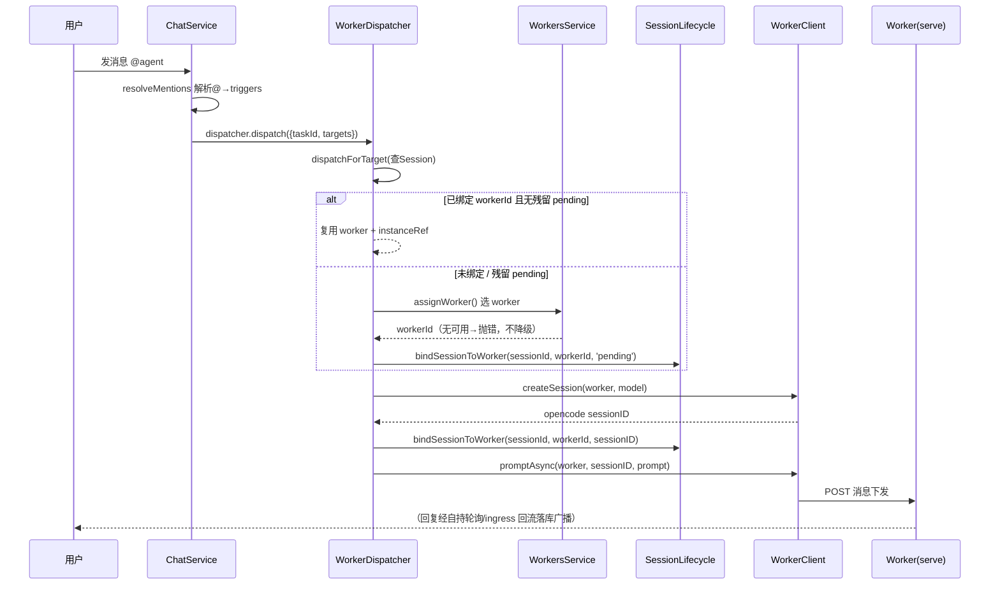
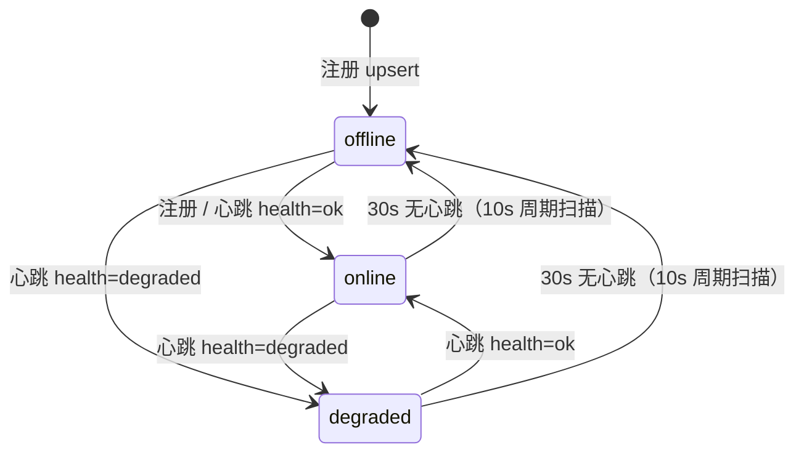

# Worker 与 Agent / 任务关系梳理

> 本文档回答三个核心问题：
> 1. worker 和 agent 是什么关系？
> 2. 任务在哪个 worker 执行是怎么确定的？
> 3. 任务绑定 worker 还是任意 worker，worker 是否要做状态维护？
>
> 所有结论均以代码实现为准，每节标注现实实现依据（文件:行号）与设计意图，并单列已知局限/待改进点。
> **本文描述截至 2026-08-08 的现状。**

---

## 1. 角色定位：三个不同层面的实体

`worker`、`agent`、`任务/会话` 属于三个不同层面的概念，容易混淆，先给出总览。

| 实体 | 层面 | 本质 | 生命周期 | 数据模型 |
|------|------|------|---------|---------|
| **Worker** | 运行层 | opencode 独立进程宿主：拉起真实 `opencode serve` 子进程，注册/心跳/上报能力，执行会话 | 进程级：启动即注册、心跳保活、超时判离线 | `Worker`（`server/prisma/schema.prisma:392-408`） |
| **Agent** | 配置层 | 平台侧智能体配置实体：模板/克隆/自定义，绑定技能、工具、模型（defaultModelId） | 配置级：由用户创建，与具体进程无关 | `Agent` |
| **任务 / 会话** | 编排层 | `Task` 是项目任务（一个任务一个群聊频道）；`Session` 是「任务 × Agent」的执行会话，`@@unique([taskId, agentId])` 保证每个任务下每个 Agent 至多一个会话 | 会话级：随任务创建、随分派激活（status: created → active） | `Session`（`server/prisma/schema.prisma:181-197`） |

### 1.1 worker：opencode 独立进程宿主（运行层）

- worker 是独立 Node 进程（`worker/`，零 server 依赖），负责 `spawn detached` 拉起真实的 `opencode serve` 子进程并代理其会话（`worker/src/index.ts:149-163`）。
- 生命周期动作：**启动注册**（T6，`X-Worker-Token` 鉴权 + 指数退避重试）、**定时心跳**（默认 10s，顺带上报 serve 健康与负载）、**优雅退出**（worker/README）。
- 能力上报：注册时上报 `opencodeVersion` 与 `capabilities`（`maxInstances`/`skills`/`tools`/`port`/`baseUrl`，`worker/src/index.ts:103-112`）。

### 1.2 agent：平台侧配置实体（配置层）

- Agent 是**配置而非进程**：模板/克隆/自定义创建，绑定技能、工具、模型（`defaultModelId`，`provider/model` 形式，见 `worker-dispatcher.ts:420-425` 的读取与解析）。
- Agent 不直接接触任何 worker；它只作为「会话的构成要素」（`Session.agentId`）与「分派的模型来源」存在。

### 1.3 任务 / 会话：编排层

- `Task` 与 `Session` 是**一对多**：一个任务可以有多个 Agent 参与，每个参与 Agent 对应一条 Session 记录。
- `Session` 是关系核心：`workerId` + `instanceRef` 两个字段承载「这个 Agent 在这个任务里的执行落在哪个 worker 的哪个 opencode 会话上」（`schema.prisma:185-186`）。
- `@@unique([taskId, agentId])`（`schema.prisma:195`）：同一任务下同一 Agent 只会有一个会话，后续 `@` 复用该会话。

> **设计意图**：三层分离保证「配置（Agent）」「运行（Worker）」「编排（Task/Session）」解耦。Agent 可被任意 worker 执行；worker 只是无状态的执行容器；会话是三者之间的唯一接线点。

---

## 2. 分派链路：@ 触发到 prompt 下发

用户消息带 `@` 触发时，完整链路如下（现实实现依据标注在括号内）。



### 2.1 链路各步实现依据

| 步骤 | 实现 | 依据 |
|------|------|------|
| ① @ 解析 | `ChatService.createMessage`：resolveMentions 解析 mentions，得到 triggers（仅 `dispatched` 目标下发），fire-and-forget 调用 dispatcher | `chat.service.ts:306-364` |
| ② 入口分派 | `WorkerDispatcher.dispatch` → 每个 target 走 `dispatchForTarget` | `worker-dispatcher.ts:348-353, 364-367` |
| ③ 查/复用会话 | 查 Session：已绑 workerId + instanceRef → 复用同一 opencode 会话；残留 pending 视为未绑定（F2 M5） | `worker-dispatcher.ts:374-405` |
| ④ 选 worker | `WorkersService.assignWorker()`（无可用返回 null → 抛错，调用方报错不降级 mock） | `workers.service.ts:393-398, 257-281` |
| ⑤ 首次绑定 | `bindSessionToWorker(sessionId, workerId, PENDING_INSTANCE_REF='pending')` 占位 | `worker-dispatcher.ts:31, 399-404` |
| ⑥ 建 opencode 会话 | `workerClient.createSession(worker, model)`；成功后第二次 bind 写入真实 instanceRef；失败 → `unbindSession` 回滚 | `worker-dispatcher.ts:445-464` |
| ⑦ 下发 prompt | doclib 上下文注入拼 prompt → `promptAsync`（fire-and-forget），工作目录隔离到 `<WORK_DIR>/tasks/<taskId>` | `worker-dispatcher.ts:427-429, 485-493` |
| ⑧ 完成判定 | 自持轮询 getMessages 命中 step-finish + ingress 回流双通道，completedSessions 幂等 | `worker-dispatcher.ts:502-516` |

> **设计意图**：链路刻意对齐 09 篇 §5.1「@ 触发同步返回受理，处理结果走 SSE」；WorkerDispatcher 是 MockDispatcher 的 Phase 4 替换实现，对外零改动（`chat.service.ts:303`）。

---

## 3. 调度算法 assignWorker

`WorkersService.assignWorker`（`workers.service.ts:257-281`）是**当前唯一的 worker 选择逻辑**，全平台所有分派共用。

### 3.1 算法规则

| 阶段 | 规则 | 依据 |
|------|------|------|
| 候选 | `status != offline`（degraded 也在候选内，只是排后） | `workers.service.ts:261-263` |
| 匹配 | `opencodeVersion` 精确匹配（req 提供时）；剩余容量 `capabilities.maxInstances - load.instances` ≥ 需求槽位（默认 1） | `:269-273` |
| 排序 | online 优先；同状态内剩余容量降序（负载最少优先） | `:274-279` |
| 结果 | 无可用 → 返回 `null`，调用方抛「无可用 worker」错误，**不降级** mock | `:280, 393-398` |

### 3.2 已知局限 / 待改进（截至 2026-08-08）

- **不按能力匹配**：调度只看「在线 + opencode 版本 + 容量」，**不匹配 skills / tools / mcpStatus**。即某个 Agent 需要的技能在候选 worker 上不存在时，仍可能被分派过去，执行时才暴露。
- **容量信息依赖上报准确**：`load.instances` 来自 worker 心跳上报（见 §7），worker 侧实例计数挂钩点尚待 T10 完整接线。
- **request 参数尚未被调用方使用**：`assignWorker` 支持 `AssignmentRequirement`（opencodeVersion/instances），但当前 `dispatchForTarget` 调用时**未传 req**（`worker-dispatcher.ts:395`），即版本精确匹配与容量槽位需求实际走的是默认值。

> **待改进方向**：将 `capabilities.skills/tools` 纳入匹配条件（需先解决 §7 的 skills 上报为空问题）；`dispatchForTarget` 传入 `AssignmentRequirement` 以启用版本/槽位约束。

---

## 4. 绑定策略：任务不绑定固定 worker

**结论：任务/会话不绑定固定 worker。** 具体分两种「绑定」语义，需要区分：

### 4.1 首次分派：任意可用 worker

- 首次 `@` 时 Session 未绑定（`workerId` 为空）→ `assignWorker()` 从全部可用 worker 中选一个（负载最少优先），并非用户/任务预先指定。
- 选定后通过 `bindSessionToWorker` 把 `workerId` + `instanceRef` **持久化**写入 Session（`session-lifecycle.service.ts:49-100`）。

### 4.2 二次 @：复用同一 worker + 同一 opencode 会话（D3）

- 再次 `@` 同一 Agent（同一 Session）：查到已绑 `workerId` 与真实 `instanceRef` → **直接复用**，不重新分配、不新建 opencode 会话，保证上下文连续。
- 幂等语义：`bindSessionToWorker` 对同 `(taskId, workerId, instanceId)` 复用已有 `TaskGroupInstance` 行而非报错（`session-lifecycle.service.ts:65-81`）。

### 4.3 绑定失败回滚（F2 M5）

- `createSession` 失败 → `unbindSession` 事务回滚：Session 恢复 `created` + 清空 `workerId/instanceRef` + `TaskGroupInstance` 软移除（`removedAt=now`），下次 `@` 重新分配 worker。
- 该机制防「绑坏 worker 后永不重分配」；残留 `pending` 占位在下次分派时同样视为未绑定重新分配（`worker-dispatcher.ts:382-405`）。

### 4.4 状态机

```
created ──首次 bind(pending)──> active ──第二次 bind(真实 instanceRef)──> active
    │                                                                      │
    └──unbindSession（createSession 失败回滚）──> created（可重新分配）      └── 二次@ 复用
```

> **设计意图**：首次自由选择 + 二次固定复用，兼顾「负载均衡」与「会话上下文连续性」；失败回滚保证不残留坏绑定。

---

## 5. Worker 状态维护

Worker 是**有状态的**，由 server 侧统一维护，worker 自身只负责上报。状态机如下：



### 5.1 三态语义

| 状态 | 含义 | 调度行为 | 离线判定 |
|------|------|---------|---------|
| `online` | 心跳正常，健康 | 优先候选 | 不适用 |
| `degraded` | 心跳正常但 health=degraded | **降权排后**（仍在候选集，仅在排序时靠后） | **不改变**：仍在候选，30s 无心跳同样判 offline |
| `offline` | 心跳超时 / 初始态 | 排除出候选集 | 触发条件：30s 无心跳（`WORKER_OFFLINE_TIMEOUT_MS=30_000`） |

> 定义见 `workers.constants.ts:18-23`；调度降权逻辑见 `workers.service.ts:274-279`。

### 5.2 状态维护实现

| 机制 | 实现 | 依据 |
|------|------|------|
| 心跳刷新 | `heartbeat(id, dto, token)`：health=ok→online / degraded→degraded，刷新 `load` + `lastHeartbeatAt`；返回下行命令（pull 模型，一次有效） | `workers.service.ts:151-198` |
| 离线扫描 | `markStaleWorkersOffline`：仅更新 `status != offline 且 (lastHeartbeatAt IS NULL 或 < now-30s)` 的行，10s 周期 × 3 = 30s | `:234-249`、`workers.constants.ts:12-16` |
| 防冒充 | 心跳比对注册时落库的 `tokenHash`（bcrypt），不匹配 → 401（防共享 token 持有者冒充任意已注册 workerId） | `workers.service.ts:162-170` |
| 索引 | `@@index([status, lastHeartbeatAt])` 支撑离线扫描 | `schema.prisma:406` |

### 5.3 已知局限 / 待改进

- **degraded 只降权不隔离**：degraded worker 仍可能被选中（仅当无 online worker 时），无「禁止调度 degraded」的开关。
- **tokenHash 可选**：`tokenHash` 为 `String?`，worker 未设 token 注册时心跳鉴权跳过（`if (token && worker.tokenHash)`），存在空档。

---

## 6. TaskGroupInstance：任务 × Worker 实例记录

`TaskGroupInstance`（`schema.prisma:410-422`）记录「一个任务在某 worker 上的一个 opencode 会话实例」。

| 字段 | 含义 |
|------|------|
| `taskId` + `workerId` + `instanceId` | 任务、worker、opencode 会话三方关联 |
| `removedAt` | **软删除标记**：unbindSession 回滚时置位，历史实例行保留 |
| `createdAt` | 实例创建时间 |

- **写入方**：`bindSessionToWorker` 事务内 upsert（`session-lifecycle.service.ts:65-81`）。
- **用途**：任务页查询执行实例的依据（`getInstancesByTask`，见 `session-lifecycle.service.ts:32` 注释）。
- **与 Session 的关系**：Session 是「任务×Agent」的编排实体（一条），TaskGroupInstance 是「任务×worker×实例」的执行记录（可多条：任务换 worker 重分配时新增/复用）。两者通过 `taskId` 关联，Session.workerId/instanceRef 是当前生效绑定，TaskGroupInstance 是执行历史。

---

## 7. 信息上报现状

### 7.1 注册上报（T6）

注册时上报 `opencodeVersion` + `capabilities`（`worker/src/index.ts:103-132`）：

| 字段 | 内容 | 备注 |
|------|------|------|
| `maxInstances` | 1（单实例） | 当前恒为 1 |
| `skills` | **恒为 `[]`** | T10 待接线（资源注入器已注入 skills，但未回填上报） |
| `tools` | `GIT_TOOLS` 七项内置 git 工具名 | 不含注入的自定义工具 |
| `port` / `baseUrl` | serve 实际监听端口与直连地址（随机端口场景必须上报，否则回退死端口 4199） | F2 C2 / D2 |

### 7.2 心跳上报

心跳携带 `load.instances`（实例计数）+ `health`（ok/degraded）+ `mcpStatus`（30s 节流），见 `workers.service.ts:171-187`。

### 7.3 当前缺口（截至 2026-08-08）

| 缺口 | 现状 | 影响 |
|------|------|------|
| **skills 上报为空** | `capabilities.skills = []`，未接线 T10 | 调度无法按技能匹配（§3.2 局限的根因） |
| **tools 仅报 GIT_TOOLS** | 注入的自定义工具不在上报清单 | 能力清单不完整 |
| **mcpStatus 未关联 worker** | 心跳上报的 mcpStatus 只进 server 侧 `mcpServers` 全局内存 Map，未落库、未关联到 worker 详情 | worker 详情接口展示 MCP 状态为新增能力 |
| **worker 多实例隔离未实现** | `maxInstances=1`，单 worker 单会话 | 容量维度尚未真正参与调度 |

---

## 8. 结论摘要表

| # | 问题 | 结论 |
|---|------|------|
| 1 | **worker 和 agent 是什么关系？** | **无直接绑定关系**。worker 是运行层进程宿主（跑真实 opencode serve），agent 是配置层实体（模板/技能/工具/模型绑定）。二者通过 Session 间接关联：Session（任务×Agent）绑定 workerId + instanceRef，一个 agent 的任务可由任意可用 worker 执行（首次自由选择）。 |
| 2 | **任务在哪个 worker 执行是怎么确定的？** | 首次 `@` 时由 `assignWorker` 调度决定：候选 = 非 offline；匹配 = opencode 版本精确 + 剩余容量 ≥ 需求；排序 = online 优先 + 负载最少优先；无可用 → 报错不降级。**局限**：不按 skills/tools/mcpStatus 匹配。 |
| 3 | **任务绑定 worker 还是任意 worker，worker 是否要做状态维护？** | **不绑定固定 worker**（首次任意可用）；但绑定后**持久化**于 Session，二次 `@` 复用同一 worker + 同一 opencode 会话，绑定失败回滚重分配。**worker 需要状态维护**：server 侧维护 online/degraded/offline 三态（心跳刷新、30s 无心跳判离线、degraded 降权、tokenHash 防冒充），离线 worker 被排除出候选集。 |

---

## 附：代码索引

| 主题 | 位置 |
|------|------|
| 分派主流程 | `server/src/chat/worker-dispatcher.ts:364-531` |
| 调度算法 | `server/src/workers/workers.service.ts:257-281` |
| 心跳 / 状态刷新 | `server/src/workers/workers.service.ts:151-198` |
| 离线扫描 | `server/src/workers/workers.service.ts:234-249` |
| 状态常量 | `server/src/workers/workers.constants.ts:18-23` |
| 会话绑定 / 解绑 | `server/src/workers/session-lifecycle.service.ts:49-125` |
| Worker / TaskGroupInstance / Session 模型 | `server/prisma/schema.prisma:392-422, 181-197` |
| worker 能力上报 | `worker/src/index.ts:103-132` |
| @ 触发入口 | `server/src/chat/chat.service.ts:306-364` |
