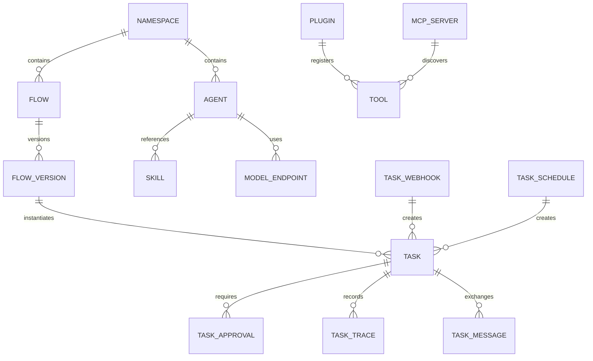
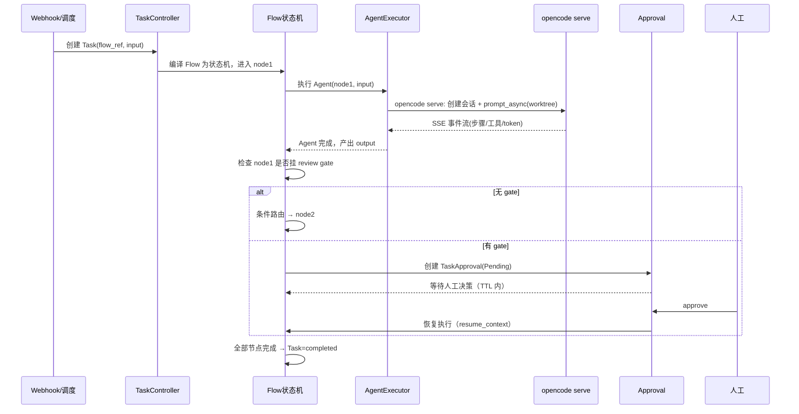
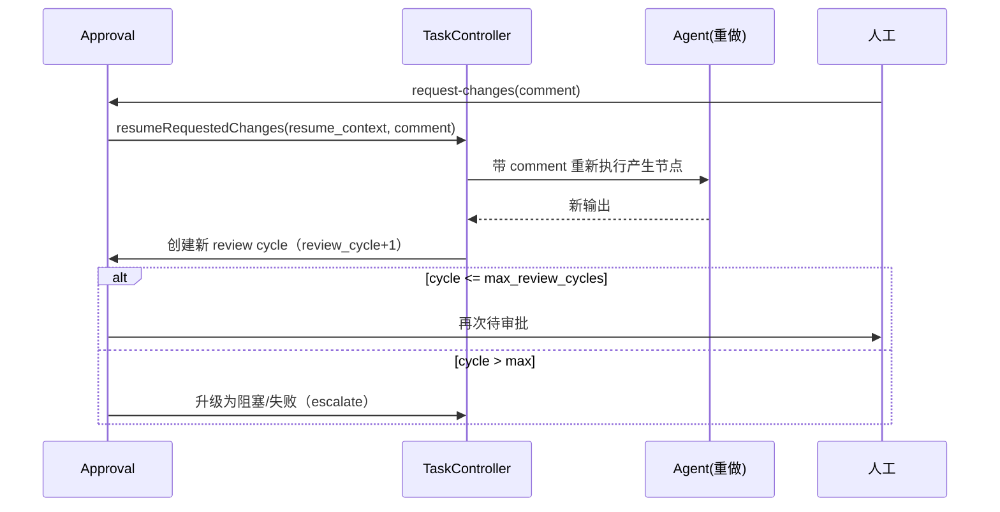
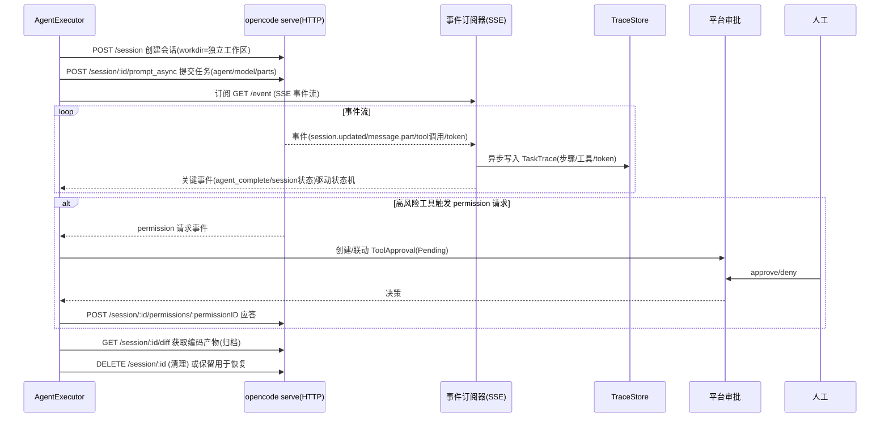

# Orchestra 通用任务编排平台 — 架构设计文档

| 项 | 内容 |
|---|---|
| 文档版本 | v0.1（草案） |
| 编写日期 | 2026-08-03 |
| 关联文档 | [需求规格说明书 PRD](requirements.md) · [设计决策记录 ADR](decisions.md) |
| 设计状态 | 待评审 |

---

## 1. 设计目标与约束

### 1.1 设计目标

1. **平台与业务分离**：编排内核与业务流程（Blueprint）解耦，业务以声明式资源按需安装。
2. **只做编排、不做实现**：执行委托给外部工具（opencode 编码、Jenkins 构建、GitHub/Gitee 代码托管），通过插件/MCP 对接。
3. **人工在环**：审批关卡为结构强制，未批准不推进。
4. **声明式优先**：一切皆资源（K8s 风格），YAML Manifest 可版本化、可评审、可审计。
5. **编排零 Token**：编排决策为确定性逻辑，不消耗模型 Token（NFR-05）。
6. **本地到生产平滑演进**：单进程（内存+内嵌 worker）→ Postgres → 分布式 worker + 消息总线，同一资源模型。

### 1.2 关键约束（来源 ADR）

| 约束 | 决策 |
|---|---|
| 后端语言 | TypeScript（Node + TS）（ADR-007） |
| 前端 | React + TypeScript（ADR-012） |
| 存储 | Postgres（生产）/ 内存（本地），存储层抽象（ADR-008） |
| 消息 | MVP 内存队列；M2 NATS JetStream（ADR-008） |
| 编排模型 | 确定性状态机 + 资源控制器，编排零 Token（ADR-009） |
| 运行时 | opencode serve API（REST + SSE，常驻实例）（ADR-010） |
| 插件 | MCP 一等标准 + 原生插件（ADR-011） |
| 审批 | 纯人工，预留 auto_review_policy 扩展位（ADR-002） |

---

## 2. 总体架构

### 2.1 分层视图

```
┌────────────────────────────────────────────────────────────────────────┐
│                    业务层（Blueprint / 可插拔，与平台分离）               │
│   软件公司开发流程包 │ 其他领域包（按需安装，参数/结构可定制）             │
├────────────────────────────────────────────────────────────────────────┤
│                    平台内核（Orchestra Core）                           │
│  ┌──────────────┐ ┌──────────────┐ ┌──────────────┐ ┌──────────────┐  │
│  │ Agent管理     │ │ 流程编排(Flow) │ │ 任务执行(Task) │ │ 人工审批     │  │
│  │ (prompt/工具/ │ │ (DAG/条件/    │ │ (状态机/重试/  │ │ (Approval    │  │
│  │  技能/模型)   │ │  并行/循环)   │ │  幂等/租约)   │ │  状态机)     │  │
│  └──────────────┘ └──────────────┘ └──────────────┘ └──────────────┘  │
│  ┌──────────────┐ ┌──────────────┐ ┌──────────────┐ ┌──────────────┐  │
│  │ 资源控制器     │ │ 插件管理      │ │ 可观测性      │ │ 通知/触发     │  │
│  │ (reconcile)  │ │ (市场/MCP)    │ │ (Trace/日志/  │ │ (cron/webhook │  │
│  │              │ │              │ │  成本/指标)   │ │  /IM)        │  │
│  └──────────────┘ └──────────────┘ └──────────────┘ └──────────────┘  │
├────────────────────────────────────────────────────────────────────────┤
│                    基础设施层（抽象接口，可替换）                         │
│  ┌──────────────┐ ┌──────────────┐ ┌──────────────┐ ┌──────────────┐  │
│  │ 存储 Store    │ │ 消息总线      │ │ 工具运行时    │ │ 模型网关      │  │
│  │ (memory/sql) │ │ (mem/nats)   │ │ (mcp/cli/http)│ │ (model route)│  │
│  └──────────────┘ └──────────────┘ └──────────────┘ └──────────────┘  │
├────────────────────────────────────────────────────────────────────────┤
│  外部系统：opencode(运行时) │ Jenkins │ GitHub/Gitee │ 企业微信 │ MCP Server 生态 │
└────────────────────────────────────────────────────────────────────────┘
```

### 2.2 进程组件

| 组件 | 职责 | 部署 |
|---|---|---|
| **`orchestra-server`** | Node/TS 服务：REST API、资源控制器、调度器、Web 控制台静态资源、可选内嵌 worker | 单进程可起 |
| **`orchestra-worker`** | Node/TS 服务：任务执行：从队列取任务、通过 `opencode serve` API 驱动 Agent 执行、上报状态 | 独立进程（M2 分布式） |
| **`orchestractl`** | cliyard 生成的 CLI（Python click 命令组，specs/ 声明式定义） | 任意节点（AI/自动化调用） |
| **Web 控制台** | React SPA，运维/设计/审批界面 | 由 server 托管 |

### 2.3 本地到生产演进

| 形态 | 存储 | 执行模式 | 消息 |
|---|---|---|---|
| 本地开发 | memory | 内嵌 worker | sequential |
| 单机生产 | Postgres | 内嵌 worker | sequential / message-driven |
| 分布式 | Postgres | 独立 worker | NATS JetStream（M2） |

---

## 3. 技术选型

| 领域 | 选型 | 说明 |
|---|---|---|
| 后端 | Node.js 22 + TypeScript 5 | 与 opencode 同生态、全栈 TS、类型安全 |
| Web 框架 | Hono | 轻量，REST 优先，TypeScript 原生 |
| 数据库 | PostgreSQL 14+ | 资源状态/任务/Trace/审计；node-pg 驱动 + pg 连接池 |
| 迁移 | drizzle-orm（drizzle-kit） | SQL 迁移版本化 |
| 校验 | zod + 自研 Manifest 解析 | YAML → 资源对象 |
| 前端 | React 18 + TypeScript + Vite + Ant Design | 控制台/管理/审批界面 |
| API 契约 | OpenAPI 3.1 + redocly lint | 先契约后实现 |
| opencode 集成 | `@opencode-ai/sdk`（类型安全客户端：session/config/event/permission）+ SSE 事件订阅 | ADR-010，复用官方 SDK 免自研客户端 |
| MCP 客户端 | `@modelcontextprotocol/sdk`（官方 TS） | ADR-011 |
| opencode 运行时 | `opencode serve` 常驻实例（守护进程，`/global/health` 健康检查），平台作为其 HTTP 客户端 | ADR-010 |
| 任务队列（MVP） | 内存队列（channel + worker pool） | M2 换 NATS |
| 指标 | prom-client + OpenTelemetry JS SDK | /metrics + 链路导出 |
| 审计 | 结构化日志 + 审计表 | 双写 |
| 配置 | YAML + 环境变量 | 12-factor |

---

## 4. 核心数据模型

### 4.1 资源对象（K8s 风格，`src/resources/` 模块）

所有资源统一结构：`apiVersion / kind / metadata(name, namespace, labels, annotations, resourceVersion, generation, createdAt) / spec / status`。

### 4.2 资源类型清单与核心字段

| 资源 | 关键 Spec 字段 | 关键 Status 字段 |
|---|---|---|
| `Agent` | `prompt`、`modelRef`、`fallbackModelRefs`、`tools[]`、`allowedTools[]`、`roles[]`、`skills[]`、`limits{maxSteps, timeoutSeconds, tokenBudget}`、`runtimeRef`、`workingDir`、`memory`、`execution` | `phase`、`lastError` |
| `ModelEndpoint` | `provider`、`baseUrl`、`defaultModel`、`auth{secretRef}`、`fallback[]` | `phase`、`lastError` |
| `Skill` | `name`、`version`、`prompt`、`tools[]`、`requiredPlugins[]` | `phase` |
| `Flow` | `version`、`nodes[{id, type, agentRef, outputs, ...}]`、`edges[{from, to, type, condition, ...}]` | `phase`、`publishedVersion` |
| `Task` | `flowRef`、`flowVersion`、`input`、`priority`、`retry`、`messageRetry`、`requirements{region,gpu,model}` | `phase`、`currentNode`、`blockedOn`、`lease{worker, expiresAt}`、`output` |
| `TaskApproval` | `taskRef`、`checkpointId`、`checkpointType`、`agent`、`reason`、`ttl`、`allowRequestChanges`、`maxReviewCycles`、`reviewCycle`、`output`、`resumeContext` | `phase(Pending/Approved/Rejected/ChangesRequested/Expired/Blocked)`、`decision`、`decidedBy`、`decidedAt`、`comment` |
| `ToolApproval` | `taskRef`、`tool`、`operationClass`、`agent`、`input`、`reason`、`ttl` | 同上 |
| `Plugin` | `name`、`version`、`source(builtin/market/mcp)`、`displayName`、`configSchema[]`、`declaredTools[]`、`runtime{requirements[], installHints[]}`、`dependencies[]` | `phase`、`installedTools[]` |
| `McpServer` | `transport(stdio/http)`、`command/args/env` 或 `endpoint`、`auth`、`toolFilter`、`reconnect`、`allowPrivate` | `phase`、`discoveredTools[]`、`lastSyncedAt` |
| `RuntimeInstance` | `name`、`endpoint`、`auth{type, username, secretRef}`、`defaultWorkdir` | `status` |
| `Secret` / `SealedSecret` | `data`（加密）/ `encryptedData` | `phase` |
| `TaskSchedule` | `cron`、`flowRef`、`inputTemplate`、`concurrency`、`enabled` | `phase`、`lastRunAt` |
| `TaskWebhook` | `path`、`flowRef`、`inputTemplate`、`signatureSecretRef`、`idempotency` | `phase`、`lastRunAt` |
| `Namespace` | `quota`、`members` | `phase` |
| `NotificationRule` | `events`、`channels`、`template`、`enabled` | `phase` |
| `AgentPolicy` / `AgentRole` / `ToolPermission` | 治理规则 | `phase` |
| `Worker` | `capacity`、`region`、`models[]`、`gpu`、`heartbeat` | `phase`、`currentLoad` |
| `EvalDataset` / `EvalRun`（M3） | golden 数据 / 运行结果 | `phase` |

### 4.3 核心关系



### 4.4 数据库表（Postgres，核心表）

| 表 | 说明 | 关键列 |
|---|---|---|
| `resources` | 通用资源主表（type/name/namespace/spec/status jsonb） | `(namespace, type, name)` 唯一，`generation`，`resource_version` |
| `tasks` | 任务实例 | `phase`、`current_node`、`worker_lease_expires_at`、`idempotency_key` 唯一 |
| `task_messages` | Agent 间消息/分支状态 | `idempotency_key` 唯一、`branch_id`、`trace_id` |
| `task_trace_events` | Trace 事件 | `step_id`、`type`、`agent`、`tool`、`tokens`、`latency_ms` |
| `approvals` | 审批（task/tool 两类） | `phase`、`decision`、`decided_by`、`expires_at`、`review_cycle` |
| `audit_logs` | 审计 | `actor`、`action`、`resource`、`before/after` |
| `secrets` | 加密凭证 | `encrypted_data`、`sealing_key_id` |

> 设计取舍：MVP 用**通用资源表**（type 区分 + jsonb spec/status）降低多表成本；性能瓶颈出现时再拆物理表。Task/Trace/Approval 为高频且需事务，独立表。

---

## 5. API 设计概览

REST API，前缀 `/api/v1`，OpenAPI 3.1 契约先行。

| 方法 | 路径 | 说明 |
|---|---|---|
| GET/POST | `/api/v1/agents` | Agent 列表/创建 |
| GET/PUT/DELETE | `/api/v1/agents/{name}` | Agent 详情/更新/删除 |
| GET/POST | `/api/v1/flows` · `/api/v1/flows/{name}` | Flow CRUD |
| POST | `/api/v1/flows/{name}/publish` | 发布流程版本 |
| GET/POST | `/api/v1/tasks` | 任务列表/手动创建 |
| GET | `/api/v1/tasks/{name}` | 任务详情（含 trace 摘要） |
| GET | `/api/v1/tasks/{name}/trace` · `/logs` | Trace / 日志 |
| POST | `/api/v1/tasks/{name}/cancel` · `/retry` · `/pause` · `/resume` | 生命周期操作 |
| GET | `/api/v1/approvals?state=pending` | 待审批列表 |
| POST | `/api/v1/approvals/{name}/decide` | 审批决策（body: `{decision, comment}`） |
| POST | `/api/v1/webhooks/{name}/trigger` | Webhook 触发入口（签名校验） |
| GET/POST | `/api/v1/plugins` · `/api/v1/plugins/{name}/install` | 插件市场 |
| GET/POST | `/api/v1/mcp-servers` | MCP 服务器管理 |
| GET | `/api/v1/metrics` | Prometheus（独立端口） |
| POST | `/api/v1/secrets` · `/api/v1/secrets/{name}/seal` | 凭证管理 |
| GET/POST | `/api/v1/skills` · `/api/v1/skills/{name}` | Skill 管理 |
| GET/POST | `/api/v1/task-schedules` · `/api/v1/task-webhooks` | 触发器管理 |

---

## 6. CLI 设计（cliyard，AI 与自动化操作入口）

### 6.1 定位与原则

- Web 前端给人用（可视化），**CLI 给 AI/Agent 与自动化用**：opencode 等编码工具、脚本、CI 通过 CLI 确定性操作平台。
- CLI 基于 **cliyard**（YAML 驱动，github.com/guolong123/cliyard）：声明式定义命令，针对平台 RESTful API（`/api/v1`）生成。
- 原则：命令与 RESTful API 一一对应（资源=命令组、method=子命令）；输出默认 JSON（AI 可解析），表格供人读；Auth 通过 `_auth.yaml` 配置链管理。

### 6.2 命令树（与 RESTful API 对齐）

| 命令 | 对应 API | 说明 |
|---|---|---|
| `orchestra agent list` | GET /api/v1/agents | Agent 列表（--namespace/--page） |
| `orchestra agent create` | POST /api/v1/agents | 创建（--name/--prompt/--runtime-ref/--workdir...） |
| `orchestra agent get\|update\|delete` | GET/PUT/PATCH/DELETE /api/v1/agents/{name} | 详情/更新/删除 |
| `orchestra flow list\|create\|get` | .../flows | 流程管理 |
| `orchestra flow publish` | POST /api/v1/flows/{name}/publish | 发布版本 |
| `orchestra task list\|create` | .../tasks | 任务管理 |
| `orchestra task get --trace` | GET .../tasks/{name}/trace | 含 trace |
| `orchestra task cancel\|retry\|pause\|resume` | POST .../tasks/{name}/cancel 等 | 生命周期动作 |
| `orchestra approval list --state pending` | GET .../approvals | 审批列表 |
| `orchestra approval decide` | POST .../approvals/{name}/decide | 审批决策 |
| `orchestra runtime-instance list\|create\|test` | .../runtime-instances | 运行时实例管理 |
| `orchestra plugin install` | POST .../plugins/{name}/install | 插件安装 |
| `orchestra mcp-server sync` | POST .../mcp-servers/{name}/sync | MCP 工具同步 |
| `orchestra skill list\|create` | .../skills | 技能管理 |
| `orchestra secret create --seal` | POST .../secrets | 凭证（加密） |
| `orchestra webhook trigger` | POST .../webhooks/{name}/trigger | 手动触发 webhook |
| `orchestra namespace list\|create` | .../namespaces | 命名空间 |

### 6.3 Auth 与配置

- `_auth.yaml`：server（base_url 指向平台 /api/v1）+ auth 链（env 读取 ORCHESTRA_TOKEN / login 获取 Bearer token / inject 注入 Authorization header），persist 到 cliyard-config。
- AI 场景：通过环境变量注入 token（`ORCHESTRA_TOKEN`），不落盘明文。

### 6.4 生成与分发

- 开发期：Library 模式（create_cli('./specs/') 动态生成，无需编译）。
- 交付：Gen 模式（cliyard gen --name orchestra → pip 包），或与平台版本同发。
- specs/ 目录随平台仓库维护，命令与 API 同步演进（OpenAPI → specs 部分可生成）。

---

## 7. 关键流程时序

### 7.1 任务执行主流程（顺序 Flow + 审批 gate）



### 7.2 审批打回循环（ChangesRequested）



### 7.3 opencode 运行时集成（serve API 模式）



---

## 8. 模块划分与目录结构

```
orchestra/
├── docs/                     # PRD / ADR / 架构文档
├── src/
│   ├── server/               # 主服务入口（原 cmd/orchestra-server）
│   ├── worker/               # worker 入口（M2，原 cmd/orchestra-worker）
│   ├── specs/                # CLI 命令定义（cliyard YAML：_auth.yaml + resources/*.yaml）
│   ├── api/                  # REST 路由、handler、OpenAPI
│   ├── resources/            # 资源类型定义、Manifest 解析、校验、normalize
│   ├── store/                # 存储抽象（memory/sql 实现）、迁移
│   ├── controllers/          # 资源控制器（reconcile 循环）
│   ├── flow/                 # Flow 编译为状态机、图执行、条件/join
│   ├── executor/             # 任务执行器（opencode SDK 客户端、SSE 事件订阅）
│   ├── approver/             # 审批状态机、resume_context
│   ├── plugins/              # 插件抽象（native/mcp）、插件市场
│   ├── mcp/                  # MCP client（@modelcontextprotocol/sdk）、工具发现/物化、会话管理
│   ├── modelgw/              # 模型网关（provider 路由、fallback、token 计量）
│   ├── trigger/              # cron 调度、webhook 接收/签名/幂等
│   ├── notify/               # 通知抽象（webhook / 企业微信 / 飞书 / 钉钉）
│   ├── observability/        # trace 写入、指标、日志、审计
│   └── auth/                 # 认证、RBAC、命名空间解析
├── web/                      # React 控制台
├── plugins/                  # 内置插件（jenkins/github/gitee）
├── blueprints/               # 业务包（开发流程包等）
├── openapi/                  # OpenAPI 契约
├── charts/                   # Helm（M2）
└── docker-compose.yml
```

---

## 9. 里程碑实现映射（架构侧）

| 里程碑 | 架构交付 |
|---|---|
| **M1（MVP）** | server 单进程（内存/Postgres）+ 资源模型（Agent/ModelEndpoint/Flow/Task/Approval/Secret/Plugin/McpServer/触发器）+ 顺序/条件 Flow 状态机 + 审批状态机 + opencode 执行器（事件流解析）+ Jenkins/GitHub 原生插件 + MCP 接入 + Trace/日志/审计 + 企业微信通知 + orchestractl |
| **M2** | 并行/汇合/循环/版本管理 + worker 独立进程/NATS + 暂停恢复重跑 + Artifact 产物归档 + 工具级审批 + Gitee 插件 + 成本统计 + OTEL/Prometheus + Blueprint 安装/参数定制 + 飞书/钉钉 |
| **M3** | 可视化画布 + 子流程 + 委托分发 + A2A + Skill 市场 + 插件沙箱强化 + IM 发起任务 + Eval 体系 + Blueprint 结构覆盖定制 |

---

## 10. 风险与缓解

| 风险 | 影响 | 缓解 |
|---|---|---|
| opencode serve API 版本演进 / 接口不稳定 | Trace 与状态同步受阻 | 提前 PoC（ADR 待验证 P1/P2/P6）；以 opencode OpenAPI spec 为契约来源，复用官方 `@opencode-ai/sdk`（随版本演进，免自研客户端维护）；事件流缺失时降级为"Agent 级状态同步 + `/session/status` 轮询" |
| opencode serve 实例故障 / 长任务恢复不可靠 | 任务中断丢失 | serve 进程守护（healthcheck `/global/health` + 自动重启）；session 持久化于 opencode 侧，平台记录 session id 重启后恢复续跑；平台侧 checkpoint（输入/输出/节点索引）兜底重跑当前节点 |
| 通用资源表 jsonb 在 Task/Trace 高频场景性能不足 | 查询慢 | 独立高频表 + 索引；批量写入 Trace |
| 审批 resume_context 跨版本兼容 | 流程升级后旧任务无法恢复 | resume_context 携带 flow_version；恢复时按原版本执行 |
| 多 worker 并发 claim 竞态 | 任务重复执行 | 租约 + 行级锁 + 幂等键（ADR PoC P4） |
| 第三方插件安全 | 凭证泄露/越权 | 插件沙箱（M2）、凭证隔离、SSRF 防护、fail-closed 治理 |

---

## 11. 附录：M1 落地的首个开发顺序建议

1. **资源模型 + 存储 + API**（Agent/ModelEndpoint/Flow/Task/Secret CRUD）→ `orchestractl apply` 打通
2. **Flow 状态机 + 顺序执行 + opencode 执行器**（先跑通"单 Agent 任务"最小闭环）
3. **人工审批状态机 + resume**（顺序 Flow 中插入 gate）
4. **触发器**（手动 → cron → webhook 签名/幂等）
5. **插件**（Jenkins/GitHub 原生 + MCP 接入）
6. **可观测**（Trace/日志/审计）与**通知**（企业微信）
7. **Blueprint**：将"软件公司开发流程"沉淀为第一个业务包
8. 前端控制台覆盖以上操作

> 对应 PoC 清单见 ADR 第 9 章（P1~P6），建议开发启动前先完成 P1/P2/P6 三项 opencode serve 相关验证。
