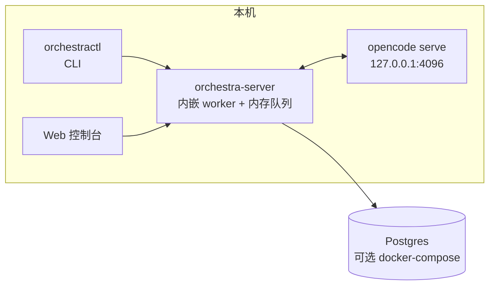
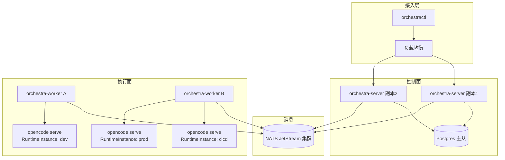
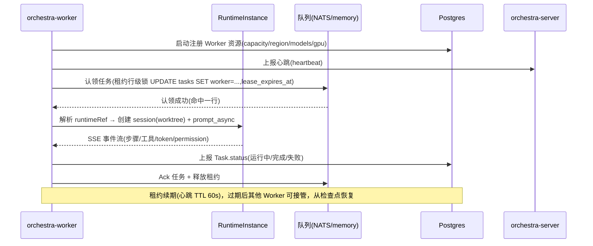

# Orchestra 部署架构

> 平台部署架构总览：本地开发 → 单机生产 → 分布式多节点的演进路径、容器化、运行时（opencode serve）部署与 CLI 分发。详细组件见 [architecture.md](architecture.md)「进程组件」，选型见 [tech-stack.md](tech-stack.md)。
> 更新时间：2026-08-03

---

## 1. 部署拓扑（演进路径）

部署形态沿「本地开发 → 单机生产 → 分布式多节点」三步演进（architecture.md 2.3），存储、执行模式、消息总线随阶段升级，但**资源模型不变**：同一份 YAML Manifest 在任意阶段可 apply，切换部署形态不迁移数据定义。

| 形态 | 存储 | 执行模式 | 消息 | 里程碑 |
|---|---|---|---|---|
| 本地开发 | memory | 内嵌 worker | sequential | M1 开发期 |
| 单机生产 | Postgres | 内嵌 worker | sequential / message-driven | M1 交付 |
| 分布式多节点 | Postgres | 独立 worker | NATS JetStream | M2 |

### 1.1 阶段一：本地开发

**单进程**：`orchestra-server` 一个进程承载 REST API、资源控制器、调度器与内嵌 worker；存储为内存后端；任务队列为内存队列（channel + worker pool）；运行时为本地 `opencode serve` 实例（默认 `http://127.0.0.1:4096`）。Postgres 可选：用 `docker-compose` 仅起 Postgres 验证 SQL 路径。

用途：开发、原型验证、PoC（ADR-010 P1/P2/P6）验证。零外部依赖，`npm run dev` 即可启动。

### 1.2 阶段二：单机生产

`orchestra-server`（含内嵌 worker）+ **Postgres** 持久化 + 内存/顺序队列 + 本地或同机 `opencode serve`。用于中小规模、单团队。`docker-compose.yml` 一键编排（见 2.2）。

| 服务 | 进程 | 存储 | 端口 |
|---|---|---|---|
| orchestra-server | Node 22（API + 控制器 + 内嵌 worker + 控制台静态资源） | Postgres（外置容器） | 3000（API/控制台），9090（/metrics 独立端口） |
| opencode-serve | opencode CLI 常驻进程 | opencode session 本地存储；任务工作区在共享卷 | 4096（HTTP，Basic Auth） |
| postgres | postgres:14+ | 数据卷 | 5432（仅内网） |

### 1.3 阶段三：分布式多节点（M2）

**server 与 worker 分离**：`orchestra-server` 无 worker（无状态，可多副本）；独立 `orchestra-worker` ×N 从队列认领任务执行；消息总线换 **NATS JetStream**；运行时为**多个 opencode serve 实例**（RuntimeInstance 资源，见 req-4.7），按 Agent 的 `runtimeRef` 路由到具体实例（就近执行 / 隔离环境 dev-cicd-prod / 容灾切换）。

Worker 通过**租约 + 行级锁**认领任务（PoC P4）：`UPDATE tasks SET worker=?, lease_expires_at=now()+60s WHERE phase='Pending' AND lease_expires_at < now()`，命中一行即认领成功；心跳续约，过期任务可被其他 Worker 接管，接管时从检查点恢复（FR-703 会话恢复联动）。

> 关联：资源表 `Worker`（capacity/region/models/gpu/heartbeat）、`Task.requirements`（region/gpu/model）驱动调度分配，见 [hld-4.5-task.md](hld-4.5-task.md) 与本文 3.2。

---

## 2. 容器化与编排

### 2.1 镜像

**后端镜像**（Node 22，`node:22-alpine` 基础，对应 ADR-007）：

- `orchestra/server`：入口 `orchestra-server`（含 `WORKER_ENABLED` 开关控制内嵌 worker，单机模式开、分布式关）；
- `orchestra/worker`：入口 `orchestra-worker`（M2）。两者可共享同一镜像、以不同 entrypoint 区分，也可分镜像发布，按团队 CI 习惯二选一。

**opencode serve 镜像**：基于官方 opencode 镜像叠加**环境基础层**（见 2.3），作为 RuntimeInstance 的部署单元。

### 2.2 编排方式

| 编排方式 | 适用阶段 | 说明 |
|---|---|---|
| docker-compose | 单机生产（M1） | 默认部署：`orchestra-server` + `postgres` + `nats`（可选，预留 M2）+ `opencode-serve`；一个命令拉起，数据落卷 |
| Helm（M2） | 分布式（M2） | `charts/` 目录；server 无状态多副本（Deployment + Service + HPA）、worker 为 Deployment/StatefulSet（容量按命名空间与 region 划分）、Postgres 外置（主从/托管）、NATS JetStream 集群、opencode-serve 按 RuntimeInstance 调度为独立 Deployment |

单机与分布式共用同一镜像与配置入口，仅编排差异（architecture.md 目录结构 `charts/` + `docker-compose.yml`）。

### 2.3 opencode serve 运行时部署

- opencode serve 为**常驻实例**（headless HTTP，默认端口 4096，`OPENCODE_SERVER_PASSWORD` Basic 认证），平台通过 REST + SSE 驱动，不 fork CLI 子进程（ADR-010）。平台注册表用 **RuntimeInstance** 资源管理多实例：`name / endpoint / auth / defaultWorkdir / status`（hld-4.7-runtime.md 3.2）。
- **部署位置**：
  - 与 worker 同机：就近执行，任务数据本地、延迟低；
  - 独立节点：环境隔离（dev / cicd / prod 各一实例，Agent 按环境选择，req-4.7「多实例使用场景」），Worker 仅做控制面。
- **环境依赖分层**（ADR-014 / req-4.7）：
  - **基础层（镜像预装）**：git / node / python / gh 等高频 CLI 预装进镜像，保证零安装延迟与确定性（NFR-07）；
  - **长尾层（Skill 自安装）**：jenkins-cli / kubectl 等低频 CLI 由会话内 Agent 按 skill 描述安装，平台通过四抓手治理：声明清单（`runtime.requirements`）、授权审批（安装命令 permission ask → ToolApproval）、执行观测（bash 调用进 Trace）、状态感知（环境预检写 Task status）。
- **健康检查**：平台定时（如 30s）探测各实例 `GET /global/health`，状态维护在 `RuntimeInstance.status`（正常 / 异常 / 未知）；实例异常时新任务进入 Pending（可重试）或按容灾策略切到健康实例。
- **每任务工作区**：任务创建后在其工作目录内建独立 worktree / 独立 clone（FR-704，如 `<workingDir>/.orchestra-worktrees/<task-id>`），并行任务互不干扰；任务终态按保留策略（保留 / 归档 / 删除）清理，避免磁盘膨胀。
- **守护与恢复**：serve 进程以 systemd / 容器方式守护，崩溃自动重启；session 持久化于 opencode 本地存储，平台记录 session id，serve 重启后 `GET /session/:id` 恢复续跑（FR-703）。

---

## 3. 多节点与 Worker 模型

### 3.1 Worker 生命周期

### 3.2 任务分配

- **调度分配**：server 调度器按 `Task.requirements`（region / gpu / model）与 Worker 上报的 `capacity / region / models[] / gpu` 匹配，将任务投递到对应队列分区；
- **队列**：M1 内存队列（channel + worker pool，单机）；M2 NATS JetStream（消息持久化、按 subject 分区、支持消费者组），`Queue` 接口抽象（`Enqueue/Claim/Ack/Nack`）使切换不动机器逻辑（hld-4.5-task.md 3.4）；
- **失败重试**：错误分类（可重试 / 非可重试）+ fixed/exponential 退避（封顶 5min），可重试错误重新入队（retryCount+1）；审批驳回归入非可重试，不走自动重试；NATS 侧死信队列承接多次失败消息供人工干预。

### 3.3 高可用

| 组件 | 高可用策略 |
|---|---|
| orchestra-server | 无状态多副本 + 负载均衡；控制器/调度器靠 Postgres 行级锁保证单点推进语义 |
| Postgres | 主从复制 / 托管服务故障转移；租约字段保证 worker 故障不丢任务 |
| NATS JetStream | 集群部署，消息持久化多副本 |
| orchestra-worker | 横向扩展；单 worker 崩溃由租约过期 + 其他 worker 接管补偿 |
| opencode serve | 多实例（RuntimeInstance）容灾：实例故障切换健康实例，配合 FR-703 会话恢复（工作区路径需实例间可达或重新 checkout） |

---

## 4. CLI 与自动化部署

### 4.1 CLI 分发

CLI（`orchestra`，cliyard 生成，对应 hld-cli / dld-cli）：

- **开发期**：Library 模式（`create_cli('./specs/')` 动态生成 click 命令组，无编译），在平台仓库内迭代；
- **交付**：Gen 模式（`cliyard gen --name orchestra --defs-path ./specs/`）生成 pip 包，**与平台版本同发**，避免命令漂移（FR-112）；specs/ 目录随平台仓库维护，API 变更同步更新 specs（OpenAPI → specs 部分可生成）。

### 4.2 供 AI 调用

- CLI 在 opencode 运行环境 / CI / 脚本中调用，认证走 `_auth.yaml` 链：`ORCHESTRA_URL` 指定平台地址，`ORCHESTRA_TOKEN` 环境变量注入 Bearer token，不落盘明文（FR-110）；
- 输出默认 JSON（`ORCHESTRA_OUTPUT=json`），确定性无交互，错误携带 API 错误码，AI 可稳定解析（FR-109）；`orchestra task get --trace --json` 供 AI 自省。

---

## 5. 配置与安全

### 5.1 配置来源

12-factor：**环境变量 + YAML 配置文件**（tech-stack 2.13 / architecture 3 技术选型「配置」）。`ORCHESTRA_*` 环境变量：

| 变量 | 说明 |
|---|---|
| `ORCHESTRA_DB_DSN` | Postgres 连接串（单机/分布式生产必填；本地可缺省走内存后端） |
| `ORCHESTRA_NATS_URL` | NATS 地址（M2 分布式；缺省回落内存队列） |
| `ORCHESTRA_SECRET_KEY` | 凭证加密主密钥（Secret AES 加密存储，secrets 表 `sealing_key_id` 关联） |
| `ORCHESTRA_RUNTIME_DEFAULT` | 默认 opencode serve 实例 endpoint（未指定 runtimeRef 的 Agent 使用） |
| `ORCHESTRA_URL` / `ORCHESTRA_TOKEN` | CLI 侧：平台地址 / Bearer token |
| `WORKER_ENABLED` | 单机模式开内嵌 worker，分布式关（M2） |

### 5.2 网络与安全

- 服务间仅内网：API / 控制器 / worker 通过内网互通；Postgres 私有网段，不暴露公网；
- opencode serve 绑定 `127.0.0.1`（同机）或内网地址（独立节点），启用 `OPENCODE_SERVER_PASSWORD` Basic 认证；
- CLI / Webhook 经 API 网关或内网入口访问平台；入站 Webhook 用 HMAC-SHA256 签名校验（`signature_secret_ref`）；
- 出站请求统一过 `urlguard` 预检（拒绝 RFC1918 / 云元数据等私网地址，默认禁私网），防 SSRF（tech-stack 2.13）。

### 5.3 凭证与密钥

- Secret / SealedSecret 资源：`encrypted_data` AES 加密落库（pgcrypto 或应用层加密），**明文不落盘**（NFR-01）；
- 凭证按命名空间隔离（ADR-004）；任务执行时解密注入运行环境（opencode 会话 / 工具调用），不写入任务输入输出与审计日志（脱敏）；
- 平台密钥由 `ORCHESTRA_SECRET_KEY` 提供，M2 强化为 SealedSecret 与密钥轮换。

### 5.4 可观测部署

- **指标**：prom-client 暴露 `/metrics`（独立端口 9090），Prometheus 抓取；含任务吞吐、队列深度、租约过期、serve 健康等核心指标；
- **链路**：OpenTelemetry JS SDK 导出（OTLP），覆盖编排控制链路（NFR-05，不导出 Agent 推理细节）；Task Trace 事件异步批量落库，观测不阻塞执行路径；
- **审计**：全量审计双写 `audit_logs` 表（actor/action/resource/diff 脱敏/trace_id/source/result），按月分区（M2 起）。

---

## 6. 部署清单（checklist）

单机生产（M1）部署步骤：

1. **部署 Postgres**（14+）：创建数据库与账号，设置备份；
2. **初始化迁移**：运行 drizzle-kit 迁移（`resources / tasks / task_messages / task_trace_events / approvals / audit_logs / secrets / users / tokens / roles / role_bindings`），播种预置五角色与 system 命名空间；
3. **部署 opencode serve 实例并注册 RuntimeInstance**：起 serve 进程（含基础层环境），配置 `OPENCODE_SERVER_PASSWORD`，平台侧创建 RuntimeInstance 资源（endpoint / auth / defaultWorkdir），测试连接（探测 `/global/health`）；
4. **启动 server**：设置 `ORCHESTRA_DB_DSN`、`ORCHESTRA_SECRET_KEY`、`ORCHESTRA_RUNTIME_DEFAULT`；单机模式 `WORKER_ENABLED=true`；
5. **启动 worker**：M1 内嵌于 server；M2 独立 worker 进程并配置 `ORCHESTRA_NATS_URL`；
6. **配置 CLI / API 网关**：发布 orchestra CLI（pip 包），配置 `ORCHESTRA_URL` / `ORCHESTRA_TOKEN`；如有网关则配置路由、TLS 与限流；
7. **验证**：`GET /global/health` 通过；`orchestra` 命令可认证并列出资源；创建并跑通首个任务，确认 Task Trace 与审计落库。

> 分布式（M2）在步骤 4/5 替换为 Helm 部署（server 多副本 + worker Deployment + NATS 集群 + Postgres 主从），其余步骤一致。
