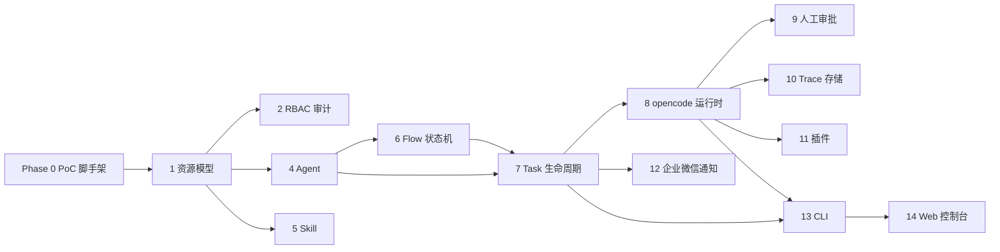

# Orchestra 开发计划

> 基于需求（req）/概要（hld）/详细（dld）/架构/技术栈/部署/决策（ADR）文档，给出从零到 M1/M2/M3 的可执行开发排期。
> 关联文档：[requirements.md](requirements.md)（里程碑）· [decisions.md](decisions.md)（PoC/ADR）· [deployment.md](deployment.md)（部署阶段）· [tech-stack.md](tech-stack.md)（选型）
> 更新时间：2026-08-03

---

## 1. 阶段总览

| 阶段 | 目标 | 交付物 | 依赖 | 预估 |
|---|---|---|---|---|
| Phase 0 前置 | PoC 验证 + 脚手架 | 6 项 PoC 结论 + TS 项目骨架 | 无 | 1-2 周 |
| Phase 1 M1 | MVP 可运行 | 平台基础 → Agent → Flow → Task → 审批 → 运行时 → 观测 → 插件最小集 → CLI | Phase 0 | 4-6 周 |
| Phase 2 M2 | 分布式与增强 | 并行/版本/分布式 worker/Blueprint/工具审批/成本/OTEL | M1 | 4-5 周 |
| Phase 3 M3 | 生态与画布 | 可视化画布/子流程/委托/A2A/Skill 市场/Eval | M2 | 4-5 周 |

> 里程碑范围以 requirements.md 第 7 章为准（M1 = FR-101~107、FR-201~205、FR-301~302、FR-401~403、FR-406、FR-501~505、FR-601~605、FR-608、FR-701~703、FR-705、FR-801~803、FR-901~902、FR-905、FR-1001~1002、NFR-01~05、NFR-08；M2/M3 见对应章节）。

---

## 2. Phase 0：前置准备（PoC + 脚手架）

### 2.1 PoC 验证清单（P1~P6，对应 decisions.md 待验证项）

> 六项 PoC 全部在 Phase 0 完成，其中 **P1/P2/P6 必须优先**（opencode serve 集成是 M1 最大技术风险，architecture.md 第 10 章明确要求开发启动前先验证）。每项给出通过标准与失败降级方案。

| PoC | 验证内容 | 通过标准 | 失败降级方案 | 关联模块 |
|---|---|---|---|---|
| P1 | `opencode serve` 的会话/消息/SSE 事件流接口（`POST /session`、`prompt_async`、`GET /event`）能否满足步骤级 Trace 解析与任务状态同步 | 订阅 `/event` 可稳定收到事件流（首个事件 `server.connected`）；`message.part`/工具调用/Token 消耗可解析为 Trace 步骤；`agent_complete`/session 状态可驱动任务状态机（ADR-001 双轨制） | 事件流解析降级为"Agent 级状态同步 + `GET /session/status` 轮询"，Trace 细粒度能力后置 | executor、observability |
| P2 | opencode 长任务会话恢复机制（session 持久化、进程重启后 `GET /session/:id` 续跑、`abort` 中止） | kill serve 进程后重启，`GET /session/:id` 能恢复会话并继续执行；运行中 `POST /session/:id/abort` 可中止 | 平台 checkpoint 兜底：持久化任务输入/输出/节点索引，恢复时重跑当前节点（architecture.md 第 10 章缓解） | executor、controllers |
| P3 | git worktree 方式的多任务并行工作区隔离可行性（FR-704） | 并行任务在 `<workingDir>/.orchestra-worktrees/<task-id>` 独立 checkout，互不干扰；任务终态按保留策略清理，磁盘不膨胀（deployment.md 2.3） | 独立 clone 方式替代（每个任务完整 clone 仓库），接受克隆开销 | executor、deployment |
| P4 | Postgres 行级锁实现任务 claim/lease 的并发正确性 | `UPDATE tasks SET worker=?, lease_expires_at=now()+60s WHERE phase='Pending' AND lease_expires_at < now()` 在多 worker 并发下恰好命中一行；心跳续约、过期可被接管（deployment.md 1.3） | 应用层分布式锁（如 advisory lock）或 M1 单 worker 顺序执行 | store、worker |
| P5 | MCP Server 工具自动发现与物化的端到端流程 | 注册 stdio/http MCP Server → `tools/list` 发现工具 → 物化为 Tool 资源 → Agent `allowedTools` 可引用 → 调用链路端到端走通（ADR-011） | 先只交付原生插件（Jenkins/GitHub），MCP 接入降级为 P2 能力 | mcp、plugins |
| P6 | opencode permission 请求（`POST /session/:id/permissions/:permissionID`）与平台 ToolApproval 审批联动可行性 | opencode 触发高风险工具 permission 请求 → 平台创建 ToolApproval（Pending）→ 人工 approve/deny → 平台应答 permission → opencode 继续执行（ADR-010/FR-606） | 审批不联动：permission 走 opencode 自身权限规则，平台仅记录审计 | approver、executor |

**PoC 产出**：每项一个结论文档（通过/降级 + 复现脚本），结论写入技术决策，未通过项按降级方案调整对应 dld 模块设计。

### 2.2 项目脚手架

| 任务 | 说明 | 产出 |
|---|---|---|
| 工程初始化 | Node 22 + TypeScript 5 + Hono + drizzle-orm + zod 依赖装配；tsconfig 严格模式 | 可运行的 `npm run dev` |
| 目录骨架 | 按 dld-overview 3.1 建 `src/` 全部模块目录（server/api/resources/store/controllers/flow/executor/approver/plugins/mcp/modelgw/trigger/notify/observability/auth/worker/specs） | 空模块 + barrel 导出 |
| 迁移基线 | `src/store/schema.ts` 定义 drizzle schema（`resources` 通用表 + `tasks/task_messages/task_trace_events/approvals/audit_logs/secrets/users/tokens/roles/role_bindings` 独立表），`drizzle-kit generate` 产出首个迁移 | drizzle/ 目录首个迁移文件 |
| OpenAPI 契约框架 | Hono 路由注册 + OpenAPI 3.1 描述 + redocly lint 接入（tech-stack 2.6） | `/api/v1` 基础 + openapi/ 契约基线 |
| 统一错误处理 | `src/api/errors.ts` 错误分类（404/409/400/401/403/429/504/Transient）+ 全局 `onError` handler（dld-overview 3.3） | 统一错误响应体 |
| CI | lint（ESLint `import/no-cycle` 开启）/ typecheck / 单测 / drizzle check 流水线 | GitHub Actions 或等价流水线 |

### 2.3 CLI 骨架（cliyard）

| 任务 | 说明 | 产出 |
|---|---|---|
| specs 目录初始化 | `specs/_auth.yaml`（`ORCHESTRA_URL`/`ORCHESTRA_TOKEN` 配置链）+ `_groups.yaml`（命令分组）（dld-cli 5.1） | 可认证空 CLI |
| 首批资源 YAML | agents/flows/tasks/approvals/runtime_instances/plugins/mcp_servers/skills/secrets/webhooks/namespaces 各 `.yaml` 骨架（list/get/create 命令，非 CRUD 动作后置） | specs/resources/ 首版 |
| 开发期验证 | `create_cli('./specs/')` Library 模式本地可跑，`orchestra --help` 输出命令树（FR-112） | CLI 开发骨架可运行 |

---

## 3. Phase 1：M1（MVP）

### 3.1 开发顺序（依赖驱动的任务分解）

> 依据架构设计第 10 章 M1 开发顺序展开。任务序号即推荐实施顺序（同一依赖层内可并行，见第 9 章）。

| # | 任务 | 依赖 | 对应文档 | 产出 |
|---|---|---|---|---|
| 1 | 资源模型 + 通用 `resources` 表 + drizzle 迁移（spec/status jsonb、CAS 乐观锁、软删除） | — | dld-4.1 / dld-overview 2.2 | 通用资源 CRUD + `apply` 管线（YAML → zod → normalize → CAS upsert） |
| 2 | RBAC + 命名空间 + 审计（roles/role_bindings/users/tokens 四表、命名空间解析、`system` 回退、audit_logs 双写） | 1 | dld-4.1 | auth 中间件、fail-closed 治理（NFR-02） |
| 3 | REST API 框架（Hono 路由 + OpenAPI 3.1 + 统一错误处理 + 分页/过滤约定） | 1 | dld-overview 4 | `/api/v1` 基础可对接 |
| 4 | Agent 资源 + ModelEndpoint（prompt/modelRef/fallbackModelRefs/tools/allowedTools/roles/skills/limits/runtimeRef/workingDir；引用解析与工具交集校验） | 1 | dld-4.2 | Agent CRUD + 模型引用 |
| 5 | Skill 资源（基础）（semver 版本、prompt 合并与物化、依赖双向校验） | 1 | dld-4.3 | Skill CRUD + prompt 合并 |
| 6 | Flow 编译状态机（顺序/条件边，状态机编译 + DAG 环检测 + 条件求值） | 4 | dld-4.4 | flow 编译 + 环检测 |
| 7 | Task 生命周期（八态状态机、手动/定时/Webhook 触发、重试退避、幂等键、内存队列抽象、task_messages） | 4,6 | dld-4.5 | Task 状态机 + 触发器 |
| 8 | opencode 运行时集成（`@opencode-ai/sdk` 客户端封装、`POST /session` + `prompt_async`、SSE 事件解析、会话恢复、worktree 工作区、双层权限联动） | 7 | dld-4.7 | executor + Trace 写入（ADR-001 双轨） |
| 9 | 人工审批（TaskApproval 状态机 + resume_context + TTL 扫描器 + maxReviewCycles 打回循环 + permission 联动） | 7,8 | dld-4.6 | approval 状态机 |
| 10 | Trace/日志存储 + 查询（task_trace_events/task_logs 批量写入队列、`GET /tasks/{id}/trace`、pino 结构化日志 + redact 脱敏） | 8 | dld-4.9 | 可观测基础 |
| 11 | 插件（Jenkins/GitHub 原生 + MCP 接入）（Plugin 抽象 native/mcp 双后端、安装生命周期、Secret 加密表、urlguard SSRF 防护） | 4,8 | dld-4.8 | plugin 工具注入 |
| 12 | 企业微信通知（NotificationRule 资源、notify_deliveries 表、出站 HMAC 签名、卡片模板） | 7 | dld-4.10 | 通知投递 |
| 13 | CLI（cliyard specs 完整）（全部资源 YAML 补全 + 动作命令 cancel/retry/decide/install/test/trigger（pause/resume 属 M2-3）+ JSON 输出 + 错误码透传） | 1-12 | dld-cli / architecture 6 | orchestra CLI 包（Library 模式） |
| 14 | Web 控制台（原型页 → 可运行）（独立 web/ 目录（React 19 + Tailwind v4），原型组件迁移，对接真实 REST API，覆盖核心管理/审批/Trace 界面） | 1-13 | requirements 4.11 / tech-stack 2.10 | 可运行控制台 |

### 3.2 M1 验收标准

- **FR 覆盖**：M1 里程碑 FR 集合全数实现并通过验收（FR-101~107、FR-201~205、FR-301~302、FR-401~403、FR-406、FR-501~505、FR-601~605、FR-608、FR-701~703、FR-705、FR-801~803、FR-901~902、FR-905、FR-1001~1002，NFR-01~05、NFR-08）。
- **可运行最小闭环**：创建 Agent → 编排顺序 Flow（含审批 Gate）→ 手动触发 Task → opencode serve 执行 → 审批人 approve/reject → Trace 可见可查 → 任务完成；全程可用 CLI（`orchestra agent create` → `orchestra flow publish` → `orchestra task create` → `orchestra task get --trace` → `orchestra approval decide`）驱动。
- **观察项**：Task Trace 落库并含步骤/工具/Token 明细；审计日志完整（资源变更 + 审批决策）；企业微信通知送达。

### 3.3 M1 里程碑出口条件

| 项 | 条件 |
|---|---|
| 部署 | 单机 docker-compose 可跑（`orchestra-server` + `postgres` + `opencode-serve`），部署清单走通（deployment.md 第 6 章）；`/global/health` 通过 |
| 测试 | 核心模块单测（resources/flow/approver/task 状态机）+ API 集成测试（真实 Postgres）+ opencode 端到端测试 |
| CLI | specs 完整 + Library 模式可运行，命令与 API 一一对齐（FR-112） |
| 文档 | 无新增要求（文档体系已完备），仅同步 PoC 结论到 ADR |

---

## 4. Phase 2：M2（分布式与增强）

> 对应 requirements.md M2 里程碑 FR 集合（FR-404~405、FR-408、FR-411、FR-506~507、FR-606~607、FR-704、FR-804~805、FR-903~904、FR-1003）+ ADR-005（Artifact 产物归档）。

| # | 任务 | 依赖 | 对应文档 | 产出 |
|---|---|---|---|---|
| M2-1 | 并行分支/汇合/循环（DAG 并行执行、join 汇合、循环节点） | M1 全部 | dld-4.4 | Flow 状态机升级 |
| M2-2 | Flow 版本快照（flow_versions 表、发布即快照、任务绑定 flowVersion、版本差异查看） | M2-1 | dld-4.4 | 版本管理 |
| M2-3 | Task 暂停/恢复/重跑（pause/resume 状态、rerun 复用幂等键） | M2-2 | dld-4.5 | 生命周期增强 |
| M2-4 | Worker 独立进程 + NATS JetStream（`orchestra-worker` 入口、Queue 接口切 NATS、租约认领/心跳续约/过期接管、失败重试入队） | M2-3 | dld-4.5 / deployment 1.3、3.1 | 分布式执行 |
| M2-5 | Blueprint 业务包（Blueprint 资源、打包/安装到命名空间、参数化定制、资源引用模型；将"软件公司开发流程"沉淀为首个业务包） | M2-2 | dld-4.4 / ADR-003 | 业务包市场 |
| M2-6 | 工具级审批（ToolApproval 状态机与 permission 联动量产化、高危工具运行时审批） | M1 的 9、11 | dld-4.6 / FR-606~607 | 工具审批闭环 |
| M2-7 | Token 成本统计（modelgw token 计量 + 成本聚合视图 + 按 Agent/命名空间统计） | M1 的 10 | dld-4.9 / FR-903 | 成本报表 |
| M2-8 | Gitee 插件（原生插件实现，与 GitHub 插件共用 Plugin 抽象） | M1 的 11 | dld-4.8 / FR-804 | 内置插件扩展 |
| M2-9 | OTEL/Prometheus（prom-client `/metrics` 独立端口 + OTEL 链路导出 + 任务/队列/租约指标） | M1 的 10 | dld-4.9 / deployment 5.4 | 指标与链路 |
| M2-10 | 飞书/钉钉通知（notify 渠道适配器扩展 + 模板） | M1 的 12 | dld-4.10 / FR-1003 | 通知渠道 |
| M2-11 | Artifact 产物归档（Artifact 资源、Task 输出升级为可归档产物、Schema 校验、issue/PR 关联） | M2-7 | ADR-005 | 验收归档 |
| M2-12 | SealedSecret 强化（密钥轮换、SealedSecret 资源） | M1 的 11 | tech-stack 2.13 | 安全增强 |
| M2-13 | CLI 增强（Blueprint 安装、Artifact 查询、成本统计、NATS/Worker 管理命令；Gen 模式发布独立 pip 包） | M2-1~12 | dld-cli / FR-112 | CLI 交付版 |

**M2 验收**：

- 多 worker 分布式执行（2+ worker 并行认领任务、租约竞争正确、单 worker 崩溃不丢任务）；
- 并行 Flow 与循环正确执行、Flow 版本回滚/差异可见；
- 分布式部署（deployment 阶段三：server 多副本 + worker Deployment + NATS 集群）通过部署清单；
- Token 成本、OTEL/Prometheus 指标、飞书/钉钉通知、Gitee 插件可用。

---

## 5. Phase 3：M3（生态与画布）

> 对应 requirements.md M3 里程碑 FR 集合（FR-206、FR-303、FR-407、FR-409~410、FR-706、FR-806、FR-1004 + P2 其余项）+ 画布与 Eval 体系。

| # | 任务 | 依赖 | 对应文档 | 产出 |
|---|---|---|---|---|
| M3-1 | 可视化编排画布（React Flow 类图库选型落地，拖拽节点/连线、与 Flow 资源双向同步；基于 flow-editor 原型） | M2-2 | ADR-012 / FR-410 | 画布编辑器 |
| M3-2 | 子流程（SubFlow 节点、嵌套编排、参数透传） | M2-1 | dld-4.4 / FR-409 | 流程复用 |
| M3-3 | 委托分发（Agent 委托另一 Agent 执行子任务，delegation 生命周期） | M2-2 | req-4.2 / FR-206、req-4.4 / FR-407 | 委托执行 |
| M3-4 | A2A 对接（Agent 间开放协议互操作，平台作为 A2A 参与方） | M2-4 | NFR-08 / FR-806 | 协议互操作 |
| M3-5 | Skill 市场（Skill 打包/发布/安装、版本分发） | M1 的 5 | req-4.3 / FR-303 | 技能生态 |
| M3-6 | 插件沙箱强化（插件隔离执行、权限收敛、凭证最小化注入） | M1 的 11 | FR-805 / tech-stack 2.13 | 安全沙箱 |
| M3-7 | IM 发起任务（企业微信/飞书消息直接触发 Task，输入模板解析） | M1 的 12 / M2-10 | req-4.10 / FR-1004 | IM 触发 |
| M3-8 | Eval 评估（EvalDataset/EvalRun 资源、golden 数据、评估运行与报告） | M3-4 | architecture 4.2 | 评估体系 |
| M3-9 | Blueprint 结构覆盖定制（覆盖层机制，基于引用替换修改流程结构，兼容上游升级） | M2-5 | ADR-003 | 深度定制 |

**M3 验收**：

- 可视化画布完成流程创建/编辑/发布闭环，与声明式 YAML 双向等价；
- 子流程/委托/A2A 链路的任务可跨 Agent 协作执行并可观测；
- Skill 市场可发布/安装业务技能；插件沙箱跑通隔离执行；
- Eval 评估可对 Agent 输出跑分并出报告。

---

## 6. 依赖关系与关键路径

- **关键路径**：资源模型（1）→ Task 生命周期（7）→ opencode 运行时集成（8）→ 人工审批（9）。该路径决定 M1 是否可交付，其他任务（5/10/11/12）可在旁路并行推进。
- **最大风险点**：8 号任务（opencode serve 集成）是依赖面最广、技术不确定性最高的环节（serve 接口演进、SSE 解析、会话恢复、权限联动），也是 9/10/11/13 的前置。**建议 P1/P2/P6 三项 PoC 在 Phase 0 前置完成**，结论直接决定 executor/approver 实现方案，避免 M1 中期返工。
- **并行窗口**：Phase 1 中 4（Agent）/5（Skill）/6（Flow）可并行；8 与 9/11 在 8 的 SDK 客户端封装落地后可部分并行（9 依赖审批抽象而非执行细节，11 依赖插件抽象而非 SSE 细节）。

---

## 7. 测试与验证策略

| 层级 | 范围 | 关键用例 | 对应模块 |
|---|---|---|---|
| 单元 | zod schema / 状态机 / 编译 | 资源 Spec 校验失败返回 400（字段级错误）；Flow 编译环检测拒绝循环 DAG；Task 八态状态机全转移合法；审批状态机（approve/reject/request-changes/TTL/expired）；条件边求值分支正确 | resources、flow、task、approver |
| 集成 | 真实 API + opencode serve + Postgres | 资源 CRUD + CAS 冲突 409；Task 全生命周期经真实 opencode serve 执行；SSE 事件解析落库 Trace；插件工具注入并可调用；RBAC 越权 403 + 审计记录 | api、executor、plugins、auth |
| 端到端 | 原型闭环 | 创建 Agent → 编排 Flow → 触发任务 → 审批 → Trace 查看 → 通知送达 全链路一次跑通（3.2 验收标准） | 全模块 |
| CLI 回归 | specs → 命令 → API 对齐 | 每个资源 YAML 生成的命令与对应 REST API 契约一致；`--json` 输出可解析；错误码透传；`_auth.yaml` 环境变量注入 token | CLI（cliyard） |
| 并发 | 租约/幂等 | 多 worker 并发 claim 只命中一次；webhook 重复投递不重复执行（幂等键）；serve 崩溃后任务恢复 | store、trigger、executor |
| 性能 | Trace 批量写入 | 高并发任务下 Trace 批量落库不阻塞执行路径（异步队列） | observability |

> 各 dld 模块第 3 节"实现设计"末尾均有对应测试要点清单，按模块补充执行。

---

## 8. 风险与缓解

| 风险 | 影响 | 缓解 |
|---|---|---|
| opencode serve API 版本演进 / 接口不稳定 | Trace 与状态同步受阻，8 号任务延期 | P1/P2/P6 PoC 前置验证；复用官方 `@opencode-ai/sdk`（随版本演进免自研维护）；以 serve `GET /doc` OpenAPI spec 为契约来源；事件流缺失时降级"Agent 级状态同步 + `/session/status` 轮询"（P1 降级方案） |
| 长任务恢复不可靠 | 任务中断丢失、执行重复 | serve 进程守护（healthcheck + 自动重启）+ session 持久化续跑（P2）；失败降级为平台 checkpoint（输入/输出/节点索引）重跑当前节点；幂等键防重复 |
| 多 worker 并发 claim 竞态 | 任务重复执行 | 租约 + 行级锁 + 心跳续约 + 幂等键（P4 验证）；M1 单 worker 顺序执行兜底 |
| MCP 生态成熟度 / 工具发现不稳定 | 第三方对接不畅 | P5 前置验证；MCP 接入失败时先交付原生插件（Jenkins/GitHub），MCP 能力后置 |
| CLI 依赖 Python 环境 / cliyard 框架演进 | 命令漂移、分发受阻 | Library 模式开发期免编译；交付 Gen 模式生成 pip 包；specs/ 与 OpenAPI 契约同源维护，API 变更同步更新（FR-112） |
| 通用资源表 jsonb 在 Task/Trace 高频场景性能不足 | 查询慢 | 独立高频表（tasks/task_trace_events）+ 索引 + 批量写入；性能瓶颈出现时按 dld-overview 2.3 分表兜底 |
| 审批 resume_context 跨版本兼容 | 流程升级后旧任务无法恢复 | resume_context 携带 flow_version，恢复时按原版本执行（architecture.md 第 10 章） |
| 插件安全（凭证泄露/越权/SSRF） | 安全事件 | 凭证隔离加密存储 + urlguard 出站预检（默认禁私网）+ fail-closed 治理；M2 SealedSecret 强化、M3 插件沙箱 |

---

## 9. 资源与并行

### 9.1 建议团队配置（4 人）

| 角色 | 人数 | 职责 |
|---|---|---|
| 后端核心 | 2 | 资源模型、Flow 编译、Task/Approval 状态机、存储与迁移（任务 1/2/3/6/7/9） |
| 后端集成 | 1 | opencode 运行时、插件/MCP、可观测、通知（任务 8/10/11/12） |
| 前端 | 1 | Web 控制台（任务 14，独立 web/ 目录） |
| CLI/QA | 1（可复用前端/核心角色） | cliyard specs、端到端与回归测试、部署验证（任务 13 + 第 7 章） |

### 9.2 各阶段并行度

- **Phase 0**：P1/P2/P6（opencode）与 P3/P4/P5 可两路并行；脚手架与 PoC 并行（脚手架不依赖 PoC 结论）。
- **Phase 1**：任务 4/5/6 并行（Agent/Skill/Flow 依赖仅资源模型）；任务 8 完成后，9 与 10/11/12 可并行；任务 13（CLI）随各资源 API 就绪增量推进，不必等全部模块。
- **Phase 2**：M2-1/2/3 串行（Flow 版本依赖并行编排）；M2-7/8/9/10 彼此独立可并行；M2-4（NATS）与 M2-5（Blueprint）可并行。
- **Phase 3**：M3-1（画布）与 M3-2/3/4（子流程/委托/A2A）并行；M3-5/6/7/8 相对独立可并行。
