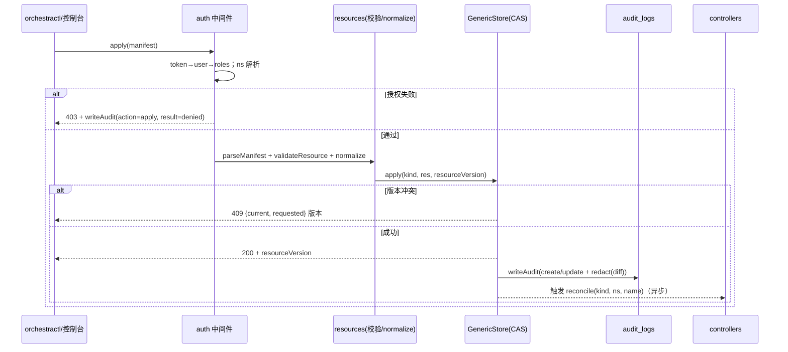

<!-- 详细设计：在 hld-4.1 之上细化到数据库表结构与实现设计，可直接指导编码 -->

# 4.1 平台基础与治理 — 详细设计

## 1. 模块范围

本模块是 Orchestra 的地基：多租户命名空间隔离（FR-101）、RBAC 授权（FR-102）、声明式资源模型与通用资源表（FR-103）、REST API 与 CLI 入口（FR-104）、全量审计（FR-106）、任务生命周期治理（FR-107，联动 4.5）。本文档在 hld-4.1 的组件划分之上，给出 `resources` 通用表的完整 DDL、RBAC 四表与审计表结构、Hono 路由注册与通用 CRUD handler、YAML Manifest 解析管线（YAML→zod→normalize→CAS upsert）的编码级设计。需求基线 req-4.1（FR-101~107），实现约束沿用 ADR-002/004/007/009。

## 2. 数据库结构设计

### 2.1 表清单

| 表名 | 用途 | 类型 |
|---|---|---|
| `resources` | 全部声明式资源的统一存储（含 Namespace 治理资源） | 通用资源表 |
| `users` | 平台用户（内置认证 MVP） | 独立表 |
| `tokens` | API Token（用户鉴权凭据） | 独立表 |
| `roles` | 预置+自定义角色定义 | 独立表 |
| `role_bindings` | 用户×角色×命名空间授权 | 独立表 |
| `audit_logs` | 全量审计（追加写、只读） | 独立表 |

### 2.2 表结构

**`resources`（通用资源表，DDL 见 dld-overview 2.2）**：`(namespace,type,name)` 唯一；`spec/status jsonb`；`generation`、`resource_version` 乐观锁。Namespace 作为治理资源存 `resources(type='namespace')`，其 spec 结构：

```jsonc
// resources.spec (type='namespace')
{
  "displayName": "开发团队",
  "quota": { "agents": 50, "tasksConcurrent": 10, "secrets": 20 },
  "members": ["user:li.wei", "role:flow-designer"]   // 成员声明（与 role_bindings 一致入口）
}
// resources.status (type='namespace')
{ "phase": "Active", "usage": { "agents": 3, "tasksRunning": 2, "secrets": 1 } }
```

**`users`**：认证主体，MVP 内置表，后续可接 SSO/CAS（auth 抽象层替换，表结构不变）。

| 字段 | 类型 | 约束 | 说明 |
|---|---|---|---|
| id | uuid | PK | |
| username | text | not null unique | 登录名 |
| display_name | text | | 展示名 |
| password_hash | text | not null | scrypt（`node:crypto`，ADR-021：`scrypt$N$r$p$salt$hash`；`'seed-only'` 为迁移占位符，SSO 接入后置空） |
| is_system | boolean | not null default false | system 账户（控制器/Webhook） |
| status | text | not null default 'active' | active/disabled |
| created_at | timestamptz | not null default now() | |
| updated_at | timestamptz | not null default now() | |

**`tokens`**：API Token，令牌明文只返回一次，库中存 hash。

| 字段 | 类型 | 约束 | 说明 |
|---|---|---|---|
| id | uuid | PK | |
| user_id | uuid | not null references users(id) | |
| name | text | not null | Token 名称 |
| token_hash | text | not null unique | sha256(token) |
| expires_at | timestamptz | | 空=不过期 |
| last_used_at | timestamptz | | |
| created_at | timestamptz | not null default now() | |

**`roles`**：预置五角色（platform-admin/flow-designer/task-initiator/approver/viewer）随迁移播种。

| 字段 | 类型 | 约束 | 说明 |
|---|---|---|---|
| id | uuid | PK | |
| name | text | not null unique | 角色名（system 命名空间语义） |
| kind | text | not null | builtin/custom |
| permissions | jsonb | not null | 权限点数组：`[{action, resourceType, scope}]` |
| created_at | timestamptz | not null default now() | |

**`role_bindings`**：授权即"谁、在哪个命名空间、有什么角色"。

| 字段 | 类型 | 约束 | 说明 |
|---|---|---|---|
| id | uuid | PK | |
| user_id | uuid | not null references users(id) | |
| role | text | not null | 角色名 |
| namespace | text | not null | 授权命名空间；`*` 表示平台级（仅 platform-admin） |
| created_at | timestamptz | not null default now() | |

索引：`(namespace, role)`、`(user_id)`。**唯一约束 `(user_id, role, namespace)`** 防重复授权。

**`audit_logs`**：追加写、只读；按月分区（M2 起）。

| 字段 | 类型 | 约束 | 说明 |
|---|---|---|---|
| id | bigserial | PK | 追加生成 |
| ts | timestamptz | not null default now() | 操作时间（UTC） |
| actor | text | not null | 用户/token/控制器/webhook 标识 |
| action | text | not null | create/update/delete/approve/reject/request-changes/apply/exec |
| resource | jsonb | not null | `{kind, namespace, name}` |
| diff | jsonb | | 变更前后摘要（脱敏后） |
| trace_id | uuid | | 关联任务 trace（若由任务触发） |
| source | text | not null | console/api/cli/webhook/im/system |
| result | text | not null | success/denied/error |

索引：`(ts desc)`、`(action)`、`(actor)`、`(resource)`（gin，含 `resource->>'kind'` 过滤）。

### 2.3 枚举/常量

```ts
// src/resources/constants.ts
export const SYSTEM_NAMESPACE = 'system';
export const RESOURCE_TYPES = ['agent','flow','skill','plugin','mcp-server','secret',
  'model-endpoint','runtime-instance','task-schedule','task-webhook','policy',
  'worker','notification-rule','blueprint','namespace'] as const;

export const ACTIONS = ['create','read','update','delete','publish','install',
  'approve','reject','request-changes','exec','apply'] as const;

export const BUILTIN_ROLES = ['platform-admin','flow-designer','task-initiator','approver','viewer'] as const;
```

## 3. 实现设计

### 3.1 模块目录结构

| 文件 | 职责 |
|---|---|
| `src/resources/types.ts` | `TypeMeta`/`ObjectMeta`/`Resource<T>` 泛型、kind 定义 |
| `src/resources/schemas.ts` | 各 kind zod schema 注册表 `REGISTRY: Record<kind, ZodType>` |
| `src/resources/manifest.ts` | YAML 解析、`parseManifest(yaml): {apiVersion,kind,metadata,spec}`、错误定位（行号） |
| `src/resources/normalize.ts` | 默认值注入、label 合并、resourceVersion 初始化 |
| `src/api/routes/resources.ts` | 通用资源 CRUD 路由注册（`/api/v1/{resource}`） |
| `src/api/routes/namespaces.ts` | 命名空间 CRUD 与配额 |
| `src/api/routes/audit.ts` | 审计检索 |
| `src/api/middleware/auth.ts` | Token 解析中间件 |
| `src/api/middleware/authz.ts` | RBAC 判定中间件 + `authz.Can` 断言 |
| `src/api/errors.ts` | AppError 分类与 HTTP 映射 |
| `src/auth/ns.ts` | 命名空间解析与 system 回退（`ResolveRef`） |
| `src/auth/rbac.ts` | 权限点判定逻辑 |
| `src/store/generic.ts` | `GenericStore`（按 type 分桶 CRUD + CAS） |
| `src/store/schema.ts` | drizzle schema（全部表） |
| `src/observability/audit.ts` | `writeAudit()` SDK，供各模块埋点 |

### 3.2 核心类型与 Schema（zod）

```ts
// src/resources/types.ts
export interface ObjectMeta {
  name: string;
  namespace: string;
  labels?: Record<string, string>;
  annotations?: Record<string, string>;
  resourceVersion?: number;
  generation?: number;
  createdAt?: string;
}
export interface Resource<S = unknown, T = unknown> {
  apiVersion: 'orchestra.io/v1alpha1';
  kind: string;
  metadata: ObjectMeta;
  spec: S;
  status?: T;
}

// src/api/middleware/authz.ts 关键断言
export interface AuthzContext {
  user: string;
  roles: { role: string; namespace: string }[];
  namespace: string;          // 请求解析出的目标命名空间
}
export async function Can(ctx: AuthzContext, action: Action, resource: { type: string; namespace?: string }): Promise<boolean>;
```

资源 schema 注册与校验：

```ts
// src/resources/schemas.ts
export const AGENT_SCHEMA = z.object({ /* ...见 dld-4.2 */ });
export const REGISTRY: Record<string, z.ZodTypeAny> = {
  agent: AGENT_SCHEMA, flow: FLOW_SCHEMA, skill: SKILL_SCHEMA, /* ... */
};
export function validateResource(kind: string, spec: unknown) {
  const schema = REGISTRY[kind];
  if (!schema) throw new ValidationError(`未知资源类型: ${kind}`);
  return schema.parse(spec);   // 抛 zod error → 422（含字段详情）
}
```

### 3.3 核心函数/服务

```ts
// src/resources/manifest.ts
parseManifest(yamlText: string): Resource;            // yaml → Resource，缺 apiVersion/kind/metadata 报 422
// src/store/generic.ts
class GenericStore {
  get(kind, ns, name): Promise<Resource>;
  list(kind, ns, opts?: {labelSelector?, page?, limit?}): Promise<Page<Resource>>;
  apply(kind, res, expectedResourceVersion?): Promise<{resource, isNew, resourceVersion}>;  // CAS upsert
  delete(kind, ns, name): Promise<void>;              // 软删除 + 写审计
  updateStatus(kind, ns, name, status): Promise<void>; // 控制器专用，不递增 resource_version
}
// src/auth/rbac.ts
resolveUser(c: HonoContext): Promise<AuthzContext>;   // token → user → roles
assertCan(ctx, action, resource): void;               // 失败抛 ForbiddenError（内部写审计）
// src/auth/ns.ts
resolveNamespace(ctx, kind, name): Promise<string>;   // 参数 ns → 资源归属；无则按 path 前缀
resolveRef(kind, name, fromNs): Promise<string>;      // 本命名空间 → system 回退（ADR-004）
// src/observability/audit.ts
writeAudit(entry: AuditEntry): Promise<void>;         // 追加写；失败打 ERROR 日志不阻断主流程
```

### 3.4 关键流程实现

**REST 路由注册与鉴权管线**（Hono）：

```ts
// src/server/app.ts（节选）
const app = new Hono();
app.use('/api/v1/*', authMiddleware);                 // token 解析
app.use('/api/v1/*', nsMiddleware);                   // 命名空间解析
app.route('/api/v1', resourcesRoutes());              // 通用 CRUD
app.route('/api/v1', namespacesRoutes());
app.route('/api/v1', auditRoutes());
app.onError((err, c) => errorToResponse(err));        // 统一错误映射
```



**GenericStore.apply CAS 实现**：

```ts
async apply(kind, res, expectedVersion?) {
  const exists = await this.get(kind, res.metadata.namespace, res.metadata.name);
  if (!exists) {
    await db.insert(resources).values({ ...res, resourceVersion: 1, generation: 1 });
    return { isNew: true, resourceVersion: 1 };
  }
  const cur = exists.resourceVersion;
  if (expectedVersion !== undefined && cur !== expectedVersion) {
    throw new ConflictError(`resourceVersion 冲突：当前 ${cur}，请求 ${expectedVersion}`);
  }
  const updated = await db.update(resources)
    .set({ spec: res.spec, generation: exists.generation + 1, resourceVersion: cur + 1, updated_at: now() })
    .where(and(eq(resources.id, exists.id), eq(resources.resource_version, cur)))
    .returning({ resourceVersion: resources.resourceVersion });
  if (updated.length === 0) throw new ConflictError('并发修改，请刷新重试');
  return { isNew: false, resourceVersion: updated[0].resourceVersion };
}
```

### 3.5 错误处理与边界情况

| 场景 | 处理 |
|---|---|
| 版本冲突 | 409 + 附当前版本；前端/CLI 提供刷新重试引导（FR-103 验收 3） |
| 未授权跨命名空间访问 | 403 + 审计 `result=denied`；列表接口只返回授权命名空间（不报错） |
| 未知 kind / schema 非法 | 422 + 字段级 zod 错误定位 |
| 配额超限 | 429 + 当前用量（与 4.9 成本联动展示） |
| 删除被引用资源 | 409 + 引用清单（反向扫描 `spec->'skills' @> ?` / flow nodes） |
| system 命名空间写保护 | 除 platform-admin 外禁止 create/update/delete（403） |
| 审计写入失败 | 打 ERROR 日志，不阻断业务事务（审计尽力而为，M2 可入队补偿） |

### 3.6 测试要点

- 单元：`GenericStore.apply` CAS 冲突路径（同一资源两次并发 apply 返回 409）；`parseManifest` 缺字段/未知 kind/注释 YAML；`Can()` 覆盖五角色×增删改查×平台级/命名空间级。
- 集成：两个命名空间同名 Agent 互相不可见；未授权变更 API 返回 403 且审计表出现 denied 记录；审批决策/插件安装/任务取消在审计中可检索；暂停→恢复→取消→重跑全链路任务状态与 trace 保留。

> CLI（cliyard）为横切能力，其详细设计见独立文档 [dld-cli.md](dld-cli.md)。
