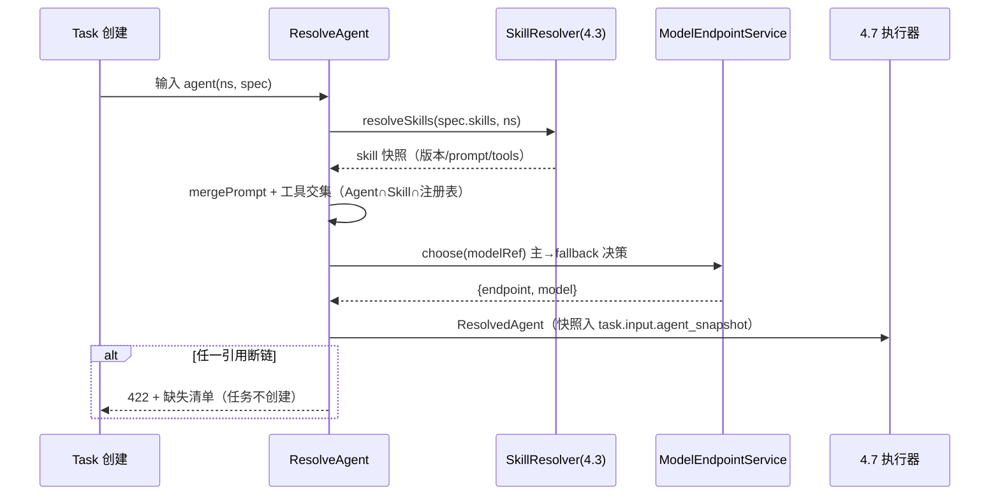

<!-- 详细设计：在 hld-4.2 之上细化到数据库表结构与实现设计，可直接指导编码 -->

# 4.2 Agent 管理 — 详细设计

## 1. 模块范围

本模块定义 Orchestra 的可执行单元 Agent：提示词、模型引用与 fallback（FR-201/205）、工具白名单与角色（FR-203）、Skill 引用（FR-204）、执行上限与运行时引用。实现上 Agent/ModelEndpoint 均为声明式资源，存 `resources` 通用表；任务创建时经 `ResolveAgent` 物化为最终执行配置（prompt + model + tools + workdir）交给 4.7 执行器。本文档给出 AgentSpec/ModelEndpointSpec 的完整结构、引用解析与工具交集校验、模型路由切换的实现设计。需求基线 req-4.2（FR-201~206），委托（FR-206）为 M3 预留字段。

## 2. 数据库结构设计

### 2.1 表清单

| 表名 | 用途 | 类型 |
|---|---|---|
| `resources(type='agent')` | Agent 声明式资源 | 通用资源表 |
| `resources(type='model-endpoint')` | 模型端点（模型路由，FR-205） | 通用资源表 |

### 2.2 表结构（spec/status jsonb 结构说明）

**`resources.spec (type='agent')`**：

```jsonc
{
  "description": "需求分析 Agent",
  "prompt": "你是资深产品经理...",                    // 核心资产
  "modelRef": { "primary": "openai/gpt-4o", "fallback": "openai/gpt-4o-mini" },  // 引用 ModelEndpoint name
  "allowedTools": ["github.create_issue_comment", "github.get_issue"],  // <plugin>.<tool>
  "skills": [{ "name": "requirement-doc", "version": "1.2.x" }],        // 版本范围，运行期解析
  "roles": ["product-manager"],
  "limits": { "maxSteps": 50, "timeoutSeconds": 1800, "tokenBudget": 200000 },
  "runtime": "opencode",
  "runtimeRef": "runtime-dev",                        // 引用 RuntimeInstance（4.7）；空=默认实例
  "workingDir": "/workspaces/requirement",            // 工作目录；空=实例 defaultWorkdir
  "delegation": null                                   // M3 预留：{maxDepth, policy}
}
// status: { "phase": "Draft|Active|Disabled", "lastError": null, "envReady": [], "resolvedRefs": {} }
```

**`resources.spec (type='model-endpoint')`**：

```jsonc
{
  "provider": "openai",
  "baseUrl": "https://api.openai.com/v1",
  "defaultModel": "gpt-4o",
  "auth": { "secretRef": "openai-api-key" },           // 凭证引用（4.1 Secret，明文不入库）
  "fallback": ["openai/gpt-4o-mini"],
  "pricing": { "inputPerMtok": 5.0, "outputPerMtok": 15.0 },   // M2 成本换算（4.9）
  "capabilities": { "contextWindow": 128000 }           // M2 能力下限校验
}
// status: { "phase": "Ready|Degraded|Error", "lastError": null, "lastHealthAt": "..." }
```

### 2.3 枚举/常量

```ts
// src/resources/agent.ts
export const AGENT_PHASE = ['Draft', 'Active', 'Disabled'] as const;
export const MODEL_ENDPOINT_PHASE = ['Ready', 'Degraded', 'Error', 'Unknown'] as const;
// 工具全名格式校验
export const TOOL_NAME_RE = /^[a-z0-9-]+\.[a-z0-9_]+$/;   // <plugin>.<tool>
export const AGENT_SCHEMA = z.object({
  description: z.string().optional(),
  prompt: z.string().min(1),
  modelRef: z.object({ primary: z.string(), fallback: z.string().optional() }),
  allowedTools: z.array(z.string().regex(TOOL_NAME_RE)).default([]),
  skills: z.array(z.object({ name: z.string(), version: z.string() })).default([]),
  roles: z.array(z.string()).default([]),
  limits: z.object({
    maxSteps: z.number().int().positive().default(50),
    timeoutSeconds: z.number().int().positive().default(1800),
    tokenBudget: z.number().int().positive().default(200000),
  }).default({}),
  runtime: z.literal('opencode').default('opencode'),
  runtimeRef: z.string().optional(),
  workingDir: z.string().optional(),
  delegation: z.object({ maxDepth: z.number(), policy: z.string() }).nullable().default(null),
});
```

## 3. 实现设计

### 3.1 模块目录结构

| 文件 | 职责 |
|---|---|
| `src/resources/agent.ts` | Agent/ModelEndpoint zod schema、normalize |
| `src/controllers/agent.ts` | Agent 控制器：发布时引用解析、状态回写 |
| `src/modelgw/index.ts` | 模型网关：`ModelEndpointService`（健康探测、主备切换决策、token 计量上报） |
| `src/executor/agent-resolve.ts` | `ResolveAgent()` 物化管线（任务创建与预览共用） |

### 3.2 核心类型与 Schema（zod）

```ts
// src/executor/agent-resolve.ts
export interface ResolvedAgent {
  agentRef: string;                     // agent 名 + 版本快照
  prompt: string;                       // Agent.prompt + Skills.prompt 依序合并
  model: { primary: string; fallback?: string };
  tools: string[];                      // allowedTools ∩ Skill.tools ∩ 已注册工具
  skills: { name: string; version: string; prompt: string }[];  // 快照，供可复现
  limits: AgentLimits;
  runtimeRef?: string;
  workingDir?: string;
}
export async function ResolveAgent(
  agent: Resource<AgentSpec>, ns: string,
  registry: ToolRegistry,        // 4.8 工具注册表
  skillResolver: SkillResolver,  // 4.3
): Promise<ResolvedAgent>;
```

### 3.3 核心函数/服务

```ts
// src/modelgw/index.ts
export class ModelEndpointService {
  get(endpointRef, ns): Promise<Resource<ModelEndpointSpec>>;          // system 回退
  probe(endpoint): Promise<{ healthy: boolean; latencyMs: number }>;    // 探测主端点
  choose(modelRef): Promise<{ endpoint, model }>;                       // 主→fallback 决策
  recordTokens(endpoint, input, output): Promise<void>;                 // 上报 4.9 计量
}
// src/controllers/agent.ts
export async function onAgentPublish(ns, name): Promise<void>;   // 全量引用解析，断链即失败
export async function assertAgentDeletable(ns, name): Promise<void>;    // 反向扫描 flow/skill 引用
export async function setAgentPhase(ns, name, phase): Promise<void>;
```

### 3.4 API 端点

| 方法 | 路径 | 说明 |
|---|---|---|
| GET/POST | `/api/v1/agents` | 列表（按命名空间/状态筛选）/ 创建（Draft） |
| GET/PUT/DELETE | `/api/v1/agents/{name}` | 详情 / 更新（CAS 带 resourceVersion）/ 删除（引用校验 409） |
| POST | `/api/v1/agents/{name}/publish` | Draft → Active（全量引用解析，断链拒绝） |
| POST | `/api/v1/agents/{name}/disable` · `/enable` | Active → Disabled 及恢复 |
| GET | `/api/v1/agents/{name}/resolve` | 预览物化结果（前端"合并后 prompt 预览"） |
| GET/POST | `/api/v1/model-endpoints` · `/{name}` | ModelEndpoint CRUD 与健康状态 |

**ResolvedAgent 使用契约**（下游消费方）：

```
4.4 流程执行节点 → ResolvedAgent（节点 Agent 快照）
4.7 会话创建     → ResolvedAgent.{prompt, model.primary, workingDir, runtimeRef}
4.6 审批产物预览 → ResolvedAgent.skills（展示技能上下文）
4.9 Token 计量  → modelgw.recordTokens（model.primary 计价）
```

**模型健康探测与切换决策（modelgw）**：

```
probe(endpoint) → 发送轻量请求（GET /models 或健康探测端点）→ 200/429/5xx/超时
  → 结果写 ModelEndpoint.status.{phase, lastHealthAt, lastError}
  → 主端点非 200 且连续 2 次探测失败 → choose() 切换 fallback
  → 429/5xx/超时在会话执行中即时触发切换（不等探测周期）
  → 切换事件写 trace（type=model, name=model-switch, detail={from,to,reason}）
  → 主端点恢复（probe 200）→ 后续新任务重新评估主端点，不强制切回
```

### 3.5 关键流程实现

**任务创建时 Agent 配置物化**（ResolveAgent 伪代码）：

```
输入: agent(Active), ns
1. 解析 skills：对 agent.spec.skills 逐个 skillResolver.resolve(name, versionRange, ns)
     → 得到具体版本快照 [{name, version, prompt}]；任一悬空 → 抛 ValidationError(缺依赖清单)
2. 合并 prompt：agent.spec.prompt + skill.prompt（依引用顺序），中间以分隔注释拼接
3. 工具交集：agentTools = agent.spec.allowedTools
     skillTools = 所有 skill 声明 tools 的并集
     registered = registry.allInstalledTools(ns)        // 4.8
     finalTools = agentTools ∩ skillTools ∩ registered
     // 白名单外一律不注入（fail-closed，FR-705 第一层）
4. 解析 modelRef：modelgw.get(modelRef.primary, ns)；不可用 → 尝试 fallback
     // 若 fallback 不满足 capabilities（上下文窗口）→ 抛 TransientError，不降级运行
5. 解析 runtimeRef/workingDir（4.7）：未指定 runtimeRef → 默认实例；workingDir 空 → defaultWorkdir
6. 返回 ResolvedAgent（快照入 Task.input.agent_snapshot）
```

**模型主备切换**：

```
opencode 会话返回 429/5xx/超时 → ModelEndpointService.choose 触发
  → 记录切换事件：observability.writeTrace({type:'model', name:'model-switch', detail:{from,to}})
  → 后续消息使用 fallback 端点
  → 主端点恢复（probe 通过）→ 下一次任务重新评估，不强行切回
```



**发布校验与删除保护**：

```
publish(agent) → 状态必须 Draft → ResolveAgent 全量解析
  → 任何 skill/tool/model 引用断链 → 拒绝发布 + 缺失清单
  → 通过 → phase=Draft→Active，status.resolvedRefs 记录快照

delete(agent) → 反向扫描 resources(type='flow')：spec->nodes @> '[{"agentRef":"<name>"}]'
             → 以及 resources(type='skill') 引用 → 存在引用 → 409 + 引用清单
```

**runtimeRef 与 workingDir 解析（联动 4.7）**：

```
ResolveAgent 第 5 步细化：
  runtimeRef 声明 → getClient(runtimeRef) 校验实例存在且 phase != Unknown
  未声明 runtimeRef → 默认实例（system 命名空间的 'default-runtime'）
  workingDir 声明   → 校验存在于实例可达文件系统（created_at 前探测）
  未声明 workingDir → 取实例 defaultWorkdir
  两者均解析后由 4.7 workspace 层在 workingDir 内建 worktree（<workingDir>/.orchestra-worktrees/<taskId>）
```

**工具交集语义细化**（FR-203/FR-705 第一层）：

```
最终工具集 = agent.allowedTools（白名单）
           ∩ union(skill.tools)          // Skill 只声明"需要"，不能突破白名单
           ∩ registry.allInstalledTools   // 4.8 已安装且已配置插件
风险工具（risk=high）：不依赖 Agent 开关，运行时强制 ToolApproval（4.6）
白名单外调用：平台侧拒绝 + 审计（fail-closed），不进入 opencode 会话
```

### 3.6 错误处理与边界情况

| 场景 | 处理 |
|---|---|
| Skill 版本范围无匹配版本 | 422 + 可用版本列表；Agent 保持 Draft |
| 工具引用未安装插件 | 422 + 缺插件提示（与 4.8 卸载校验双向闭环） |
| 主模型不可用且无 fallback | 任务创建成功但执行时按可重试错误处理；Agent 状态标 `lastError` |
| fallback 能力不足 | 标失败（不降级运行），trace 记录 `model-capability-mismatch` |
| Token 超限 | 执行器收到 limit 事件 → 4.7 abort 会话 → 任务 Failed（`token-budget-exceeded`） |
| Active 被 Flow 引用时删除 | 409（4.1 删除保护统一处理） |
| Disabled 后新任务 | 任务创建拒绝（409）；运行中任务不受影响 |
| modelRef 引用不存在的 ModelEndpoint | 发布/创建时解析失败 422；引用更新需重新 publish |

### 3.7 测试要点

- 单元：ResolveAgent 工具交集（Agent∩Skill∩注册表）正确性；prompt 合并顺序稳定（Agent 在前、Skill 依序）；modelRef fallback 触发条件（429/5xx/超时）与切换 trace；TOOL_NAME_RE 校验。
- 集成：429 时任务自动切 fallback 且 Agent 定义文件零改动；Skill 卸载后编辑 Agent 出现断链提示；Agent 被 Flow 引用时 DELETE 返回 409；Draft 不可被任务引用，Active 可。
- 一致性：同一 Agent 在 `/resolve` 预览与任务创建物化结果完全一致（口径单点，防漂移）。
