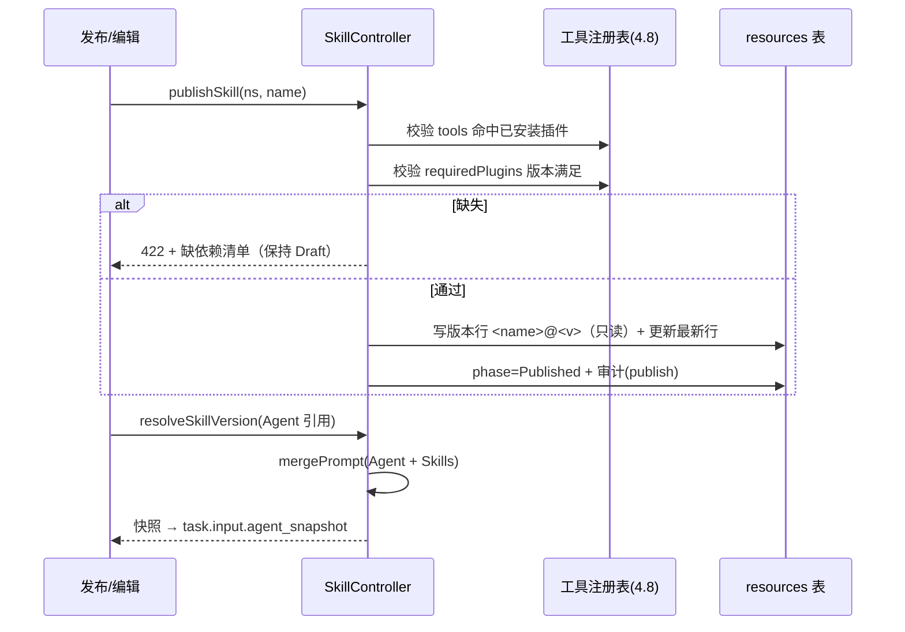

<!-- 详细设计：在 hld-4.3 之上细化到数据库表结构与实现设计，可直接指导编码 -->

# 4.3 Skill 管理 — 详细设计

## 1. 模块范围

本模块管理可复用能力包 Skill：创建/上传/版本管理（FR-301）、工具与插件依赖校验（FR-302）、市场发布安装（FR-303，M2/M3）。Skill 存 `resources(type='skill')` 通用表；版本为不可变发布制；任务创建时由 4.2 的 ResolveAgent 把 Skill 解析为快照并入 prompt。本文档给出 SkillSpec 完整结构、依赖双向校验（发布校验 + 卸载反向扫描）、prompt 合并与 opencode skills 目录物化（M2）的实现设计。需求基线 req-4.3（FR-301~303），市场部分归 M2/M3。

## 2. 数据库结构设计

### 2.1 表清单

| 表名 | 用途 | 类型 |
|---|---|---|
| `resources(type='skill')` | Skill 声明式资源（含版本） | 通用资源表 |

### 2.2 表结构（spec/status jsonb 结构说明）

**`resources.spec (type='skill')`**：

```jsonc
{
  "displayName": "需求文档生成",
  "category": "prompt-template",       // prompt-template | tool-binding | template
  "version": "1.2.0",                  // semver，发布后不可变（内容变更=新版本）
  "description": "基于 issue 描述生成结构化需求文档",
  "prompt": "你正在撰写需求文档，请遵循以下模板结构...",
  "tools": ["github.get_issue", "github.create_issue_comment"],  // 绑定工具（tool-binding 必填）
  "requiredPlugins": [{ "name": "github", "versionRange": ">=1.0.0" }],
  "docs": "使用说明：适用于需求分析阶段...",
  "templateParams": [{"name":"docTitle","required":true}]   // category=template 时校验渲染变量
}
// status: { "phase": "Draft|Published|Broken", "published": true, "skillRefBroken": false }
```

**版本管理方式**：同一 Skill 的多个版本以 `name` 相同、`annotations["orchestra.io/skill-version"]` 区分的多行 `resources` 记录存储；`metadata.name` 规则为 `<skill-name>`（最新）与 `<skill-name>@<version>`（历史版本快照）。发布流程：当前 Draft 行校验通过 → 写 `<skill-name>@<version>` 只读行 + 更新 `<skill-name>` 行 version 字段。查询版本列表用 `resources.name LIKE 'requirement-doc%'`。

**版本查询与快照解析 SQL**：

```sql
-- 版本列表（含最新与历史，按版本号排序）
SELECT name, spec->>'version' AS version, annotations->'orchestra.io/skill-version' AS tag,
       status->>'phase' AS phase
FROM resources
WHERE type = 'skill' AND namespace = $1
  AND (name = $2 OR name LIKE $2 || '@%')
  AND deleted_at IS NULL
ORDER BY version DESC;

-- 范围解析（semver 过滤在应用层完成，SQL 仅取候选集）
SELECT name, spec
FROM resources
WHERE type = 'skill' AND namespace = $1
  AND (name = $2 OR name LIKE $2 || '@%')
  AND deleted_at IS NULL;
-- 应用层：candidates.filter(s => matchesRange(s.version, range)) 取最高匹配
```

**依赖双向扫描 SQL（4.8 卸载复用）**：

```sql
-- Skill 声明的插件依赖
SELECT name FROM resources
WHERE type = 'skill' AND namespace = $1 AND deleted_at IS NULL
  AND spec->'requiredPlugins' @> '[{"name": "' || $2 || '"}]';
-- Agent 引用的 Skill
SELECT name FROM resources
WHERE type = 'agent' AND namespace = $1 AND deleted_at IS NULL
  AND spec->'skills' @> '[{"name": "' || $2 || '"}]';
```

**版本不可变约束**：历史版本行（`<name>@<version>`）写入后，任何 PUT 返回 409（除 `delete` 软删外无修改通道）；回滚 = 基于历史版本 spec 创建新 Draft 并重新发布（升版本），不覆盖历史。

### 2.3 枚举/常量

```ts
// src/resources/skill.ts
export const SKILL_CATEGORY = ['prompt-template', 'tool-binding', 'template'] as const;
export const SKILL_PHASE = ['Draft', 'Published', 'Broken'] as const;
export const SKILL_SCHEMA = z.object({
  displayName: z.string().min(1),
  category: z.enum(SKILL_CATEGORY),
  version: z.string().regex(/^\d+\.\d+\.\d+$/),          // 严格 semver 三字段
  description: z.string().optional(),
  prompt: z.string().min(1),
  tools: z.array(z.string()).default([]),
  requiredPlugins: z.array(z.object({ name: z.string(), versionRange: z.string() })).default([]),
  docs: z.string().optional(),
  templateParams: z.array(z.object({ name: z.string(), required: z.boolean() })).default([]),
}).superRefine((s, ctx) => {
  if (s.category === 'tool-binding' && s.tools.length === 0) {
    ctx.addIssue({ code: 'custom', message: 'tool-binding 类型必须声明 tools' });
  }
  // template 类型校验渲染变量与必填参数一致
});
```

**category 分类语义细化**：

| 类别 | 结构要求 | 运行期行为 |
|---|---|---|
| `prompt-template` | 仅 prompt，tools 可选空 | 纯上下文注入（合并进 Agent prompt 或 `noReply` 注入） |
| `tool-binding` | prompt + tools 必填 | 绑定工具并入 Agent 工具集（取交集），不突破白名单 |
| `template` | prompt + `templateParams` | 渲染变量（`{{docTitle}}`）在任务输入层替换；必填参数缺失校验 |

## 3. 实现设计

### 3.1 模块目录结构

| 文件 | 职责 |
|---|---|
| `src/resources/skill.ts` | SkillSpec zod schema、category 分类校验 |
| `src/controllers/skill.ts` | 发布校验（引用解析）、断链标记、版本写入 |
| `src/skills/version.ts` | semver 解析与范围匹配（`1.2.x`、`>=1.0.0`） |
| `src/skills/merge.ts` | `mergePrompt(agentPrompt, skillSnapshots)` 与合并预览 |
| `src/skills/materialize.ts` | M2：物化为 opencode skills 目录条目（SKILL.md） |
| `src/plugins/dependents.ts` | 卸载反向扫描（Skill/Agent 引用），供 4.8 复用 |

### 3.2 核心类型与 Schema（zod）

```ts
// src/skills/version.ts
export function matchesRange(version: string, range: string): boolean;  // semver.satisfies
export function resolveSkillVersion(
  name: string, range: string, ns: string,
): Promise<{ version: string; prompt: string; tools: string[] }>;       // 快照解析

// src/skills/merge.ts
export interface SkillSnapshot { name: string; version: string; prompt: string; tools: string[] }
export function mergePrompt(agentPrompt: string, snapshots: SkillSnapshot[]): string;
  // 结果 = agentPrompt + '\n--- 技能上下文 ---\n' + snapshots.map(s => s.prompt).join('\n---\n')

// src/plugins/dependents.ts
export async function listSkillDependents(ns, pluginName): Promise<string[]>;
  // SELECT name FROM resources WHERE type='skill' AND spec->'requiredPlugins' @> '[{"name":"<pluginName>"}]'
export async function listAgentSkillRefs(ns, skillName): Promise<string[]>;
  // SELECT name FROM resources WHERE type='agent' AND spec->'skills' @> '[{"name":"<skillName>"}]'
```

### 3.3 核心函数/服务

```ts
// src/controllers/skill.ts
export async function publishSkill(ns, name): Promise<void>;
  // 1. 解析 tools（须命中已安装插件）2. 校验 requiredPlugins（已安装且版本满足）
  // 3. 全量解析失败 → ValidationError(缺依赖清单) 4. 写版本行 + 更新最新行 + phase=Published
export async function markBrokenRefs(ns, skillName): Promise<void>;
  // 卸载/断链后把引用 Agent 的 status.skillRefBroken 置 true（下次编辑提示）
// src/skills/materialize.ts (M2)
export async function materializeToOpencode(skill: SkillSnapshot, workdir: string): Promise<void>;
  // 写 workdir/.opencode/skills/<name>/SKILL.md（frontmatter: name/description + prompt 正文）
export async function injectNoReply(ctx, prompt: string): Promise<void>;
  // 上下文类 skill 用 session.prompt(..., { noReply: true }) 注入，不产生回复
```

### 3.4 API 端点

| 方法 | 路径 | 说明 |
|---|---|---|
| GET/POST | `/api/v1/skills` | 列表（按分类/发布状态筛选）/ 创建（Draft） |
| GET/PUT/DELETE | `/api/v1/skills/{name}` | 详情 / 编辑（仅 Draft）/ 删除（引用校验 409） |
| POST | `/api/v1/skills/{name}/publish` | 发布新版本（不可变，全量引用解析） |
| GET | `/api/v1/skills/{name}/versions` | 版本列表（含历史） |
| GET | `/api/v1/skills/{name}/versions/{v}` | 历史版本查看/回滚（回滚=基于旧版本新建） |
| POST | `/api/v1/skills/{name}/preview` | 合并 prompt 预览（Agent+Skill 依序拼接） |

### 3.5 关键流程实现

**发布校验与版本写入**：

```
publish(ns, name)
  → skill = get(ns, name)；phase 必须 Draft
  → 校验 tools：每个工具名须在 4.8 工具注册表已安装（tool_ref → plugin 已 install+configured）
  → 校验 requiredPlugins：插件已安装且 semver.satisfies(versionRange)
  → 任一缺失 → 抛 ValidationError(缺依赖清单)，phase 保持 Draft
  → 通过 → 写只读行 resources(name='<skill>@<version>', spec 深拷贝)
          → 更新最新行 version 字段 → phase=Published
          → 写审计(action=publish)

卸载插件（4.8 调用本模块）：
  → listSkillDependents(ns, pluginName) 非空 → 409 + 依赖 Skill 清单
  → 卸载成功 → 引用 Agent status.skillRefBroken=true（编辑时提示断链）
```

**任务创建时 Skill 物化**（由 4.2 ResolveAgent 调用）：

```
resolve(skillRefs, ns)
  → 逐引用 resolveSkillVersion(name, range, ns) → 具体版本快照
  → mergePrompt(agentPrompt, snapshots) → 最终 prompt 存 task.input.agent_snapshot
  → tools 并集交 Agent.allowedTools（取交集，Skill 不突破 Agent 权限边界）
  → M2：materializeToOpencode(快照, task workdir)，使 skill 在 opencode 会话内可感知
```



**物化格式（M2，兼容 opencode skill 体系）**：

```markdown
<!-- <workdir>/.opencode/skills/requirement-doc/SKILL.md -->
---
name: requirement-doc
description: 基于 issue 描述生成结构化需求文档
version: 1.2.0
---
你正在撰写需求文档，请遵循以下模板结构...
<!-- 绑定工具由 4.2 工具交集注入，此处仅声明意图 -->
```

### 3.6 错误处理与边界情况

| 场景 | 处理 |
|---|---|
| 版本范围无匹配 | 422 + 可用版本列表；引用方保持原快照不降级 |
| 发布时工具悬空 | 拒绝发布 + 缺失工具/插件清单（FR-302 验收 2） |
| 卸载被引用插件 | 409 + 引用 Skill/Agent 清单（fail-closed，不静默破坏） |
| 同版本重复发布 | 409（版本不可变，提示升版本） |
| 市场安装同名冲突（M2/M3） | 提示覆盖或另建命名（req-4.3） |
| 断链后 Agent 编辑 | 前端展示 `skillRefBroken` 标记与影响清单 |
| 版本范围语法非法 | 422（semver 解析失败），引用方提示修正 |
| 跨命名空间引用 | 4.1 隔离规则拒绝（system 命名空间只读） |

### 3.7 测试要点

- 单元：`matchesRange` 覆盖 `1.2.x`/`>=1.0.0`/`^1.0.0` 边界；`mergePrompt` 顺序稳定且含分隔标记；category 校验（tool-binding 缺 tools 被拒）；版本行写入只读约束。
- 集成：发布依赖未装插件的 Skill 返回缺失清单；卸载被 Skill 引用插件被 409 阻止；两个命名空间安装同一市场 Skill 不同版本互不干扰；Skill 绑定工具超 Agent 白名单时按交集生效且不中断任务；回滚历史版本后 Agent 引用解析到旧快照。

### 3.8 市场分发设计（M2/M3，FR-303）

- 市场 Skill 与命名空间 Skill 同构（同一资源模型），仅 `annotations["orchestra.io/market"] = "true"` 标记市场可见。
- **安装语义 = 目标命名空间创建副本**：复制 spec 到目标命名空间，生成独立资源（与源解耦），可参数化定制（ADR-003 分层：参数可改）。
- 同名冲突：安装前检测目标命名空间是否存在同名 Skill，存在则提示覆盖或另建命名。
- 升级同步：显式执行 `sync-from-market` 才拉取源新版本（复制为新 Draft），不自动覆盖命名空间内已定制副本。
- 版本索引：市场列表接口按源 Skill 聚合版本，`system` 命名空间存放平台内置 Skill 模板（对所有命名空间只读）。
- 前置依赖（M2 PoC）：制品托管与鉴权方式（镜像仓库 / 制品库 / 纯 API 复制）在 M2 启动时定选型。
