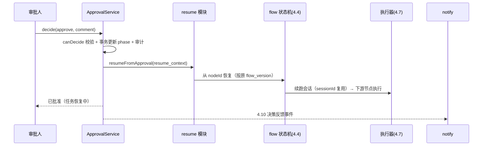

<!-- 详细设计：在 hld-4.6 之上细化到数据库表结构与实现设计，可直接指导编码 -->

# 4.6 人工审批（Human-in-the-Loop）— 详细设计

## 1. 模块范围

本模块是"像真实公司一样运转"的结构化保障：审批状态机（FR-601）、通过后精确恢复（FR-602）、驳回/打回循环（FR-603/604）、TTL 超时策略（FR-605）、工具级审批 ToolApproval 与 opencode permission 联动（FR-606）、审批人分配（FR-607）、审批内容审计与产物预览（FR-608）。实现上审批走独立表 `approvals`（高频、需事务），resume_context 随行存储，TTL 由后台扫描器处理。本文档给出 approvals 表 DDL、审批状态机与决策接口、resume_context 结构、TTL 幂等过期、permission 联动的实现设计。需求基线 req-4.6（FR-601~608），审批为纯人工（ADR-002）。

## 2. 数据库结构设计

### 2.1 表清单

| 表名 | 用途 | 类型 |
|---|---|---|
| `approvals` | 审批（TaskApproval/ToolApproval 双类型） | 独立表 |

### 2.2 表结构

**`approvals`**：

| 字段 | 类型 | 约束 | 说明 |
|---|---|---|---|
| id | uuid | PK | |
| namespace | text | not null | |
| name | text | not null | 审批名 |
| kind | text | not null | TaskApproval \| ToolApproval |
| task_id | uuid | not null | 关联任务 |
| node_ref | text | | 挂载节点 id / 工具调用点 |
| producer_agent | text | | 产生被审批产物的 Agent |
| artifact_ref | jsonb | | `{type: output\|tool-call, key}`（FR-608） |
| approvers | jsonb | not null | `{mode: user\|role\|multi-level, value}`（FR-607） |
| ttl_seconds | int | not null | |
| expires_at | timestamptz | not null | = created_at + ttl |
| max_review_rounds | int | not null default 3 | 打回上限（FR-604） |
| auto_review_policy | jsonb | | 预留空（ADR-002，不启用） |
| phase | text | not null | Pending/Approved/Rejected/ChangesRequested/Expired/Blocked |
| round | int | not null default 1 | 当前轮次 |
| decision | text | | approve/reject/request-changes |
| decided_by | text | | 决策人 |
| decided_at | timestamptz | | |
| comment | text | | 决策意见（含打回意见） |
| resume_context | jsonb | | `TaskApprovalResumeContext`（FR-602） |
| escalation_chain | jsonb | | multi-level 审批链（FR-607） |
| permission_id | text | | ToolApproval 关联的 opencode permission id |
| created_at | timestamptz | not null default now() | |
| updated_at | timestamptz | not null default now() | |

索引：`(namespace, phase)`（审批中心列表）、`(task_id)`、`(expires_at)`（TTL 扫描）、`(decided_by)`。

**`TaskApprovalResumeContext`（resume_context jsonb 结构）**：

```jsonc
{
  "flowRef": { "name": "software-company-dev", "version": 3 },   // 按原版本恢复（防漂移）
  "nodeId": "review-gate",          // 挂起节点
  "nodeIndex": 2,                   // 拓扑序索引
  "input": { "issueNumber": 42 },   // 任务输入快照
  "outputsSnapshot": { "pm-analyze": { "requirement_doc": "..." } },  // 已完成节点产物
  "sessionId": "sess-xxx",          // 4.7 会话（恢复续跑）
  "workdir": "/workspaces/..."      // 工作区路径
}
```

### 2.3 枚举/常量

```ts
// src/approver/state.ts
export const APPROVAL_PHASE = ['Pending','Approved','Rejected','ChangesRequested','Expired','Blocked'] as const;
export const APPROVAL_KIND = ['TaskApproval','ToolApproval'] as const;
export const DECISION = ['approve','reject','request-changes'] as const;
export const TTL_EXPIRE_POLICY = ['fail','escalate','remind'] as const;
export const TTL_SCAN_INTERVAL_MS = 60_000;        // 扫描周期 < TTL 粒度
export const MAX_REVIEW_ROUNDS_DEFAULT = 3;
```

## 3. 实现设计

### 3.1 模块目录结构

| 文件 | 职责 |
|---|---|
| `src/approver/state.ts` | 审批状态机（显式转移表）、round 控制 |
| `src/approver/service.ts` | 创建审批、decide 接口、审批人匹配、决策幂等 |
| `src/approver/resume.ts` | resume_context 生成与恢复调用（回 4.4/4.7） |
| `src/approver/ttl.ts` | TTL 扫描器（fail/escalate/remind） |
| `src/approver/perms.ts` | ToolApproval ↔ opencode permission 应答（联动 4.7） |
| `src/api/routes/approvals.ts` | 审批中心 API、决策、历史 |

### 3.2 核心类型与 Schema（zod）

```ts
// src/approver/service.ts
export interface ApprovalRecord {
  id: string; namespace: string; name: string;
  kind: ApprovalKind; taskId: string; nodeRef?: string; producerAgent?: string;
  artifactRef?: { type: 'output'|'tool-call'; key: string };
  approvers: { mode: 'user'|'role'|'multi-level'; value: string };
  ttlSeconds: number; expiresAt: string; maxReviewRounds: number;
  phase: ApprovalPhase; round: number;
  decision?: Decision; decidedBy?: string; decidedAt?: string; comment?: string;
  resumeContext?: TaskApprovalResumeContext; escalationChain?: string[];
  permissionId?: string;
}
export async function decide(ns, name, body: { decision: Decision; comment?: string }, actor: string): Promise<ApprovalRecord>;
export async function canDecide(actor, approval): Promise<boolean>;   // user 匹配 / role 匹配 / multi-level 当前级
```

### 3.3 API 端点

| 方法 | 路径 | 说明 |
|---|---|---|
| GET | `/api/v1/approvals?state=pending&type=task\|tool` | 待审批列表（按命名空间/角色过滤） |
| GET | `/api/v1/approvals/{name}` | 审批详情（产物预览/Checkpoint/历史轮次） |
| POST | `/api/v1/approvals/{name}/decide` | 决策（`{decision, comment}`，幂等） |
| GET | `/api/v1/approvals/{name}/history` | 多轮审批历史（含每轮产物差异） |
| GET | `/api/v1/tasks/{name}/approvals` | 按任务聚合审批（TaskApproval + ToolApproval 并存） |

### 3.4 核心函数/服务

```ts
// src/approver/service.ts
export async function createTaskApproval(task, node, resumeContext): Promise<ApprovalRecord>;
export async function createToolApproval(task, toolCall, permissionId, producerAgent): Promise<ApprovalRecord>;
export async function decide(...): Promise<ApprovalRecord>;          // 决策（幂等 + 审计 + 通知事件）
// src/approver/resume.ts
export function buildResumeContext(task, node, sessionId, workdir): TaskApprovalResumeContext;
export async function resumeFromApproval(approval): Promise<void>;   // → 4.4 恢复节点执行
// src/approver/ttl.ts
export async function scanExpired(): Promise<void>;                  // 周期扫描，幂等过期
// src/approver/perms.ts
export async function respondPermission(approval, decision): Promise<void>;
  // SDK: postSessionByIdPermissionsByPermissionId(sessionId, permissionId, { state: 'approved'|'rejected' })
```

### 3.5 关键流程实现

**审批状态机与决策**：

```
state: Pending
  approve        → Approved（终态；resume_context 恢复执行）
  reject         → Rejected（终态；Task=Failed，保留 comment，不自动重试）
  request-changes→ ChangesRequested → 打回 producer Agent 重做（带 comment）
                  → Agent 重做完成 → 创建新一轮（round+1）Pending
                  → round > maxReviewRounds → Blocked（管理员介入）
  TTL 到期        → Expired（终态；按策略 fail/escalate/remind）
```

```ts
const TRANSITIONS: Record<ApprovalPhase, Decision[]> = {
  Pending: ['approve','reject','request-changes'],
  Approved: [], Rejected: [], Expired: [], Blocked: [], ChangesRequested: [],
};
async decide(ns, name, body, actor) {
  const a = await store.getApproval(ns, name);
  if (a.phase !== 'Pending') return a;                    // 幂等：已决策返回现状
  if (!await canDecide(actor, a)) throw new ForbiddenError('无决策权限');
  await db.transaction(async (tx) => {
    const updated = await tx.update(approvals)
      .set({ phase: toPhase(body.decision), decision: body.decision, decidedBy: actor,
             decidedAt: now(), comment: body.comment ?? '' })
      .where(and(eq(approvals.id, a.id), eq(approvals.phase, 'Pending')))
      .returning();
    if (updated.length === 0) throw new ConflictError('审批状态已变化');
    writeAudit({ action: body.decision, resource: {kind:'approval',ns,name}, ... });
  });
  if (body.decision === 'approve') await resumeFromApproval(a);        // FR-602
  if (body.decision === 'reject') await taskController.markFailed(a.taskId, { code:'approval-rejected', comment });
  if (body.decision === 'request-changes') await taskController.reworkNode(a, body.comment);  // round+1
  notify.emit('approval.decided', a);                                  // 4.10
}
```

**审批决策时序（approve 恢复路径）**：



**TTL 幂等过期**：```ts
// 事务内条件更新，与决策并发时保证单次生效
const rows = await tx.update(approvals)
  .set({ phase: 'Expired' })
  .where(and(eq(approvals.id, id), eq(approvals.phase, 'Pending'),
             lt(approvals.expires_at, now())))
  .returning();
if (rows.length === 1) {
  switch (a.ttlExpirePolicy ?? 'fail') {
    case 'fail':      await taskController.markFailed(a.taskId, { code: 'approval-expired' }); break;
    case 'escalate':  await escalate(a); break;   // 升上级审批人，重置 TTL（round 不变）
    case 'remind':    notify.emit('approval.expired', a); break;      // 可配提醒次数/间隔
  }
  writeAudit({ action: 'expire', ... });
}
```

**工具级审批联动（opencode permission，FR-606/PoC P6）**：

```
SSE 收到 permission 请求事件
  → executor 挂起会话执行 → createToolApproval(task, toolCall, permissionId) → Pending
  → Task 保持 Running 但该工具调用暂停（ToolApproval 独立于 TaskApproval 并存）
人工 approve → respondPermission(sessionId, permissionId, 'approved')
           → opencode 会话继续执行该工具 → tool 事件入 Trace
人工 reject  → respondPermission(..., 'rejected') → Agent 收到被拒结果调整策略
opencode permissions 端点不可用 → 降级为平台侧高风险工具白名单拦截 + 调用前 ToolApproval（fail-closed）
```

**审批人匹配（FR-607）**：

```
mode=user          → decided_by 必须等于 approvers.value
mode=role          → actor 在命名空间持有 approvers.value 角色（4.1 role_bindings）
mode=multi-level   → escalation_chain = [一级审批人, 二级审批人, ...]
                    一级 Pending → approve → 转二级 Pending（round 不变）
                    任一级 reject/request-changes → 终态
                    一级 TTL 超时 → escalate 到二级（重置 TTL）
匹配判定单点实现 canDecide(actor, approval)，审批中心按角色过滤可见列表
```

**审批历史与产物预览（FR-608）**：

```
history：approvals 表多轮 = 每次打回创建新 round（同 approval id，round+1）
  或独立历史行（round_history jsonb 累积决策/意见/产物差异）——MVP 用同表多行 + round 字段
产物预览：artifact_ref.{type,key}
  → type=output → task.outputs[key]（Markdown 渲染）
  → type=tool-call → tool 调用摘要（入参脱敏 + 结果截断）
决策二次确认（前端）→ decide；决策后不可撤回（无撤回接口）
```

### 3.6 错误处理与边界情况

| 场景 | 处理 |
|---|---|
| 决策并发/重复 | 条件更新幂等；重复 decide 返回已决策状态 |
| resume_context 跨版本 | 携带 flow_version，恢复按原版本执行（不漂移） |
| 打回无限循环 | maxReviewRounds 必填（默认 3），超限 Blocked |
| TTL 扫描与决策竞争 | 事务条件更新保证 Expired 单次生效 |
| 多级审批（multi-level） | escalation_chain 存链；一级通过转二级，任一级驳回即驳回；一级超时升二级 |
| 无决策权限 | 403 + 审计（fail-closed） |
| 决策后不可撤回 | 无撤回接口；前端二次确认（设计决策） |
| 同一任务多审批并存 | 审批中心按任务聚合；任一未决任务保持等待 |

### 3.7 测试要点

- 单元：审批转移表（非法转移拒绝）；TTL 幂等过期（并发 decide+扫描单次生效）；canDecide 三模式（user/role/multi-level）；round 超限升级 Blocked。
- 集成：审批未决策时任务保持 WaitingApproval 且任何路径不绕过；批准后从暂停节点精确恢复（已完节点不重跑）；打回→Agent 重做→round+1→超限 Blocked；TTL 过期按 fail/escalate/remind 处理；ToolApproval 批准前高风险工具不产生外部副作用。
