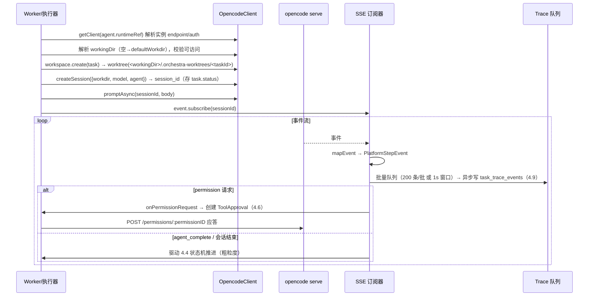

<!-- 详细设计：在 hld-4.7 之上细化到数据库表结构与实现设计，可直接指导编码 -->

# 4.7 运行时（opencode）集成 — 详细设计

## 1. 模块范围

本模块是执行链路的咽喉：常驻 `opencode serve` 实例 + 平台作为 HTTP 客户端（FR-701）、SSE 事件流订阅与 Trace 转化（FR-702）、会话保持与断线恢复（FR-703）、每任务独立工作区 worktree（FR-704）、双层权限约束（FR-705）、模型/参数透传（FR-706，P2）。实现上复用 `@opencode-ai/sdk`（createOpencodeClient），RuntimeInstance 为声明式资源（多实例），SSE 事件异步批量写 Trace（ADR-001 双轨）。本文档给出 RuntimeInstance 资源结构、opencode 客户端封装、事件解析器、会话/工作区管理器、权限联动的实现设计。需求基线 req-4.7（FR-701~706），开工前需完成 PoC P1/P2/P6。

## 2. 数据库结构设计

### 2.1 表清单

| 表名 | 用途 | 类型 |
|---|---|---|
| `resources(type='runtime-instance')` | opencode serve 实例注册表（多实例） | 通用资源表 |
| `tasks`（扩展字段） | session_id / workdir / event_cursor / env_check（见 dld-4.5） | 独立表 |
| `task_trace_events` | SSE 事件转化的 Trace 落库（见 dld-4.9） | 独立表 |

### 2.2 表结构（RuntimeInstance spec/status）

**`resources.spec (type='runtime-instance')`**：

```jsonc
{
  "endpoint": "http://localhost:4096",       // serve HTTP Base URL
  "auth": { "type": "basic", "username": "opencode", "secretRef": "serve-password" },  // OPENCODE_SERVER_PASSWORD
  "defaultWorkdir": "/workspaces",           // Agent 未指定 workingDir 时使用（FR-704）
  "labels": { "region": "cn-east", "env": "dev" }      // 供任务按需求路由
}
// status: { "phase": "Healthy|Degraded|Unknown", "lastHealthAt": "...", "lastError": null }
```

### 2.3 枚举/常量

```ts
// src/executor/opencode/config.ts
export const RUNTIME_INSTANCE_PHASE = ['Healthy','Degraded','Unknown'] as const;
export const HEALTH_CHECK_INTERVAL_MS = 30_000;
export const DEFAULT_SERVE_PORT = 4096;
export const EVENT_BATCH_SIZE = 200;          // Trace 批量写入阈值
export const EVENT_BATCH_WINDOW_MS = 1_000;
export const SESSION_ABORT_TIMEOUT_MS = 10_000;
// SSE 事件类型（来自 @opencode-ai/sdk Event 类型）
export const TRACE_EVENT_MAP: Record<string, TraceEventType> = {
  'message.part': 'model', 'step.started': 'step', 'tool.call': 'tool',
  'tool.result': 'tool', 'permission.request': 'permission', 'message.error': 'error',
};
```

## 3. 实现设计

### 3.1 模块目录结构

| 文件 | 职责 |
|---|---|
| `src/executor/opencode/client.ts` | `createOpencodeClient(instance)` 单例/多实例客户端封装 |
| `src/executor/opencode/session.ts` | 会话 CRUD、prompt_async/command/shell、abort |
| `src/executor/opencode/config.ts` | `PATCH /config` 下发（M2/M3 透传） |
| `src/executor/events/subscribe.ts` | SSE 订阅（event.subscribe）与事件队列 |
| `src/executor/events/parser.ts` | 事件→平台步骤事件映射、乱序对齐、event_cursor |
| `src/executor/session/manager.ts` | 会话持久化、断线恢复、恢复矩阵 |
| `src/executor/workspace/index.ts` | worktree 创建/复用/清理（PoC P3） |
| `src/executor/perms/index.ts` | 双层权限：白名单拦截 + ToolApproval 联动应答 |
| `src/executor/checkpoint.ts` | 平台侧检查点（节点输入输出快照）兜底恢复 |
| `src/controllers/runtime-instance.ts` | RuntimeInstance CRUD 与健康检查循环 |

### 3.2 核心类型与 Schema（zod）

```ts
// src/executor/opencode/client.ts
import { createOpencodeClient } from '@opencode-ai/sdk';
export interface OpencodeInstance {
  name: string; endpoint: string;
  client: ReturnType<typeof createOpencodeClient>;   // baseUrl + Basic Auth
  phase: RuntimePhase;
}
export const clientRegistry = new Map<string, OpencodeInstance>();   // 按实例名缓存（单例）
export function getClient(runtimeRef?: string): OpencodeInstance;    // 缺省 → 默认实例
export async function healthCheck(inst: OpencodeInstance): Promise<void>;
  // GET /global/health → Healthy/Degraded；结果写 status + Prometheus 指标
```

### 3.3 平台 API 端点（REST）

| 方法 | 路径 | 说明 |
|---|---|---|
| GET/POST | `/api/v1/runtime-instances` | RuntimeInstance 列表（按 phase 筛选）/ 创建 |
| GET/PUT/DELETE | `/api/v1/runtime-instances/{name}` | 详情 / 更新（CAS 带 resourceVersion）/ 删除（有运行中任务 409） |
| POST | `/api/v1/runtime-instances/{name}/test` | 连接测试（GET /global/health 探活，同步结果） |
| POST | `/api/v1/runtime-instances/{name}/sync` | 强制重新健康检查并回写 status（异步 202） |

### 3.4 serve API 端点映射（平台 → opencode）

| serve 端点 | 封装函数 | 用途 |
|---|---|---|
| `GET /global/health` | `healthCheck` | 守护探活（30s 周期） |
| `POST /session` | `createSession` | 创建会话（workdir/agent/model） |
| `POST /session/:id/prompt_async` | `promptAsync` | 异步提交任务（204 受理） |
| `GET /event` · `/global/event` | `subscribeEvents` | SSE 事件流（event.subscribe） |
| `GET /session/:id` | `getSession` | 恢复查询 / 状态轮询兜底 |
| `POST /session/:id/abort` | `abortSession` | 强制中止（FR-703） |
| `POST /session/:id/shell` · `/command` | `execShell`/`execCommand` | shell / slash command（CLI 自安装等） |
| `GET /session/:id/diff` | `getDiff` | 编码产物获取（M2 归档） |
| `POST /session/:id/permissions/:permissionID` | `respondPermission` | 权限应答（联动 4.6） |
| `PATCH /config` | `patchConfig` | opencode 全局配置下发（M3 透传） |

### 3.5 SSE 事件 → Trace 映射（FR-702）

| opencode 事件 | PlatformStepEvent.kind | Trace type | 备注 |
|---|---|---|---|
| `message.part`（模型回复） | model | model | 记 tokens |
| `step.started` | step | step | 子步骤开始 |
| `tool.call` | tool | tool | 记录输入摘要 |
| `tool.result` | tool | tool | 耗时/错误 |
| `permission.request` | permission | approval | 挂起等待 ToolApproval |
| `message.error` | error | error | 错误分类（可重试/非可重试） |
| `session.updated`（终态） | step | step | 驱动 4.4 状态机（粗粒度） |

```ts
// src/executor/opencode/session.ts
export async function createSession(inst, opts: { workdir, model?, agent? }): Promise<string>;
  // POST /session → session_id
export async function promptAsync(inst, sessionId, body: { model?, agent?, parts[] }): Promise<void>;
  // POST /session/:id/prompt_async → 204 受理
export async function abortSession(inst, sessionId): Promise<void>;          // POST /abort
export async function getSession(inst, sessionId): Promise<SessionInfo>;     // 恢复查询
export async function getDiff(inst, sessionId): Promise<Diff[] | null>;      // 产物归档（M2）

// src/executor/events/parser.ts
export interface PlatformStepEvent {
  seq: number; kind: 'model'|'tool'|'permission'|'error'|'step';
  name: string; ts: string; durationMs?: number;
  tokens?: { input: number; output: number };
  detail?: Record<string, unknown>;
}
export async function mapEvent(raw: unknown, seq: number): PlatformStepEvent | null;
  // 未知事件类型 → null（跳过不阻塞）；乱序按 seq/time 重排
// src/executor/session/manager.ts
export async function recoverTaskSession(task): Promise<void>;
  // 读 task.session_id → GET /session/:id → 可用则续跑（event_cursor 续读）
// src/executor/perms/index.ts
export async function onPermissionRequest(task, permission): Promise<void>;
  // 平台白名单放行？→ 创建 ToolApproval（4.6）→ respondPermission 应答
```

### 3.6 关键流程实现

**任务执行 + 事件双轨（ADR-001）**：



**断线/重启恢复矩阵**：

```
平台重启（serve session 仍在）→ getSession(sessionId) 成功 → 续跑（event_cursor 续读）
serve 重启（session 丢失）→ getSession 失败 → 平台 checkpoint（节点输入输出快照）重跑当前节点
两者均失败 → 任务按可重试错误回 Pending（serve-unavailable），重试耗尽 → Failed
```

**SSE 订阅实现（异步、容错、批量）**：

```ts
// src/executor/events/subscribe.ts
export async function subscribeEvents(task, inst): Promise<() => void> {
  const seq = { value: task.eventCursor };            // 断点续读起点
  const buffer: PlatformStepEvent[] = [];             // 批量缓冲
  const flush = () => { if (buffer.length) {
      traceQueue.push(buffer.splice(0)); } };          // 交给 4.9 批量队列
  const timer = setInterval(flush, EVENT_BATCH_WINDOW_MS);
  const sub = inst.client.event.subscribe(task.sessionId, (raw) => {
    const ev = mapEvent(raw, seq.value++);
    if (ev) { buffer.push(ev); if (buffer.length >= EVENT_BATCH_SIZE) flush(); }
  });                                                  // 未知事件返回 null，跳过
  return () => { clearInterval(timer); sub.unsubscribe(); };
}
```

**任务执行器整合（worker 侧主循环）**：

```
executeTask(task, inst)
  → sessionId = task.status.sessionId ?? createSession(...)（首次）
  → promptAsync(sessionId, ResolvedAgent 透传 prompt/model/agent)
  → subscribeEvents(task, inst)（订阅）
  → 等待事件：permission → onPermissionRequest（挂起 + ToolApproval）
           → agent_complete/session 终态 → flow.step() 推进 → 下一个节点或完成
  → 任务终态：更新 task.status（sessionId/workdir/eventCursor 持久化）→ 清理订阅
```

**双层权限（FR-705）**：

```
工具调用请求
  → 第一层：平台白名单（agent.allowedTools ∩ 已注册工具）校验
      → 白名单外 → 拒绝 + 审计（fail-closed）
      → risk=high → 先建 ToolApproval（4.6），批准前不执行
  → 第二层：opencode 运行时 permission 请求（SSE）→ onPermissionRequest
      → 平台应答 approved/rejected（策略优先于会话内策略）
  两层都放行才执行；任一拒绝即中止
```

**多实例路由与健康检查循环**：

```
健康检查循环（server 启动时注册，30s 周期）：
  for each instance in resources(type='runtime-instance'):
    phase = healthCheck(instance)  → Healthy/Degraded/Unknown
    update status.{phase, lastHealthAt, lastError}
    metrics.runtimeInstanceStatus.set({instance: name}, phase == Healthy ? 1 : 0)

任务路由：
  agent.runtimeRef 指定 → 该实例；实例 phase == Unknown/Degraded → 回 Pending（可重试）
  未指定 → 默认实例（'default-runtime'）；不可达 → 容灾切换至 labels 匹配的健康实例（M2）
```

**CLI 环境四抓手（ADR-014）**：

```
任务开始 → 环境预检：读 agent/plugin runtime.requirements → which/--version 探测
         → 缺失清单写 task.status.env_check（前端"环境缺失"展示）→ 创建会话
执行中   → skill 描述安装命令 → Agent 调 bash → 命中 permission ask（如 "curl *": ask）
         → SSE permission 事件 → ToolApproval → 应答 → 安装 bash 调用入 Trace
```

### 3.7 错误处理与边界情况

| 场景 | 处理 |
|---|---|
| serve 不可达 | health 失败 → 新任务回 Pending（可重试）；运行中按恢复矩阵等待 |
| 事件乱序/未知类型 | seq + ts 对齐；未知跳过；断点按 event_cursor 续读 |
| 会话恢复失败 | 可重试错误 → 重试 → 失败终态（FR-703） |
| worktree 清理残留 | 任务终态按保留策略（保留/归档/删除），防磁盘膨胀 |
| workingDir 不可访问 | 创建任务前校验，失败回可重试错误 |
| 高频 SSE 阻塞执行 | Trace 异步批量落盘（NFR-05，观测不阻塞） |
| permission 联动端点不可用 | 降级平台侧白名单拦截 + 前置 ToolApproval |

### 3.8 测试要点

- 单元：mapEvent 事件类型映射与未知跳过；event_cursor 断点续读（模拟乱序重排）；getClient 默认实例回退；workingDir 校验。
- 集成（依赖 P1/P2/P6 PoC 通过）：任务经 serve HTTP 执行，平台与 serve 可独立启停、serve 重启后恢复续跑；一次执行的消息/工具/Token 按时间线完整入 Trace；平台重启后经 session_id 从中断点继续；并行任务 worktree 隔离文件互不可见；abort 后任务 Cancelled 且记录中止点。
