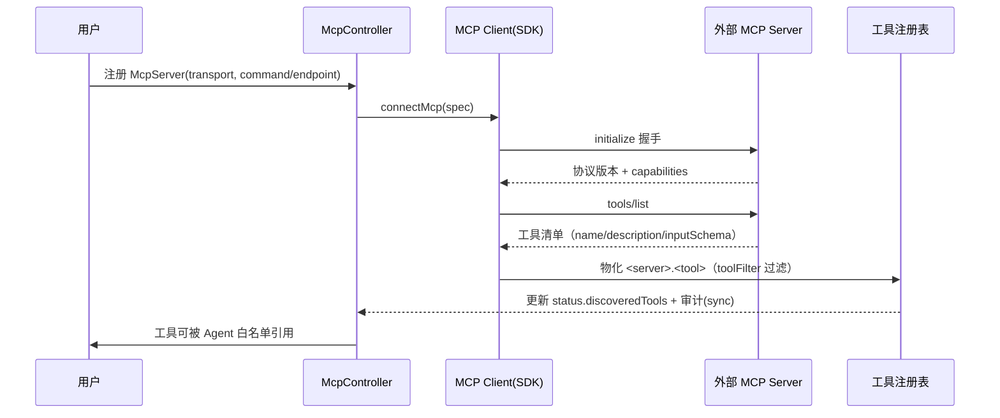

<!-- 详细设计：在 hld-4.8 之上细化到数据库表结构与实现设计，可直接指导编码 -->

# 4.8 插件市场与第三方对接 — 详细设计

## 1. 模块范围

本模块实现"只做编排、不做实现"的接入层：插件安装注册工具与配置项（FR-801）、内置 Jenkins/GitHub/Gitee 插件（FR-802）、MCP 协议接入与工具发现物化（FR-803）、版本依赖与凭证治理（FR-804）、沙箱与 SSRF（FR-805）、A2A 预留（FR-806，M3）。实现上 Plugin/McpServer 为声明式资源走通用表；工具注册表运行时维护 `<plugin>.<tool>` → 执行器；凭证加密块存独立表 `secrets`；MCP client 用 `@modelcontextprotocol/sdk`。本文档给出 Plugin/McpServer spec 结构、secrets 表 DDL、MCP 工具发现物化、凭证注入与 SSRF 防护的实现设计。需求基线 req-4.8（FR-801~806），MCP 物化需 PoC P5。

## 2. 数据库结构设计

### 2.1 表清单

| 表名 | 用途 | 类型 |
|---|---|---|
| `resources(type='plugin')` | 插件声明式资源 | 通用资源表 |
| `resources(type='mcp-server')` | MCP Server 注册 | 通用资源表 |
| `secrets` | 加密凭证块（AES，命名空间隔离） | 独立表 |

### 2.2 表结构

**`secrets`（加密块，对应 resources(type='secret') 的 spec 引用）**：

| 字段 | 类型 | 约束 | 说明 |
|---|---|---|---|
| id | uuid | PK | |
| secret_name | text | not null | 对应资源名（跨表引用） |
| namespace | text | not null | 命名空间隔离（沙箱硬约束） |
| sealing_key_id | text | not null | 加密密钥标识（轮换用） |
| encrypted_data | text | not null | AES-256 加密后的 JSON（多个键值对） |
| created_at | timestamptz | not null default now() | |
| updated_at | timestamptz | not null default now() | |

索引：`(namespace, secret_name)` **唯一**。`resources(type='secret')` 的 spec 只存 `{dataKeys: ['apiToken',...]}`（不含明文），明文写入时经 `crypto.aes-256-gcm` 加密后落此表。

**`resources.spec (type='sealed-secret')`（M2-12，ADR-015）**——密文块直接入 spec（密文可安全过 jsonb）：

```jsonc
// spec: 密文数据（逐 key 独立 AES-256-GCM 加密块，格式同 SealedBlock: base64(iv||authTag||ciphertext)）
{
  "data": {
    "apiToken": "base64(iv||tag||ct)…",   // 每个 value 单独 seal，支持逐条目轮换
    "serverUrl": "base64(iv||tag||ct)…"
  }
}
// status: { phase: Sealed|Unsealed|Error, sealingKeyId, previousKeyId?, graceUntil?, dataKeys[], lastError? }
```

- **phase 语义**：`Sealed`=密文就绪未验证；`Unsealed`=最近一次 unseal 成功（密钥可用，可注入）；`Error`=unseal 失败（密钥缺失/密文损坏/宽限期后旧键条目未轮换）→ fail-closed 禁止注入。
- **rotate（POST /api/v1/sealed-secrets/{name}/rotate）**：activeKey 解密全部条目（previousKey 兜底）→ 新 activeKey 重加密 → `sealingKeyId` 更新、旧键降为 previousKey、`graceUntil=now()+7d`；宽限期内旧密文可解，过后旧键条目仍存 → `Error`。以 `metadata.resourceVersion` CAS 防并发轮换。

**`resources.spec (type='plugin')`**：

```jsonc
{
  "name": "jenkins", "version": "1.4.2", "source": "builtin",   // builtin|market|mcp
  "displayName": "Jenkins 集成",
  "configSchema": [
    { "name": "serverUrl", "type": "string", "required": true },
    { "name": "apiToken", "type": "secret", "required": true }   // 凭证引用，界面掩码
  ],
  "declaredTools": [
    { "name": "jenkins.trigger_build", "description": "触发 Jenkins 构建",
      "risk": "normal", "configRefs": ["serverUrl","apiToken"] },
    { "name": "jenkins.delete_job", "description": "删除任务", "risk": "high" }
  ],
  "dependencies": [{ "name": "github", "versionRange": ">=2.0.0" }],
  "runtime": {
    "requirements": [{ "name": "jenkins-cli", "version": ">=2.0", "check": "jenkins-cli --version" }],
    "installHints": ["curl -fsSL .../jenkins-cli -o /usr/local/bin/jenkins-cli && chmod +x ..."]
  }
}
// status: { "phase": "Installed|Configuring|Ready|Error", "installedTools": [], "lastError": null }
```

**`resources.spec (type='mcp-server')`**：

```jsonc
{
  "transport": "stdio",                       // stdio | http
  "command": "npx", "args": ["@modelcontextprotocol/server-git"],
  "env": { "GITHUB_TOKEN_REF": "gh-token" },  // 凭证引用
  "endpoint": null,                           // http 传输时 URL
  "auth": null, "toolFilter": ["repo_*"],     // 仅物化匹配工具
  "reconnect": { "maxRetries": 3, "backoffMs": 5000 },
  "allowPrivate": false                       // SSRF：默认禁内网
}
// status: { "phase": "Discovered|Error", "discoveredTools": [{name,description,inputSchema}], "lastSyncedAt": "..." }
```

### 2.3 枚举/常量

```ts
// src/plugins/types.ts
export const PLUGIN_SOURCE = ['builtin','market','mcp'] as const;
export const TOOL_RISK = ['normal','high'] as const;        // high → 强制 ToolApproval（4.6）
export const PLUGIN_PHASE = ['Installed','Configuring','Ready','Error'] as const;
export const MCP_TRANSPORT = ['stdio','http'] as const;
export const TOOL_DEFAULT_TIMEOUT_MS = 30_000;
export const SSRF_BLOCKED_CIDRS = ['10.0.0.0/8','172.16.0.0/12','192.168.0.0/16','169.254.0.0/16','127.0.0.0/8'];
```

## 3. 实现设计

### 3.1 模块目录结构

| 文件 | 职责 |
|---|---|
| `src/plugins/types.ts` | Plugin/McpServer zod schema、工具注册表类型 |
| `src/plugins/backend.ts` | `PluginBackend` 接口（DiscoverTools/ExecTool/Health） |
| `src/plugins/native/jenkins.ts` · `github.ts` · `gitee.ts` | 内置插件工具函数（HTTP 调第三方） |
| `src/plugins/lifecycle.ts` | 安装/配置/升级/卸载、依赖双向校验 |
| `src/plugins/registry.ts` | 工具注册表：`<plugin>.<tool>` → 执行器 + risk + configRefs |
| `src/mcp/client.ts` | MCP client（stdio/http 传输、握手、tools/list） |
| `src/mcp/materialize.ts` | 工具物化（discovered → 注册表）与 Server 生命周期 |
| `src/plugins/secret.ts` | Secret 加解密、tool_auth 组装、注入点统一 |
| `src/plugins/urlguard.ts` | SSRF 预检（DNS 解析 + 网段判定） |

### 3.2 核心类型与 Schema（zod）

```ts
// src/plugins/registry.ts
export interface RegisteredTool {
  fullName: string;            // <plugin>.<tool>
  plugin: string; ns: string;
  description: string; risk: ToolRisk;
  executorRef: string;         // native 函数名 或 mcp server+tool
  configRefs: string[];        // 需要从 Secret 读取的配置项
  timeoutMs: number;
}
export async function registerTools(plugin): Promise<void>;
export async function resolveTool(fullName, ns): Promise<RegisteredTool>;   // 未配置/未安装 → NotFoundError

// src/mcp/client.ts
import { Client } from '@modelcontextprotocol/sdk/client/index.js';
import { StdioClientTransport } from '@modelcontextprotocol/sdk/client/stdio.js';
export async function connectMcp(server: McpServerSpec): Promise<{ client, tools: McpTool[] }>;
  // 握手（initialize）→ tools/list → 按 toolFilter 过滤
export async function callTool(conn, name, args): Promise<McpCallResult>;   // 失败 → TransientError
```

### 3.3 内置插件工具清单（FR-802）

| 插件 | 工具全名（示例） | risk | 说明 |
|---|---|---|---|
| jenkins | `jenkins.trigger_build` / `jenkins.get_build_status` / `jenkins.get_build_log` | normal | 触发/查询/日志 |
| jenkins | `jenkins.delete_job` / `jenkins.update_job_config` | **high** | 删除/改配置，强制 ToolApproval |
| github | `github.create_pull_request` / `github.create_issue_comment` / `github.get_issue` | normal | PR/评论/查询 |
| github | `github.push_code` / `github.delete_branch` | **high** | 推送/删除，强制审批 |
| gitee | 与 github 同构，前缀 `gitee.` | 同上 | 复用同一工具函数层（插件抽象层参数化 provider） |

内置插件实现约束：工具函数签名统一 `(ctx: ToolCtx, args) => Promise<ToolResult>`，`ToolCtx` 含已解密的 `auth` 与 `logger`（脱敏），不直接接触 Secret 存储。

### 3.4 API 端点

| 方法 | 路径 | 说明 |
|---|---|---|
| GET/POST | `/api/v1/plugins` | 插件市场列表（source/phase 筛选）/ 注册插件 |
| GET/PUT/DELETE | `/api/v1/plugins/{name}` | 详情 / 更新（CAS 带 resourceVersion）/ 删除（被引用 409） |
| POST | `/api/v1/plugins/{name}/install` | 安装（依赖双向校验，异步 202） |
| POST | `/api/v1/plugins/{name}/configure` | 配置（configSchema 校验 + 凭证写 Secret） |
| POST | `/api/v1/plugins/{name}/uninstall` | 卸载（反向扫描 409 或继续） |
| POST | `/api/v1/plugins/{name}/upgrade` | 升级（工具清单变化需人工确认） |
| GET/POST | `/api/v1/mcp-servers` · `/{name}` | MCP Server CRUD |
| POST | `/api/v1/mcp-servers/{name}/sync` | 工具发现同步（连接 → tools/list → 物化） |
| POST | `/api/v1/secrets` · `/api/v1/secrets/{name}/seal` | 凭证创建 / 加密写入 |

### 3.5 核心函数/服务

```ts
// src/plugins/lifecycle.ts
export async function installPlugin(ns, plugin): Promise<void>;
  // 校验 dependencies（已安装且版本满足）→ 注册 declaredTools → phase=Configuring
export async function configurePlugin(ns, plugin, config): Promise<void>;
  // configSchema 校验 → 凭证写 Secret（AES）→ phase=Ready（工具可被引用）
export async function uninstallPlugin(ns, name): Promise<void>;
  // 反向扫描 Skill/Agent 引用（4.3 dependents）→ 409 阻止或继续；删除 Secret
export async function upgradePlugin(ns, name, newVersion): Promise<void>;
  // 工具清单变化需人工确认（FR-804）→ 依赖重新校验
// src/mcp/materialize.ts
export async function syncMcpServer(ns, name): Promise<void>;
  // connect → tools/list → 物化为 <mcp-server>.<tool> → 更新 status.discoveredTools → 写审计
// src/plugins/urlguard.ts
export async function assertSafeUrl(url: string): Promise<void>;
  // 解析 host → IP；命中 SSRF_BLOCKED_CIDRS → ForbiddenError（fail-closed + 审计）
```

### 3.6 关键流程实现

**MCP Server 注册 → 工具物化**（PoC P5 端到端）：



**安装/配置/MCP 发现与工具调用**：

```
安装 → 校验 dependencies（插件已安装且 semver 满足）
     → 注册 declaredTools（phase=Configuring，未配置工具不可被引用）
配置 → configSchema 校验 → secret 键值写 secrets 表（AES-GCM，ns 隔离）→ phase=Ready

MCP 接入 → 注册 McpServer → connectMcp（握手 + tools/list）
         → 按 toolFilter 物化 <server>.<tool> 进注册表 → status.discoveredTools → 审计

工具调用 → resolveTool(fullName, ns)
         → 解密 Secret 组装 tool_auth（请求头/参数，注入点统一）
         → urlguard.assertSafeUrl（拒绝内网/169.254.0.0/16，fail-closed）
         → risk=high → 先建 ToolApproval（4.6）→ 批准后放行
         → 执行（native HTTP / MCP callTool）→ 调用入 Trace（4.9）
         → 失败按可重试分类返回（MCP 连接失败 → TransientError）
```

**Secret 加解密与注入**：

```ts
// src/plugins/secret.ts
export async function sealSecret(ns, name, data: Record<string, string>): Promise<void>;
  // 每次写入生成新 IV；AES-256-GCM 加密 → secrets 表；明文即刻丢弃
export async function unsealSecret(ns, name): Promise<Record<string, string>>;
  // 仅调用方为同命名空间（沙箱硬约束：跨 ns 读取抛 ForbiddenError）
export async function assembleAuth(tool: RegisteredTool, ns): Promise<Record<string, string>>;
  // 按 tool.configRefs 从 Secret 取值 → 注入 headers/params；Trace/日志自动脱敏
```

### 3.7 错误处理与边界情况

| 场景 | 处理 |
|---|---|
| 依赖未安装/版本不满足 | 拒绝安装 + 缺依赖清单 |
| MCP Server 连接失败 | 工具调用返回可重试错误；`reconnect` 策略自动重连 |
| 凭证泄露风险 | 明文只存在于 Secret 加密块；日志/Trace 脱敏；跨 ns 读取被拒 |
| SSRF（目标内网/元数据） | urlguard 预检拒绝 + 审计（默认禁私网） |
| 升级工具清单变化 | 需人工确认（FR-804），未确认不生效 |
| 卸载被引用插件 | 反向扫描 Skill/Agent → 409 + 引用清单 |
| 未配置调用工具 | NotFoundError（提示先配置） |
| risk=high 未审批 | 不产生外部副作用，等待 ToolApproval |
| MCP Server 生命周期 | 平台管理进程（按需启动/保活/回收）；回收后工具调用返回可重试错误 |

### 3.8 沙箱与凭证隔离细化（FR-805）

- **凭证沙箱**：`unsealSecret` 仅允许调用方命名空间 == Secret 命名空间；插件工具执行器持有 `ns` 上下文，越权读取抛 ForbiddenError 并审计（fail-closed）。
- **网络沙箱（M1/M2）**：出站统一走 `urlguard`（内网/云元数据黑名单）；`allowPrivate` 仅限 platform-admin 开启，且开启写入审计。
- **进程沙箱（M3）**：容器隔离 + 能力最小化（Capability drop、只读 rootfs），原生插件以独立进程运行；M1/M2 以配置校验 + 运行时拦截为主。
- **文件系统隔离**：工具执行器只读注入 Secret 明文（不落盘），工作区写入限制在任务 worktree 内。

### 3.9 工具调用超时与重试（FR-801 运行期）

- 默认超时 `TOOL_DEFAULT_TIMEOUT_MS = 30s`（可配），超时抛 `TransientError`（可重试）。
- 自动重试仅限幂等工具（插件声明 `idempotent: true`），非幂等工具失败直接上报，避免重复副作用。
- 失败分类写入 Trace（`detail.error = {code, retryable}`），供 4.5 任务重试决策消费。
- 工具调用全程埋点：入 Trace（tool span）+ 出站 URL 预检 + 审批联动，任一层失败不产生外部副作用。
- 运行期状态联动：插件 `status.phase` 变化（Configuring→Ready→Error）同步工具注册表，`Ready` 前 `resolveTool` 返回 NotFoundError（明确提示先配置）。
- 高可用：MCP Server 进程崩溃时平台守护自动重启（`reconnect` 策略），重启后触发 `syncMcpServer` 重新发现工具。

### 3.10 插件扩展机制（第三方开发接入）

本小节回答"第三方开发者如何开发一个新插件接入平台"：插件开发范式、Plugin 定义文件规范、打包校验与发布到市场、平台扩展点清单、与 cliyard plugins 的关系。这是平台可扩展性（NFR-06：新增业务域 = 新增 Blueprint/插件，不改平台代码）的关键设计缺口。平台侧生命周期（install/uninstall/upgrade、PluginBackend、MCP 物化、沙箱）见 3.1~3.9，本小节聚焦第三方接入侧的开发与发布。

#### 10.1 插件开发范式（两种）

| 范式 | 适用 | 开发方式 | 复杂度 |
|---|---|---|---|
| **MCP 插件**（推荐，FR-803） | 对接已有系统/工具 | 开发/复用 MCP Server（`@modelcontextprotocol/sdk` 或任意语言 MCP 实现），平台零改造接入，自动发现 Tools | 低 |
| **原生插件**（FR-801） | 深度集成/自定义工具逻辑 | 按 Plugin 定义文件声明 declaredTools/configSchema/runtime，工具实现走平台工具壳（custom tool 或 API） | 中 |

- 选型建议：能走 MCP 的优先走 MCP（标准协议 NFR-08，生态复用）；只有需要平台深度集成（如审批联动、自定义工具逻辑）时才开发原生插件。
- 两种范式共用同一 Plugin 资源模型与配置流程（仅 `source` 区分 builtin/market/mcp），治理一致（req-4.8 FR-802 设计说明）。

#### 10.2 Plugin 定义文件规范（原生插件）

一个插件 = 一个 manifest（YAML）+ 可选实现资源：

```yaml
apiVersion: orchestra.io/v1alpha1
kind: Plugin
metadata:
  name: my-plugin
  namespace: default
spec:
  version: 1.0.0
  source: market               # builtin | market | mcp
  displayName: 我的插件
  configSchema:                # 安装后要求填写的配置
    - { name: serverUrl, type: string, required: true }
    - { name: apiToken, type: secret }
  declaredTools:
    - name: my.tool_1
      description: 工具说明
      risk: normal              # normal | high（high 自动接 ToolApproval，4.6）
      configRefs: [serverUrl, apiToken]
  runtime:
    requirements:              # CLI 依赖声明（不安装，预检用，ADR-014）
      - { name: mycli, check: "mycli --version" }
    installHints:              # 安装提示（skill 自安装，ADR-014）
      - "curl -fsSL ... | sh"
  dependencies:                # 插件间依赖
    - { name: github, versionRange: ">=2.0.0" }
```

字段校验（发布/安装前离线校验，校验器见 3.2 zod schema）：

- `configSchema`：类型合法（string/secret/number/boolean/select 等）、必填标记、secret 标记（界面掩码，值写 `secrets` 表加密块，见 3.2/3.8）。
- `declaredTools`：工具全名 `<plugin>.<tool>` 唯一性检查（与已注册工具无冲突）、`risk` 取值合法（normal|high）。
- `runtime`：requirements/installHints 格式合法；requirements 只声明不安装（ADR-014），check 命令用于环境预检。
- `dependencies`：双向依赖校验（安装校验依赖存在且版本满足；悬空依赖拒绝发布，FR-804）。

#### 10.3 打包与发布

- **打包**：插件打包为规范格式（`.orchestra-plugin` 目录或压缩包），内含 manifest + 可选 assets/脚本 + 校验和（SHA-256，防篡改）。
- **校验**：发布前离线校验（manifest schema、工具命名唯一、依赖、configSchema 凭证引用合法性），校验不通过拒绝发布。
- **发布**：发布到插件市场（FR-801），按命名空间可安装；版本不可变（semver，同版本覆盖被拒），升级走 3.5 `upgradePlugin`（工具清单变化需人工确认，FR-804）。
- **市场元数据**：名称/版本/描述/来源（builtin|market|mcp）/兼容平台版本（升级兼容性校验依据，3.4 API `/api/v1/plugins` 列表返回）。

#### 10.4 扩展点清单（平台可扩展性 NFR-06）

| 扩展点 | 机制 | 位置 |
|---|---|---|
| 新增工具 | 插件 declaredTools 或 MCP 自动发现 | 4.8 |
| 新增业务域流程 | Blueprint | 4.4 |
| 新增 Skill | Skill 资源 | 4.3 |
| 新增 CLI 命令 | cliyard specs 资源 YAML + 可选 cliyard plugins（Python：自定义 auth 步骤/输出格式化） | dld-cli |
| 新增通知渠道 | 通知适配器 | 4.10 |
| 新增模型 Provider | ModelEndpoint | 4.2 |

新增业务域的标准路径：写 Blueprint + 配套 Skill/插件，全部以声明式资源安装，平台内核代码零改动（NFR-06）。

#### 10.5 与 cliyard plugins 的关系

- cliyard 的 Python plugins（`@register_auth_step` / 自定义输出）用于 **CLI 侧**扩展（自定义认证步骤、响应格式化），与平台插件（Server 侧工具）互补：
  - 平台插件：扩展平台能力（工具/流程/Skill），供所有 Agent 用；
  - cliyard plugins：扩展 CLI 行为（认证/输出），供 AI/自动化调用时用。
- 两者通过 RESTful API 契约对齐（OpenAPI 3.1，tech-stack 2.6）：平台插件注册的工具由 CLI specs 命令可调（dld-cli 4.3 动作命令），specs 资源 YAML 是命令唯一源，第三方如需深度自定义命令行为再写 cliyard plugins（tech-stack 2.9）。

#### 10.6 插件开发文档与脚手架（建议）

- 插件开发模板/脚手架：manifest 示例、MCP 骨架（`@modelcontextprotocol/sdk` server 模板）、configSchema 校验器（复用 3.2 zod schema 生成）。
- 插件开发指南：manifest 规范 + 打包发布步骤 + 本地测试（含 configSchema 填写与工具调用验证）。
- 脚手架作为市场内容发布（一个 "developer-tools" 内置插件），与 4.4 Blueprint 模板市场共用发布链路。

### 3.11 A2A 预留（FR-806，M3）

- Plugin 资源预留 `backend: { type: 'a2a', cardUrl, auth }` 分支（仅 schema，不实现）。
- A2A Agent 物化为平台工具（`a2a.<agent>`）或编排为流程节点（subflow 变体），调用结果入 Trace。
- 发布 Agent Card 走标准协议（NFR-08），凭证与命名空间隔离规则同 MCP 接入。

### 3.12 测试要点

- 单元：urlguard 覆盖内网段/云元数据/合法域名；Secret 加解密往返与跨命名空间拒绝；dependencies 版本校验；工具全名唯一性（`<plugin>.<tool>`）。
- 生命周期：安装→配置→Ready 全链路状态迁移；配置前工具不可引用；升级工具清单变化被拦截待确认。
- 集成（PoC P5 前置）：安装并配置 Jenkins 后 Agent 可引用 `jenkins.trigger_build` 并成功调用，未配置时明确报错；GitHub 与 Gitee 工具带前缀无冲突；注册 MCP Server 后 Tools 自动出现在工具列表并可直接白名单引用；升级工具清单变化需人工确认；两命名空间同一插件不同凭证互不可读。
- 运行期：`jenkins.delete_job`（risk=high）在 ToolApproval 批准前不产生外部副作用；未配置插件调用返回明确错误；MCP Server 重启后工具列表重新同步。
