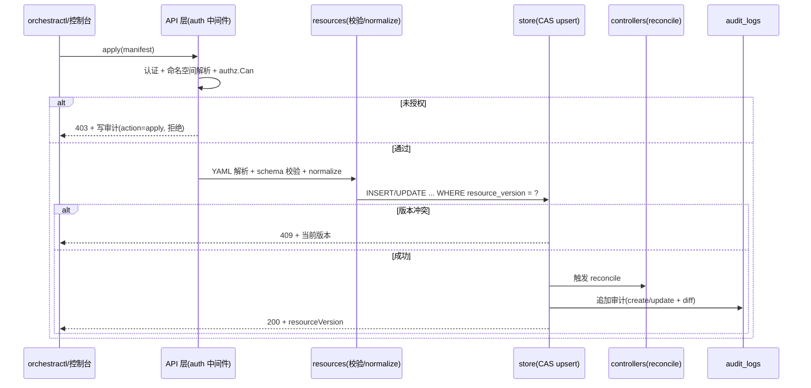

<!-- 概要设计：对应需求文档 docs/req-4.1-platform.md 与架构 architecture.md 第 4 章 -->

# 4.1 平台基础与治理 — 概要设计

## 1. 模块定位

平台基础与治理是 Orchestra 的底座：负责多租户命名空间隔离、基于角色的访问控制（RBAC）、全量审计日志、声明式资源模型与 REST API 网关。本模块横切 4.2~4.10 全部模块，任何资源访问、任务操作、审批决策都以本模块的隔离与鉴权为前置。需求基线见 [req-4.1-platform.md](req-4.1-platform.md)（FR-101~107），本文档给出其实现方案：K8s 风格资源模型、通用资源表存储、TypeScript 中间件 RBAC、审计双写。

## 2. 可行性分析

### 2.1 技术可行性

本模块所需技术均为 Node/TypeScript 生态成熟能力，无未经验证的风险点：

- **K8s 风格资源模型**：TS 实现 `TypeMeta + ObjectMeta + Spec + Status` 类型 + `yaml` 库解析 + zod 校验，属常见模式（对标 Orloj 的 `resources` 包），无新技术负担。
- **通用资源表**：Postgres jsonb 列存 `spec`/`status`，配合 `(namespace, type, name)` 唯一索引，CRUD 与按 type 过滤查询均可由单表 SQL 完成（architecture.md 4.4 已定此取舍）。
- **RBAC**：标准"用户 → 角色（Role）→ 权限（资源×动作）→ 命名空间"模型，TS 中间件按请求路径前缀 + 资源归属解析命名空间后判定，无理论障碍。
- **REST API**：Hono 路由 + OpenAPI 3.1 契约先行（architecture.md 3 节），工作量集中在路由注册与 handler 封装。
- **乐观锁**：`resourceVersion` 字段 + UPDATE 语句带 `WHERE resource_version = ?` 实现 CAS，Postgres 原生支持。

### 2.2 依赖与前置

- 依赖 Postgres 14+（生产模式）；MVP 可先以内存存储实现同一接口（NFR-07 平滑演进）。
- 不依赖其他功能模块，是全局地基；但被全部模块引用，需先行冻结资源模型（TypeMeta/命名规则）与 API 前缀约定。
- 依赖外部认证源（后续可接 SSO/CAS），MVP 先用内置用户表 + API Token，接口留鉴权抽象层。

### 2.3 风险与复杂度评估

| 风险 | 影响 | 缓解 |
|---|---|---|
| 通用资源表 jsonb 在 Task/Trace 高频场景查询慢 | 任务列表/Trace 检索性能下降 | 高频表独立（tasks/task_trace_events），通用表仅存低频治理资源（Agent/Flow/Plugin 等） |
| RBAC 判定遗漏导致越权（fail-closed 失效） | 跨命名空间数据泄露 | 网关层 + 业务层双重校验；提供统一 `authz.Can(ctx, action, resource)` 断言函数，测试用例覆盖全部 API 端点 |
| 命名空间解析歧义（嵌套路径、跨命名空间引用） | 资源归属错乱 | 解析规则单点实现（URL 参数 → 资源对象 → 归属命名空间），system 命名空间回退规则显式编码 |
| resourceVersion 并发冲突处理不当 | 用户困惑 | 409 返回冲突详情（当前版本 vs 请求版本），前端提供刷新重试引导 |
| 审计日志膨胀 | 存储成本与检索变慢 | 追加写 + 分区表（按月），保留期策略 + 后台清理任务 |

### 2.4 可行性结论

**可行**，复杂度评级：**中**。无需要 PoC 的技术点，但资源模型与 RBAC 语义需在 M1 启动时一次定稿（跨模块引用成本高），建议先完成 `src/resources` 与 `src/auth` 的单元测试骨架再铺开其他模块。

## 3. 实现初步方案

### 3.1 核心模块/组件划分（对齐 `src/`）

| 组件 | 职责 |
|---|---|
| `src/resources` | 资源类型定义（TypeMeta/ObjectMeta/Spec 泛型）、YAML Manifest 解析与校验、默认值注入（normalize）、resourceVersion 管理 |
| `src/store` | 存储抽象接口（memory/sql 双实现）、通用资源表读写、迁移脚本 |
| `src/api` | Hono 路由注册、OpenAPI 契约、handler 封装、统一错误码（400/401/403/404/409/500） |
| `src/auth` | 用户/Token 认证、RBAC 授权判定、命名空间解析、system 命名空间回退 |
| `src/controllers` | 资源控制器 reconcile 循环（spec 期望态 → status 实际态），本模块含 Quota 配额控制器 |
| `src/observability` | 审计双写（结构化日志 + `audit_logs` 表），供各模块埋点调用 |

### 3.2 关键数据模型（表/资源）

- **通用资源表 `resources`**（architecture.md 4.4）：`(namespace, type, name)` 唯一；`spec jsonb`、`status jsonb`、`generation int`、`resource_version bigint`、`labels/annotations jsonb`。
- **审计表 `audit_logs`**：`id bigserial`、`timestamp`、`actor`、`action`（create/update/delete/approve/reject/request-changes/apply/exec）、`resource {kind,namespace,name}`、`diff jsonb`（敏感字段脱敏）、`trace_id`、`source`（console/api/cli/webhook/im）；追加写、只读接口。
- **命名空间资源 `Namespace`**（新增治理资源）：`spec{quota{agents,tasks_concurrent,secrets}, members[]}`，`system` 命名空间以保留标记 `system: "true"` 标识。
- **RBAC 表**：`users`、`tokens`（API Token）、`roles`（预置五角色）、`role_bindings(role, namespace, user)`。

### 3.3 关键流程/接口

核心 API（前缀 `/api/v1`，contract-first）：

| 方法 | 路径 | 说明 |
|---|---|---|
| GET/POST | `/api/v1/namespaces` · `/api/v1/namespaces/{name}` | 命名空间 CRUD 与配额 |
| GET/POST/PUT/DELETE | `/api/v1/{resource}` · `/api/v1/{resource}/{name}` | 通用资源 CRUD（apply 语义，PUT 带 resourceVersion） |
| GET | `/api/v1/audit-logs` | 审计检索（actor/时间/资源类型/action 过滤，分页） |
| GET/POST | `/api/v1/secrets` · `/api/v1/secrets/{name}` | 凭证管理（加密存储，见 4.8/4.1 联动） |

关键时序（RBAC 校验）：

```
请求 → auth 中间件（解析 Token → 用户）→ 命名空间解析（URL 参数 / 资源归属）
     → authz.Can(user, action, resource) → 通过则进入业务 handler，拒绝则 403 + 写审计
```

`apply` 流程：解析 YAML → 校验 schema → normalize（注入默认值）→ CAS upsert（冲突 409）→ 触发控制器 reconcile → 写审计。

`apply` 时序：



### 3.4 关键技术点

1. **通用资源 CRUD 泛化**：用一个 `GenericStore` 按 `(type)` 分桶操作，各 kind 只注册 Spec 解码器与校验器，避免每资源一套 CRUD 样板代码。
2. **RBAC 双重校验**：网关层做粗粒度（路径前缀 + 命名空间），业务层用 `authz.Can` 断言做细粒度（资源级动作，如"仅审批人可 decide"），双保险保证 fail-closed。
3. **命名空间回退解析**：引用解析顺序为"本命名空间 → system 命名空间"（ADR-004），集中在 `auth.ResolveRef` 单点实现，保证 4.2/4.4 引用语义一致。
4. **审计脱敏**：diff 落盘前对 `secret`/`token`/`password` 键值掩码（`sk-••••`），与 4.9 日志脱敏共用同一规则函数。
5. **乐观锁 CAS**：所有 PUT/PATCH 必须携带 `resourceVersion`，UPDATE 条件带版本比对，冲突返回 409 并附当前版本。
6. **任务生命周期 API**（FR-107）：`pause/resume/cancel/rerun` 端点由本模块的治理层承接（与 4.5 状态机联动），重跑生成新 Task 实例、保留原记录。
7. **统一错误码**：`401`（未认证）/`403`（授权失败，fail-closed 拒绝并审计）/`404`/`409`（版本冲突）/`422`（校验失败含字段详情）/`429`（配额超限），前端按码渲染，避免裸 500。
8. **配额强校验**：命名空间配额（Agent 数/Task 并发/凭证数）在创建/更新事务内校验，超限拒绝创建并返回当前用量（与 4.9 成本统计联动展示）。

### 3.5 实现步骤（MVP → 增强）

1. **M1**：`resources` 模块（TypeMeta/ObjectMeta + YAML 解析校验）→ 通用资源表 + 迁移 → 命名空间/RBAC/审计三表 → Hono 路由 + 认证中间件 + 通用 CRUD handler → orchestractl `apply` 打通（architecture.md 附录第 1 步）。
2. **M1**：Quota 配额控制器 + `pause/resume/cancel/rerun` 任务治理接口。
3. **M2**：审计分区表 + 保留期清理；命名空间资源统计（与 4.9 成本联动展示）。
4. **M3**：外部认证接入（SSO/CAS）、跨命名空间共享资源的管理界面。

> CLI（cliyard）为横切能力，其概要设计见独立文档 [hld-cli.md](hld-cli.md)。
