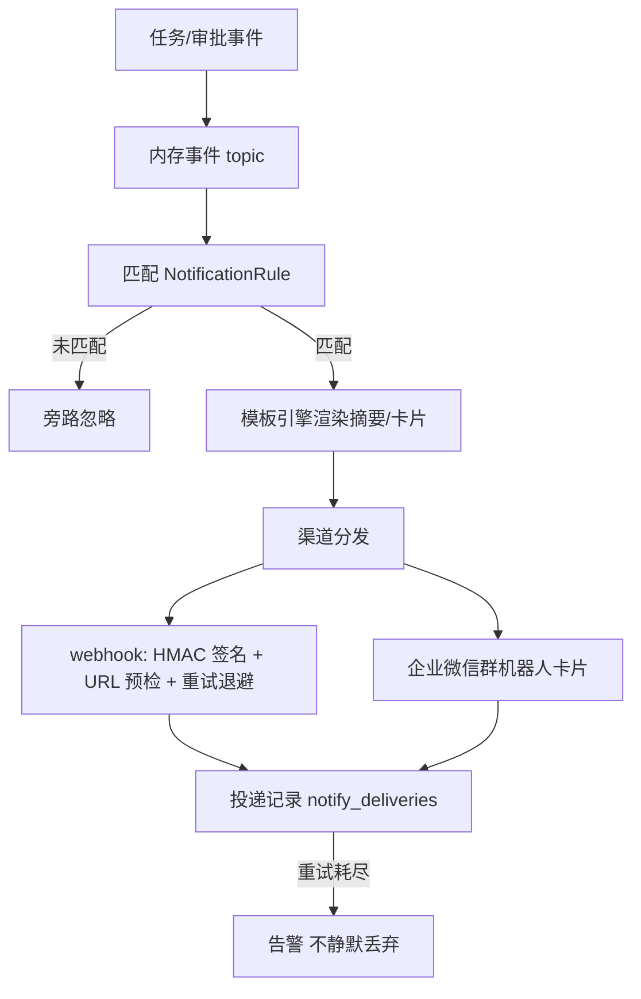

<!-- 概要设计：对应需求文档 docs/req-4.10-notify.md -->

# 4.10 通知与 IM 集成 — 概要设计

## 1. 模块定位

通知模块完成"人工在环"闭环的最后一公里：任务状态变更（完成/失败/等待审批）通过出站 Webhook 通知外部系统，通过企业微信机器人推送结果摘要与审批待办卡片，并预留飞书/钉钉等多渠道适配。通知订阅与 4.5 的 Webhook 触发共用同一事件模型，入向（触发）与出向（通知）两条链路对称设计。需求基线见 [req-4.10-notify.md](req-4.10-notify.md)（FR-1001~1004），本文档给出其实现方案：NotificationRule 资源 + 事件订阅 + 渠道适配器 + 出站签名/SSRF。

## 2. 可行性分析

### 2.1 技术可行性

- **事件订阅模型**：平台内部统一事件总线（4.5 状态变更、4.6 审批、4.9 指标均发事件），NotificationRule 声明订阅事件与投递渠道，TS 侧 `publisher/subscriber` 简单实现（内存 topic，M2 可复用消息总线）。
- **出站 Webhook（FR-1001）**：HTTP POST + HMAC-SHA256 签名（基于 Secret），重试退避（默认 5 次指数），标准模式。
- **企业微信机器人（FR-1002）**：企业微信群机器人 webhook 为公开 HTTP 接口（`https://qyapi.weixin.qq.com/cgi-bin/webhook/send`），消息卡片为 JSON payload，TS 实现无 SDK 依赖。
- **消息模板引擎（FR-1003）**：TS 模板引擎（handlebars）+ 按渠道渲染适配器，多渠道仅差异渲染，新增渠道 = 新增适配器（NFR-08）。
- **SSRF 防护**：出站 URL 预检与 4.8 同规则（禁内网/云元数据），复用 `urlguard`。
- **IM 触发（FR-1004，M3）**：企业微信回调事件（消息事件）接收 + 指令解析 + 调用任务创建接口，与 Webhook 触发同源。

### 2.2 依赖与前置

- 依赖 4.5：任务状态变更事件源（task.succeeded/failed/waiting-approval 等）。
- 依赖 4.6：审批待办与 TTL 过期事件。
- 依赖 4.1：Secret 加密存储（出站签名密钥、企业微信凭据）、命名空间 RBAC。
- 依赖 4.8：企业微信插件提供机器人配置（settings 集成分组）。
- 外部依赖：企业微信群机器人 webhook 地址、接收方 Webhook 服务。

### 2.3 风险与复杂度评估

| 风险 | 影响 | 缓解 |
|---|---|---|
| 投递失败静默丢弃 | 关键通知丢失 | 重试退避（5 次指数）+ 重试耗尽告警，绝不静默丢弃（req-4.10 验收第 3 条） |
| 出站目标被打到内网（SSRF） | 内网探测 | 出站 URL 预检（复用 4.8 urlguard），fail-closed 拒绝 |
| 通知风暴（高频事件重复投递） | 接收方被打爆 | 通知旁路 + 事件聚合（同一任务状态收敛后发一次）+ 渠道限速 |
| 模板注入/凭据进 payload | 信息泄露 | payload 只含摘要（默认 1KB 截断），完整内容走 API 按权限拉取；凭证明文绝不进 payload |
| 企业微信回调重复投递 | 重复创建任务 | 指令触发复用幂等键（`wecom:msg-id`，NFR-04） |
| 多渠道渲染不一致 | 用户困惑 | 模板引擎单点渲染，多渠道仅适配器差异（正文语义一致） |

### 2.4 可行性结论

**可行**，复杂度评级：**低**。出站 Webhook 与模板引擎无技术风险；企业微信机器人为标准 HTTP 接口，无需 PoC。IM 发起任务（FR-1004）为 M3，需企业微信回调事件接入（可通过 4.8 企业微信插件承载）。

## 3. 实现初步方案

### 3.1 核心模块/组件划分

| 组件 | 职责 |
|---|---|
| `src/notify` | 事件订阅与分发：NotificationRule 解析、事件 → 渠道匹配、投递重试 |
| `src/notify/webhook` | 出站 Webhook 渠道：HMAC 签名、HTTP 发送、重试退避 |
| `src/notify/wecom` | 企业微信渠道：群机器人消息/卡片发送、回调事件接收（M3） |
| `src/notify/template` | 消息模板引擎：按事件类型渲染，渠道适配器注册 |
| `src/notify/outbound` | 出站安全：URL 预检（SSRF）、payload 截断脱敏 |
| `src/trigger`（联动 4.5） | IM 指令触发入口（M3，复用 Webhook 触发链路） |

### 3.2 关键数据模型（表/资源）

- **NotificationRule 资源**：`spec{events[]（task.succeeded/task.failed/task.waiting-approval/approval.expired/task.paused/resumed/cancelled）, channels[{type(webhook|wecom|feishu|dingtalk), url/webhook 配置, secret_ref, retry{maxRetries, backoff}}], template, enabled}`；`status{phase, last_delivery}`。
- **事件负载结构**：`{trace_id, task_ref, namespace, event, timestamp, payload_summary}`（统一语义，与 4.5 Webhook 触发共享 traceId）。
- **投递记录表 `notify_deliveries`**：`rule_ref, channel, event_id, status(ok|retrying|failed), attempts, last_error`（去重 + 排障）。

### 3.3 关键流程/接口

核心 API：

| 方法 | 路径 | 说明 |
|---|---|---|
| GET/POST | `/api/v1/notification-rules` · `/{name}` | 通知规则 CRUD |
| POST | `/api/v1/notification-rules/{name}/toggle` | 启停（不影响任务执行，旁路） |
| GET | `/api/v1/notify/deliveries` | 投递记录查询（排障） |
| POST | `/api/v1/im-callbacks/wecom` | 企业微信回调入口（M3，IM 指令触发） |

关键流程（事件 → 投递）：

```
任务状态变更 / 审批待办 → 发事件到内存 topic
→ notify 分发器匹配 NotificationRule（events + enabled）
→ 模板引擎渲染（事件类型 → 摘要/卡片）
→ 渠道适配器投递：webhook（HMAC 签名 + URL 预检 + 重试退避）/ wecom（群机器人卡片）
→ 投递记录写 notify_deliveries → 重试耗尽告警（不静默丢弃）
→ 审批卡片含深链 #approval-detail（控制台地址全局设置配置），决策后回推结果反馈
```



### 3.4 关键技术点

1. **事件源统一**：4.5/4.6/4.9 的事件统一走 `src/notify` 的事件总线入口，通知订阅与 4.5 Webhook 触发共享 `traceId` 语义（入向/出向对称）。
2. **HMAC-SHA256 签名**：出站请求体 hash 后以 Secret 签名，携带 `X-Orchestra-Signature` 头；接收方校验防伪造；密钥存 4.1 Secret。
3. **payload 截断与脱敏**：任务输出摘要默认 1KB 截断，完整内容走 API 按权限拉取；凭证明文绝不进入 payload（NFR-01）。
4. **模板引擎 + 渠道适配器**：模板按事件类型定义，变量注入（任务名/节点/审批人/链接/耗时/成本）；新增渠道仅注册适配器（FR-1003，NFR-08）。
5. **通知旁路**：投递失败不影响任务执行本身；失败走重试退避，耗尽告警。
6. **IM 指令幂等**（M3）：`wecom:msg-id` 幂等键与 4.5 Webhook 同源，重复指令不重复建任务；指令权限遵循命名空间 RBAC（task-initiator）。
7. **事件聚合去抖**：同一任务连续状态变化（如 Pending→Running→WaitingApproval）按事件类型聚合后投递，避免通知风暴；卡片内呈现最终态摘要。
8. **深链可靠性**：卡片跳转 URL 由全局设置下发（控制台地址），变更时旧卡片链接保持可跳转（302 到首页兜底）。

### 3.5 实现步骤（MVP → 增强）

1. **M1**：NotificationRule 资源 + 事件订阅分发 + 出站 Webhook（HMAC 签名 + SSRF 预检 + 重试退避）+ 投递记录表。
2. **M1**：企业微信群机器人（任务结果摘要 + 审批待办卡片 + 深链 + 决策反馈）。
3. **M2**：飞书/钉钉渠道适配器（复用模板引擎）、通知模板命名空间级覆盖。
4. **M3**：IM 发起任务（企业微信回调 + 指令解析 + 幂等 + RBAC，与 4.5 触发联动）。
