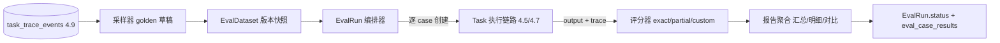

<!-- 概要设计：对应需求文档 docs/req-4.11-eval.md，评估体系为 M3 差异化能力 -->

# 4.11 Eval 评估体系 — 概要设计

## 1. 模块定位

Eval 评估体系解决"如何量化 Agent 输出质量"：以带期望输出的 golden 样例（`EvalDataset`）驱动真实任务执行（复用 4.5 Task 管线与 4.7 opencodeExecutor），采集输出与 trace，按可配置评分维度（精确 / 部分 / 自定义）对比打分，聚合成可追溯的评估报告（`EvalRun`）。需求基线见 [req-4.11-eval.md](req-4.11-eval.md)（FR-1005~1010），本文档给出其实现方案：EvalDataset/EvalRun 资源 + 评估运行编排器 + 可插拔评分器 + trace 采样器 + 报告聚合。

## 2. 可行性分析

### 2.1 技术可行性

- **资源模型**：EvalDataset/EvalRun 与 Agent/Flow 同为 K8s 风格资源，注册进现有 REGISTRY（schemas.ts）即接入通用资源表与通用 CRUD（架构 4.1/4.2），无新技术负担。
- **评估运行**：复用 Task 执行链路（4.5 状态机 + 4.7 opencodeExecutor），评估编排器只需"为 case 创建 Task → 等待 → 取输出/trace"，不重复实现执行引擎，复杂度大幅收敛。
- **评分器**：exactMatch（字符串归一化 + JSON 深比较）、partialMatch（关键词/子串/相似度）、custom（脚本资源或 LLM 判定）均为确定性或已成熟模式；LLM 判定走现有 modelgw 调用（4.2），显式计费。
- **trace 采样**：`task_trace_events`（4.9）已记录历史任务输入与执行元信息，按任务/节点/Agent 过滤即可生成 golden 草稿。
- **报告聚合**：SQL/内存聚合 case 结果 + 历史对比，标准实现。

### 2.2 依赖与前置

- 依赖 4.5：Task 执行链路（创建 / 等待 / 重试 / 取消），评估运行的核心载体。
- 依赖 4.7：opencodeExecutor（真实执行侧），与 4.5 一致。
- 依赖 4.9：`task_trace_events` 采样源 + 耗时/Token 计量（评分旁证与报告成本）。
- 依赖 4.2：评估目标 `agentRef` 引用校验；custom + LLM 判定走 modelgw。
- 依赖 4.4：评估目标为 Flow 时 `flowRef` 引用校验与实例化。
- 可选依赖 4.8 / 4.3：custom 判定脚本的资源引用机制（脚本来源复用 Skill/插件机制）。
- 外部依赖：无新增第三方；评估运行复用 opencode serve（已有）。

### 2.3 风险与复杂度评估

| 风险 | 影响 | 缓解 |
|---|---|---|
| 评估结果与线上行为不一致（自建执行 vs 真实执行） | 跑分失真 | 强制复用 Task 执行链路，case 即真实任务；评估报告携带关联 Task 跳转（可复核） |
| 大批量 case 并发压垮 worker | 影响线上任务 | concurrency 受 4.5 worker 容量与命名空间配额约束；EvalRun 可配置子集运行（caseFilter） |
| 无标注数据跑分失真 | golden 质量低 | 采样只生成草稿，期望输出人工确认后才可运行（fail-closed） |
| custom LLM 判定成本失控 | Token 成本膨胀 | 显式标注独立计费（NFR-05 例外），报告单列该成本，限制判定调用次数/缓存 |
| 数据集变更影响历史结果 | 对比失真 | 数据集版本不可变（快照），运行固定引用版本 |
| 评估运行与线上任务资源竞争 | 调度抖动 | 复用 4.5 队列/租约/配额机制，评估任务与线上任务同优先级治理规则 |

### 2.4 可行性结论

**可行**，复杂度评级：**中**。核心风险点是"复用执行链路"与"golden 数据质量"两处，前者靠架构约束（评估只编排不执行），后者靠采样草稿 + 人工确认的 fail-closed 流程。评分器三种维度无技术难点，LLM 判定走既有 modelgw。M3 落地按"资源 → 编排器 → 评分器 → 采样 → 报告"顺序推进即可。

## 3. 实现初步方案

### 3.1 核心模块/组件划分

| 组件 | 职责 |
|---|---|
| `src/eval/dataset` | EvalDataset 类型 / zod schema / 校验（cases 结构、目标引用存在性、版本管理） |
| `src/eval/runner` | 评估运行编排器：按 case 创建 Task（复用 4.5 管线）、并发控制、等待与结果回收、超时/失败处理 |
| `src/eval/scorer` | 评分器：exactMatch / partialMatch / custom 三种判定 + 维度/case 加权聚合 |
| `src/eval/sample` | 从 `task_trace_events` 采样生成 cases 草稿（输入侧自动、期望输出人工补标） |
| `src/eval/report` | 报告聚合（汇总/明细/历史对比）与查询 API |
| `src/eval/registry` | EvalDataset / EvalRun 注册进 REGISTRY（schemas.ts），接入通用 CRUD 与 RBAC/审计 |

### 3.2 关键数据模型（表/资源）

- **`EvalDataset` 资源**：`spec{description, targetAgentRef|targetFlowRef, scoringDimensions[{name, matchType, weight, params}], cases[{id, input, expectedOutput, expect?, weight?}]}`；按 `(namespace, name, version)` 版本化，版本不可变（快照语义）。
- **`EvalRun` 资源**：`spec{datasetRef, datasetVersion, targetAgentRef?, concurrency, timeoutSeconds, scoringOverride?, caseFilter?}`；`status{phase, totalCases, passedCases, failedCases, score, reportRef, startedAt, finishedAt, lastError}`。
- **数据库表**（详细见 dld-4.11 §2）：`eval_datasets`（spec/cases jsonb + 版本）、`eval_runs`（运行配置与结果汇总）、`eval_case_results`（case 级评分明细，关联 run 与 task）。

### 3.3 关键流程/接口

核心 API（前缀 `/api/v1`，contract-first）：

| 方法 | 路径 | 说明 |
|---|---|---|
| GET/POST | `/api/v1/eval-datasets` · `/api/v1/eval-datasets/{name}` | EvalDataset CRUD（含版本） |
| POST | `/api/v1/eval-datasets/{name}/cases` | golden 批量导入（JSON Lines / YAML） |
| POST | `/api/v1/eval-datasets/{name}/sample` | 从 task_trace_events 采样生成 cases 草稿 |
| GET/POST | `/api/v1/eval-runs` · `/api/v1/eval-runs/{name}` | EvalRun CRUD |
| POST | `/api/v1/eval-runs/{name}/start` · `/cancel` · `/rerun` | 评估运行生命周期 |
| GET | `/api/v1/eval-runs/{name}/report` | 评估报告（汇总 + case 明细 + 历史对比） |
| GET | `/api/v1/eval-runs/{name}/cases` | case 级结果分页 |

关键流程（评估运行）：

```
EvalRun start → 加载 dataset 版本快照 → 解析 cases + 评分维度
→ 并发（concurrency）为每个 case 创建 Task（4.5 管线：单 Agent 构造单节点 Flow / Flow 直接实例化）
→ 等待完成 → 采集 Task.output + task_trace_events（耗时/Token/工具）
→ scorer 逐 case 评分（weight 加权）→ 聚合总分/通过率/维度得分
→ 写 EvalRun.status + eval_case_results + 报告 → phase 终态
```



### 3.4 关键技术点

1. **只编排不执行**：评估运行不引入第二执行引擎，case → Task 全部走 4.5 状态机与 4.7 opencodeExecutor，评估结果即线上真实行为（架构约束，非约定）。
2. **版本快照**：EvalRun 固定引用 `datasetVersion`，数据集编辑产生新版本；历史运行/报告不受影响，保证对比口径一致。
3. **采样草稿 + 人工确认**：`/sample` 只自动提取输入侧与元信息，期望输出留空即不可运行（fail-closed），杜绝无标注跑分。
4. **可插拔评分器**：`Scorer` 接口按 `matchType` 分发，新增判定维度不改编排器；`custom` 复用 Skill/插件脚本资源机制，LLM 判定走 modelgw 并独立计费（NFR-05 例外显式标注）。
5. **case 级失败隔离**：单 case Task 失败/超时不中断整体运行（计为 failedCases），`failFast` 可配；致命错误（引用失效、配额拒绝）才置 phase=failed。
6. **复用治理**：评估 Task 与线上任务共用命名空间配额、RBAC、审计（创建数据集/运行均入审计日志），无旁路特权。
7. **报告口径单点**：总分/维度得分/通过率/成本聚合集中在 `src/eval/report`，与 4.9 成本聚合 SQL 共用口径。
8. **历史对比**：同 dataset 多轮 EvalRun 按 `(dataset_id, version, started_at)` 序列查询，输出趋势与维度波动。

### 3.5 实现步骤（MVP → 增强）

1. **M3 第一步**：EvalDataset/EvalRun 资源类型 + zod 校验 + 注册 REGISTRY（接入通用 CRUD / RBAC / 审计）。
2. **M3 第二步**：`eval_datasets` / `eval_runs` / `eval_case_results` 表 + 迁移 + RESTful API（CRUD / cases 导入 / report 查询）。
3. **M3 第三步**：评估运行编排器（case → Task → 采集 → 状态更新），先跑通单 Agent 评估闭环（复用 mock/opencode executor）。
4. **M3 第四步**：评分器三种维度（exactMatch / partialMatch / custom 脚本）+ 加权聚合。
5. **M3 第五步**：trace 采样器（`/sample`）+ 报告聚合与历史对比。
6. **M3 增强**：custom + LLM 判定（modelgw）、Flow 目标评估、评估展示原型页（eval-dataset / eval-run / eval-report）。
