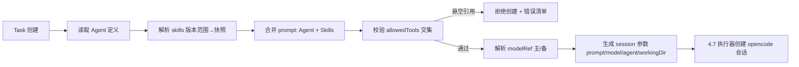

<!-- 概要设计：对应需求文档 docs/req-4.2-agent.md -->

# 4.2 Agent 管理 — 概要设计

## 1. 模块定位

Agent 是 Orchestra 的一等公民：一个声明式可执行单元，封装提示词、模型引用、工具白名单、技能范围与执行上限。本模块负责 Agent 资源的定义、校验、生命周期与模型路由，并产出"可下发给 opencode 会话"的最终执行配置（prompt + model + agent 参数）。需求基线见 [req-4.2-agent.md](req-4.2-agent.md)（FR-201~206），本文档给出其实现方案：AgentSpec 结构 + 引用解析 + 模型网关路由 + 工具白名单校验。

## 2. 可行性分析

### 2.1 技术可行性

本模块为纯声明式资源管理，无高风险技术：

- **AgentSpec 结构**：TS 接口 + yaml 字段映射，字段与 req-4.2 完全对齐（prompt/modelRef/allowedTools/skills/roles/limits/runtime/workingDir），校验用 zod。
- **模型路由（FR-205）**：ModelEndpoint 资源 + 主/备模型切换，Node/TS 侧实现健康探测（429/5xx/超时判定）即可，无依赖外部 SDK。
- **工具白名单**：`allowedTools` 是字符串集合，运行时与插件注册工具清单比对（交集），判定逻辑简单。
- **引用解析**：Skill/ModelEndpoint/Tool 的引用在任务创建时解析为快照，属常规 CRUD + 校验。
- **委托（FR-206，P2）**：父子 Task 关联，M3 落地，MVP 不实现。

### 2.2 依赖与前置

- 依赖 4.1：Agent 归属命名空间，引用遵循 system 回退规则（ADR-004）。
- 依赖 4.8：`allowedTools` 引用的工具名（`<plugin>.<tool>`）来自插件/MCP 注册表，插件未安装时 Agent 校验失败。
- 依赖 4.3：`skills` 引用的 Skill 资源与版本范围解析。
- 依赖 4.7：Agent 配置最终透传给 opencode session（创建会话时带 model/agent 参数），MVP 先透传 model，`PATCH /config`（FR-706）为 P2。

### 2.3 风险与复杂度评估

| 风险 | 影响 | 缓解 |
|---|---|---|
| 工具引用悬空（插件卸载后 Agent 仍引用） | 运行时工具缺失 | 发布/编辑 Agent 时全量解析引用，断链即拦截；与 4.8 卸载校验双向闭环 |
| 模型端点不可用导致任务连续失败 | 任务积压 | fallback 切换 + 切换事件写 trace；ModelEndpoint 状态健康检查 + 探活 |
| Skill 合并 prompt 顺序不一致 | 执行结果不可复现 | 合并规则固定（Agent prompt 在前，Skill 按引用顺序拼接），任务创建时快照存档 |
| Agent 被 Flow 引用时误删 | 流程破链 | 删除前反向扫描 Flow/Skill 引用，有引用即拒绝并提示级联 |
| Token 预算超限无终止手段 | 成本失控 | limits 下发给执行器，超限触发 abort（与 4.7 联动） |

### 2.4 可行性结论

**可行**，复杂度评级：**低**。无 PoC 需求；风险集中在引用一致性与模型可用性，均可通过校验与 fallback 机制缓解。委托（FR-206）单独评估为 M3。

## 3. 实现初步方案

### 3.1 核心模块/组件划分

| 组件 | 职责 |
|---|---|
| `src/resources` | `Agent` / `ModelEndpoint` 资源类型定义、Spec 校验、YAML 解析 |
| `src/modelgw` | 模型网关：主/备模型健康探测、切换决策、token 计量上报（4.9） |
| `src/controllers` | Agent 控制器：reconcile 引用解析（Skill/Tool/ModelEndpoint）、状态回写（Draft/Active/Disabled） |
| `src/executor`（联动 4.7） | 任务创建时由 Agent 定义生成 session 创建参数（prompt/model/agent） |

### 3.2 关键数据模型（表/资源）

- **Agent 资源**（通用资源表）：`spec{prompt, description, modelRef{primary, fallback}, allowedTools[], skills[{name,version}], roles[], limits{maxSteps, timeoutSeconds, tokenBudget}, runtime, workingDir}`；`status{phase, lastError, envReady[]}`。
- **ModelEndpoint 资源**：`spec{provider, base_url, default_model, auth{secret_ref}, fallback[], pricing{input_per_mtok, output_per_mtok}}`；`status{phase, lastError, lastHealthAt}`。
- **Agent 表**：MVP 走通用资源表 `resources(type='agent')`；高频查询（列表页模型/工具数统计）可加物化索引视图。

### 3.3 关键流程/接口

核心 API：

| 方法 | 路径 | 说明 |
|---|---|---|
| GET/POST | `/api/v1/agents` | 列表（按命名空间/状态筛选）/ 创建 |
| GET/PUT/DELETE | `/api/v1/agents/{name}` | 详情 / 更新（CAS）/ 删除（引用校验） |
| POST | `/api/v1/agents/{name}/publish` | Draft → Active（发布时全量引用解析） |
| GET/POST | `/api/v1/model-endpoints` · `/{name}` | ModelEndpoint CRUD 与健康状态 |

关键流程（任务创建时 Agent 配置物化）：

```
Task 创建 → 读取 Agent 定义 → 解析 skills（版本范围→快照）→ 合并 prompt（Agent + Skills）
        → 校验 allowedTools 交集（Agent ∩ Skill ∩ 已安装插件）→ 解析 modelRef（主/备）
        → 生成 opencode session 参数（prompt, model, agent, workingDir）→ 传给 4.7 执行器
```



### 3.4 关键技术点

1. **引用解析单点化**：Agent 的所有引用（Skill/Tool/ModelEndpoint）统一在 `ResolveAgent(agent, ns)` 中完成，产出物化后的 `ResolvedAgent`（含最终 prompt 与工具交集），任务创建与 Agent 预览共用，保证口径一致。
2. **模型切换决策**：探测结果（429/5xx/超时/配额超限）→ 切换 fallback → 切换事件以 span 写入 trace；fallback 不满足能力下限（上下文窗口）时直接标失败，不降级运行。
3. **工具交集语义**：Skill 只声明"需要"，最终工具集 = `allowedTools ∩ Skill.tools ∩ 已注册工具`，白名单外一律不注入，fail-closed（FR-705 双层约束第一层）。
4. **版本快照**：Skill 引用解析为具体版本快照存入 Task 输入，保证结果可复现；Agent 后续修改不影响已创建任务。
5. **删除保护**：`DELETE /agents/{name}` 前反向查询 `resources(type='flow')` 的 nodes 与 `resources(type='skill')` 引用，存在即 409。
6. **委托预留**（M3）：Agent spec 预留 `delegation{maxDepth, policy}` 字段位，MVP 不实现，避免后续 schema 迁移。
7. **状态语义**：`Draft` 可自由编辑；`Active` 才可被 Flow/任务引用；`Disabled` 后不再接受新任务，运行中任务不受影响（与 4.4 流程版本策略一致，FR-408 对齐）。
8. **工作区声明**：`workingDir` 留空 → 使用所引用实例的 `defaultWorkdir`；每任务 worktree 在 `workingDir` 下创建（`<workingDir>/.orchestra-worktrees/<task-id>`），隔离并行任务（与 4.7 FR-704 一致）。

### 3.5 实现步骤（MVP → 增强）

1. **M1**：Agent/ModelEndpoint 资源定义 + 通用 CRUD API + 引用解析（Skill 基础、Tool 交集校验）→ `orchestractl apply` 可用。
2. **M1**：模型路由（主/备切换 + 健康探测 + 切换入 trace）。
3. **M2**：能力下限校验（上下文窗口）、ModelEndpoint 单价配置（供 4.9 成本换算）。
4. **M3**：委托分发（FR-206，与 4.4 fan-out 联动）、`PATCH /config` 模型透传（FR-706）。
