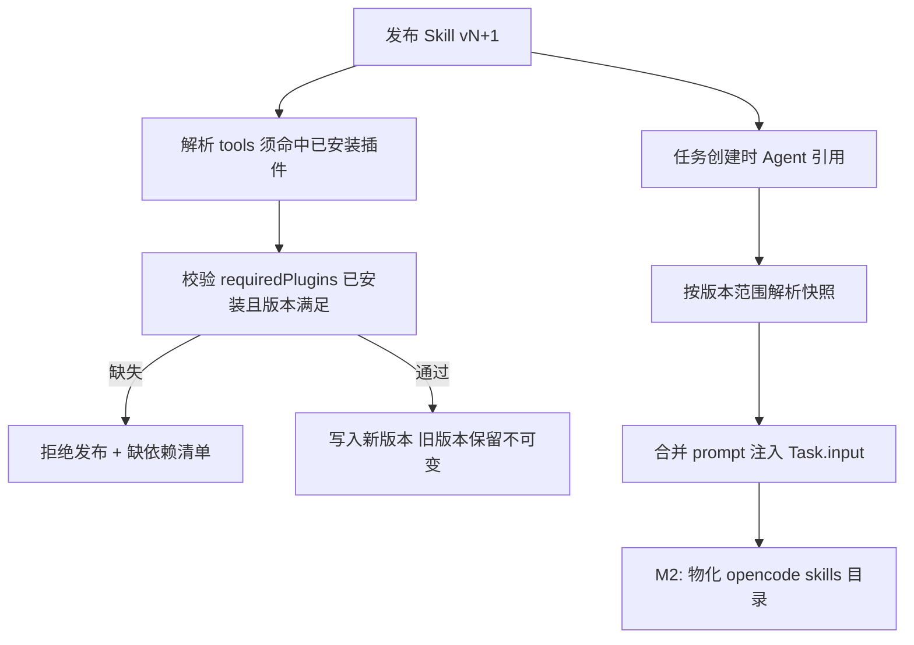

<!-- 概要设计：对应需求文档 docs/req-4.3-skill.md -->

# 4.3 Skill 管理 — 概要设计

## 1. 模块定位

Skill 是可复用的能力包（提示词模板 + 工具绑定 + 说明文档），被多个 Agent 按版本引用，运行期合并进最终 prompt。本模块负责 Skill 的创建、不可变版本管理、依赖校验（Skill→Tool→插件）与运行时物化。需求基线见 [req-4.3-skill.md](req-4.3-skill.md)（FR-301~303），本文档给出其实现方案：Skill 资源 + 语义化版本 + 双向依赖校验 + prompt 合并与 skill 物化。

## 2. 可行性分析

### 2.1 技术可行性

- **Skill 资源**：声明式 YAML（prompt/tools/requiredPlugins/version），走 4.1 通用资源表，无新技术。
- **语义化版本管理**：MVP 用 `semver` 库解析版本范围（`1.2.x`、`>=1.0.0`），Node 生态成熟。
- **依赖校验**：安装/卸载双向扫描引用关系（Skill→Plugin、Agent→Skill），基于通用资源表 + 索引，SQL 查询即可完成。
- **运行时物化**：任务创建时合并 prompt 快照（Agent + Skills 顺序拼接），属纯字符串处理。
- **Skill 市场（FR-303，P2）**：发布/安装即复制资源到目标命名空间，无复杂协议；市场界面与分发机制（镜像/制品仓库）需 PoC 评估。

### 2.2 依赖与前置

- 依赖 4.1：Skill 归属命名空间，跨命名空间引用禁止；system 命名空间放内置 Skill 模板。
- 依赖 4.8：`tools` 引用的工具来自插件注册表，`requiredPlugins` 校验插件安装状态；Skill 发布前全量解析（悬空引用拒绝发布）。
- 供 4.2 消费：Agent 引用 Skill 时按版本范围解析快照。
- 与 4.7 联动：M2 可把 Skill 物化为 opencode skills 目录条目（`~/.config/opencode/skills/` 或项目级 skills 目录），使 Skill 在会话内可被 opencode 的 skill 机制感知。

### 2.3 风险与复杂度评估

| 风险 | 影响 | 缓解 |
|---|---|---|
| 版本范围解析在运行期变化（Skill 升级后任务行为漂移） | 结果不可复现 | 任务创建时解析为固定版本快照，快照存 Task 输入（与 4.2 一致） |
| 卸载插件时静默破坏引用 Skill 的 Agent | 运行期工具缺失 | 卸载插件反向扫描 Skill/Agent 引用，存在即阻止（fail-closed） |
| 市场安装同名冲突 | 资源覆盖 | 安装时检测目标命名空间同名，提示覆盖或另建命名 |
| Skill prompt 与 Agent prompt 冲突（角色指令覆盖） | 执行行为异常 | 合并规则固定（Agent 在前、Skill 依序在后），提供合并预览 |
| 市场分发机制未定（制品如何托管/鉴权） | 市场功能延期 | 市场归入 M2/M3，M1 仅命名空间内创建与引用 |

### 2.4 可行性结论

**可行**（市场部分需 PoC），复杂度评级：**低**。命名空间内 Skill 生命周期与依赖校验无风险；市场分发机制（制品存储、跨命名空间复制、版本索引）需在 M2 启动时做一次轻量 PoC 定选型。

## 3. 实现初步方案

### 3.1 核心模块/组件划分

| 组件 | 职责 |
|---|---|
| `src/resources` | `Skill` 资源定义、版本字段校验（semver）、prompt_template 结构 |
| `src/controllers` | Skill 控制器：发布前引用解析（tools/requiredPlugins）、依赖校验、状态回写 |
| `src/skills` | 技能包逻辑：版本解析、prompt 合并（Agent+Skill）、物化为 opencode skills 目录（M2） |
| `src/plugins`（联动 4.8） | 插件卸载时反向扫描 Skill 引用 |

### 3.2 关键数据模型（表/资源）

- **Skill 资源**：`spec{displayName, category(prompt-template|tool-binding|template), version, description, prompt, tools[], requiredPlugins[{name, versionRange}], docs}`；`status{phase, published}`。
- **表**：MVP 走通用资源表 `resources(type='skill')`；引用扫描用 `resources` 表 jsonb 查询（`spec->'skills' @> ?`）。
- **Skill 快照**（随 Task 存）：`task.input.skill_snapshots[{name, version, prompt}]`，保证可复现。

### 3.3 关键流程/接口

核心 API：

| 方法 | 路径 | 说明 |
|---|---|---|
| GET/POST | `/api/v1/skills` · `/api/v1/skills/{name}` | Skill CRUD（含版本列表） |
| POST | `/api/v1/skills/{name}/publish` | 发布新版本（版本不可变，全量引用解析） |
| GET | `/api/v1/skills/{name}/versions/{v}` | 历史版本查看/回滚 |

关键流程（发布校验 + 任务时物化）：

```
发布 → 解析 tools（须命中已安装插件）→ 校验 requiredPlugins（已安装且版本满足）
     → 不满足返回缺依赖清单（拒绝发布）→ 写入新版本（version 递增，旧版本保留）

任务创建 → 读取 Agent.skills[{name, versionRange}] → 解析为具体版本快照
        → 合并 prompt（Agent.prompt + Skill.prompt 依序）→ 注入 Task.input
        →（M2）将 Skill 物化到 opencode skills 目录供会话内感知
```



### 3.4 关键技术点

1. **不可变版本**：Skill 的 `version` 发布后即冻结，修改内容 = 新建版本；版本号语义化（major.minor.patch），Agent 引用声明范围。
2. **双向依赖校验**：安装/更新方向校验 `requiredPlugins` 满足；卸载方向由 4.8 反向扫描 Skill/Agent，两者共享 `plugins.ValidateNoDependents` 工具函数。
3. **工具交集语义**：Skill 绑定工具并入 Agent 工具集时取交集（`allowedTools ∩ Skill.tools`），Skill 不能突破 Agent 权限边界（req-4.3 验收第 5 条）。
4. **物化策略（M2）**：Skill 目录物化在任务工作区或全局 skills 目录（取决于 opencode skill 加载路径），以 `SKILL.md` + 目录结构为标准格式，与 opencode 原生 skill 体系兼容；纯上下文类 Skill 也可经 `@opencode-ai/sdk` 的 `session.prompt(..., { noReply: true })` 注入（不产生回复、仅增强上下文）。
5. **断链提示**：Skill 卸载后，引用它的 Agent 下次编辑时提示断链并列出影响清单（status 标记 `skillRefBroken`）。
6. **市场副本语义（M2/M3）**：市场安装 = 目标命名空间创建副本（参数可定制），与源 Skill 解耦，升级需显式同步。
7. **目录分类**：`prompt-template`（纯 prompt）/`tool-binding`（prompt+工具）/`template`（可参数化骨架）三类字段校验不同：tool-binding 必填 `tools`，template 校验渲染变量与必填参数。
8. **合并预览**：Agent 编辑页提供"合并后 prompt 预览"（Agent + Skill 依序拼接结果），发布前可人工核对冲突。

### 3.5 实现步骤（MVP → 增强）

1. **M1**：Skill 资源 + 通用 CRUD + semver 版本管理（命名空间内创建/引用/发布校验）。
2. **M1**：发布前引用解析（tools/requiredPlugins）+ 任务创建时 prompt 合并快照。
3. **M2**：Skill 物化到 opencode skills 目录、卸载断链提示、命名空间内发布提升（published 标记）。
4. **M3**：Skill 市场（跨命名空间安装/版本索引，先 PoC 定制品分发选型）。
