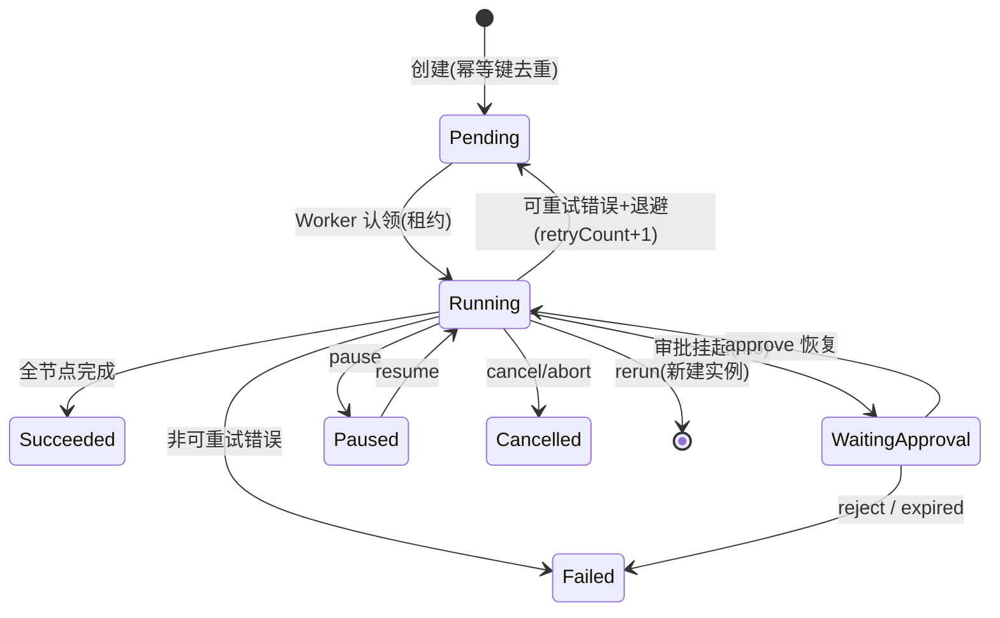

<!-- 概要设计：对应需求文档 docs/req-4.5-task.md -->

# 4.5 任务执行与触发 — 概要设计

## 1. 模块定位

Task 是 Flow 的一次运行实例，是触发、执行、重试、并发控制的汇聚点。本模块负责任务生命周期状态机、四种触发方式（手动/定时/Webhook/IM）、重试与退避策略、Worker 租约与并发队列，并协调 4.4 状态机推进、4.7 运行时执行、4.9 观测记录。需求基线见 [req-4.5-task.md](req-4.5-task.md)（FR-501~507），本文档给出其实现方案：Task 状态机 + 幂等键 + 租约（行级锁）+ 消息队列抽象 + 触发器。

## 2. 可行性分析

### 2.1 技术可行性

- **Task 状态机**：`Pending/Running/Paused/WaitingApproval/Succeeded/Failed/Cancelled/Expired` 八态，Node/TS 侧显式转移表实现，确定性（ADR-009）。
- **幂等（FR-503/NFR-04）**：`idempotency_key` 唯一索引（`github:issue-42`），重复插入冲突即跳过；定时以"调度周期+计划时间"为键，Postgres 原生唯一约束保障。
- **重试退避（FR-505）**：错误分类（可重试/非可重试）+ fixed/exponential 退避，Node 定时器 + 状态转移即可，无依赖。
- **Worker 租约（FR-506）**：`tasks.worker_lease_expires_at` 字段 + `UPDATE ... WHERE lease_expires_at < now()` 行级原子认领（ADR PoC P4），Postgres 行锁标准用法（TS 侧用 pg 连接池）。
- **消息队列抽象（M2）**：定义 `Queue` 接口（memory/NATS 双实现），NATS JetStream 为成熟方案；MVP 用 channel + worker pool。
- **定时调度**：cron 表达式解析用 `node-cron`（Node 成熟库）；Webhook 签名校验用 HMAC-SHA256。

### 2.2 依赖与前置

- 依赖 4.1：任务归属命名空间、并发配额、RBAC（发起人需 task-initiator 角色）。
- 依赖 4.4：任务由 Flow 版本实例化，状态机推进回调 flow 执行引擎。
- 依赖 4.7：任务执行驱动 opencode 会话（会话 id、workdir 存于 Task status）。
- 依赖 4.6：审批挂起状态（WaitingApproval）与恢复。
- 依赖 4.9：执行事件上报 Trace/日志；依赖 4.10：状态变更事件通知（旁路）。
- 依赖外部系统：GitHub/Gitee Webhook 事件源（4.8 插件提供）。

### 2.3 风险与复杂度评估

| 风险 | 影响 | 缓解 |
|---|---|---|
| 多 Worker 并发认领同一任务 | 重复执行/状态错乱 | 租约行级锁 + 幂等键 + 认领事务（UPDATE 条件原子性）；PoC P4 验证 |
| Worker 崩溃任务悬挂 | 任务卡死在 Running | 租约过期（TTL 60s）+ 心跳续约 + 接管时从检查点恢复（4.7 session 恢复联动） |
| Webhook 重复投递 | 重复任务 | idempotency_key 唯一索引，重复返回 200 不创建（NFR-04） |
| 任务风暴超出 worker 容量 | 队列堆积 | 两级限流（命名空间并发上限 + 全局队列深度）+ Pending 排队（优先级+FIFO） |
| 恢复时 opencode session 不可用 | 任务无法续跑 | session 恢复失败按可重试错误处理，重试仍失败进入失败终态 |

### 2.4 可行性结论

**可行**，复杂度评级：**高**。核心状态机、幂等、重试在 M1 可落地；Worker 分布式执行需先完成 PoC P4（Postgres 行级锁 claim 正确性）再实现，M2 引入 NATS。整体无不可逾越的技术障碍。

## 3. 实现初步方案

### 3.1 核心模块/组件划分

| 组件 | 职责 |
|---|---|
| `src/controllers` | Task 控制器：状态机推进（reconcile）、生命周期操作（pause/resume/cancel/rerun）、租约管理 |
| `src/trigger` | 触发器：cron 调度（TaskSchedule）、Webhook 接收/签名/幂等（TaskWebhook） |
| `src/executor` | 任务执行器：从队列取任务、驱动 4.7 会话执行、上报状态 |
| `src/queue` | 队列抽象：`Queue` 接口 + memory 实现（M2 换 NATS JetStream） |
| `src/store` | tasks/task_messages 独立表 + 事务 |

### 3.2 关键数据模型（表/资源）

- **Task 资源**（独立表 `tasks`）：`spec{flow_ref{name,version}, trigger{type,source,eventId}, input jsonb, retryPolicy{maxRetries, backoff, baseDelaySeconds, retryableErrors[], nonRetryableErrors[]}}`；`status{phase, currentNode, blocked_on, lease{worker, expires_at}, outputs, session_id, workdir, lastError, retryCount, nextRetryAt}`；`idempotency_key` 唯一。
- **TaskSchedule 资源**：`spec{cron, flow_ref, input_template, concurrency, enabled, timezone, missed_policy(skip|catchup)}`；`status{lastRunAt, nextRunAt}`。
- **TaskWebhook 资源**：`spec{path, flow_ref, input_template, signature_secret_ref, idempotency}`；`status{lastRunAt}`。
- **task_messages**：Agent 间消息/分支状态（`branch_id`、`trace_id`、`idempotency_key` 唯一）。

### 3.3 关键流程/接口

核心 API：

| 方法 | 路径 | 说明 |
|---|---|---|
| GET/POST | `/api/v1/tasks` | 列表/手动创建（body: flowRef+input） |
| GET | `/api/v1/tasks/{name}` | 详情（含 trace 摘要/环境预检状态） |
| POST | `/api/v1/tasks/{name}/cancel` · `/retry` · `/pause` · `/resume` | 生命周期操作（治理层 4.1 承接权限） |
| GET/POST | `/api/v1/task-schedules` · `/task-webhooks` | 触发器 CRUD |
| POST | `/api/v1/webhooks/{name}/trigger` | Webhook 触发入口（签名校验 + 幂等） |

关键流程（任务认领与重试）：

```
调度器/Webhook → 创建 Task（幂等键去重）→ 入队（Pending）
Worker 认领 → UPDATE tasks SET worker=?, lease_expires_at=now()+60s WHERE phase='Pending' AND lease_expires_at < now()
           → 命中行数=1 则认领成功 → 执行（4.7）→ 上报状态
执行失败 → 错误分类：可重试 → 计算退避（fixed/exponential，封顶 5min）→ 重新入队（retryCount+1）
         → 非可重试 → Failed 终态（含错误分类）
Worker 心跳过期 → 其他 Worker 可接管 → 从检查点恢复（4.7 session 恢复）
```



### 3.4 关键技术点

1. **租约原子认领**：认领用单条 `UPDATE ... WHERE phase='Pending' AND (lease IS NULL OR lease_expires_at < now())`，靠行级锁与条件保证并发正确性（PoC P4 先验证）。
2. **幂等三键**：Webhook = `来源类型:eventId`；定时 = `schedule_ref:计划时间`；消息 = `wecom:msg-id`；统一写入 `idempotency_key` 唯一索引，冲突即返回已受理不重复执行。
3. **任务不可变**：Task `spec` 创建后只读，运行时仅更新 `status`（req-4.5 设计要点），审计友好。
4. **审批驳回不重试**：`approval-rejected` 归入非可重试错误，不走自动重试，避免绕过人工决策（与 4.6 语义一致）。
5. **队列抽象**：`Queue` 接口（`Enqueue/Claim/Ack/Nack`），memory 实现内嵌单进程，NATS 实现供 M2 分布式 worker，切队列不动机器逻辑。
6. **重跑语义**：`rerun` 创建新 Task 实例（继承输入与 flow_version），原 Task 与 trace 保留（FR-107，与重试严格区分）。
7. **环境预检**（ADR-014）：任务开始前按 Agent/Plugin 的 `runtime.requirements` 探测 CLI 缺失项，写入 Task status（前端"环境缺失"展示）。
8. **触发来源可审计**：Task `trigger` 字段标记来源（manual/cron/webhook/im + eventId），创建入口均写审计，满足 FR-905 追溯。

### 3.5 实现步骤（MVP → 增强）

1. **M1**：Task 表 + 状态机 + 手动创建 → 顺序 Flow 执行最小闭环（architecture.md 附录第 2 步）。
2. **M1**：定时调度（node-cron）+ Webhook 签名与幂等 → 重试/退避错误分类。
3. **M1**：内嵌 worker + 内存队列（单进程模式）。
4. **M2**：PoC P4 通过后实现租约分布式认领 + 心跳接管 + 暂停/恢复/重跑 + NATS JetStream 队列。
5. **M3**：IM 指令触发（与 4.10 联动）、任务排期与优先级细化。

### 附录：PoC 项

- **P4**：Postgres 行级锁并发 claim 正确性（1000 并发认领 10 任务的竞态验证），M2 开工前置。
