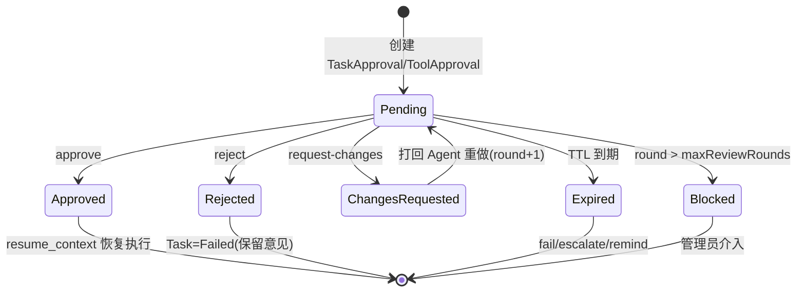

<!-- 概要设计：对应需求文档 docs/req-4.6-approval.md -->

# 4.6 人工审批（Human-in-the-Loop）— 概要设计

## 1. 模块定位

人工审批是 Orchestra "像真实公司一样运转"的结构化保障：人类在关键节点保留决策权，未批准不推进。本模块负责审批状态机（TaskApproval/ToolApproval）、通过后精确恢复（resume_context）、打回循环、TTL 超时策略，以及与 opencode permission 请求的双向联动。需求基线见 [req-4.6-approval.md](req-4.6-approval.md)（FR-601~608），本文档给出其实现方案：Approval 资源 + 状态机 + 恢复点机制 + 权限联动客户端。

## 2. 可行性分析

### 2.1 技术可行性

- **审批状态机**：`Pending → Approved/Rejected/ChangesRequested/Expired` + `Blocked`（超轮次），五态转移（含 Blocked 升级态） + round 计数，TypeScript 显式状态表实现，成熟模式。
- **精确恢复（FR-602）**：`resume_context`（节点索引 + 上下文快照 + flow_version）随 Approval 存储，恢复即从挂起点续跑，由 4.4 状态机与 4.7 会话恢复共同支撑。
- **TTL 超时（FR-605）**：`expires_at` 字段 + 周期扫描任务（cron ticker），到期按策略（fail/escalate/remind）处理，标准定时逻辑。
- **工具级审批（FR-606/PoC P6）**：通过 `@opencode-ai/sdk` 的 `postSessionByIdPermissionsByPermissionId` 应答 opencode 的 permission 请求 + 平台 ToolApproval 联动，P6 已验证方向可行（ADR PoC 清单）。
- **审批人分配（FR-607）**：user/role/multi-level 三种模式，基于 4.1 RBAC 的角色匹配。

### 2.2 依赖与前置

- 依赖 4.1：审批人角色与命名空间 RBAC（角色决定"能否决策"，命名空间决定"能看哪些审批"）。
- 依赖 4.4：审批关卡节点挂载（gate 后暂停）。
- 依赖 4.5：Task 的 WaitingApproval 状态与恢复调用。
- 依赖 4.7：ToolApproval 与 opencode permission 应答联动（需 opencode 版本支持 permissions 端点，PoC P6）。
- 依赖 4.10：审批待办卡片通知与 TTL 提醒。

### 2.3 风险与复杂度评估

| 风险 | 影响 | 缓解 |
|---|---|---|
| resume_context 跨版本不兼容（流程升级后旧任务恢复） | 恢复失败/执行漂移 | resume_context 携带 flow_version，恢复按原版本执行（architecture.md 风险表） |
| opencode permissions 端点版本演进 | 工具审批联动失效 | 以 opencode OpenAPI spec 为契约，客户端可重生成；联动失败降级为"平台侧白名单拒绝" |
| 打回循环无上限 | 任务无限往复 | maxReviewRounds 必填（默认 3），超限升级 Blocked |
| TTL 扫描延迟导致过期判定不及时 | 审批滞留 | 扫描周期短于 TTL 粒度（如 1min）；决策与扫描竞争用事务保证 Expired 幂等 |
| 审批决策后不可撤回但误操作 | 事故 | 决策二次确认（前端）+ 审计完整留痕；拒绝提供撤回接口（设计决策） |

### 2.4 可行性结论

**可行**，复杂度评级：**中**。流程级审批（TaskApproval）无技术风险；工具级审批（ToolApproval）依赖 opencode permissions 端点的稳定性，需 M1 开工前完成 PoC P6 验证，若端点不可用则先以"平台侧高风险工具拦截 + 白名单外拒绝"兜底。

## 3. 实现初步方案

### 3.1 核心模块/组件划分

| 组件 | 职责 |
|---|---|
| `src/approver` | 审批状态机、resume_context 生成/恢复、TTL 扫描器、审批人匹配 |
| `src/resources` | `Approval` 资源（TaskApproval/ToolApproval 双类型）、`auto_review_policy` 预留字段 |
| `src/executor`（联动 4.7） | opencode permission 请求拦截 → 创建 ToolApproval → SDK 应答 `postSessionByIdPermissionsByPermissionId` |
| `src/notify`（联动 4.10） | 审批待办卡片/过期提醒事件发射 |

### 3.2 关键数据模型（表/资源）

- **Approval 资源**（独立表 `approvals`）：`spec{kind(TaskApproval|ToolApproval), task_ref, node_ref, producer_agent, artifact_ref{type,key}, approvers{mode(user|role|multi-level), value}, ttl_seconds, max_review_rounds, auto_review_policy(预留空)}`；`status{phase(Pending/Approved/Rejected/ChangesRequested/Expired/Blocked), round, decided_by, decided_at, comment, resume_context jsonb}`。
- **审批挂起关联**：Task status 增加 `blocked_on{approval_ref}`，恢复时据其定位。
- **TTL 扫描**：`approvals(expires_at)` 索引 + 后台 ticker。

### 3.3 关键流程/接口

核心 API：

| 方法 | 路径 | 说明 |
|---|---|---|
| GET | `/api/v1/approvals?state=pending&type=task|tool` | 待审批列表（按命名空间/角色过滤） |
| GET | `/api/v1/approvals/{name}` | 审批详情（产物预览、Checkpoint、历史轮次） |
| POST | `/api/v1/approvals/{name}/decide` | 决策（body: `{decision: approve|reject|request-changes, comment}`） |
| GET | `/api/v1/approvals/{name}/history` | 多轮审批历史 |

关键时序（审批生命周期 + 工具级联动）：

```
流程节点完成 → 挂 gate → 创建 TaskApproval(Pending, TTL, round=1) → Task=WaitingApproval
人工 decide → approve → 读取 resume_context → 4.4 从暂停点恢复 → 4.7 会话续跑
           → reject → Task=Failed（保留意见）→ 不重试
           → request-changes(comment) → 打回 producer Agent 重做（带意见）→ round+1
              → round > maxReviewRounds → Blocked（管理员介入）
TTL 到期 → 扫描器 → Expired → 按策略 fail/escalate/remind

工具级：opencode permission 请求 → SSE 事件 → 创建 ToolApproval(Pending)
       → 人工 approve → POST /session/:id/permissions/:permissionID 应答放行 → 会话继续
       → deny → 应答拒绝 → Agent 收到被拒结果调整策略
```



### 3.4 关键技术点

1. **resume_context 结构**：`{flow_ref, flow_version, node_id, node_index, input, outputs_snapshot, session_id, workdir}`，恢复时全部还原；审批通过只恢复挂起节点，已完节点不重跑（FR-602）。
2. **TTL 幂等过期**：过期判定用事务 `UPDATE approvals SET phase='Expired' WHERE id=? AND phase='Pending' AND expires_at < now()`，与决策并发时保证单次生效。
3. **多级审批（FR-607）**：multi-level 模式审批流存于 Approval status（`escalation_chain`），一级通过转二级，任一级驳回即驳回；一级 TTL 超时升级二级。
4. **权限联动降级**：opencode permissions 不可用时，平台侧以"高风险工具白名单拦截 + 调用前 ToolApproval"兜底（fail-closed，NFR-02），不依赖 opencode 自身策略。
5. **审批即审计**：每次决策写 `audit_logs`（action=approve/reject/request-changes，含决策全文），与 4.9 审计检索打通。
6. **二次确认**：前端决策操作需二次确认；决策接口幂等（同一 approval 重复 decide 返回已决策状态）。
7. **产物预览**：审批详情展示被审批产物（`artifact_ref` 指向 Task outputs 或 tool-call 摘要），Markdown 渲染 + 多轮差异对比（FR-608）。
8. **工具审批聚合**：同一任务可同时挂多个 ToolApproval 与一个 TaskApproval，审批中心按任务聚合展示，任一未决即任务保持等待。

### 3.5 实现步骤（MVP → 增强）

1. **M1**：Approval 资源 + 状态机 + `decide` API + resume_context 精确恢复（顺序 Flow 挂 gate，architecture.md 附录第 3 步）。
2. **M1**：TTL 扫描器（fail/escalate/remind 三策略）+ 打回循环（round 控制）+ 审计留痕。
3. **M2**：工具级审批（PoC P6 通过后联动 opencode permissions）；多级审批（multi-level）。
4. **M3**：审批通知卡片闭环优化（与 4.10 深链）、auto_review_policy 扩展位评估。

### 附录：PoC 项

- **P6**：opencode permission 请求（`/session/:id/permissions/:permissionID`）与平台 ToolApproval 审批联动端到端验证，M1 工具级审批前置。
