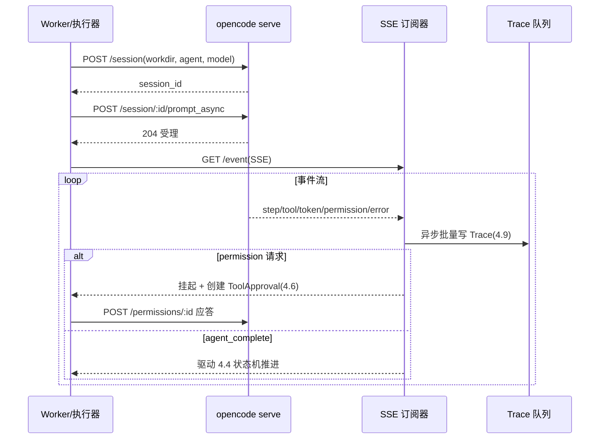

<!-- 概要设计：对应需求文档 docs/req-4.7-runtime.md -->

# 4.7 运行时（opencode）集成 — 概要设计

## 1. 模块定位

运行时是 Agent 的实际执行引擎。首个版本固定为 opencode，集成方式为"常驻 `opencode serve` 实例 + 平台作为 HTTP 客户端"：通过 REST API 创建/驱动会话，通过 SSE 事件流解析步骤/工具/Token 转化为 Task Trace，管理会话保持与断线恢复，并承接工具级审批的权限联动。需求基线见 [req-4.7-runtime.md](req-4.7-runtime.md)（FR-701~706），本文档给出其实现方案：serve API 客户端 + SSE 事件解析器 + 会话管理器 + worktree 隔离 + 双层权限。

## 2. 可行性分析

### 2.1 技术可行性

- **serve API 客户端**：直接复用 opencode 官方 `@opencode-ai/sdk`（`createOpencodeClient` 创建类型安全客户端），覆盖 session/config/event/permission 全部端点，无需自研；已验证 `POST /session`、`POST /session/:id/prompt_async`（返回 204 受理）、`PATCH /config`（实测 200）等端点可用（ADR-010 PoC P1 方向）。
- **SSE 事件流**：`GET /event` / `GET /global/event` 为标准 Server-Sent Events，SDK 提供 `event.subscribe()` 事件订阅，TS 侧无需手写帧解析；首个事件 `server.connected`。
- **会话恢复（FR-703）**：session 持久化于 opencode 本地存储，平台记录 session id，重启后 `GET /session/:id` 续跑（PoC P2 待完整验证）。
- **worktree 隔离（FR-704）**：git worktree 或独立 clone，PoC P3 验证多任务并行隔离可行性。
- **权限联动（FR-705）**：`/session/:id/permissions/:permissionID` 应答 + 平台 ToolApproval（PoC P6）。
- **守护进程**：serve 以 systemd/容器方式常驻，`GET /global/health` 健康检查 + 自动重启。

### 2.2 依赖与前置

- 依赖 4.5：Task 执行驱动会话（session id、workdir 存于 Task status）。
- 依赖 4.6：permission 请求与 ToolApproval 联动。
- 依赖 4.9：SSE 事件异步写入 Trace。
- 依赖 4.2：Agent 配置（prompt/model）透传。
- 外部依赖：opencode CLI 版本（需包含 serve 命令且 permissions 端点可用）；部署节点上 git 环境（worktree）。
- ADR-014：CLI 环境安装（Skill 自安装 + 平台四抓手）。

### 2.3 风险与复杂度评估

| 风险 | 影响 | 缓解 |
|---|---|---|
| opencode serve API 版本演进/接口不稳定 | Trace 与状态同步受阻 | 以 OpenAPI spec 为契约来源，复用官方 `@opencode-ai/sdk`（随版本演进，免自研客户端）；事件流缺失降级为"Agent 级状态同步 + /session/status 轮询"（architecture.md 风险表） |
| serve 实例故障/长任务恢复不可靠 | 任务中断丢失 | 守护 + `/global/health` + 自动重启；session id 持久化重启续跑；平台 checkpoint 兜底重跑节点 |
| SSE 事件乱序/未知事件类型 | Trace 时间线错乱 | 按会话时间戳 + 序号对齐；未知事件跳过不阻塞 |
| worktree 并发冲突/清理残留 | 仓库污染、磁盘膨胀 | PoC P3 验证；任务终态按保留策略清理（保留/归档/删除） |
| 高频 SSE 事件阻塞执行路径 | 执行性能下降 | Trace 写入异步批量落盘（NFR-05 编排零 Token，观测不阻塞） |

### 2.4 可行性结论

**有条件可行**，复杂度评级：**高**。核心机制（serve REST + SSE 解析 + 会话恢复）方向已验证（ADR-010 已采纳），但依赖三个待验证项：**P1**（事件流接口满足步骤级解析）、**P2**（长任务会话恢复）、**P6**（permissions 联动）。M1 开工前必须完成 P1/P2/P6 三项 PoC；若 P2 恢复不可靠，则降级为"平台 checkpoint + 节点重跑"方案。

## 3. 实现初步方案

### 3.1 核心模块/组件划分

| 组件 | 职责 |
|---|---|
| `src/executor/opencode` | opencode SDK 客户端：session CRUD、prompt_async/command/shell、permissions 应答、/global/health |
| `src/executor/events` | SSE 事件订阅与解析：`event.subscribe()` 事件流、映射为平台步骤事件（model/tool/token/permission/error） |
| `src/executor/session` | 会话管理器：session id 持久化、断线恢复、abort 中止、会话生命周期 |
| `src/executor/workspace` | worktree 管理器：创建/复用/清理每任务独立工作区（PoC P3） |
| `src/executor/perms` | 双层权限：白名单拦截 + permission 联动 ToolApproval |
| `src/executor/checkpoint` | 平台侧检查点：节点输入输出快照，兜底恢复 |

### 3.2 关键数据模型（表/资源）

- **Task status 扩展**（4.5 的 `tasks` 表）：`session_id`、`workdir`、`session_status`、`event_cursor`（已消费事件序号）、`env_check[]`（环境预检结果）。
- **Trace 事件**（4.9 的 `task_trace_events`）：由事件解析器写入，含 `event_type` 映射字段。
- **RuntimeInstance 资源**（多实例注册表，见 req-4.7 FR-701）：

| 字段 | 说明 |
|---|---|
| name | 实例名（唯一标识，Agent 通过 `runtimeRef` 引用） |
| endpoint | serve 地址（host:port） |
| auth | Basic Auth 用户名/密码，或无认证 |
| defaultWorkdir | 实例默认工作区（Agent 未指定 workingDir 时使用） |
| status | 连接状态（正常 / 异常 / 未知），健康检查维护 |

- **配置资源**：RuntimeInstance 列表（endpoint、auth、defaultWorkdir）作为全局设置（settings / runtime-manage 页）维护的注册表；`PATCH /config` 下发的 opencode 配置存平台侧（P2）。

### 3.3 关键流程/接口

核心交互（平台 → serve）：

| serve 端点 | 用途 |
|---|---|
| `GET /global/health` | 健康检查（守护进程探活） |
| `POST /session` | 创建会话（body 带 workdir/agent/model） |
| `POST /session/:id/prompt_async` | 异步提交任务（204 受理） |
| `GET /event` · `/global/event` | SSE 事件流订阅 |
| `GET /session/:id` · `POST /session/:id/abort` | 恢复查询 / 中止 |
| `GET /session/:id/diff` | 编码产物获取（归档） |
| `POST /session/:id/permissions/:permissionID` | 权限应答（联动 4.6） |
| `PATCH /config` | 下发 opencode 配置（P2，实测 200） |

关键时序（任务执行 + 事件双轨）：

```
4.5 调度 → 创建 session（worktree workdir + agent/model 透传）→ prompt_async 提交
→ 订阅 /event（SSE）→ 事件映射：message/step → step span；tool → tool span；token → 计量
  → permission 请求 → 挂起 + 创建 ToolApproval（4.6）→ 决策后应答 /permissions/:id
  → agent_complete → 驱动 4.4 状态机推进（双轨：状态机粗粒度，Trace 细粒度，ADR-001）
→ 产物归档 GET /diff → session 保留或清理（DELETE）
断线/重启 → 从 Task status 读 session_id → GET /session/:id 恢复续跑 → 从 event_cursor 续读
```

多实例下的会话创建（先解析引用，再创建会话）：

```
4.5 调度 → 解析 Agent.runtimeRef（未指定取默认 RuntimeInstance）→ 确定实例 endpoint + auth
→ 解析 workingDir（未指定取实例 defaultWorkdir）→ 校验目录在实例可达文件系统内且可访问
→ 在 workingDir 内创建每任务 worktree → POST /session(workdir=worktree, agent, model) → prompt_async
```



### 3.4 关键技术点

1. **双轨同步**（ADR-001）：状态机以"Agent 节点完成"驱动下一步；Trace 以步骤级事件异步写入。两者解耦，事件流故障不影响流程推进（降级轮询）。
2. **事件解析容错**：解析器以 SDK 的事件类型定义为准，未知类型跳过；事件带序号/time 用于乱序对齐（`event_cursor` 保证断点续读）。
3. **session 恢复矩阵**：平台重启（session 仍在）→ 直接恢复；serve 重启（session 丢失）→ 按 checkpoint 重跑当前节点；两者均失败 → 可重试错误分类。
4. **双层权限合并**：平台白名单（allowedTools）→ 运行时 permission 请求 → ToolApproval；两层都放行才执行，平台策略优先（fail-closed，NFR-02）。
5. **worktree 隔离**：每任务独立 worktree（`<workingDir>/.orchestra-worktrees/<task-id>`），并行任务互不可见；任务终态按保留策略清理，避免磁盘膨胀。
6. **CLI 环境四抓手**（ADR-014）：`runtime.requirements` 声明清单（环境预检写 Task status）→ 安装命令 permission ask → ToolApproval → 安装 bash 调用进 Trace。
7. **Trace 异步批量写**：SSE 事件按批聚合后批量落库（如 200 条/批或 1s 窗口），避免高频事件阻塞执行。
8. **连接降级**：serve 不可用时（health 失败），新任务进入 Pending 等待（可重试错误），运行中任务按 FR-703 恢复路径等待 serve 就绪；不允许静默丢弃任务。
9. **多实例注册表与健康检查**：平台维护 RuntimeInstance 列表（name / endpoint / auth / defaultWorkdir / status），定时（如 30s）探测各实例 `/global/health` 更新 status；任务按 `runtimeRef` 路由到对应实例，未引用实例的 Agent 使用默认实例。
10. **Agent runtimeRef 解析**：任务创建时解析 `runtimeRef` → 实例 endpoint / auth；目标实例不可达（status 异常）时任务进入 Pending（可重试），或按容灾策略切换到健康实例。
11. **workingDir 校验与 worktree 关系**：任务创建前校验 `workingDir` 存在于实例可达的文件系统且可访问，校验失败进入可重试错误；Agent 级 `workingDir` 决定任务执行路径，每任务 worktree 在其内创建（如 `<workingDir>/.orchestra-worktrees/<task-id>`），隔离并行任务。

### 3.5 资产注入机制（MCP / Tools / Skills → opencode）

平台声明资产如何变为 opencode 会话内可用能力，三条通道 + 统一回传：

**① MCP 服务注入**（来自 4.8 FR-803）
- 平台将 McpServer 资源 → 注入 opencode 配置（M1 经 session 参数/工作区配置注入，`PATCH /config` 为 M2/M3 全局基线，见 3.6 分层）：`mcp` 字段（local：command/args/environment；remote：url/headers/oauth）
- opencode 自动加载，工具注册为 `<serverName>_<toolName>`，可在 `tools` 配置按 glob 启停（如 `"mcpName_*": false`）
- 平台工具白名单（Agent.allowedTools）映射为该 glob 规则的 allow 列表

**② Tool 注入**（来自 4.2/4.8）
- MCP 来源工具：随①直接可用，无需额外注入
- CLI/原生来源工具：平台生成 custom tools 壳（`.opencode/tools/<plugin>_<tool>.ts`，Zod 参数 schema + 内部调 CLI），写入任务工作区；CLI 依赖安装走"skill 自安装 + 平台审批观测"（ADR-014）
- 权限：工具级 permission 规则（ask → ToolApproval 联动 FR-606）

**③ Skill 注入**（来自 4.3）
- M1：skill prompt 合并进 Agent prompt（纯字符串，任务创建时快照）；上下文类 skill 亦可用 `session.prompt(..., { noReply: true })` 注入（SDK 支持，纯上下文不产生回复）
- M2：物化为 opencode skills 目录条目（`~/.config/opencode/skills/` 或项目级），会话内可被 skill 机制感知

**统一回传**（三通道共用）
- opencode 的 tool 调用/模型调用/permission/error 全部经 SSE（`/event`/`/global/event`）推送 → 平台解析 → Task Trace
- permission 请求 → ToolApproval → 应答后继续（FR-705 双层约束）
- CLI 安装的 bash 调用同样进 Trace（可观测，ADR-014）

**注入时机**：任务创建时按 Agent.runtimeRef 解析目标实例 → 组装该 Agent 的 mcp 配置差异 + tools 白名单 + skill prompt → 会话创建/消息发送时生效（`PATCH /config` 为全局基线，会话级差异用 session message 的 agent/tools 参数或工作区级配置覆盖）

### 3.6 实现步骤（MVP → 增强）

1. **M1 前置（PoC）**：P1（事件流解析）+ P2（会话恢复）+ P6（权限联动）三项验证通过后开工。
2. **M1**：基于 `@opencode-ai/sdk` 的 opencode 客户端骨架（session/prompt_async/health）→ SSE 订阅解析器 → 单 Agent 任务最小闭环（architecture.md 附录第 2 步）。
3. **M1**：会话持久化与断线恢复（session id + event_cursor）→ worktree 隔离 → 双层权限拦截。
4. **M2**：permissions 联动 ToolApproval 全链路、会话保活优化、产物 diff 归档（与 ADR-005 Artifact 联动）。
5. **M3**：`PATCH /config` 模型/参数透传（FR-706）、多 serve 实例负载与故障转移。

### 附录：PoC 项

- **P1**：serve 的会话/消息/SSE 事件流接口（`/session`、`prompt_async`、`/event`）满足步骤级 Trace 解析与状态同步。
- **P2**：长任务会话恢复（session 持久化、进程重启后 `GET /session/:id` 续跑、abort 中止）。
- **P3**：git worktree 多任务并行工作区隔离。
- **P6**：permission 请求（`/session/:id/permissions/:permissionID`）与 ToolApproval 联动。
