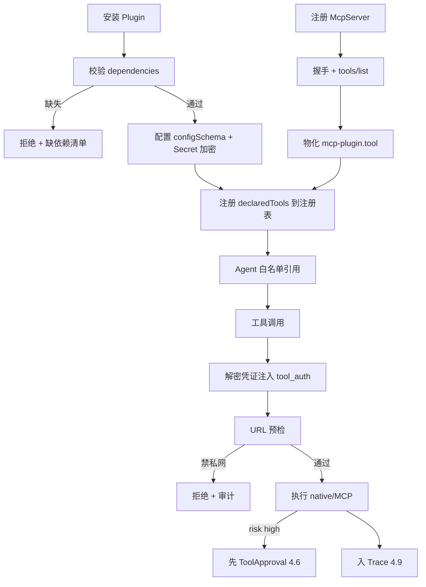

<!-- 概要设计：对应需求文档 docs/req-4.8-plugin.md -->

# 4.8 插件市场与第三方对接 — 概要设计

## 1. 模块定位

插件模块实现"只做编排、不做实现"原则的接入层：Plugin 安装后注册一组 Tool 与配置项，Agent 通过工具白名单引用；MCP 协议让外部 Server 零改造接入并自动发现工具物化；凭证按命名空间隔离加密存储；沙箱与 SSRF 防护保障多租户安全。需求基线见 [req-4.8-plugin.md](req-4.8-plugin.md)（FR-801~806），本文档给出其实现方案：Plugin 资源 + 原生/MCP 双后端 + MCP client 工具发现 + 凭证注入 + 沙箱。

## 2. 可行性分析

### 2.1 技术可行性

- **Plugin 资源**：声明式 YAML（declaredTools/configSchema/runtime.requirements），走 4.1 通用资源表。
- **原生插件**：Jenkins/GitHub/Gitee 用 TypeScript 实现工具执行函数（HTTP 调用第三方 API），标准模式。
- **MCP 接入（FR-803）**：TS 侧 MCP client 用官方 `@modelcontextprotocol/sdk`（stdio/http 传输），握手 + tools/list 发现工具清单，物化为平台 Tool（PoC P5 待验证端到端）。
- **凭证管理**：Secret 加密存储（AES），工具调用时解密注入请求头，命名空间隔离。
- **SSRF 防护（NFR-01）**：出站请求前校验目标 IP/域名（禁止内网网段与云元数据地址 169.254.169.254），标准防护逻辑。
- **沙箱（FR-805）**：M1/M2 以配置校验 + 运行时拦截为主，进程级隔离（容器）为 M3。

### 2.2 依赖与前置

- 依赖 4.1：插件归属命名空间、凭证隔离、RBAC（platform-admin 可安装）。
- 供 4.2/4.3 消费：工具注册表是 Agent `allowedTools` 与 Skill 依赖校验的来源。
- 依赖 4.6：`risk: high` 工具自动接入 ToolApproval。
- 依赖 4.7：工具调用在 opencode 会话内执行（MCP 工具由 serve 运行时暴露给会话 Agent）。
- 依赖 4.9：工具调用入 Trace。
- 外部依赖：MCP Server 生态（stdio/http 两种传输）。

### 2.3 风险与复杂度评估

| 风险 | 影响 | 缓解 |
|---|---|---|
| MCP 工具发现/物化端到端链路不稳定 | 插件接入受阻 | PoC P5 先行验证（握手 + tools/list + 工具调用）；失败时工具调用返回可重试错误 |
| 插件凭证泄露（日志/Trace 明文） | 安全事件 | 凭证只存 Secret 加密，注入点统一（tool_auth），Trace 脱敏 |
| SSRF：插件请求打到内网/元数据 | 内网探测/凭证窃取 | 出站 URL 预检（内网段 + 169.254.169.254 黑名单），fail-closed 拒绝并审计 |
| 插件升级破坏 Agent 白名单 | 运行期工具缺失 | 升级校验工具清单变化需人工确认（FR-804） |
| 插件间依赖循环/不兼容版本 | 安装失败 | 依赖校验（安装校验依赖存在、卸载校验无反向引用），与 4.3 同规则 |
| 第三方 MCP Server 不可信 | 任意代码执行 | M1 配置校验 + 运行时拦截，M2/M3 沙箱强化（容器隔离） |

### 2.4 可行性结论

**可行**（MCP 物化部分需 PoC P5），复杂度评级：**中**。原生插件（Jenkins/GitHub）与凭证治理无风险；MCP 工具发现/物化需 M1 开工前完成 PoC P5 验证端到端，若 MCP client 库能力不足则先以内置 HTTP 适配器兜底。沙箱强化（进程隔离）为 M3。

## 3. 实现初步方案

### 3.1 核心模块/组件划分

| 组件 | 职责 |
|---|---|
| `src/plugins` | 插件抽象：`PluginBackend` 接口（native/mcp 双实现）、安装/配置/升级/卸载生命周期、依赖校验 |
| `src/plugins/native` | 内置插件实现（jenkins/github/gitee 工具函数） |
| `src/mcp` | MCP client（@modelcontextprotocol/sdk）：stdio/http 传输、握手、tools/list 发现、工具物化、会话管理 |
| `src/plugins/registry` | 工具注册表：`<plugin>.<tool>` → 执行器 + 风险等级 + 配置引用 |
| `src/plugins/secret` | 凭证注入：Secret 解密、tool_auth 组装、注入点统一 |

### 3.2 关键数据模型（表/资源）

- **Plugin 资源**：`spec{name, version, source(builtin|market|mcp), display_name, config_schema[], declaredTools[{name, description, risk(normal|high), config_refs[]}], dependencies[], runtime{requirements[], install_hints[]}}`；`status{phase, installed_tools[], last_error}`。
- **McpServer 资源**：`spec{transport(stdio|http), command/args/env 或 endpoint, auth, tool_filter, reconnect, allow_private}`；`status{phase, discovered_tools[], last_synced_at}`。
- **Secret/SealedSecret**：`encrypted_data` + `sealing_key_id`，工具配置项 type=secret 引用。
- **工具注册表**（内存 + 持久化）：`tools(name, plugin, risk, executor_ref, config_refs)`。

### 3.3 关键流程/接口

核心 API：

| 方法 | 路径 | 说明 |
|---|---|---|
| GET/POST | `/api/v1/plugins` | 插件列表/上传 |
| POST | `/api/v1/plugins/{name}/install` · `/configure` | 安装/配置（填地址与凭证） |
| DELETE | `/api/v1/plugins/{name}` | 卸载（反向引用校验） |
| GET/POST | `/api/v1/mcp-servers` · `/{name}/sync` | MCP 服务注册与工具同步 |

关键流程（安装 + MCP 发现）：

```
安装 → 校验 dependencies（已安装且版本满足）→ 注册 declaredTools → 进入"待配置"
配置 → 校验 configSchema → 凭证写入 Secret（AES 加密，命名空间隔离）→ 工具可被引用
MCP 接入 → 注册 McpServer → 握手 → tools/list 发现 → 物化为 <mcp-plugin>.<tool>
        → 同步 discovered_tools 到注册表 → 供 Agent 白名单引用
工具调用 → 解析 <plugin>.<tool> → 解密凭证 → SSRF 预检 → 执行（native HTTP / MCP 调用）
        → risk: high → 先建 ToolApproval（4.6）→ 批准后放行 → 调用入 Trace（4.9）
```



### 3.4 关键技术点

1. **双后端抽象**：`PluginBackend` 接口定义 `DiscoverTools/ExecTool/Health`，native 与 mcp 各实现一套，插件市场界面与治理逻辑完全复用。
2. **工具全名规范**：`<plugin>.<tool>` 全局唯一，Agent 白名单与 Skill 依赖统一以此引用，无命名冲突（req-4.8 验收第 2 条）。
3. **凭证注入统一点**：工具执行前在 `tool_auth` 层解密 Secret 并注入（请求头/参数），任何工具不自行读取 Secret；Trace/日志自动脱敏。
4. **SSRF 预检**：出站请求统一过 `urlguard`（解析目标 IP，拒绝 RFC1918/169.254.0.0/16 等），默认禁私网（NFR-01）。
5. **MCP 生命周期**：平台管理 Server 进程（按需启动/保活/回收），连接失败工具调用返回可重试错误；`reconnect` 策略可配。
6. **风险自动审批**：`risk: high` 工具不依赖 Agent 开关，运行时强制 ToolApproval（与 4.6 联动，req-4.8 设计要点）。
7. **CLI 环境声明**（ADR-014）：Plugin `runtime.requirements/install_hints` 只声明不安装，供环境预检与 Skill 自安装引用。
8. **工具调用超时与重试**：工具执行有默认超时（如 30s）与重试策略（仅幂等工具自动重试）；失败分类写入 Trace 供 4.5 重试决策。

### 3.5 实现步骤（MVP → 增强）

1. **M1 前置（PoC）**：P5（MCP Server 工具发现与物化端到端）验证。
2. **M1**：Plugin 资源 + 安装/配置/卸载生命周期 + 凭证加密存储 + SSRF 预检 + 工具注册表。
3. **M1**：内置 Jenkins/GitHub 插件（触发构建/创建 PR/查询 issue 等核心工具）。
4. **M1**：MCP 接入（stdio/http 传输 + 工具发现物化）。
5. **M2**：Gitee 插件、插件版本管理/兼容性确认、依赖双向校验、runtime 环境预检联动。
6. **M3**：沙箱强化（进程/容器隔离）、A2A 对接（FR-806，Agent Card 发布与消费）。

### 附录：PoC 项

- **P5**：MCP Server 工具自动发现与物化的端到端流程（注册 → 握手 → tools/list → 物化 → 白名单引用 → 调用），M1 前置。
