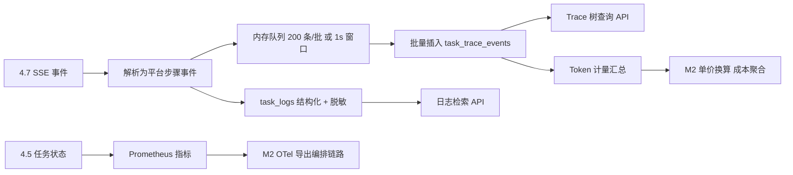

<!-- 概要设计：对应需求文档 docs/req-4.9-observability.md -->

# 4.9 可观测性 — 概要设计

## 1. 模块定位

可观测性把 Agent 执行的"黑盒"打开：模型调用、工具调用、耗时、错误、Token 消耗被记录为可检索的 Trace 与日志，成本按任务/Agent/命名空间聚合，并通过 Prometheus/OTEL 对接外部监控；同时承担审计日志的检索侧能力（写入侧在 4.1）。需求基线见 [req-4.9-observability.md](req-4.9-observability.md)（FR-901~905），本文档给出其实现方案：Task Trace 事件模型 + 存储表 + 异步批量写入 + Token 成本聚合 + 指标导出。

## 2. 可行性分析

### 2.1 技术可行性

- **Trace 事件模型**：树形 span 结构（traceId/parentSpanId/type/name/start/end/duration/status/detail），映射自 4.7 的 SSE 事件，TS 类型 + Postgres jsonb 明细列，成熟做法。
- **存储**：`task_trace_events` 独立表（architecture.md 4.4），高频且需事务；批量插入（batch insert）提升吞吐。
- **日志**：结构化日志（`task_logs` 表或文件 + 索引），与 Trace 通过 `trace_id + span_id` 关联。
- **Token 成本（FR-903）**：Token 计数来自 SSE 事件，单价配置在 ModelEndpoint（4.2），聚合 SQL（GROUP BY task/agent/namespace + 日/周/月）即可。
- **Prometheus/OTEL（FR-904）**：Node 侧 `prom-client` + `@opentelemetry/sdk-node` 均成熟，导出编排控制链路（NFR-05，不导出 Agent 推理）。
- **审计检索（FR-905）**：`audit_logs` 表多条件查询 + 分页，标准 SQL。

### 2.2 依赖与前置

- 依赖 4.7：SSE 事件解析器产出平台步骤事件（Trace 数据源）。
- 依赖 4.5：Task 生命周期事件（开始/结束/暂停）与任务状态指标。
- 依赖 4.1：审计表写入（跨模块埋点）与检索权限。
- 依赖 4.2：ModelEndpoint 单价配置（成本换算）。
- 外部依赖：Prometheus 采集端点、OTEL collector（导出目标，可选）。

### 2.3 风险与复杂度评估

| 风险 | 影响 | 缓解 |
|---|---|---|
| Trace 表高频写入性能不足 | 执行路径阻塞/存储膨胀 | 异步批量落盘（批大小/时间窗聚合）+ 独立写入队列；Trace 只存摘要与截断，全文日志独立存储 |
| 事件乱序/丢失导致 Trace 不完整 | 排障困难 | 事件序号 + 时间戳对齐；缺失时以任务顺序兜底，不阻断流程（ADR-001） |
| Token 统计与单价口径不一致 | 成本失真 | 单价集中配置于 ModelEndpoint，聚合 SQL 单点实现，与明细对账 |
| 日志含凭证明文 | 泄露 | 统一脱敏规则（与审计一致），写库前脱敏 |
| 数据量膨胀（Trace/日志/审计） | 存储成本 | 三级保留期（Trace 默认 30 天可配、日志/审计独立），分区表 + 清理任务 |
| OTEL/Prometheus 导出影响性能 | 监控反噬 | 导出默认关闭，采样率可配（全局设置） |

### 2.4 可行性结论

**可行**，复杂度评级：**中**。Trace 事件模型、异步批量写入、审计检索无技术风险；Token 成本聚合（M2）与 OTEL 导出（M2）依赖 4.7 事件源与 4.2 单价配置先行到位。M1 落地 Trace/日志/审计三项即可满足主链路可观测。

## 3. 实现初步方案

### 3.1 核心模块/组件划分

| 组件 | 职责 |
|---|---|
| `src/observability/trace` | Trace 模型、事件落库、批量写入队列、查询 API |
| `src/observability/logs` | 任务日志结构化存储、检索、脱敏 |
| `src/observability/cost` | Token 聚合、单价换算、命名空间成本统计（M2） |
| `src/observability/metrics` | Prometheus 指标注册与采集端点、OTEL 导出（M2） |
| `src/observability/audit` | 审计写入 SDK（供各模块埋点）与检索 API（检索侧） |

### 3.2 关键数据模型（表/资源）

- **`task_trace_events`**：`id, trace_id, task_ref, step_id, parent_step_id, type(model|tool|approval|error|subflow), name, start_time, end_time, duration_ms, status(ok|error|skipped), detail jsonb(model/tokens/error), tokens_input, tokens_output, event_seq`；索引：`(task_ref, start_time)`、`(trace_id)`。
- **`task_logs`**：`task_ref, node, step_id, level, message, ts, trace_id`；索引 `(task_ref, ts)`。
- **`audit_logs`**（复用 4.1）：检索侧按 `actor/action/resource/ts` 过滤。
- **成本聚合视图**：按需物化 `cost_daily(task, agent, ns, tokens_in, tokens_out, cost)`（M2）。

### 3.3 关键流程/接口

核心 API：

| 方法 | 路径 | 说明 |
|---|---|---|
| GET | `/api/v1/tasks/{name}/trace` | 任务 Trace 树（时间线，类型筛选） |
| GET | `/api/v1/tasks/{name}/logs?node=&ts=` | 任务日志检索（分页/虚拟滚动） |
| GET | `/api/v1/tasks/{name}/cost` | 单任务 Token/成本 |
| GET | `/api/v1/namespaces/{name}/cost?period=day|week|month` | 命名空间成本汇总（M2） |
| GET | `/metrics` | Prometheus 指标（独立端口） |
| GET | `/api/v1/audit-logs` | 审计检索（FR-905，与 4.1 共用） |

关键流程（事件 → Trace 落库）：

```
4.7 SSE 事件 → 解析为平台步骤事件（step/tool/token/permission/error）
→ 写入 observability 队列（内存 channel，批量 200 条或 1s 窗口）
→ 批量插入 task_trace_events（事务）→ 关联 task_ref/trace_id
→ 任务终态 → 汇总 Token（4.7 计量 + 4.2 单价）→ 成本聚合（M2）
→ 同时按 task 状态计数更新 Prometheus 指标
```



### 3.4 关键技术点

1. **异步批量写入**：SSE 事件先入内存队列，后台批量落库（批大小 + 时间窗双阈值），执行路径零等待（NFR-05）。
2. **Trace 摘要策略**：Trace 只存步骤摘要与输入输出截断（如 1KB），全文日志独立存储，防 Trace 表膨胀（req-4.9 设计要点）。
3. **父子关系还原**：事件携带 parent/step 关系，缺失时按任务顺序兜底建树；`event_seq` 保证断点续读与乱序对齐。
4. **统一脱敏规则**：日志与审计共用 `redact()`（掩码 secret/token/password），写库前调用，界面展示掩码。
5. **成本口径单点**：单价存 ModelEndpoint `pricing`，聚合 SQL 集中定义，与明细对账脚本保障口径一致。
6. **指标集**（FR-904）：任务状态计数、执行耗时直方图、队列深度、审批 TTL 到期数、Token 消耗速率、serve 连接状态；OTEL 导出编排控制链路（采样率可配，默认关）。
7. **事件序号对齐**：`event_seq` 单调递增，断点续读（4.7 event_cursor）后按序补齐，乱序事件以序号重排，保证时间线正确。
8. **数据保留策略**：Trace 默认 30 天（可配）、日志 90 天、审计长期；按表分区 + 后台清理，避免膨胀影响查询。

### 3.5 实现步骤（MVP → 增强）

1. **M1**：Trace 模型 + 事件批量写入队列 + `task_trace_events` 表 + 任务 Trace/日志查询 API（与 4.7 事件解析联动）。
2. **M1**：审计检索 API 打通（复用 4.1 审计表）+ 日志脱敏。
3. **M2**：Token 成本聚合（依赖 4.2 单价配置）+ 命名空间成本视图 + Prometheus/OTEL 导出。
4. **M3**：Trace 与 Artifact 归档联动、跨任务关联分析（父子委托 trace 跳转）。
