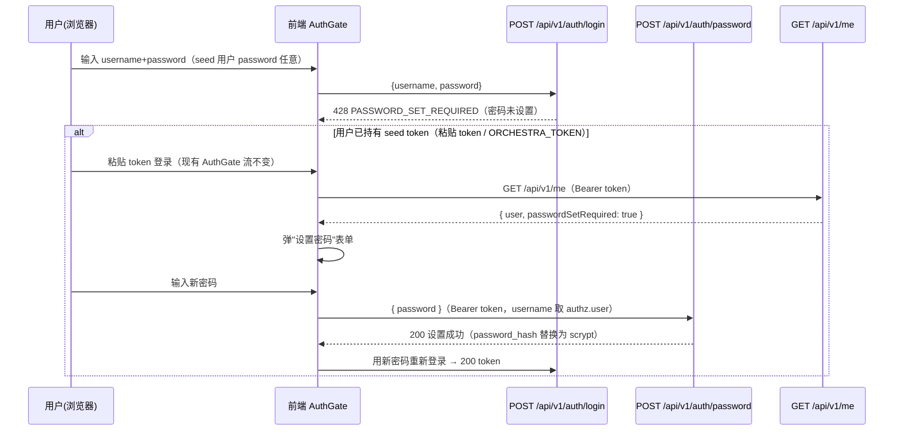

<!-- 子文档：用户体系完善（密码登录 + 用户管理 + /me）需求与 API 契约，对应主 PRD 4.12 章节，由 docs/requirements.md 拆分扩展 -->

# 4.12 认证与用户管理（需求设计说明 · Wave 0 契约）

> **状态**：Wave 0 契约设计定稿（2026-08-05）。本文件为 `.omo/plans/orchestra-user-system.md` Wave 0（T0.1~T0.4）的落档：
> 密码哈希选型见 ADR-021（`docs/decisions.md`）；本文件承载 T0.2 存量用户兼容策略、T0.3 认证 API 契约、T0.4 用户管理 API 契约。
> 实现波次：Wave 1 = P0 密码登录（FR-113/114）、Wave 2 = P1 用户管理（FR-115）、Wave 3 = P2 租户/管理页面分开（FR-116）。

## 模块概述

认证与用户管理是平台基础（4.1）之上的用户基础设施完善：把"M1~M3 粘贴 token 登录"升级为**用户名+密码登录**（P0），补齐**用户 CRUD + 角色分配**（P1），并提供 **`/me` 端点**支撑前端"租户面 / 管理面"分开渲染（P2）。

现状基线（M1/M2/M3 已具备，本模块在其上增量）：

| 能力 | 现状 | 本模块动作 |
|---|---|---|
| `users` 表 | 字段齐全；`password_hash` 已预留，seed 用户为 `'seed-only'` 占位 | 密码哈希落地（ADR-021 scrypt）+ 存量兼容 |
| `tokens` 表 | Bearer token 认证就绪（`token_hash=sha256(明文)`，auth middleware） | 登录端点签发 token 复用此表 |
| `role_bindings` | 用户×角色×命名空间二维授权就绪（`'*'` 平台级） | 角色分配 API + 禁止非 admin 绑定 `'*'` |
| RBAC（rbac.ts） | 五预置角色，viewer 含 `read *` 命名空间级通配 | 用户管理用**显式平台级判定**，规避通配误放行 |
| 前端 AuthGate | 仅粘贴 token（无密码、无 401 全局处理） | 密码登录表单 + 428 设密码引导 + 全局 401 回登录 |

## 需求列表

| 编号 | 需求 | 优先级 |
|---|---|---|
| FR-113 | 密码登录：用户名+密码调用 `POST /api/v1/auth/login` 校验通过后签发 Bearer token（写入 `tokens` 表，sha256 存储）；密码错误 / 用户不存在 / 用户禁用均返回**统一 401**（防枚举）；登录写审计 | P0 |
| FR-114 | 存量用户兼容（首次登录设密码）：`password_hash='seed-only'` 的账号密码登录返回 **428 `PASSWORD_SET_REQUIRED`**；经 token 认证后 `POST /api/v1/auth/password` 设置密码（Wave 1 内闭环，不依赖 Wave 2 重置接口）；测试夹具 seed-only 同步策略 | P0 |
| FR-115 | 用户管理：`/api/v1/users` CRUD + 角色分配，**仅 platform-admin（显式平台级授权）**；禁止非 platform-admin 角色绑定 `namespace='*'`；用户删除前清理 `tokens`/`role_bindings` 外键引用（ON DELETE no action） | P1 |
| FR-116 | 当前用户信息：`GET /api/v1/me` 返回 `{ user, roles, namespaces }`，前端按角色渲染导航（管理面/租户面分开） | P2 |

> 范围外（Out-of-Scope，见 `.omo/plans/orchestra-user-system.md` §四）：OAuth/SSO/第三方登录、自助注册、密码找回/邮件验证、MFA、全局分布式速率限制（见 §错误与安全）。

---

## 1. 密码哈希（FR-113 · ADR-021 摘要）

- **算法**：`node:crypto` scrypt；参数 `N=2^17`（131072）、`r=8`、`p=1`、`saltLength=16`、`keyLength=64`。
- **存储串格式**（`users.password_hash`）：`scrypt$N$r$p$<saltHex>$<hashHex>`。
- **seed-only 识别**：`password_hash === 'seed-only'` 为非合法哈希（前缀非 `scrypt$`），`verifyPassword` 对 seed-only / 非法格式一律返回 `false`（不抛错，避免信息泄露）。
- **模块**（Wave 1 新增）：`src/auth/password.ts` → `hashPassword` / `verifyPassword` / `isSeedOnly`。测试用固定 salt 预计算哈希（或低参 `N=2^10` 测试档）加速单测。

## 2. 存量用户兼容策略（FR-114 · T0.2）

### 2.1 现状

`scripts/seed/seed.ts` 播种 `admin` / `viewer` 两用户，`password_hash='seed-only'`；18 个测试文件 + seed.ts 共 19 个文件使用 `'seed-only'` 占位（src/ 下 29 处；含 auth.test.ts、agents.test.ts、namespaces.test.ts、resources.test.ts、task.test.ts 等）。这些 seed 用户同时持有有效 token（`seed-admin`/`seed-viewer`，token 认证流不受影响）。

### 2.2 流程（固定"首次登录设密码"）



**要点**：

1. **登录端点识别 seed-only** → 返回 **428 `PASSWORD_SET_REQUIRED`**，不校验密码（seed-only 无合法密码可校验），错误消息固定：`该账号尚未设置密码，请先使用令牌登录后设置`。
2. **设密码端点 `POST /api/v1/auth/password` 必须经 token 认证**（挂 `authMiddleware`），目标用户强制取 `authz.user`（当前登录用户），**不接受匿名设置**——避免"用户名公开 → 匿名劫持 admin 密码"的严重漏洞。
3. **闭环不跨波**：seed token 是 Wave 1 之前已存在的存量凭证，前端引导（粘贴 token → /me 检测 `passwordSetRequired` → 设密码 → 密码登录）全部在 Wave 1 内完成，**不依赖 Wave 2 的管理员重置接口**。
4. **`/me` 增加 `passwordSetRequired` 字段**：Wave 1 实现 `/me` 的 `passwordSetRequired` 标记（检测 `password_hash === 'seed-only'`）即可闭环；`/me` 其余字段（roles/namespaces）在 Wave 3（FR-116）补齐，前端对缺失字段容错。
5. **管理员重置（Wave 2 补充）**：`POST /api/v1/users/:name/password` 仅 platform-admin 可调，用于重置任意用户密码（含 seed-only 迁移漏网用户）。

### 2.3 测试夹具同步策略

| 夹具类型 | 现状 | 同步策略（Wave 1 T1.3 执行） |
|---|---|---|
| seed 脚本（`scripts/seed/seed.ts`） | `password_hash: 'seed-only'` | **保留不变**——seed 用户设计上就是"首次登录设密码"入口 |
| 测试 fixture（18 文件 29 处） | 直接写 `password_hash: 'seed-only'` | 引入共享 fixture `src/auth/test-fixtures.ts`（`seedUser()` / `scryptUser(plain)`）统一替换；已设密码的用户用预计算 scrypt hash |
| 新增用例 | — | `auth.test.ts` 增：seed-only 密码登录 → 428；设密码后登录成功；设密码端点无 token → 401；verifyPassword(seed-only) → false |

> 同步原则：**不批量改写全部 18 个文件的行内 `'seed-only'` 字面量**，而是按"该测试是否需要密码登录行为"分类——纯 token 认证测试保持 seed-only 不变（语义正确），涉及密码登录/设密码的测试改用 `scryptUser` fixture。改写风险：`'seed-only'` 在 fixtures 中仍合法（用户可用），仅语义从"任意密码可登"变为"428"，故需逐个用例确认无断言冲突。

## 3. 认证 API 契约（FR-113 · T0.3）

### 3.1 端点总览

| 方法 | 路径 | 认证 | 说明 |
|---|---|---|---|
| POST | `/api/v1/auth/login` | 无（不挂 authMiddleware） | 密码登录，签发 token |
| POST | `/api/v1/auth/password` | Bearer（authMiddleware） | 当前用户设置/修改自己的密码（seed-only 或改密） |
| GET | `/api/v1/me` | Bearer（authMiddleware） | 当前用户信息（FR-116，Wave 1 先提供 `passwordSetRequired`） |
| POST | `/api/v1/users/:name/password` | Bearer + platform-admin | 管理员重置指定用户密码（Wave 2） |

**`/auth/login` 不挂 authMiddleware**——理由与 `/api/v1/health`（app.ts）、`/api/v1/im-callbacks/*`（tasks.ts）、A2A 端点（a2a）一致：登录前无 token 可用，属公开匿名端点；匿名端点不写 401 审计（无 actor），登录成功/失败审计由 handler 自行 `writeAudit`（actor=尝试的 username）。

### 3.2 POST /api/v1/auth/login

**请求**：

```jsonc
// Content-Type: application/json
{ "username": "admin", "password": "..." }
```

zod schema：`{ username: z.string().min(1).max(64), password: z.string().min(1).max(128) }`。

**成功响应 200**：

```jsonc
{
  "token": "…32 字节随机 hex…",
  "user": {
    "username": "admin",
    "displayName": "平台管理员",
    "isSystem": false,
    "status": "active"
  }
}
```

**错误响应**（统一 `{ error: { code, message, retryable } }`）：

| HTTP | code | 场景 | 说明 |
|---|---|---|---|
| 401 | `UNAUTHORIZED` | 用户不存在 / 密码错误 / 用户禁用 | **统一同一消息**：`用户名或密码错误`（不区分枚举；用户禁用也走同一消息，仅审计结果不同） |
| 428 | `PASSWORD_SET_REQUIRED` | `password_hash === 'seed-only'` | 首次登录需设密码（见 §2） |
| 429 | `RATE_LIMITED` | 触发失败锁定 | 见 §3.4 |
| 400 | `VALIDATION_ERROR` | 请求体校验失败 | — |

### 3.3 token 签发（登录成功路径）

1. `crypto.randomBytes(32).toString('hex')` 生成 token 明文（与 seed.ts `randomBytes(24)` 一致风格，建议 32）。
2. `tokens` 表插入：`{ userId, name: 'login', tokenHash: sha256Hex(明文), expiresAt }`。
   - `expiresAt`：**可选**。默认 `null`（不过期，与现有 seed token 一致）；支持环境变量 `ORCHESTRA_LOGIN_TOKEN_TTL`（如 `24h`）签发短期会话 token。**Token 名 `'login'` 与 seed 的 `'seed-admin'`/`'seed-viewer'` 区分**（审计/排障可辨来源）。
3. 明文仅此一次返回，后续认证走 auth middleware 的 `sha256Hex` 比对。
4. 登录成功 `writeAudit`：`{ actor: username, action: 'login', resource: { kind: 'auth', namespace: '', name: username }, source: 'api', result: 'success' }`。
   登录失败 `writeAudit`：`result: 'error'`（actor=尝试的 username，密码错误/用户不存在统一归 error；用户禁用归 `denied` 语义可并入 error——**审计内不区分"用户不存在 vs 密码错"，防枚举延伸**）。

### 3.4 统一 401 防枚举

- **用户不存在 / 密码错误 / 用户禁用 → 同一 `401` + 同一消息** `用户名或密码错误`。区别仅在审计 `result` 字段（error vs denied），不通过 HTTP 响应暴露。
- **时序均衡**：用户不存在时对 `'seed-only'` 占位哈希执行一次假 `verifyPassword`（等时伪验证），避免"存在用户耗时更长"的时序侧信道。
- **不暴露账号状态细节**：错误消息不含"已禁用/不存在/密码错"字样。
- 前端展示：仅提示"用户名或密码错误"。

### 3.5 登录失败锁定 / 速率限制（决策：做进程内失败锁定）

- **决策**：Wave 1 实现**进程内登录失败锁定**（`src/auth/login-guard.ts`，单机内存 Map）：
  - 键：`username + '|' + 客户端 IP`（Hono `c.req.header('x-forwarded-for')` 回退 `c.env` remote；内网部署可简化为仅 username）。
  - 阈值：**15 分钟内累计 5 次失败** → 锁定 **15 分钟**；锁定期登录 → `429 RATE_LIMITED`（复用 `errors.ts` `RateLimitError`，retryable=true），消息固定 `登录尝试过于频繁，请稍后重试`（不区分键成分）。
  - 成功登录清零计数。
- **不做全局分布式速率限制**（写入 Out-of-Scope）：单机/内网部署，Postgres 无内存缓存；M2 引入 NATS JetStream 后如出现公网暴露再评估共享计数。失败锁定已在单机场景覆盖暴力破解（防枚举 + 锁定双保险）。
- 错误码差异说明：401（凭证错）vs 429（被锁定）不构成用户枚举——两者均不暴露"用户是否存在"（锁定发生在失败计数达阈值后，无论用户名真假）。

### 3.6 POST /api/v1/auth/password

- **认证**：挂 `authMiddleware`（Bearer token）。目标用户 = `authz.user`（强制当前用户，不接受 body 指定他人）。
- **请求**：`{ "password": string }`（zod：`min(8).max(128)`）。
- **逻辑**：更新 `users.password_hash = hashPassword(password)`；成功 `200 { "status": "updated" }`。seed-only 用户设置成功后 `passwordSetRequired` 变 false。
- **审计**：`{ actor: authz.user, action: 'update', resource: { kind: 'user', namespace: '', name: authz.user }, source: 'api', result: 'success' }`（diff 脱敏：不写密码，仅 `{ passwordHash: '<redacted>' }`）。

### 3.7 前端交互契约（AuthGate 改造点，Wave 1 T1.4）

1. **登录表单**：AuthGate 增加"用户名+密码"表单（保留"粘贴 token"作为次级入口，seed 引导需要）；提交调 `POST /auth/login` → 成功存 `orchestra.token`（沿用 `setToken`）→ reload。
2. **428 处理**：`/auth/login` 返回 428 → 登录页显示"该账号需先设置密码"提示 + 引导粘贴 seed token 进入设密码流程。
3. **设密码引导**：`GET /me` 响应 `passwordSetRequired: true` → 顶栏/弹窗引导设置密码 → `POST /auth/password` → 成功后提示用新密码登录。
4. **全局 401 处理**（当前缺失，Memory 已标注）：`web/src/api/client.ts` `request()` 捕获 `res.status === 401 && auth` → `setToken("")` → `window.location.hash = '#/login'`（或 reload），避免 token 过期后页面卡死/静默失败。
5. **`/me` 加载态**（Wave 3 完整）：AuthGate 加 `/me` 加载态/失败态（401 → 回登录页），防导航闪烁。

## 4. 用户管理 API 契约（FR-115 · T0.4）

### 4.1 授权模型（显式平台级判定）

用户是**平台级资源**（不属任何租户命名空间）。授权**不得**复用通用 `read-*` 通配（`viewer: [{ action:'read', resourceType:'*', scope:'namespace' }]`——若用 `Can('read','user',{namespace})` 以某租户命名空间判定，viewer 绑定该 ns 即被误放行）。

**实现路径（仿 `src/api/routes/namespaces.ts` handler 内逐绑定授权，但更直接）**：

```ts
// 用户管理端点 handler 内（每端点一次）：
// resource = { type: 'user', namespace: '*' }（平台级）
const allowed = await Can(authz, action, { type: 'user', namespace: '*' }, provider);
if (!allowed) {
  await writeAudit(db, { actor: authz.user, action, resource: { kind: 'user', namespace: '*', name: '' }, source: 'api', result: 'denied' });
  throw new ForbiddenError(`权限不足: ${action} user/*`);
}
```

判定链路：`Can` → 遍历绑定 → `platform-admin` 权限点 `{ action:'*', resourceType:'*', scope:'platform' }` + 绑定 `namespace='*'` → `scopeAllows('platform', '*', '*')` → true。**viewer 的 `read *`（scope='namespace'）对 target `'*'` 不命中**（`scopeAllows` 要求 `bindingNs === targetNs`，viewer 绑定 'default' ≠ '*'）→ 天然隔离，无通配泄漏。

> 不引入专用权限点（如 `{ action:'*', resourceType:'user' }`）——平台级判定 + platform-admin 全权限点已充分表达"仅平台管理员可管用户"，保持权限模型最小变更。

### 4.2 端点总览

| 方法 | 路径 | 授权 | 说明 |
|---|---|---|---|
| GET | `/api/v1/users` | read user/* | 用户分页列表（不含 password_hash） |
| POST | `/api/v1/users` | create user/* | 创建用户（初始密码或 seed-only 占位） |
| GET | `/api/v1/users/:name` | read user/* | 用户详情 |
| PATCH | `/api/v1/users/:name` | update user/* | 更新 displayName / status（禁用/启用）/ isSystem |
| DELETE | `/api/v1/users/:name` | delete user/* | 删除用户（事务内清理 tokens + role_bindings） |
| POST | `/api/v1/users/:name/password` | update user/* | 管理员重置密码 |
| POST | `/api/v1/users/:name/roles` | update user/* | 绑定角色（role × namespace） |
| DELETE | `/api/v1/users/:name/roles` | update user/* | 解除角色绑定 |
| GET | `/api/v1/me` | authMiddleware | 当前用户（FR-116；不属于平台管理面） |

所有端点挂 `authMiddleware`；中间件链：`authMiddleware → [handler 内显式平台级判定]`（顶层无 namespace 参数，无法用通用 `dynamicAuthorize` 单点判定，仿 namespaces.ts list 模式）。

### 4.3 用户 CRUD 契约

**POST /api/v1/users**（创建）：

```jsonc
// 请求
{ "username": "zhang.san", "displayName": "张三", "password": "…", "status": "active", "isSystem": false }
// password 可选：缺省 → password_hash='seed-only'（走首次登录设密码流）；提供 → scrypt 哈希
// 响应 201
{ "user": { "username": "zhang.san", "displayName": "张三", "isSystem": false, "status": "active", "createdAt": "…" } }
```

- 用户名唯一冲突 → 409 `CONFLICT`。
- `isSystem` 为 true 时：`password_hash` 强制 seed-only（system 账户非人登录，无密码），`status` 强制 active。

**PATCH /api/v1/users/:name**（更新）：

```jsonc
// 请求（部分更新）
{ "displayName": "…", "status": "disabled" }   // status: active | disabled
```

- 禁用 → 立即生效：auth middleware 的 `users.status !== 'active'` 拒绝其所有 token（现有逻辑已覆盖）；禁用不吊销 token（恢复后可用）。
- 不可 PATCH `username`（登录名不可变）；禁止禁用/删除 `isSystem` 账户（控制器/Webhook 凭据，返回 409）。

**DELETE /api/v1/users/:name**（删除）：

- **FK 清理**：`tokens.user_id` 与 `role_bindings.user_id` 均为 `references(() => users.id)`（ON DELETE 默认 NO ACTION，`src/store/schema.ts` L531/L553）。删除用户必须在**同一事务**内：`DELETE FROM tokens WHERE user_id=?` → `DELETE FROM role_bindings WHERE user_id=?` → `DELETE FROM users WHERE id=?`。任一失败整体回滚（409/500）。
- `audit_logs.actor` 为 text（非 FK），历史审计保留，无需清理。
- 自删保护：platform-admin 不能删除自己（403/409），避免平台失管。

**POST /api/v1/users/:name/password**（管理员重置）：

```jsonc
// 请求 { "password": "…" }   // zod min(8).max(128)
// 成功 200 { "status": "reset" }；强制下次登录使用新密码
```

### 4.4 角色分配契约

**POST /api/v1/users/:name/roles**：

```jsonc
// 请求
{ "role": "flow-designer", "namespace": "dev" }
// 成功 200 { "bindings": [ { "role": "flow-designer", "namespace": "dev" } ] }
```

- 校验：角色存在（`roles` 表，缺失 → 400）；命名空间存在（`resources(type='namespace')`，缺失 → 400）。
- **禁止非 platform-admin 绑定 `'*'`**（T0.4 硬约束）：`namespace === '*'` 时 `role` 必须是 `platform-admin`，否则 → 400 `VALIDATION_ERROR`（消息：`仅 platform-admin 可绑定平台级（*）命名空间`）。此校验在 API 层实施（防御式），与 schema 注释（L555："`*` 表示平台级（仅 platform-admin）"）对齐。
- 重复绑定（user_id, role, namespace 唯一约束）→ 409 `CONFLICT`（或幂等 200，Wave 1 定：**幂等 200**，与 `onConflictDoNothing` 语义一致）。

**DELETE /api/v1/users/:name/roles**：

```jsonc
// 请求 { "role": "flow-designer", "namespace": "dev" }
// 成功 200 { "bindings": [ 剩余绑定 ] }；绑定不存在 → 404
```

- 禁止解除 platform-admin 自身的 `platform-admin@*` 绑定（防止平台失管）。

### 4.5 响应结构（不含敏感字段）

- 所有用户响应**绝不包含 `password_hash`**；`UserSummary = { username, displayName, isSystem, status, createdAt }`，详情追加 `bindings: [{ role, namespace }]`。

## 5. `/me` 契约（FR-116 · T0.4）

**GET /api/v1/me**（挂 `authMiddleware`）：

```jsonc
// 200
{
  "user": { "username": "admin", "displayName": "平台管理员", "isSystem": false, "status": "active" },
  "roles": [ { "role": "platform-admin", "namespace": "*" } ],
  "namespaces": [ "*" ],          // 可访问命名空间；platform-admin → ["*"]，其他角色 → 绑定 ns 去重列表
  "passwordSetRequired": false    // password_hash === 'seed-only' 时为 true（Wave 1 先行字段）
}
```

- `namespaces` 语义与 `GET /api/v1/namespaces` 的 handler 内逐绑定授权一致：遍历 `authz.roles`，`Can('read','*',{namespace:binding.namespace})` 为 true 的加入集合；platform-admin 绑定 `'*'` → 集合含 `'*'`（前端据此显示"全部命名空间"）。
- 前端（Wave 3）：登录后调 `/me` → 按 `roles`/`namespaces` 分组渲染导航（管理面 vs 租户面）+ 路由守卫。

## 6. 错误码契约扩展（errors.ts 增量）

| 新错误类 | HTTP | code | 场景 |
|---|---|---|---|
| `PasswordSetRequiredError`（新增） | 428 | `PASSWORD_SET_REQUIRED` | seed-only 用户密码登录（FR-114） |

> `toErrorResponse` / `errorToStatus` 无需改动（`AppError` 基类覆盖任意 status/code）；新增类仅构造器传参（`super(428, 'PASSWORD_SET_REQUIRED', …)`）。既有 401/429/409 错误类全部复用。

## 7. 影响面与依赖

- **不改 M1/M2/M3 已定契约**：token 认证管线（auth middleware）、RBAC 判定、现有端点全部不动；仅新增匿名登录端点 + 用户管理端点 + `/me`。
- **文档同步**：`dld-4.1-platform.md` §2.2 `users.password_hash` 说明由 bcrypt 改为 scrypt；`src/store/schema.ts` L521 注释同步；`docs/requirements.md` §4 模块表追加本模块行。
- **前端**：`web/src/api/client.ts` 增 `endpoints.auth.login / password / me` + `endpoints.users.*`；AuthGate 改造（§3.7）；Wave 3 导航分组（App.tsx NAV 按角色过滤）。
- **CLI（dld-cli）**：FR-110 已定义 `_auth.yaml` 认证链（`ORCHESTRA_TOKEN` / 登录换取 Bearer），`login` 子命令实现时消费本契约的 `POST /auth/login` 响应（token），无契约冲突。

## 8. 验证清单（Wave 0 落档验收）

- [x] ADR-021 追加 `docs/decisions.md`（编号唯一，grep 确认至 ADR-020）
- [x] 本契约文档落档 + `docs/requirements.md` 模块表追加 + `dld-4.1` password_hash 修订 + schema.ts 注释同步
- [x] `cp docs/*.md prototype-viewer/public/prd/` 同步 + `prototype-viewer/src/prd/docs.ts` 注册
- [ ] （Wave 1 执行）`npm run build && npm run lint` + 全量测试 829+ 保持绿
