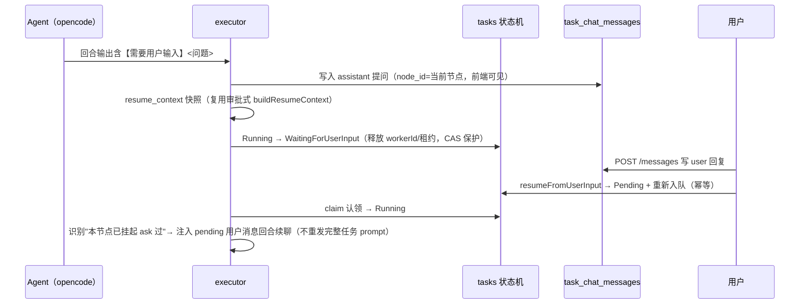

<!-- 子文档：任务级 Agent 对话（注入式聊天 + 任务级产物库 + 已完成 agent 持续对话）需求与 API 契约，对应主 PRD 4.13 章节，由 docs/requirements.md 拆分扩展 -->

# 4.13 任务级 Agent 对话（需求设计说明）

> **状态**：契约设计定稿（2026-08-05）。本文件为 `.omo/plans/agent-chat-and-stage-tabs.md` 全 22 任务的落档（T1~T22 已实现）：
> 任务级聊天消息表（T1/T2）、WaitingForUserInput 状态机（T3/T10）、聊天 REST/SSE 端点（T4/T14）、executor 消息感知注入（T8/T9）、guardrail（T12）、已完成 agent 持续对话（T13）、前端 tab + 聊天页（T18~T22）。
> 数据模型见 dld-4.13 §2；API 契约见 dld-4.13 §4。

## 模块概述

任务级 Agent 对话是 4.7 运行时之上的交互能力升级：把"任务跑完看结果"升级为"**执行过程中可多轮对话、任务结束后可继续对话**"。核心是四个能力：

1. **注入式多轮对话**：用户消息经 executor 注入 agent 会话（`promptAsync` 追加），流式返回，不新开 session、不改任务状态机。
2. **动作协议驱动推进**：agent 回合结束按输出协议声明动作——【任务完成】推进节点、【需要用户输入】挂起等待、`request_approval` 动态审批、`publish_artifact` 产物入库。
3. **任务级产物库**：agent 产出自动注册到全局共享产物库（artifacts 表），可多版本更新，下游 buildPrompt 只注入摘要（非完整会话）。
4. **已完成 agent 持续对话**：终态任务（Succeeded/Failed/Cancelled/Expired）对任意已执行节点继续对话，更新该节点产物，**不重跑任务、不复活任务、不推进节点**。

现状基线（M1/M2/M3 已具备，本模块在其上增量）：

| 能力 | 现状 | 本模块动作 |
|---|---|---|
| `tasks` 表 | 八态状态机，无用户交互挂起态 | 新增 `WaitingForUserInput` 状态（挂起/恢复） |
| `artifacts` 表 | ADR-005/016 产物归档（手工归档） | 加 `node_id` 列 + agent 自动发布（版本递增） |
| executor 回合 | 单轮 promptAsync → idle → 节点推进 | idle 后消息感知注入（多轮）+ 动作协议解析 |
| SSE 订阅 | executor 内部订阅（状态跟踪用） | 独立代理端点（directory+sessionID，前端 EventSource） |
| Web 控制台 | 阶段时间线（纵向步骤） | 横向 tab + 聊天页（历史/流式/输入/产物库） |

## 需求列表

| 编号 | 需求 | 优先级 |
|---|---|---|
| FR-1011 | 聊天消息端点：`POST /api/v1/tasks/{name}/messages` 发送用户消息（user→agent，`idempotencyKey` 幂等，`nodeId` 路由产出节点，状态校验：Running/WaitingForUserInput 注入、Pending/Paused 排队、终态 forArtifact 写入、WaitingApproval → 409）；`GET` 读取历史（created_at ASC） | P0 |
| FR-1012 | SSE 流式代理：`GET /api/v1/tasks/{name}/messages/stream` 独立订阅 opencode 会话（`directory + sessionID`），按事件类型转发（connected/text/reasoning/tool/file/delegation/message/idle/error）；`permission.*` 不转发（审批走 ToolApproval 独立通道）；连接关闭即 abort | P0 |
| FR-1013 | WaitingForUserInput 状态：agent 输出【需要用户输入】→ 任务挂起（问题写 chat 表 + resume_context 快照 + **释放租约**），用户回复 → 回置 Pending 重新入队（`resumeFromUserInput` 幂等），executor 认领后从 currentNode 续聊 | P0 |
| FR-1014 | agent 输出协议（buildPrompt 注入）：【任务完成】→ 节点终态；【需要用户输入】<问题> → 挂起；`{"action":"request_approval",...}` → 动态 ApprovalRecord + WaitingApproval；`{"action":"publish_artifact",...}` → 产物入库；无动作默认完成 | P0 |
| FR-1015 | 任务级产物库：artifacts 表 `node_id` 关联产出节点；agent 发布产物自动注册（text → markdown/json 内联、file → 远端收集归档，DB 只存 ref）；更新走版本递增（不覆盖历史）；下游 buildPrompt 注入资源清单摘要（≤300 字符/资源） | P0 |
| FR-1016 | 已完成 agent 持续对话：终态任务对已执行且 chatEnabled 的节点续聊（复用持久化 sessionId），publish 更新该节点产物（version++），complete/ask 仅记录；**绝不调用 step/transition/persistNodeProgress**（phase 与 outputs 零变化） | P1 |
| FR-1017 | 对话 guardrail：每 agent 节点轮数上限（`CHAT_MAX_TURNS`，缺省 5）；消息长度上限 2000；注入回合 token 计入 cost（走现有 trace → cost_daily 管道）；注入幂等（CAS claim + markMessagesDelivered） | P0 |

> 范围外（Out-of-Scope）：消息编辑/撤回/富文本/附件（产出物走 artifacts）、fan-out 分支并发聊天、审批节点对话（审批保持独立通道）、改 opencode serve 本身、完整会话过程注入全局上下文（只注入资源摘要）。

---

## 1. 聊天消息端点（FR-1011）

### 1.1 状态语义（写前校验）

| 任务 phase | 行为 |
|---|---|
| Running | 正常注入：消息写 `task_chat_messages`（`is_pending=true`），executor 回合 idle 后 claim 注入 |
| WaitingForUserInput | 正常注入 + **T10 恢复续聊**：写入后调 `resumeFromUserInput` 回置 Pending 重新入队 |
| Pending / Paused | 消息排队（`is_pending=true` 保持），任务进入 Running 后由 executor 消费 |
| Succeeded / Failed / Cancelled / Expired | 允许写入（**forArtifact 语义**，nodeId ≠ `'user-input'`）→ 触发一次 `runTerminalChat`（尽力而为，失败不影响 201） |
| WaitingApproval | **409 拒绝**——审批走独立通道，聊天不混入 |

### 1.2 请求/响应

```jsonc
// POST /api/v1/tasks/{name}/messages（认证：Bearer；RBAC：exec task/*）
{ "content": "请补充说明验收标准", "nodeId": "pm-analyze", "idempotencyKey": "msg-001" }
// content: min(1).max(2000)；nodeId 可选，缺省 'user-input'；idempotencyKey 可选（重复提交返回首次记录）

// 201
{ "id": "...", "taskId": "...", "nodeId": "pm-analyze", "role": "user", "content": "...",
  "isPending": true, "idempotencyKey": "msg-001", "createdAt": "..." }
```

- **幂等**：同 `idempotencyKey` 重复 POST 返回已有记录（先查后插 + 唯一约束兜底）。
- **终态预检**：终态任务写入前做轮数断言（`assertChatTurnLimit`），超限 400 拒绝（消息不落库）。
- **审计不记 content 明文**（MUST NOT：消息内容不落 audit_logs），仅记 `chat` action。

### 1.3 历史读取

```jsonc
// GET /api/v1/tasks/{name}/messages（认证：Bearer；RBAC：read task/*，system 回退开）
// 200
{ "taskId": "...", "messages": [ /* MESSAGE_RESPONSE 数组，created_at ASC */ ] }
```

- 只读历史，**不消费 pending 队列**（`is_pending` 语义由 executor claim 维护）；前端轮询降级与流式共用此端点。

## 2. SSE 流式代理（FR-1012）

- **端点**：`GET /api/v1/tasks/{name}/messages/stream`（`text/event-stream`）。
- **订阅参数**：从 `task.sessionId` 解析 opencode session、`task.workdir` 作 directory——`client.event.subscribe({}, { query: { directory, sessionID }, signal })`。**必须带 directory**（PoC 验证：仅 sessionID 收不到事件）。
- **首行握手**：`data: {"type":"connected"}`（前端据此判定 stream 可用）。
- **独立订阅**：与 executor 的订阅互不共享（生命周期解耦，客户端断开 → abort 底层订阅防泄漏）。
- **转发事件类型**（opencode Part 全集分类）：见 dld-4.13 §4.4 事件映射表。

## 3. WaitingForUserInput 状态（FR-1013）



- **转移表**（dld-4.5 §3.5 唯一事实源增量）：`Running → WaitingForUserInput`；`WaitingForUserInput → Pending/Cancelled/Expired`。
- **禁止 worker 阻塞**：挂起即释放租约（`workerId=null, workerLeaseExpiresAt=null`），等待期间不占执行资源。
- **恢复续聊**（T10）：executor 复用已有 sessionId（`countChatMessagesByRole(assistant)>0` 判定"本节点挂起过"）→ 首轮只注入 pending 用户消息，**不重发完整任务 prompt（禁止重跑节点）**。
- **不重跑**：挂起/恢复全程不推进节点、不重发任务输入，恢复锚点 = currentNode + sessionId/workdir。

## 4. agent 输出协议（FR-1014）

`chatEnabled=true` 的 agent 节点，`buildPrompt` 注入"输出协议"（见 dld-4.13 §5.2 原文）。回合结束由 `parseAgentActions` 解析：

| 动作 | 协议标记 | 语义 |
|---|---|---|
| 完成 | `【任务完成】` | 节点终态推进（默认完成语义） |
| 询问 | `【需要用户输入】<问题>` | 任务转 WaitingForUserInput 挂起 |
| 审批 | `{"action":"request_approval","approvers":{...},"reason":"..."}` | 创建动态 ApprovalRecord + WaitingApproval |
| 发布产物 | `{"action":"publish_artifact","name":"...","type":"text\|file","content\|fileRef":"..."}` | 产物入库（可多个） |

**解析优先级**（终态动作互斥）：`request_approval > 【任务完成】 > 【需要用户输入】`；publish 恒全量返回（发布产物后可继续完成/询问/审批）。无动作 → 默认完成。

## 5. 任务级产物库（FR-1015）

- **存储复用**（ADR-016，不重复造）：`artifacts` 表只加 `node_id` 列；content 结构 `{format, body?, ref?}`——文档=`markdown`、结构化=`json`、文件/链接=`file`（ref=归档相对路径）。
- **agent 自动发布**：`publish_artifact` 文本动作 → `publishArtifactFromAgent`（type 限定 ARTIFACT_TYPE，缺省 design；可 JSON.parse 的对象 → json 格式，否则 markdown 文本）；文件动作 → `collectFileViaOpencode`（opencode File API 远端收集归档，DB 只存 ref）。
- **版本递增**：`(namespace, name)` 共享版本序列（`nextArtifactVersion`），更新不覆盖历史（不可变原则）。
- **全局共享摘要**：下游 buildPrompt 注入"任务产出资源"清单（`name/type/version/summary`，≤300 字符/资源）——**只注入摘要，不注入完整会话**。

## 6. 已完成 agent 持续对话（FR-1016）

- **触发**：终态任务收到 `nodeId != 'user-input'` 的消息 → `runTerminalChat`（尽力而为：flow 不可解析/节点未执行/会话不可用/agent 未开启 chatEnabled → 静默跳过，消息已写入）。
- **执行**：claim 该节点 pending 用户消息（按 node_id 路由，跨节点不串注入）→ 轮数检查点 → 注入 prompt（输出协议 + 全局/本节点资源摘要 + 终态说明 + 用户消息）→ 复用 `runSessionAndWaitIdle` 跑单回合 → 动作处理：publish 更新该节点产物、complete/ask 仅记录。
- **铁律**：不重跑任务、不复活任务、不推进节点、phase 与 outputs 零变化；worktree 已删（终态任务清理）→ **file 发布拒绝**（提示改用文本产物）。

## 7. 非功能需求

| 编号 | 分类 | 需求 |
|---|---|---|
| NFR-09 | 性能 | 首字延迟：SSE 首行握手 `connected` 必须在订阅建立后立即发出；消息注入回合复用 executor 既有 SSE 窗口与心跳机制（30s 心跳 / 90s idle guard），不新增独立会话资源 |
| NFR-10 | 安全 | 文件产物 `fileRef` 强制相对路径 + 无 `..` 段 + resolve 在 worktree 内 + symlink 不逃逸，文件 ≤50MB；下载端点对 DB ref 做同样路径校验（不信任 ref 之外的任何输入）；SSE 转发 file 只带 filename/url（不泄漏 workdir 绝对路径） |

## 8. 验证清单（落档验收）

- [x] `task_chat_messages` 表 + `artifacts.node_id` 列 + migration 0008
- [x] POST/GET messages + GET artifacts?nodeId + GET messages/stream（SSE）+ download 端点
- [x] WaitingForUserInput 状态机全链路（转移表/租约释放/恢复续聊，CAS 测试绿）
- [x] 动作协议解析（四动作互斥）纯函数测试绿；guardrail（轮数/长度/token）测试绿
- [x] 终态对话不重跑/不复活（runTerminalChat 集成测试 + e2e 16 场景）
- [x] 本契约文档落档 + `cp docs/*.md prototype-viewer/public/prd/` 同步 + docs.ts 注册
- [ ] （前端接入后）浏览器实测：横向 tab / 聊天流式 / 挂起态 / 终态只读 / 资源列表
